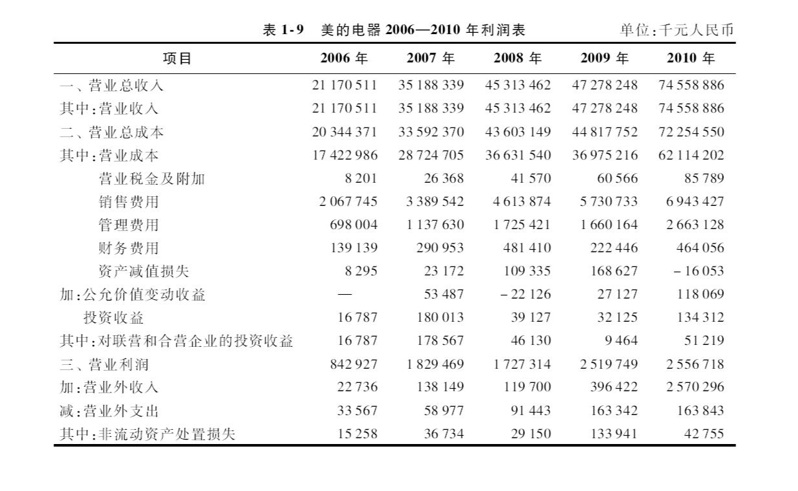
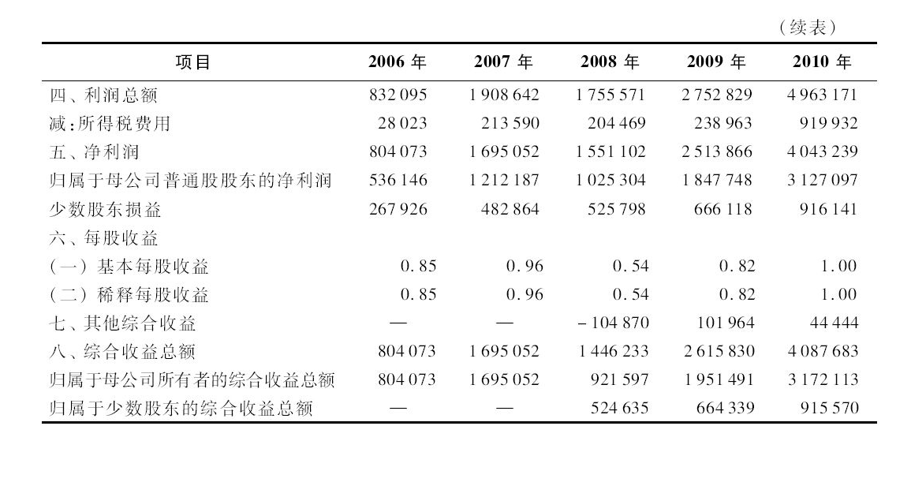
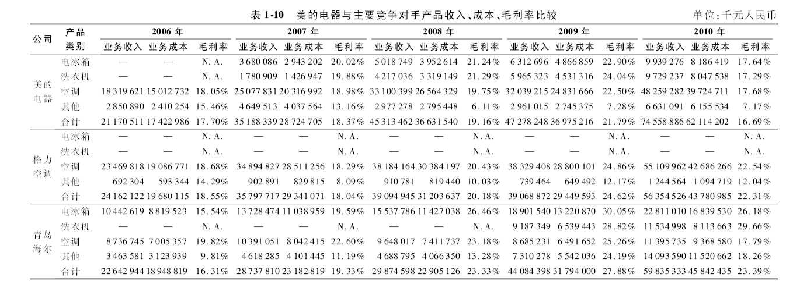
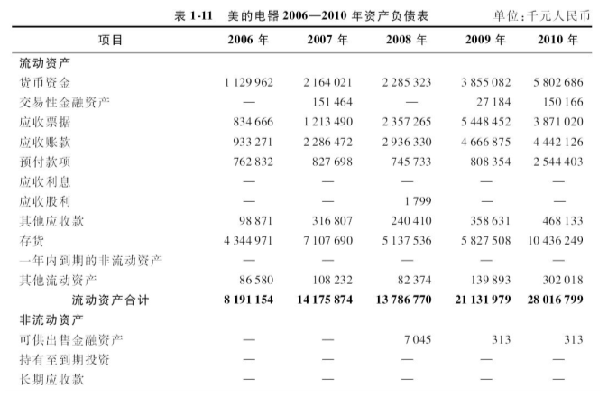
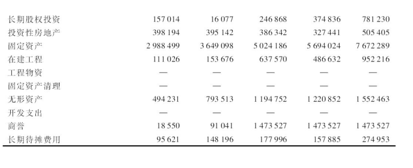
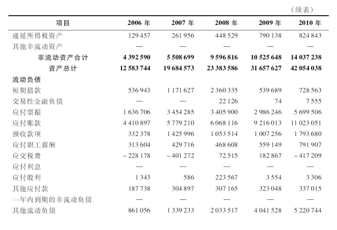
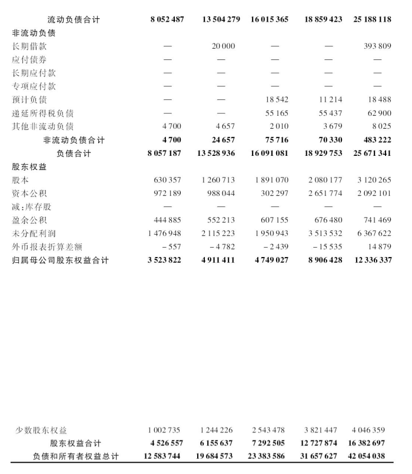
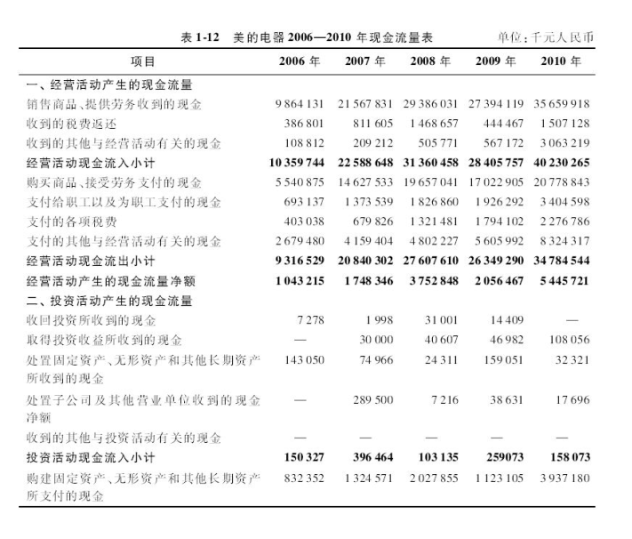
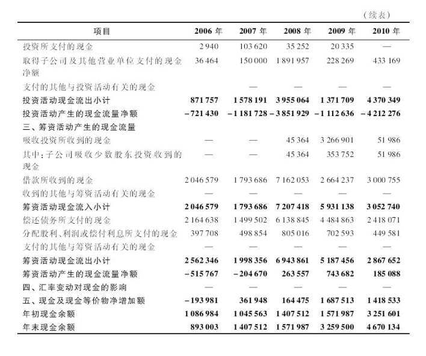

# 案例分析——解读美的电器2006—2010年度财务报表 :id=cp_e_1
--- 

## 背景 :id=cp_e_100

```md
2006—2010年，是美的电器战略布局的5年。美的电器从家用空调为主，逐步成长为暖通空调产业、白色家电产业综合协调发展的行业龙头之一；
资本市场上，美的完成了股权分置改革、公开增发，推动了近期的非公开增发；收购整合小天鹅、荣事达和华凌等；
5年间，美的电器收入、净利润和总市值分别增长了`3.5`倍、`8.2`倍和`27.2`倍。

```

## 一、解读利润表 :id=cp_e_101

在多年的高速发展过程中，美的电器一直秉承“**上规模、保盈利、调结构**”的经营方针，把扩大规模放在第一位，事实证明，这一经营方针使美的电器迅速成长为中国白色家电行业的龙头企业之一。 

- 这种规模至上的经营策略在为美的电器带来巨额销售收入的同时，是否会给美的电器的发展造成隐患？
- 这种经营策略又能否在美的电器未来的发展中持续奏效呢？

带着这些问题，我们收集了美的电器2006—2010年的利润表，对美的电器过去5年的经营情况进行分析和研究。

从表1-9可见，美的电器过去5年营业收入的增长速度确实迅猛。

从2006年的212亿元增长到2010年的746亿元，年均增幅高达`37%`，不仅高于行业平均水平，也远远高于其主要竞争对手青岛海尔（年均增长幅度为`27%`）和格力电器（年均增长幅度为`23%`）。

尤其是2009年以来，国家对家电行业系列扶持政策的密集出台，成为内需消费增长和白色家电行业复苏的重要因素。

2010年美的电器的营业收入比2009年增长了`57.7%`，达到创纪录的746亿元，远远高于青岛海尔的606亿元和格力电器的608亿元。




然而，这种规模至上的经营策略同样给美的电器未来的发展带来新的问题与挑战。

第一，尽管美的电器2010年的营业收入比2009年增长了`57.7%`，但公司的营业利润却几乎在原地踏步，从2009年的25.2亿元略微增长到2010年的25.6亿元。尽管公司最终的净利润还是从2009年的25亿元增长到2010年的40亿元，但增长的动力几乎完全来源于政府对节能空调的补贴（体现为营业外收入25.7亿元）。一旦政府取消对节能空调的补贴，公司未来的利润增长速度将受到极大的影响。

第二，公司营业利润之所以没有增长，主要原因在于美的电器各项产品毛利率的大幅下降。我们对美的电器主要产品毛利率进行了横向和纵向比较。从表1-10可见，美的电器的三大主要产品为空调、电冰箱和洗衣机，2010年的毛利率都在`17%`左右，不仅处于公司历史的最低水平，更远远低于竞争对手的同期水平。与公司2009年的毛利率相比，公司2010年空调、电冰箱和洗衣机的毛利率分别下降了`4.81%`、`5.27%`和`6.75%`。与主要竞争对手相比，青岛海尔2010年电冰箱的毛利率为`26.18%`，洗衣机的毛利率为`29.66%`，均远远高于美的电器的同类产品；青岛海尔2010年空调的毛利率为`17.79%`，也基本上与美的电器持平。而格力电器2010年空调的毛利率达到`22.54%`，同样高出美的电器近5个百分点。

第三，公司对三大费用的控制无法抵消毛利率下降对营业利润造成的负面影响。美的电器主要的期间费用为销售费用和管理费用，这两项费用2010年的金额分别为69.43亿元和26.63亿元，分别比2009年上涨了`21%`和`60%`。尽管涨幅得到一定的控制，但由于公司毛利率下降过多，这两项费用的控制并不能显著提高公司的营业利润。

综合以上对美的电器利润表的分析，可以看出，尽管美的电器的营业收入在过去5年实现了年均`37%`的增长幅度，但这种规模的增长在未来很难真正转化为盈利能力的增长。而一旦国家相关扶持政策退出，公司将面临增长乏力甚至衰退的风险。因此，公司有必要对目前这种规模至上的经营方针进行反思。




## 二、解读资产负债表 :id=cp_e_102

进一步来分析美的电器2006—2010年的资产负债表。由表1-11可见，公司过去5年的规模扩张很快，总资产从2006年的126亿元增长到2010年的421亿元，年均增长幅度高达35.2%；归属母公司股东的权益也从2006年的35亿元增长到2010年的123亿元，年均增长幅度也高达37%左右。尽管公司扩张很快，但公司整体的财务状况依然保持良好。从资产负债率来看，公司尽管在2007—2008年出现了一定的上升，达到69%左右，但很快又恢复正常，2009—2010年维持在60%左右。从公司的流动比率来看，除2008年受到国际金融危机和国内经济增长下滑的影响而低于1以外，其他年份公司的流动比率都维持在1以上，2009—2010年的流动比率更是维持在1.1以上。这表明公司并没有因为快速扩张而造成财务上的过大压力。







但是，需要关注的是公司2010年资产负债表中存货的激增。2009年美的电器的存货仅有58亿元，到了2010年，公司的存货高达104亿元，涨幅高达`80%`左右。尽管储备一定的原材料能够抵御通货膨胀可能给公司造成的成本压力，但从财务报表附注中我们发现，公司原材料占存货的比重仅有`20%`左右，存货的主要形式是库存商品，占存货比重的`70%`左右，达到75亿元左右。这表明公司的销售开始出现乏力的迹象，公司原有的经营方针可能需要作出一定的调整。

## 三、解读现金流量表 :id=cp_e_103

从美的电器的现金流量表来看（表1-12），美的电器的经营活动产生的现金流量净额从2006年的10亿元增长到2008年的37.5亿元，2009年下降至20.6亿元，2010年又回升至54.5亿元，年均增长幅度超过50%，表明公司的经营管理活动具有良好的现金创造能力。比较公司5年的累计现金创造能力和累计盈利能力可以发现，公司5年间累计创造的净利润为106亿元，而累计创造的经营活动净现金高达140亿元，表明公司不光盈利能力有现金流作保障，而且固定资产的折旧和无形资产的摊销也得到了现金保障，公司整体的盈利质量很高。





从投资活动产生的现金流量来看，公司2006年投资活动净现金投入为7.2亿元，到2008年投资活动净现金流出达到38.5亿元，2009年该指标下降为11.1亿元，但2010年又回升到42.1亿元，表明公司在过去5年一直在增加固定资产的投资，这也是公司规模扩张战略下的必然结果。因为只有增加固定资产投入，才能扩大生产规模、降低产品成本，进而以低价格迅速占领市场。需要注意的是，当公司销售良好时，这种模式是没有问题的，但如果公司的销售无法实现预期目标，固定资产的过快投入将可能导致工厂或开工不足，或产品积压销售不出去，进而影响公司未来的经营净现金。

筹资活动产生的现金流量可以体现出公司长期贯彻负债经营的思想。筹资活动产生的现金流量主要来自借款。2006年公司借款收到20.5亿元，2008年借款增加到71.6亿元，2010年又下降至30亿元。将借款产生的现金流入与公司偿还债务的现金流出进行比较，可以进一步看出公司的借款主要是1年期以内的短期借款。尽管公司目前的流动性以及现金创造能力足以应对公司的借款，但公司还是要警惕当销售乏力时，资金在产品上的积压而可能造成的资金周转不畅。

## 四、结论和启示 :id=cp_e_104

从美的电器2006—2010年的三大报表来看，尽管美的电器实现快速增长，但这种规模至上的“激进式—进攻型”增长模式似乎已经走到了尽头，尤其是国家扶持政策的不稳定性，例如，启动四年之久的家电下乡政策已接近尾声，加上通货膨胀、汇率波动、原材料及人工成本上升等不利因素，都宣告了廉价制造时代正在终结，规模优势亦难以为继。不转型，公司规模可能还可以增长几年，但盈利能力会受到更大的影响，积累的问题会更多，问题爆发时产生的破坏力会更大；转型，则需要管理层思考选择什么样的经营战略和发展道路，以及公司是否能够承受转型的“阵痛”。两难之间，管理层必须作出抉择。

值得庆幸的是，美的电器的管理层自身也清醒地意识到了战略转型的必要性和紧迫性。自2011年下半年以来，美的电器开始放弃了原有经营方针中的“上规模”，并在各事业部的业绩考核指标中取消了规模增长指标。“转变发展方式、推动战略转型”被全面提上日程，而转型的目标就是“从注重增长数量向注重增长质量转型、从低附加值向高附加值转型、从粗放式管理向精细管理转型”。其核心就是要告别之前的“野蛮生长”。与此同时，公司摈弃了原来的“规模、盈利、品质”的考核顺序和“重营销、轻研发”的发展思路，要求各事业部每年将收入的3%投入研发，并由一位副总裁亲自抓品质，从设计到原材料选用到最后的品质验收，试图由原来的以规模取胜转变为以效益取胜。美的电器的战略转型能否取得成功呢？我们拭目以待！
