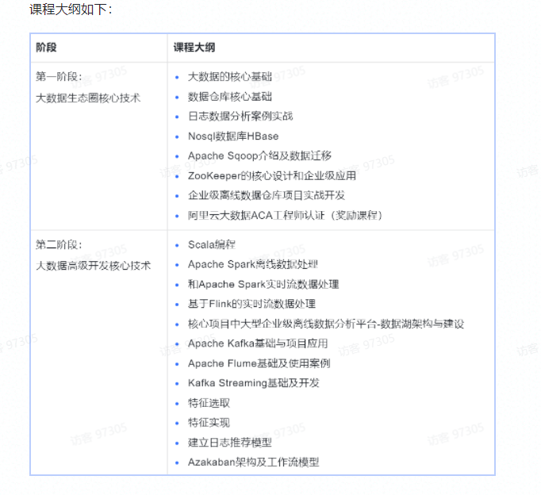

# 深度之眼.大数据开发实战

### 目录

* [大数据开发实战第一期](Bigdata_development/README.md)
    - [1.大数据概况及Hadoop生态系统](Bigdata_development/chapter01.md)
    - [2.Hadoop分布式文件系统HDFS](Bigdata_development/chapter02.md)
    - [3.MapReduce 编程模型基础和实践](Bigdata_development/chapter03.md)
    - [4.Hive-数据仓库基础](Bigdata_development/chapter04.md)
    - [5.Hive-数据仓库进阶](Bigdata_development/chapter05.md)
    - [6.Hive-数据仓库高级实战](Bigdata_development/chapter06.md)
    - [7.项目实战-日志数据分析](Bigdata_development/chapter07.md)
    - [8.项目实战-用户消费数据分析](Bigdata_development/chapter08.md)
    - [9.Nosql综述和ApacheHBase基础](Bigdata_development/chapter09.md)
    - [10.Apache HBase进阶及性能优化](Bigdata_development/chapter10.md)
    - [11.Apache Sqoop介绍及数据迁移](Bigdata_development/chapter11.md)
    - [12.ZookKeeper的核心设计和企业级应用](Bigdata_development/chapter12.md)
    - [13.企业级离线数据仓库项目实战开发](Bigdata_development/chapter13.md)
* [大数据开发实战第二期](Bigdata_development/README.md)
    - [14.Scala编程基础](Bigdata_development/chapter14.md)
    - [15.Scala编程进阶](Bigdata_development/chapter15.md)
    - [16.Apache Spark基础及架构](Bigdata_development/chapter16.md)
    - [17.Apache Spark分布式计算原理](Bigdata_development/chapter17.md)
    - [18.Spark SQL精华及与Hive的集成](Bigdata_development/chapter18.md)
    - [19.Spark Streaming的流数据处理和分析](Bigdata_development/chapter19.md)
    - [20.Flink任务调度原理与资源分配](Bigdata_development/chapter20.md)
    - [21.Flink-Streaming State核心设计与实践](Bigdata_development/chapter21.md)
    - [22.Flink-Streaming WasterMark核心设计与实践](Bigdata_development/chapter22.md)
    
### 课程内容简介

介绍地址：
[https://deepshare.feishu.cn/docs/doccnD7CSY787vusiBV8D1zsvAh](https://deepshare.feishu.cn/docs/doccnD7CSY787vusiBV8D1zsvAh)

部分截图：

## 参考资料
1. [mermaid官方文档](https://mermaid-js.github.io/mermaid/#/flowchart?id=special-characters-that-break-syntax)
2. [文档中心-Ambari使用指南 - 金山云](https://docs.ksyun.com/documents/5519)
3. [Ambari 架构](https://ifeve.com/ambari-1/)
4. [百度.IT小尚](https://author.baidu.com/home?from=bjh_article&app_id=1703817847568260)
