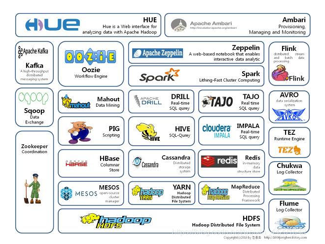
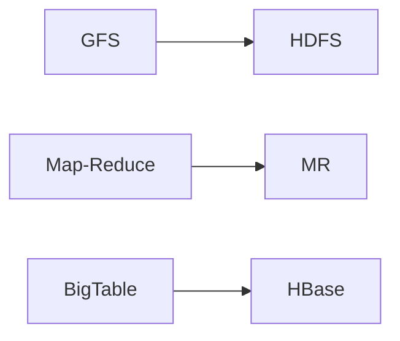
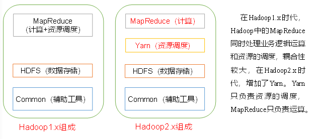
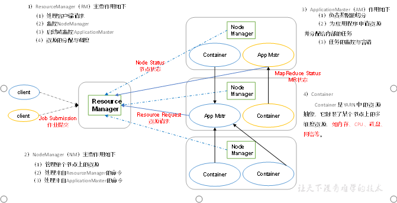
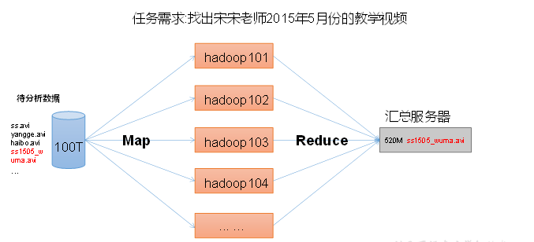
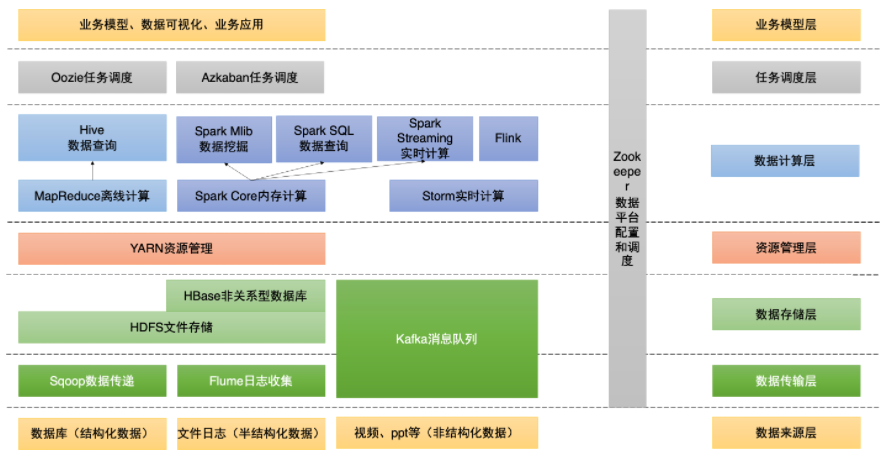

# 第1节.大数据概况及Hadoop生态系统 :id=1

**本节知识点**

- 了解大数据概论及属性
- 了解大数据分布式处理的基本方法
- 了解Hadoop生态系统
- 理解Hadoop框架及核心模块

## 1.1 大数据 :id=1-2

### 1.1.1 大数据定义

**大数据(Big Data)** 指**无法在可承受的时间范围**内用常规软件工具进行捕捉、管理和处理的数据集合，
是需要新处理模式才能具有更强的决策力、洞察发现力和流程优化能力的**海量、高增长率和多样化的信息资产**。

主要解决，海量数据的**存储**和海量数据的**分析计算**问题。


按顺序给出数据存储单位：bit、btye、KB、MB、GB、**TB、PB、EB**、ZB、YB、BB、NB、DB。

1Byte =8bit 1K=1024Byte 1MB = 1024K

1G = 1024M **1T=1024G** **1P = 1024T**

### 1.1.2大数据特征(4V)

- 大量（Volume） - 过去两年产生了90%的数据量，未来有50%的数据将通过Hadoop这个平台产生
- 高速（Velocity） - 为了实现快速分析海量数据的目的，新兴的大数据分析技术通常采用集群处理和独特的内部设计。
- 多样（Variety） - 大数据的数据来源众多，生物大数据、交通大数据、医疗大数据、电信大数据、电力大数据、金融大数据等（种类越丰富，价值越高）
- 低价值密度（Value）- 价值密度却远远低于传统关系数据库中已经有的数据。(并非数据越大越有价值)

### 1.1.3数据分析

**数据分析**是基于**商业目的**，有目的的进行收集、整理、加工和分析数据，**提炼有价值信息**的过程。


### 1.1.4 数据的特点

- 基于时间 - 数据产生的时间是一个重要的元素
- 不可变更性 - 数据的真实性不会改变。 我们将大数据的变化视为新条目，而不是现有条目的更新

### 1.1.5 传统分布式和基于Hadoop的分布式？

**思考题：** 并行和并发的区别？

> 并行(Parallel)：大数据领域，**当系统有一个以上CPU时，当一个CPU执行一个进程时，另一个CPU可以执行另一个进程，两个进程互不抢占CPU资源，可以同时进行，这种方式我们称之为并行(Parallel)。**
>
> 并发(**Concurrent**)：web领域，指的是多个事情，在同一时间段内同时发生了.并发的多个任务之间是互相抢占资源的

传统的分布式计算的特点:**数据向计算靠拢**

- 计算受CPU限制
- 数据量相对较小
- 对数据进行大量的复杂处理
- 主要的推动力是增加单台机器的计算力
- 通常在计算时，数据被复制到计算节点

基于Hadoop的新型分布式计算:**计算向数据靠拢**

- 分布式存储数据，**数据不用复制到计算节点**
  - 将程序分发到数据节点，处理大数据成为可能
  - 廉价的机器群就可以实现
  - 算法支持并行运算

### 1.1.6 Hadoop vs RDMS


|                          | Relational                                                                     | Hadoop                                                                                                               |
| -------------------------- | -------------------------------------------------------------------------------- | ---------------------------------------------------------------------------------------------------------------------- |
| Schema(模式)             | Require Write                                                                  | Required Read                                                                                                        |
| Speed(速度)              | Reads are fast                                                                 | Writes are fast                                                                                                      |
| Govemance(管理)          | Stanards and structured(标准和结构化)                                          | Loosely structured(结构松散)                                                                                         |
| Processing               | Limited,no data processing (局限，无数据处理)                                  | processing coupled with data(处理数据)                                                                               |
| Data Types               | Structured(结构化)                                                             | structured,semi-structured,Un structured                                                                             |
| Best Fit Use(最适合使用) | Complex ACID Transactions,Operational Data Store(复杂ACID事务，操作，数据存储) | Data Discovery,Processing un structured data,Massive storage/processing(数据探索，处理非结构化数据，大规模存储/处理) |

> * (Hadoop并不是要取代关系数据库。 Hadoop用于存储大数据，这通常是由于大小或成本限制而无法存储
>   在RDB中的数据类型)

### 1.1.7 OLAP和OLTP的区别

```md
联机分析处理(OLAP)的概念最早是由关系数据库之父E.F.Codd于1993年提出的，他同时提出了关于OLAP的12条准则。OLAP的提出引起了很大的反响，OLAP作为一类产品同联机事务处理（OLTP）明显区分开来。
当今的数据处理大致可以分为两大类：联机事务处理OLTP(on-line transaction processing)、联机分析处理OLAP(On-LineAnalytical Processing)。
OLTP是传统的关系型数据库的主要应用，主要是基本的、日常的事务处理、例如银行交易。
OLAP是数据仓库系统的主要应用，支持复杂的分析操作，侧重决策支持，并且提供直观易懂的查询结果。


```

下表列出了OLTP和OLAP之间的比较。


| 比较项目           | 联机业务                             | 批处理业务                               |
| -------------------- | -------------------------------------- | ------------------------------------------ |
| 操作特点           | 日常业务操作，尤其是包含大量前台操作 | 后台操作，例如统计报表、大批量数据加载。 |
| 响应速度           | 优先级最高，要求响应速度非常高       | 要求速度高，吞吐量大                     |
| 吞吐量             | 小                                   | 大                                       |
| 并发访问量         | 非常高                               | 不高                                     |
| 单笔事务的资源消耗 | 小                                   | 大                                       |
| SQL语句类型        | 抓哟是插入和修改操作（DML）          | 主要是大量查询操作或批量DML操作          |
| 索引类型           | B*索引                               | Bitmap,Bitmap join 索引                  |
| 索引量             | 适量                                 | 多                                       |
| 访问方式           | 按索引访问                           | 全表访问                                 |
| 连接方式           | Nested_loop                          | Hash join                                |
| BIND 变量          | 使用或强制使用                       | 不使用                                   |
| 并行技术           | 使用不多                             | 大量使用                                 |
| 分区技术           | 使用，但目标不同                     | 使用，但目标不同                         |
| 物化视图           | 少量使用                             | 大量使用                                 |

## 1.2 Hadoop 概述  :id=1-2

### 1.2.1 Hadoop 简介

1）Hadoop 是一个由Apache基金会开发的分布式基础框架。

2）主要解决，海量数据的**存储**和海量数据的**分析计算**问题。

3）广义上来说，Hadoop通常是指一个更广泛的概念 -- Hadoop生态圈



### 1.2.2 Hadoop发展历史

1. Lucene框架是Doug Cutting(道格.卡丁)开创的开源软件，用Java书写代码，实现与Google类似的全文搜索功能，它提供了全文检索引擎的架构，包括完整的查询引擎和索引引擎。

   
2. 2001年年底Lucene成为Apache基金会的一个子项目。
3. 对于海量数据的场景，Lucene面对与Google同样的困难，**存储数据困难，检索速度慢。**
4. 学习和模仿Google解决这些问题的办法：微型版Nutch。
5. 可以说Google是Hadoop的思想之源（Google在大数据方面的三篇论文）



6. 2003-2004年，Google公开了部分GFS和MapReduce思想的细节，以此为基础Doug Cutting等人用了**2年业余时间**实现了HDFS和MapReduce机制，使Nutch性能飙升。
7. 2005年Hadoop作为Lucene的子项目Nutch的一部分正式引入Apache基金会。
8. 2006 年 3月份，Map-Reduce和Nutch Distributed File System(NDFS)分别被纳入到Hadoop项目中，Hadoop就此正式诞生，标志着大数据时代来临。
9. 名字来源于Doug Cutting儿子的玩具大象，如图：

   

### 1.2.3 Hadoop 三大发行版本

Hadoop三大发行版本：**Apache、Cloudera、Hortonworks**。

- Apache版本最原始（最基础）的版本，对于入门学习最好。
- Cloudera在大型互联网企业中用的较多。
- Hortonworks文档较好。

1. Apache Hadoop

官网地址：http://hadoop.apache.org/releases.html
下载地址：[https://archive.apache.org/dist/hadoop/common/](https://archive.apache.org/dist/hadoop/common/)

2. Cloudera Hadoop

官网地址：https://www.cloudera.com/downloads/cdh/5-10-0.html

下载地址：http://archive-primary.cloudera.com/cdh5/cdh/5/

（1）2008年成立的Cloudera是最早将Hadoop商用的公司，为合作伙伴提供Hadoop的商用解决方案，主要是包括支持、咨询服务、培训。

**（2）2009年Hadoop的创始人Doug Cutting也加盟Cloudera公司** 。Cloudera产品主要为CDH，Cloudera Manager，Cloudera Support

（3）CDH是Cloudera的Hadoop发行版，完全开源，比Apache Hadoop在兼容性，安全性，稳定性上有所增强。

（4）Cloudera Manager是集群的软件分发及管理监控平台，可以在几个小时内部署好一个Hadoop集群，并对集群的节点及服务进行实时监控。Cloudera Support即是对Hadoop的技术支持。

（5）Cloudera的标价为每年每个节点4000美元。Cloudera开发并贡献了可实时处理大数据的Impala项目。

3. Hortonworks Hadoop

官网地址：https://hortonworks.com/products/data-center/hdp/

下载地址：https://hortonworks.com/downloads/#data-platform

（1）2011年成立的Hortonworks是雅虎与硅谷风投公司Benchmark Capital合资组建。

**（2）公司成立之初就吸纳了大约25名至30名专门研究Hadoop的雅虎工程师，上述工程师均在2005年开始协助雅虎开发Hadoop，贡献了Hadoop80%的代码。**

（3）雅虎工程副总裁、雅虎Hadoop开发团队负责人Eric Baldeschwieler出任Hortonworks的首席执行官。

（4）Hortonworks的主打产品是Hortonworks Data Platform（HDP），也同样是100%开源的产品，HDP除常见的项目外还包括了Ambari，一款开源的安装和管理系统。

（5）HCatalog，一个元数据管理系统，HCatalog现已集成到Facebook开源的Hive中。Hortonworks的Stinger开创性的极大的优化了Hive项目。Hortonworks为入门提供了一个非常好的，易于使用的沙盒。

（6）Hortonworks开发了很多增强特性并提交至核心主干，这使得Apache Hadoop能够在包括Window Server和Windows Azure在内的Microsoft Windows平台上本地运行。定价以集群为基础，每10个节点每年为12500美元。

### 1.2.4 Hadoop的优势

1） 高可靠性：Hadoop底层维护多个数据副本，所以即使Hadoop某个计算元素或存储出现故障，也不会导致数据的丢失。

2） 高扩展性：在集群间分配任务数据，可方便的扩展数以千计的节点。

3） 高效性：在MapReduce的思想下，Hadoop是并行工作的，以加快任务处理速度。

4） 高容错性：能够自动将失败的任务重新分配。

### 1.2.5 Hadoop组成



> Hadoop3.x 增加了纠错码技术（Erasure coding）简称EC,是一种编码容错技术。这种技术最早用于通信行业，数据传输中的数据恢复。它通过对数据进行分块，然后计算出校验数据，使得各个部分的数据产生关联性。
> 当一部分数据块丢失时，可以通过剩余的数据块和校验计算出丢失的数据块。

Hadoop从2.x开始，就开始分化了。逐渐演变成：HDFS，YARN，MapReduce三大应用模块，这三个
应用模块分别的能力和作用是：

```md
1. HDFS:  分布式文件系统，用来接解决海量大文件的存储问题
2. MapReduce: 一套通用的用来解决海量大文件计算的编程模型API
3. YARN: 资源调度/管理系统
```

其中需要主要的是：这三者之间的关系。彼此独立，又相互依赖。使用`MapReduce`的分布式编程API编写分布式计算应用程序，读取存储在`HDFS`上的海量大文件进行计算，由`YARN`提供计算资源。`HDFS`和`YARN`可以独立运行。主要表现在：

```md
1. 使用MapReduce编写的应用程序也可以运行在其他资源调度系统之上；
2. 使用其他编程模型编写的应用程序，比如storm,Spark,Flink等也可运行在YARN集群上。
```

所以称Hadoop是一个分布式的成熟解决方案。
所以其实安装Hadoop,其实安装HDFS和YARN两个集群。HDFS和YARN都是一个一主多从的集群。

HDFS 集群：

```md
一个NameNode主节点/管理节点。
多个DataNode从节点/工作节点。
```

YARN 集群：

```md
一个ResourceManager主节点/管理节点
多个NodeManager从节点/工作节点
```

#### 1.2.5.1 HDFS 架构概述

HDFS（Hadoop Distributed File System）的架构概述。

1）NameNode (nn): 存储文件的元数据，如文件名，文件目录结构，文件属性（生成时间、副本数、文件权限），以及每个文件的块列表和块所在的DataNode等。

2）DataNode(dn)：在本地文件系统存储文件块数据，以及块数据的校验和。

3）Secondary NameNode(2nn)：用来监控HDFS状态的辅助后台程序，每隔一段时间获取HDFS元数据的快照。

#### 1.2.5.2 YARN架构概述

YARN架构概述



#### 1.2.5.3 MapReduce 架构概述

MapReduce将计算过程分为两个阶段：**Map 和 Reduce**

1) Map阶段并行处理输入数据
2) Reduce阶段对Map结果进行汇总



## 1.3 大数据技术生态体系



1）Sqoop：Sqoop是一款开源的工具，主要用于在Hadoop、Hive与传统的数据库(MySql)间进行数据的传递，可以将一个关系型数据库（例如 ：MySQL，Oracle 等）中的数据导进到Hadoop的HDFS中，也可以将HDFS的数据导进到关系型数据库中。

2）Flume：Flume是Cloudera提供的一个高可用的，高可靠的，分布式的海量日志采集、聚合和传输的系统，Flume支持在日志系统中定制各类数据发送方，用于收集数据；同时，Flume提供对数据进行简单处理，并写到各种数据接受方（可定制）的能力。

3）Kafka：Kafka是一种高吞吐量的分布式发布订阅消息系统，有如下特性：

（1）通过O(1)的磁盘数据结构提供消息的持久化，这种结构对于即使数以TB的消息存储也能够保持长时间的稳定性能。

（2）高吞吐量：即使是非常普通的硬件Kafka也可以支持每秒数百万的消息。

（3）支持通过Kafka服务器和消费机集群来分区消息。

（4）支持Hadoop并行数据加载。

4）Storm：Storm用于“连续计算”，对数据流做连续查询，在计算时就将结果以流的形式输出给用户。

5）Spark：Spark是当前最流行的开源大数据内存计算框架。可以基于Hadoop上存储的大数据进行计算。

6）Oozie：Oozie是一个管理Hdoop作业（job）的工作流程调度管理系统。

7）Hbase：HBase是一个分布式的、面向列的开源数据库。HBase不同于一般的关系数据库，它是一个适合于非结构化数据存储的数据库。

8）Hive：Hive是基于Hadoop的一个数据仓库工具，可以将结构化的数据文件映射为一张数据库表，并提供简单的SQL查询功能，可以将SQL语句转换为MapReduce任务进行运行。 其优点是学习成本低，可以通过类SQL语句快速实现简单的MapReduce统计，不必开发专门的MapReduce应用，十分适合数据仓库的统计分析。

10）R语言：R是用于统计分析、绘图的语言和操作环境。R是属于GNU系统的一个自由、免费、源代码开放的软件，它是一个用于统计计算和统计制图的优秀工具。

11）Mahout：Apache Mahout是个可扩展的机器学习和数据挖掘库。

12）ZooKeeper：Zookeeper是Google的Chubby一个开源的实现。它是一个针对大型分布式系统的可靠协调系统，提供的功能包括：配置维护、名字服务、 分布式同步、组服务等。ZooKeeper的目标就是封装好复杂易出错的关键服务，将简单易用的接口和性能高效、功能稳定的系统提供给用户。

13）Flink: 一个框架和分布式处理引擎，用于对无界和有界数据流进行有状态计算。Flink被设计在所有常见的集群环境中运行，以内存执行速度和任意规模来执行计算。

## 1.4 Hadoop运行环境搭建 :id=1-4

版本选择 ，现在 Hadoop 经历四个大版本：

```
Hadoop-0.x # 古老的Hadoop，连YARN都没有，现在应该没有任何企业还在使用这么古老的Hadoop了
hadoop-1.x # 基本淘汰的Hadoop版本。不用考虑
hadoop-2.x # 现阶段主流的使用版本。比如Hadoop-2.6.5， hadoop-2.7.7， hadoop-2.8.5
hadoop-3.x # 目前较新的Hadoop版本，提供了很多新特性，但是升级的企业还是比较少。
```

根据以上的说明和比较，根据我的了解，选择使用 Hadoop-2.7.7

### 1.4.1 集群规划

说到集群规划，那么我们需要了解一下关于Hadoop集群的几种模式。

```md
伪分布式
分布式
高可用
联邦集群
```

主要有这么四种。当然企业中搭建的 Hadoop 集群都是高可用的分布式集群！

所以这里讲的Hadoop集群的规划主要针对Hadoop分布式集群来进行说明。

一台服务器：伪分布式


| 节点名称 | Hadoop                                  | YARN                             |
| ---------- | ----------------------------------------- | ---------------------------------- |
| bigdate2 | NameNode + DataNode + SecondaryNamenode | ResouceManager+<br />NodeManager |

三台服务器：


| 节点名称 | Hadoop                       | YARN                                   |
| ---------- | ------------------------------ | ---------------------------------------- |
| bigdate2 | NameNode + DataNode 主节点   | NodeManager                            |
| bigdate3 | DataNode + SecondaryNamenode | NodeManager                            |
| bigdate4 | DataNode                     | ResouceManager主节点+<br />NodeManager |

四台服务器：


| 节点名称 | Hadoop                       | YARN           |
| ---------- | ------------------------------ | ---------------- |
| bigdate2 | NameNode                     | NodeManager    |
| bigdate3 | DataNode + SecondaryNamenode | NodeManager    |
| bigdate4 | DataNode                     | NodeManager    |
| bigdate4 | DataNode                     | ResouceManager |

如果有更多的服务器，那么可以按需分配集群角色。实际企业中，一般会将单独性能较好的机器作为集群的主节点。我们在这儿把HDFS和YARN集群的主节点分开安装的不同的节点，主要是为了降低个节点的压力。毕竟我们使用的是虚拟机呀。当然，也可以调整把他们安装在同一个节点。

### 1.4.2 集群安装

刚才讲集群规划的时候，提到了四种安装模式。

```md
伪分布式 # 主要用来测试学习，搭建快速 
分布式 # 正儿八经的分布式集群。用来了解集群的工作机制，用于正儿八经的企业生产 
高可用 # 现阶段流行的主要集群模式。因为避免Hadoop的SPOF问题。提高集群的可用性。 
联邦集群 # 一些超大型企业可以使用的模式。主要为了应对超大规模的数据量对集群的主节点造 成的压力。
```

### 1.4.3 单机版环境搭建

<nav>
<a href="#一前置条件">一、前置条件</a><br/>
<a href="#二配置-SSH-免密登录">二、配置 SSH 免密登录</a><br/>
<a href="#三HadoopHDFS环境搭建">三、Hadoop(HDFS)环境搭建</a><br/>
<a href="#四HadoopYARN环境搭建">四、Hadoop(YARN)环境搭建</a><br/>
</nav>

一、前置条件

Hadoop 的运行依赖 JDK，需要预先安装;

- **Linux下JDK的安装**

> **系统环境**：centos 7.6
> **JDK 版本**：jdk 1.8.0_20

1. 下载并解压

在[官网](https://www.oracle.com/technetwork/java/javase/downloads/index.html) 下载所需版本的 JDK，这里我下载的版本为[JDK 1.8](https://www.oracle.com/technetwork/java/javase/downloads/jdk8-downloads-2133151.html) ,下载后进行解压：

```shell
[root@ java]# tar -zxvf jdk-8u311-linux-x64.tar.gz

```

2. 设置环境变量

```shell
[root@ java]# vi /etc/profile
```

添加如下配置：

```shell
export JAVA_HOME=/usr/java/jdk1.8.0_311  
export JRE_HOME=${JAVA_HOME}/jre  
export CLASSPATH=.:${JAVA_HOME}/lib:${JRE_HOME}/lib  
export PATH=${JAVA_HOME}/bin:$PATH
```

执行 `source` 命令，使得配置立即生效：

```shell
[root@ java]# source /etc/profile
```

3. 检查是否安装成功

```shell
[root@ java]# java -version
```

显示出对应的版本信息则代表安装成功。

```shell
java version "1.8.0_201"
Java(TM) SE Runtime Environment (build 1.8.0_201-b09)
Java HotSpot(TM) 64-Bit Server VM (build 25.201-b09, mixed mode)
```

- **配置免密登录**

Hadoop 组件之间需要基于 SSH 进行通讯。

1. 配置映射

配置 ip 地址和主机名映射：

```shell
vim /etc/hosts
# 文件末尾增加
192.168.72.131  hadoop001
```

2. 生成公私钥

执行下面命令行生成公匙和私匙：

```
ssh-keygen -t rsa
```

3. 授权

进入 `~/.ssh` 目录下，查看生成的公匙和私匙，并将公匙写入到授权文件：

```shell
[root@@hadoop001 sbin]#  cd ~/.ssh
[root@@hadoop001 .ssh]# ll
-rw-------. 1 root root 1675 3 月  15 09:48 id_rsa
-rw-r--r--. 1 root root  388 3 月  15 09:48 id_rsa.pub
# 写入公匙到授权文件
[root@hadoop001 .ssh]# cat id_rsa.pub >> authorized_keys
[root@hadoop001 .ssh]# chmod 600 authorized_keys
```

二、Hadoop 环境搭建

这里使用的Hadoop版本为2.7.7。

将该文件夹解压后，可以放置到自己喜欢的位置，如`/root/install`文件夹下。

```shell
tar -zxvf hadoop-2.7.2.tar.gz -C /root/install/

```

打开`/etc/profile`文件，命令如下：

```shell
sudo vi /etc/profile
在文件末尾，添加如下内容：
#hadoop
HADOOP_HOME=/root/install/hadoop-2.7.7
export HADOOP_HOME
export HADOOP_CLASSPATH=`hadoop classpath`
export HADOOP_CLASSPATH=$CLASSPATH:$HIVE_HOME/lib/*


```

对于单机安装，首先需要更改`hadoop-env.sh`文件，用于配置Hadoop运行的环境变量，命令如下：

修改hadoop-env.sh文件配置

```shell
cd /root/install/hadoop-2.7.7
vi etc/hadoop/hadoop-env.sh

```

在文件末尾，添加如下内容：

```shell
export JAVA_HOME=/root/install/jdk1.8.0_65


```

通过查看版本号命令验证是否安装成功，命令如下：

```shell
[root@hadoop5 hadoop-2.7.7]# hadoop version
Hadoop 2.7.7
Subversion Unknown -r c1aad84bd27cd79c3d1a7dd58202a8c3ee1ed3ac
Compiled by stevel on 2018-07-18T22:47Z
Compiled with protoc 2.5.0
From source with checksum 792e15d20b12c74bd6f19a1fb886490
This command was run using /root/install/hadoop-2.7.7/share/hadoop/common/hadoop-common-2.7.7.jar

```

## 1.5  Hadoop 测试案例 :id=1-5

### 1.5.1 官方案例

利用Hadoop自带的`WordCount`示例程序进行检查集群，并在主节点上进行如下操作，创建执行MapReduce任务所需的HDFS目录：

```shell

hadoop fs -mkdir /input

```

创建测试文件，命令如下：

```shell
vim test

```

在`test`文件中，添加以下内容：

```shell
Hello world!

```

使用`Shift+:`，输入`wq`后回车，保存并关闭编辑器。

将测试文件上传到Hadoop HDFS集群目录，命令如下：

```shell
hadoop fs -put test /input

```

执行wordcount程序，命令如下：

```shell
hadoop jar /root/install/hadoop-2.7.7/share/hadoop/mapreduce/hadoop-mapreduce-examples-2.7.7.jar wordcount /input /out

```

通过以下命令，查看执行结果：

```shell
hadoop fs -ls /out
```

执行结果如下：

```
Found 2 items
-rw-r--r--    1 root supergroup       0 time /out/_SUCCESS
-rw-r--r--    1 root supergroup      17 time /out/part-r-00000 

```

可以看到，结果中包含`_SUCCESS`文件，表示Hadoop集群运行成功。

查看具体的输出结果，命令如下：

```
hadoop fs -text /out/part-r-00000

```

输出结果如下：

```shell
Hello   1
world!  1

```


## 1.6 本节思考题 :id=1-7

**1. NameNode存储数据吗?**

> NameNode并不直接存储数据，NameNode 负责跟踪 HDFS 中所有与文件相关的元数据，例如文件名、块位置、文件许可和副本。从安全角度需要知悉的是，那些读写文件的 HDFS 客户端**总是**与 NameNode 通信的。

**2. NameNode和DataNode的关系**

> DataNode 负责在 HDFS 中对数据块进行存储和读取，NameNode 会告诉正在读取某文件的 HDFS 客户端，集群中的哪个 DataNode 拥有客户端请求的数据。

**3. 通过Java实现对HDFS的文件读写**

```md
  // 创建目录
  @Test
  public void mkDir() throws Exception {
  fileSystem.mkdirs(new Path("/hdfs-api/test0/"));
  }
  //创建文件，并写入内容
  @Test
  public void create() throws Exception {
  // 如果文件存在，默认会覆盖, 可以通过第二个参数进行控制。第三个参数可以控制使用缓冲区的大小
  FSDataOutputStream out = fileSystem.create(new Path("/hdfs-api/test/a.txt"),
  true, 4096);
  out.write("hello hadoop!".getBytes());
  out.write("hello spark!".getBytes());
  out.write("hello flink!".getBytes());
  // 强制将缓冲区中内容刷出
  out.flush();
  out.close();
  }
  //判断文件是否存在
  @Test
  public void exist() throws Exception {
  boolean exists = fileSystem.exists(new Path("/hdfs-api/test/a.txt"));
  System.out.println(exists);
  }
  //查看文件内容
  @Test
  public void readToString() throws Exception {
  FSDataInputStream inputStream = fileSystem.open(new Path("/hdfs-api/test/a.txt"));
  String context = inputStreamToString(inputStream, "utf-8");
  System.out.println(context);
  }

  /**

  * 把输入流转换为指定编码的字符
  *
  * @param inputStream 输入流
  * @param encode      指定编码类型
    */
    private static String inputStreamToString(InputStream inputStream, String encode) {
    try {
    if (encode == null || ("".equals(encode))) {
    encode = "utf-8";
    }
    BufferedReader reader = new BufferedReader(new InputStreamReader(inputStream, encode));
    StringBuilder builder = new StringBuilder();
    String str = "";
    while ((str = reader.readLine()) != null) {
    builder.append(str).append("\n");
    }
    return builder.toString();
    } catch (IOException e) {
    e.printStackTrace();
    }
    return null;
    }

```

**4. 常用的HDFS命令有那些**

> fsck: 检查文件的完整性
> start-balancer.sh: 重新平衡HDFS
> hdfs dfs -copyFromLocal 从本地磁盘复制文件到HDFS

**5. hdfs上的副本在节点之间如何保存的**

> 第一个 block 副本存放在 client 所在的 node 中（如果 client 不在集群范围内，则第一个 node 是随机选取 的，系统会尝试不选择那些太满或者太忙的 node）；
> 第二个副本放置在与第一个 node 不同机架的 node 中（近乎随机选择，系统会尝试不选择那些太满或者太忙 的 node）；
> 第三个副本放在与第二个副本同机架不同的 node 中。
