# MapReduce 编程模型基础和实践

---

## 3.1 MapReduce概述

### 3.1.1 MapReduce 定义

MapReduce是一个分布式运算程序的编程框架，是基于Hadoop的数据分析计算的核心框架。

MapReduce处理过程分为两个阶段：Map和Reduce。

1. Map负责把一个任务分解成多个任务；
2. Reduce负责把分解后多任务处理的结果汇总。

适用场景

- **搜索：** 网页爬取、倒排索引、PageRank.
- **Web访问日志分析：** 分析和挖掘用户在web上的访问、购物行为特征、实现个性化推荐；分析用户访问行为。
- **文本统计分析：** 比如莫言小说的 wordcount、词频TFIDF分析；学术论文、专利文献的引用分析和统计；维基百科数据分析等；
- **海量数据挖掘：** 非结构化数据、时空数据、图像数据的挖掘。
- **机器学习：** 监督学习、非监督学习、分类算法如决策树、SVM等。
- **自然语言处理：** 基于大数据的训练和预测；基于语料库构建单词同现矩阵，频繁项集数据挖掘、重复文档检测等；
- **广告推荐：** 用户点击(CTR)和购买行为(CVR)预测。

### 3.1.2 MapReduce 优缺点

#### 优点

1. MapReduce 易于编程

**它简单的实现一些接口，就可以完成一个分布式程序**，这个分布式程序可以分布到大量廉价的PC机器上运行。也就是说你写一个分布式程序，跟写一个简单的串行程序是一模一样的。就是因为这个特点使得MapReduce编程变得非常流行。

2. 良好的扩展性
   当你的计算资源不能得到满足的时候，你可以通过简单的增加机器来扩展它的计算能力。
3. 高容错性

MapReduce设计的初衷就是使程序能够部署在廉价的PC机器上，这就要求它具有很高的容错性。比如其中一个机器挂了，它可以把上面的计算任务转移到另外一个节点上运行，不至于这个任务运行失败，而且这个过程不需要人工参与，而完全是由Hadoop内部完成的。

4. 适合PB级以上海量数据的离线处理

可以实现上千台服务器集群并发工作，提供数据处理能力。

#### 缺点

1. 不擅长实时计算

MapReduce无法像Mysql一样，在毫秒或者秒级内返回结果。

2. 不擅长流式计算

流式计算的输入数据是动态的，而MapReduce的输入数据集是静态的，不能动态变化。这是因为MapReduce自身的设计特点决定了数据源必须是静态的。

3. 不擅长DAG(有向图)计算

多个应用程序存依赖关系，后一个应用程序的输入为前一个的输出。在这种情况下，MapReduce并不是不能做，而是使用后，每个MapReduce作业的输出结果都会写入到磁盘中，会造成大量的磁盘IO,导致性能非常的低下。

### 3.1.3 MapReduce 核心编程思想

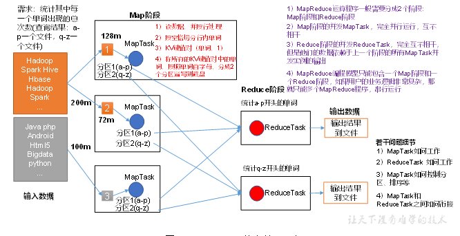

1） 分布式的运算程序往往需要分成至少2个阶段。

2）第一个阶段的MapTask并发实例，完全并行运行，互不相干。

3）第二个阶段的ReduceTask并发实例互不相干，但是他们的数据依赖于上一个阶段的所有MapTask并发实例的输出。

4）MapReduce编程模型只能包含一个Map阶段和一个Reduce阶段，，如果用户的业务逻辑非常复杂，那就只能多个MapReduce程序，串行运行。

总结：分析WordCout数据流走向深入理解mapReduce核心思想。

### 3.1.4 MapReduce 进程

一个完整的MapReduce程序在分布式运行时有三类实例进程：

1. **MrAppMaster:** 负责整个程序的过程调度及状态协调。
2. **MapTask:** 负责Map阶段的整个数据处理流程。
3. **ReduceTask:** 负责Reduce阶段的整个数据处理流程。

### 常用数据序列化类型


| Java类型 | Hadoop Writable类型 |
| ---------- | --------------------- |
| boolean  | BooleanWritable     |
| byte     | ByteWritable        |
| int      | IntWritable         |
| float    | FloatWritable       |
| long     | LongWritable        |
| double   | DoubleWritable      |
| String   | Text                |
| map      | MapWritable         |
| array    | ArrayWritable       |

### 3.1.5 MapReduce 编程规范

用户编写的程序分为三个部分：Mapper、Reducer和Driver。

- Mapper阶段
  - 用户自定义的Mapper要继承自己的父类
  - Mapper的输入数据是KV对的形式（kv的类型可自定义）
  - Mapper中的业务逻辑写在map()方法中
  - Mapper的输出数据是kv对的形式（kv的类型可自定义）
  - map()方法（Maptask进程）对每一个<K,V>调用一次🎉️
- Reduce阶段
  - 用户自定义的Reducer要继承自己的父类
  - Reducer的输入数据类型对应Mapper的输出数据类型，也是kv
  - Reducer的业务逻辑写在reduce()方法中。
  - ReduceTask进程对每一组相同k的<k,v>组调用一次reduce()方法
- Driver阶段
  - 相当于YARN集群的客户端，用于提交我们整个程序到YARN集群，提交的是封装了MapReduce程序相关运行参数的job对象。

### 3.1.6 Wordcount 案例实操

官方wordcount源码采用反编译工具反编译源码，发现WordCount案例有Map类、Reduce类和驱动类。且数据的类型是Hadoop自身封装的序列化类型。

1. 需求
   在给定的文本文件中统计输出每一个单词出现的总次数
   1）输入数据:
   hello.txt

```
atguigu atguigu
ss ss
cls cls
jiao
banzhang
xue
hadoop
```

2) 期望输出数据

```
atguigu	2
banzhang	1
cls	2
hadoop	1
jiao	1
ss	2
xue	1
```

2. 需求分析

按照MapReduce编程规范，分别编写Mapper，Reducer，Driver，如图所示。

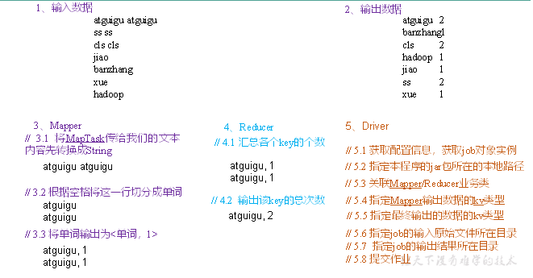

3. IDE代码

完整代码：`code\chapter03\mapreduce`

这里只列出相关文件代码：`pom.xml`,`WordcountMapper.java`,`WordcountReducer.java`,`WordcountDriver.java`

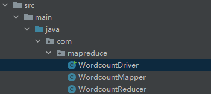

pom.xml 文件代码：

```java
<dependencies>
    <dependency>
        <groupId>org.apache.hadoop</groupId>
        <artifactId>hadoop-common</artifactId>
        <version>2.7.2</version>
    </dependency>
    <dependency>
        <groupId>org.apache.hadoop</groupId>
        <artifactId>hadoop-hdfs</artifactId>
        <version>2.7.2</version>
    </dependency>
    <dependency>
        <groupId>org.apache.hadoop</groupId>
        <artifactId>hadoop-auth</artifactId>
        <version>2.7.2</version>
    </dependency>
    <dependency>
        <groupId>org.apache.hadoop</groupId>
        <artifactId>hadoop-client</artifactId>
        <version>2.7.2</version>
    </dependency>
    <dependency>
        <groupId>org.apache.hadoop</groupId>
        <artifactId>hadoop-mapreduce-client-core</artifactId>
        <version>2.7.2</version>
    </dependency>
    <dependency>
        <groupId>org.apache.hadoop</groupId>
        <artifactId>hadoop-mapreduce-client-jobclient</artifactId>
        <version>2.7.2</version>
    </dependency>
    <dependency>
        <groupId>junit</groupId>
        <artifactId>junit</artifactId>
        <version>3.8.1</version>
        <scope>test</scope>
    </dependency>
</dependencies>

<build>
    <!--<sourceDirectory>src</sourceDirectory>-->
    <plugins>
        <plugin>
            <groupId>org.apache.maven.plugins</groupId>
            <artifactId>maven-jar-plugin</artifactId>
        </plugin>
    </plugins>
</build>
```

WordcountMapper.java 文件代码：

```java
package com.mapreduce;

import java.io.IOException;
import org.apache.hadoop.io.IntWritable;
import org.apache.hadoop.io.LongWritable;
import org.apache.hadoop.io.Text;
import org.apache.hadoop.mapreduce.Mapper;

public class WordcountMapper extends Mapper<LongWritable, Text, Text, IntWritable>{

    Text k = new Text();
    IntWritable v = new IntWritable(1);

    @Override
    protected void map(LongWritable key, Text value, Context context)	throws IOException, InterruptedException {

        // 1 获取一行
        String line = value.toString();

        // 2 切割
        String[] words = line.split(" ");

        // 3 输出
        for (String word : words) {

            k.set(word);
            context.write(k, v);
        }
    }
}
```

WordcountReducer.java 文件代码：

```
 package com.mapreduce;
 
 import java.io.IOException;
 import org.apache.hadoop.io.IntWritable;
 import org.apache.hadoop.io.Text;
 import org.apache.hadoop.mapreduce.Reducer;
 
 public class WordcountReducer extends Reducer<Text, IntWritable, Text, IntWritable>{
 int sum;
 IntWritable v = new IntWritable();
 
     @Override
     protected void reduce(Text key, Iterable<IntWritable> values,Context context) throws IOException, InterruptedException {
 
         // 1 累加求和
         sum = 0;
         for (IntWritable count : values) {
             sum += count.get();
         }
 
         // 2 输出
         v.set(sum);
         context.write(key,v);
     }
 }

```

WordcountDriver.java 文件代码：

```
package com.mapreduce;

import java.io.IOException;
import org.apache.hadoop.conf.Configuration;
import org.apache.hadoop.fs.Path;
import org.apache.hadoop.io.IntWritable;
import org.apache.hadoop.io.Text;
import org.apache.hadoop.mapreduce.Job;
import org.apache.hadoop.mapreduce.lib.input.FileInputFormat;
import org.apache.hadoop.mapreduce.lib.output.FileOutputFormat;

public class WordcountDriver {

 public static void main(String[] args) throws IOException, ClassNotFoundException, InterruptedException {

     // 1 获取配置信息以及封装任务
     Configuration configuration = new Configuration();
     Job job = Job.getInstance(configuration);

     // 2 设置jar加载路径
     job.setJarByClass(WordcountDriver.class);

     // 3 设置map和reduce类
     job.setMapperClass(WordcountMapper.class);
     job.setReducerClass(WordcountReducer.class);

     // 4 设置map输出
     job.setMapOutputKeyClass(Text.class);
     job.setMapOutputValueClass(IntWritable.class);

     // 5 设置最终输出kv类型
     job.setOutputKeyClass(Text.class);
     job.setOutputValueClass(IntWritable.class);
     // 6 设置输入和输出路径
     FileInputFormat.setInputPaths(job, new Path(args[0]));
     FileOutputFormat.setOutputPath(job, new Path(args[1]));

     // 7 提交
     boolean result = job.waitForCompletion(true);

     System.exit(result ? 0 : 1);
 }
}
```

打包运行：

1. 打包jar复制到文件夹：`share/hadoop/mapreduce/mapreduce0-wordcount.jar`
2. 复制hello.txt到dfs文件夹：`hadoop fs -put hello.txt input`

hello.txt

```text
atguigu atguigu
ss ss
cls cls
jiao
banzhang
xue
hadoop
```

3. 执行代码：`hadoop jar share/hadoop/mapreduce/mapreduce-wordcount.jar com.mapreduce.WordcountDriver input/hello.txt output3`
4. `hadoop fs -cat output3/*`

最后显示结果：

```
[root@hadoop5 hadoop-2.7.7]# hadoop fs -cat output3/*
atguigu 2
banzhang        1
cls     2
hadoop  1
jiao    1
ss      2
xue     1
```

## 3.2 Hadoop序列化

### 3.2.1 序列化概述

#### 3.2.1.1 什么是序列化

序列化就是把内存中的对象，转换成字节序列（或其他数据传输协议）以便存储到磁盘（持久化）和网络传输。

反序列化就是将收到的字节序列（或其他数据传输协议）或者磁盘的持久化数据，转换成内存中的对象。

#### 3.2.1.2 为什么要序列化

一般来说，“活跃”对象只生存在内存里，关机断电就没有了。而且“活跃”对象只能由本地进程使用，不能被发送到网络上的另一台计算机。然而序列化可以存储“活跃”对象，可以将“活跃”对象发送到远程计算机。

#### 3.2.1.3 为什么不用Java的序列化

Java的序列化是一个重量级序列化框架（Serializable），一个对象被序列化后，会附带很多额外的信息（各种校验信息、Header、继承体系等），不便于在网络中高效传输。所以，Hadoop自己开发了一套序列化机制（Writable）。

**Hadoop 序列化特点**

（1）**紧凑：** 高效使用存储空间

（2）**快速：** 读写数据的额外开销小。

（3）**可扩展：** 随着通信协议的升级而升级。

（4）**互操作：** 支持多语言的交互。

### 3.2.2 自定义 bean对象实现序列化接口（Writable）

在企业开发中往往常用的基本序列化类型不能满足所有需求，比如在Hadoop框架内部传递一个`bean`对象，那么该对象就需要实现序列接口。

具体实现`bean`对象序列化步骤如下7步：

（1）必须实现Writable接口

（2）反序列化时，需要反射调用空参数构造函数，所以必须有空参构造

```java
public FlowBean() {
    super();
}
```

（3）重写序列化方法

```java
@Override
public void write(DataOutput out) throws IOException {
	out.writeLong(upFlow);
	out.writeLong(downFlow);
	out.writeLong(sumFlow);
}
```

（4）重写反序列化方法

```java
@Override
public void readFields(DataInput in) throws IOException {
	upFlow = in.readLong();
	downFlow = in.readLong();
	sumFlow = in.readLong();
}
```

（5）注意反序列化的顺序和序列化的顺序完全一致。🎉️

（6）要想把结果显示在文件中，需要重写`toString()`,可用“\t”分开，方便后续用。

（7）如果需要将自定义的bean放在key中传输，则还需要实现`Comparable`接口，因为MapReduce框中的shuffle过程要求对key必须能排序。**详见后面排序案例。**

```java
@Override
public int compareTo(FlowBean o) {
	// 倒序排列，从大到小
	return this.sumFlow > o.getSumFlow() ? -1 : 1;
}
```

### 3.2.3 序列化案例实操

#### 1. 需求

统计每一个手机号耗费的总上行流量、下行流量、总流量

（1） 输入数据 （均为虚假模拟数据）phone_data.txt

```plaintext
1	13736230513	192.196.100.1	www.atguigu.com	2481	24681	200
2	13846544121	192.196.100.2			264	0	200
3 	13956435636	192.196.100.3			132	1512	200
4 	13966251146	192.168.100.1			240	0	404
5 	18271575951	192.168.100.2	www.atguigu.com	1527	2106	200
6 	84188413	192.168.100.3	www.atguigu.com	4116	1432	200
7 	13590439668	192.168.100.4			1116	954	200
8 	15910133277	192.168.100.5	www.hao123.com	3156	2936	200
9 	13729199489	192.168.100.6			240	0	200
10 	13630577991	192.168.100.7	www.shouhu.com	6960	690	200
11 	15043685818	192.168.100.8	www.baidu.com	3659	3538	200
12 	15959002129	192.168.100.9	www.atguigu.com	1938	180	500
13 	13560439638	192.168.100.10			918	4938	200
14 	13470253144	192.168.100.11			180	180	200
15 	13682846555	192.168.100.12	www.qq.com	1938	2910	200
16 	13992314666	192.168.100.13	www.gaga.com	3008	3720	200
17 	13509468723	192.168.100.14	www.qinghua.com	7335	110349	404
18 	18390173782	192.168.100.15	www.sogou.com	9531	2412	200
19 	13975057813	192.168.100.16	www.baidu.com	11058	48243	200
20 	13768778790	192.168.100.17			120	120	200
21 	13568436656	192.168.100.18	www.alibaba.com	2481	24681	200
22 	13568436656	192.168.100.19			1116	954	200
```

（2）输入数据格式：

```
7 	13590439668	 192.168.100.4   1116	   954	     200
id  手机号码     网络IP           上行流量    下行流量   网络状态码
```

（3）期望输出数据格式

```
13590439668	 1116	     954	  2070
手机号码           上行流量    下行流量   总流量
```

#### 需求分析

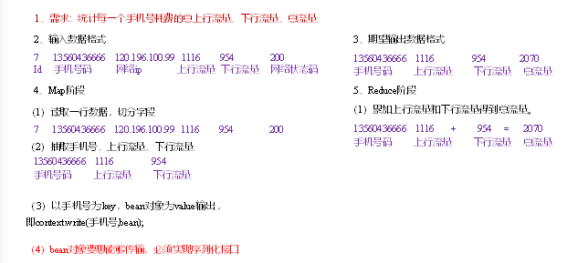

## 3.3 MapReduce框架原理

### 3.3.1 InputFormat数据输入

#### 3.3.1.1 切片与MapTask并行度决定机制

（1）问题引出

MapTask的并行度决定Map阶段的任务处理并发度，进而影响到整个Job的处理速度。

> 思考：

## 3.4 MapReduce的工作流程

### 3.4.1 工作流程概述

大规模数据集的处理包括:`分布式存储`和`分布式计算`


| 对比   | 分布式存储         | 分布式计算       |
| -------- | -------------------- | ------------------ |
| google | 布式文件系统GFS    | MapReduce        |
| Hadoop | 分布式文件系统HDFS | Hadoop MapReduce |

MapReduce的核心思想可以用**"分而治之"**来描述，即把一个大的数据集拆分成多个小数据块在多台机器上并行处理，也就是说，一个大的MapReduce作业的处理流程如下：

- 首先，会被分成许多个Map任务在多台机器上并行执行。每个`Map`任务通常运行在数据存储的节点上，这样，计算和数据就可以放在一起运行，不需要额外的数据传输开销。当`Map`任务结束后，会生成以`<key,value>`形式表示的许多中间的结果。
- 然后，这些中间结果会被分发到多个`Reduce`任务在多台机器上**并行执行**，**具有相同key**的`<key,value>`会被发送到同一个`reduce`任务那里，`reduce`任务会对中间结果进行汇总计算得到最后结果，并输出到分布式文件系统中。

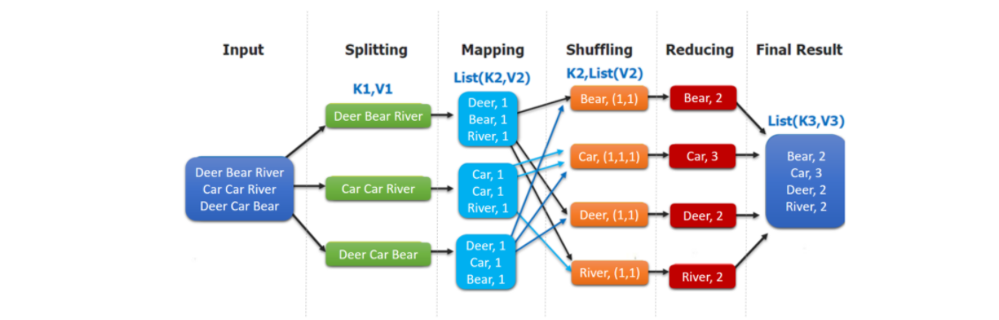

> 不同的Map任务之间不会进行通信，不同的reduce任务之间也不会发生任何信息交换；用户不能显示地从一台机器向另一台机器发送消息，所有的数据交换都是通过mapreduce框架自身去实现的。
> 在MapReduce的整个执行过程中，Map任务的输入文件，reduce任务的处理结果都是保存在分布式文件系统中的，而Map任务处理得到的中间结果则保存在本地存储（如磁盘）中。

### 3.4.2 MapReduce的各个执行阶段

MapReduce算法的执行过程：

1. MapReduce框架使用`InputFormat`模块做`Map`前的预处理。作用：验证输入的格式是否符合输入定义，如果符合，将输入文件切分为逻辑上的多个`InputSplit`,`InputSplit`是MapReduce对文件进行处理和运算的输入单位，只是一个逻辑概念，每个`InputSplit`并没有对文件进行实际切割，知识记录了要处理的数据的位置和长度。
2. 因为`InputSplit`是逻辑切分，所以，还需要通过`RecordReader`(RR)并根据`InputSplit`中的信息来处理`InputSplit`中的具体记录，加载数据并转换为适合`Map`任务读取的键值对，输入给`Map`任务。
3. `Map`任务会根据用户自定义的映射规则，输出一系列的`<key,value>`作为中间结果。
4. 为了让`Reduce`可以并行处理`Map`的结果，需要对`Map`的输出进行一定的分区，排序(Sort)、合并(Combine)和归并等操作，得到`<key,value-list>`形式的中间结果，再交给对应的`Reduce`程序进行处理，这个过程称为`shuffle`。
5. `Reduce`以一系列`<key,value-list>`中间结果作为输入，执行用户定义的逻辑，输出结果给`OutputFormat`模块。
6. `OutputFormat`模块会验证输出目录是否已经存在，以及输出结果类型是否符合配置文件中的配置类型，如果都满足，就输出`Reduce`的结果到分布式文件系统。
   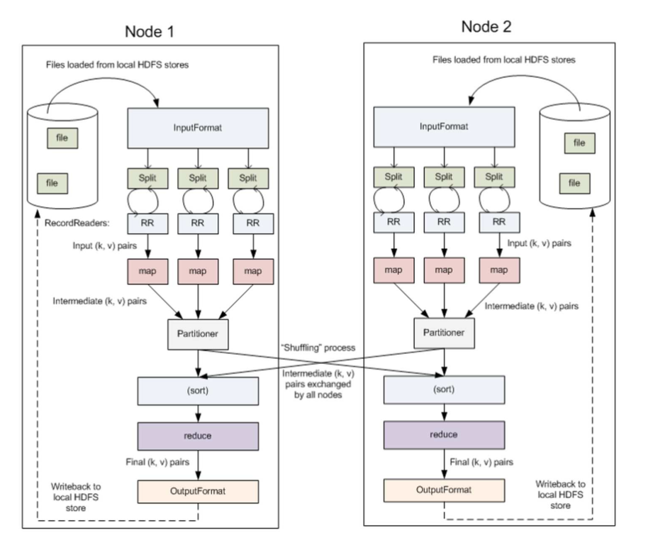

### 3.4.3 shuffle过程详解

#### 3.4.3.1 shuffle过程简介

> list(k2,v2) -> <k2,v2-list>的过程

`shuffle`过程是MapReduce整个工作流程的核心环节，理解`shuffle`过程的基本原理，对于理解MapReduce流程至关重要。

所谓`shuffle`，是针对`Map`输出结果进行**分区、排序和合并**等处理,并交给`reduce`的过程。因此，**shuffle过程**分为**Map端的操作和Reduce端的操作**。

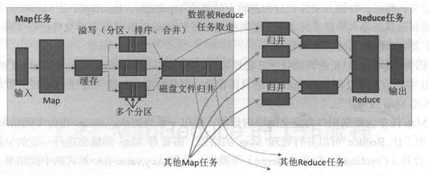

1. 在`Map`端的shuffle过程。`Map`的输出结果首先被写入缓存，当缓存满时，就启动溢写操作（分区、排序、合并），把缓存中的数据写入磁盘文件，并清空缓存，当启动溢写操作时，首先需要把缓存中的数据进行分区，然后对每个分区的数据进行排序(sort)和合并（Combine）,之后写入磁盘文件。 每次溢写操作会生成要给新的磁盘文件，随着`Map`任务的执行，磁盘中就会生成多个溢写文件。在`Map`任务全部结束之<前[todo]，这些溢写文件会被归并(merge)成一个大的磁盘文件，然后，通知相应的`reduce`任务来领取属于自己需要处理的数据。


2. 在`reduce`端的shuffle过程。`Reduce`任务从`Map`端的不同`Map`机器领回属于自己需要处理的那部分数据，然后，对数据进行归并(Merge)后交给`Reduce`处理。

#### 3.4.3.2 Map端的shuffle过程

`Map`端的`shuffle`过程包括4个步骤：

1. 输入数据和执行`Map`任务 `k1,v1 -> list(k2,v2)`

`Map`任务的输入数据一般保存在分布式文件系统(如GFS或HDFS)的文件块中，这些文件块的格式时任意的，可以是文档，也可以是二进制格式的。`Map`任务接受`<key,value>`作为输入后，按一定的映射规则转换成一批`<key,value>`进行输出。

2. 写入缓存

每个`Map`任务都会被分配一个缓存，`Map`的输出结果不是立即写入磁盘，而是首先写入缓存。在缓存中积累一定数量的`map`输出结果以后，在一次性批量写入磁盘，这样可以大大减少对磁盘`I/O`的影响。

因为，磁盘包含机械部件，它事实通过磁头移动和盘片的转动来寻址定位数据的，每次寻址的开销很大，如果每个`Map`输出结果都直接写入磁盘，回引入很多寻址开销，而**一次性批量写入**,就只需要一次寻址，连续写入，大大降低了开销。需要注意的是，在写入缓存之前，`key`于`value`值都会被序列化成字节数组。

3. 溢写（分区、排序和合并）

提供给MapReduce的缓存的容量是有限的，默认大小是100MB. 随着`Map`任务的执行，缓存中`Map`结果的数量不断增加，很快就会占满整个缓存，这时，就必须启动溢写（spill）操作，把缓存中的内容一次性写入磁盘，并清空缓存。

## 3.5 Hadoop数据压缩

### 3.5.1 概述

压缩技术能够有效减少底层存储系统（HDFS）读写节点数。压缩提高了网络带宽和磁盘空间的效率。在运行MR程序时，I/0操作、网络数据传输、shuffle和Merge要花大量的时间，尤其是数据规模很大和工作负载密集的情况下，因此，使用数据压缩显得非常重要。

鉴于磁盘I/O和网络带宽是Hadoop的宝贵资源，数据压缩对于节省资源，最小化磁盘I/O和网络传输非常有帮助。可以在任意MapReduce阶段启用压缩。不过，尽管压缩和解压操作的CPU开销不高，其性能的提升和资源的节省并非没有代价。

压缩是提高Hadoop运行效率的一种**优化策略。**

**通过对Mapper、Reducer运行过程的数据进行压缩，以减少磁盘I/O，** 提高MR程序运行速度。

> 注意：采用压缩技术减少了磁盘I/O,但同时增加了CPU运算负担。所以，压缩特性运用得当能提高性能，但运行不当也可能降低性能。

压缩基本原则：

（1） 运算密集型的job,少用压缩。

（2） IO密集型的job,多用压缩

### 3.5.2 MR支持的压缩编码

- DEFLATE hadoop自带 ,不可切分，算法：DEFLATE
- Gzip hadoop自带 不可以切分，算法：DEFLATE
- bzip2 hadoop自带 可切分，算法：bzip2
- LZO   自定义安装  可切分，算法：LZO
- snappy 自定义安装 不可切分，算法：snappy

## 3.6 Yarn 资源调度器

yarn 是一个资源调度平台，负责为运算程序提供服务器运算资源，相当于一个分布式的操作系统平台，而MapReduce等运算程序则相当于运行于操作系统之上的应用程序。

### 3.6.1 Yarn基本架构

YARN主要由`ResourceManager`、`NodeManager`、`ApplicationMaster`和`Container`等组件构成

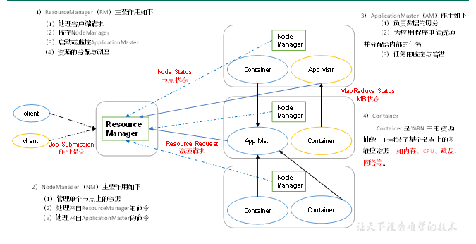

### 3.6.2 Yarn工作机制

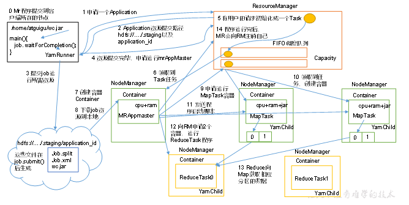

工作机制详解：

（1）MR程序提交到客户端所在的节点。

（2）YarnRunner向ResourceManager申请一个Application。

（3）RM将该应用程序的资源路径返回给YarnRunner。

（4）该程序将运行所需资源提交到HDFS上。

（5）程序资源提交完毕后，申请运行mrAppMaster。

（6）RM将用户的请求初始化成一个Task。

（7）其中一个NodeManager领取到Task任务。

（8）该NodeManager创建容器Container，并产生MRAppmaster。

（9）Container从HDFS上拷贝资源到本地。

（10）MRAppmaster向RM 申请运行MapTask资源。

（11）RM将运行MapTask任务分配给另外两个NodeManager，另两个NodeManager分别领取任务并创建容器。

（12）MR向两个接收到任务的NodeManager发送程序启动脚本，这两个NodeManager分别启动MapTask，MapTask对数据分区排序。
（13）MrAppMaster等待所有MapTask运行完毕后，向RM申请容器，运行ReduceTask。

（14）ReduceTask向MapTask获取相应分区的数据。

（15）程序运行完毕后，MR会向RM申请注销自己。

### 3.6.3 作业提交全过程

#### 1. 作业提交过程之YARN

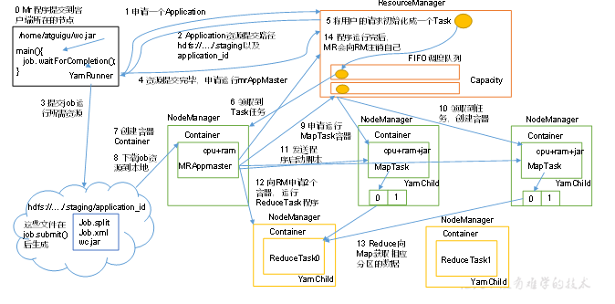

作业提交全过程详解

（1）作业提交

第1步：Client调用job.waitForCompletion方法，向整个集群提交MapReduce作业。

第2步：Client向RM申请一个作业id。

第3步：RM给Client返回该job资源的提交路径和作业id。

第4步：Client提交jar包、切片信息和配置文件到指定的资源提交路径。

第5步：Client提交完资源后，向RM申请运行MrAppMaster。

（2）作业初始化

第6步：当RM收到Client的请求后，将该job添加到容量调度器中。

第7步：某一个空闲的NM领取到该Job。

第8步：该NM创建Container，并产生MRAppmaster。

第9步：下载Client提交的资源到本地。

（3）任务分配

第10步：MrAppMaster向RM申请运行多个MapTask任务资源。

第11步：RM将运行MapTask任务分配给另外两个NodeManager，另两个NodeManager分别领取任务并创建容器。

（4）任务运行

第12步：MR向两个接收到任务的NodeManager发送程序启动脚本，这两个NodeManager分别启动MapTask，MapTask对数据分区排序。

第13步：MrAppMaster等待所有MapTask运行完毕后，向RM申请容器，运行ReduceTask。

第14步：ReduceTask向MapTask获取相应分区的数据。

第15步：程序运行完毕后，MR会向RM申请注销自己。

（5）进度和状态更新

YARN中的任务将其进度和状态(包括counter)返回给应用管理器, 客户端每秒(通过mapreduce.client.progressmonitor.pollinterval设置)向应用管理器请求进度更新, 展示给用户。

（6）作业完成

除了向应用管理器请求作业进度外, 客户端每5秒都会通过调用waitForCompletion()来检查作业是否完成。时间间隔可以通过mapreduce.client.completion.pollinterval来设置。作业完成之后, 应用管理器和Container会清理工作状态。作业的信息会被作业历史服务器存储以备之后用户核查。

#### 作业提交过程之MapReduce

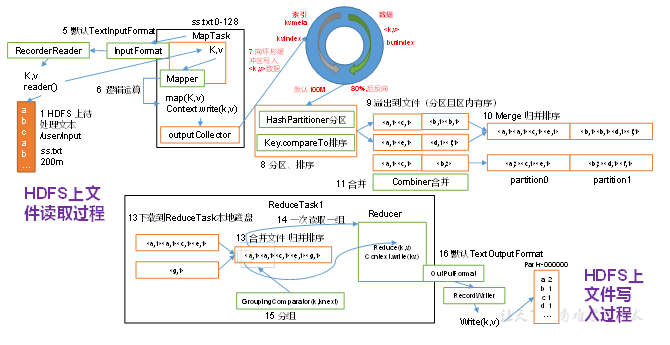

### 3.6.4 资源调度器

目前，Hadoop作业调度器主要有三种：FIFO、Capacity Scheduler和Fair Scheduler。Hadoop2.7.7。

默认的资源调度器是Capacity Scheduler。

具体设置详见：yarn-default.xml文件

```
<property>
    <description>The class to use as the resource scheduler.</description>
    <name>yarn.resourcemanager.scheduler.class</name>
<value>org.apache.hadoop.yarn.server.resourcemanager.scheduler.capacity.CapacityScheduler</value>
</property>
```

### 3.6.5 任务的推测执行

1．作业完成时间取决于最慢的任务完成时间

一个作业由若干个Map任务和Reduce任务构成。因硬件老化、软件Bug等，某些任务可能运行非常慢。

思考：系统中有99%的Map任务都完成了，只有少数几个Map老是进度很慢，完不成，怎么办？

2．推测执行机制

发现拖后腿的任务，比如某个任务运行速度远慢于任务平均速度。为拖后腿任务启动一个备份任务，同时运行。谁先运行完，则采用谁的结果。

3．执行推测任务的前提条件

（1）每个Task只能有一个备份任务

（2）当前Job已完成的Task必须不小于0.05（5%）

（3）开启推测执行参数设置。mapred-site.xml文件中默认是打开的。

```java
<property>
  	<name>mapreduce.map.speculative</name>
  	<value>true</value>
  	<description>If true, then multiple instances of some map tasks may be executed in parallel.</description>
</property>

<property>
  	<name>mapreduce.reduce.speculative</name>
  	<value>true</value>
  	<description>If true, then multiple instances of some reduce tasks may be executed in parallel.</description>
</property>
```

4．不能启用推测执行机制情况

（1）任务间存在严重的负载倾斜。

（2）特殊任务，比如任务向数据库中写数据。

5. 算法原理

   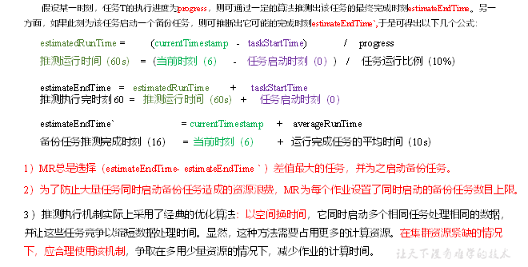

## 3.7 Hadoop企业优化

### 3.7.1 MapReduce 跑的慢的原因

MapReduce 程序效率的瓶颈在于两点：

1. 计算机性能
   CPU、内存、磁盘健康、网络
2. I/O 操作优化

（1）数据倾斜

（2）Map和Reduce数设置不合理

（3）Map运行时间太长，导致Reduce等待过久

（4）小文件过多

（5）大量的不可分块的超大文件

（6）spill次数过多

（7）Merge次数过多等。

### 3.7.2 MapReduce优化方法

MapReduce优化方法主要从六个方面考虑：数据输入、Map阶段、Reduce阶段、IO传输、数据倾斜问题和常用的调优参数。

## 3.8 学习资料

1. [大数据学习指南](https://ldbmcs.gitbook.io/bigdata/hadoop/fen-bu-shi-ji-suan-kuang-jia-mapreduce)
2. [MapReduce 计算框架入门](https://www.cnblogs.com/shoufeng/p/15377088.html)

````

````
