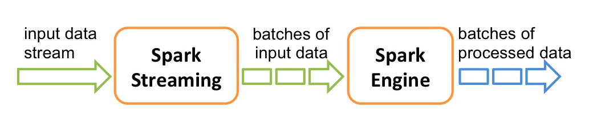
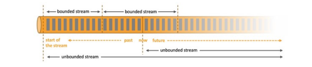

# Flink

## 1. Flink 简介

Flink项目的理念是：“**Apache Flink是为分布式、高性能、随时可用以及准确的流处理应用程序打造的开源流处理框架**”。

Flink 是一个分布式的流处理框架，它能够对有界和无界的数据流进行有状态计算。FLink被设计在所有常见的集群环境中运行，以内存执行速度和任意规模来执行计算。

Flink 的核心是流处理，当然它也能支持批处理，Flink 将批处理看成是流处理的一种特殊情况，即数据流是有明确界限的。

这和 Spark Streaming 的思想是完全相反的。

### Flink流处理特性

1. 支持高吞吐、低延迟、高性能的流处理
2. 支持带有事件时间 的窗口（window）操作
3. 支持有状态计算的Exactly-once语义 。
> **Exactly-Once一致性语义**
> 当任意条数据流转到某分布式系统中，如果系统在整个处理过程中对该任意条数据都仅精确处理一次，且处理结果正确，则被认为该系统满足Exactly-Once一致性。
知识点：[一文彻底了解Exactly-Once一致性语义: 对比Spark/Flink流处理模型](https://zhuanlan.zhihu.com/p/431414055)
4. 支持高度灵活的窗口（Window）操作，支持基于time、count、session以及data-driven的窗口操作。
5. 支持具有Backpressure功能的持续流模型
6. 支持基于轻量级分布快照(Snapshot)实现的容错
7. 运行时同时支持Batch on Streaming 处理和Streaming处理
8. Flink在JVM内部实现了自己的内存管理
9. 支持迭代计算
10. 支持程序自动优化：避免特定给情况下shuffle、排序等昂贵操作，中间结果有必要进行缓存

### Flink 基石

Flink 之所以能这么流行，离不开它最重要的四个基石： `Checkpoint、State、Time、Window`。

- Checkpoint：基于Chandy-Lamport算法（1985）， 实现了分布式一致性快照，提供了一致性的语义。

### Flink的重要特点

#### **事件驱动型(Event-driven)**

事件驱动型应用是一类具有状态的应用，它从一个或多个事件流提取数据，并根据到来的事件**触发**计算、状态更新或其他外部动作。比较典型的就是以kafka为代表的消息队列几乎都是事件驱动型应用。

**特点**

1. 如何触发来源于接收的数据流，无需连接远程数据库，应用只需访问本地（内存或磁盘）即可获取流式数据；
2. 能够定期向远程持久化存储写入（checkpoint）,保证系统的容错性。

**spark streaming数据流微批次和Flink流式事件驱动对比：**

Spark Streaming 微批次：

事件驱动型：

### 流与批

**批处理**的特点是有界、持久、大量、非常适合需要访问全套记录才能完成的计算工作，一般用于离线统计。

**流处理**的特点是无界、实时、无需针对整个数据集执行操作，而是对通过系统传输的每个数据项执行操作，一般用于实时统计。

在spark中，一切都是由批次组成的，离线数据是一个大批此，而实时数据是由一个一个无限小的批次组成的。

在Flink中，一切都是由流组成的，离线数据是有界限的流，实时数据是一个没有界限的流，这就是所谓的有界流和无界流。

**无界数据流：** 无界数据流有一个开始，但是没有结束。它们不会再生成时终止并提供数据，必须连续处理无界流，也就是说必须再获取后理解处理event。对于无界数据流我们无法等待所有数据都到达，因为输入是无界的，并且在任何时间点都不会完成。处理无界数据通常要求以特定顺序（例如事件发生的顺序）获取event,以便能够推断结果完整性。

**有界数据流：** 有界数据流有明确定义的开始和结束，可以在执行人和计算之前通过获取所有数据来处理有界流，处理有界流不需要有序获取，因为可以始终对有界数据集进行排序，有界流的处理也称为批处理。

**流架构最大的好处就是具有极低的延迟。**

### 分层 api

最底层级的抽象仅仅提供了有状态流，它将通过过程函数（Process Function）被嵌入到DataStream API中。底层过程函数（Process Function）与 DataStream API 相集成，使其可以对某些特定的操作进行底层的抽象，它允许用户可以自由地处理来自一个或多个数据流的事件，并使用一致的容错的状态。除此之外，用户可以注册事件事件并处理事件回调，从而使程序可以处理复杂的计算。

实际上，大多数应用并不需要上述的底层抽象，而是针对核心API(Core APIs)进行编程，比如DataStream API(有界或无界流数据)以及DataSet API(有界数据集)。这些API为数据处理提供了通用的构建模块，比如由用户定义的多种形式的转换（transformations），连接（joins）,聚合（aggregations）,窗口操作（Windows）等等。

DataSet API 为有界数据集提供了额外的支持，例如循环与迭代。这些API处理的数据类型以类（classes）的形式由各自的编程语言所表示。

## flink性能对比

Flink是一行一行处理，而sparkstream是基于数据片集合（RDD）进行小批量处理，所以spark在流处理方面，不可避免增加一些延时。flink的流式计算跟storm性能差不多，支持毫秒级计算，而spark则只支持秒级计算。

Spark vs flink vs Storm:

Spark:

以批处理为核心，用微批去模拟流式处理

支持sql处理，流处理，批处理

对于流处理：因为是微批处理，所以实时性弱，吞吐量高，延迟度高

Flink:

以流式处理为核心，用流处理去模拟批处理

支持流处理，sql处理，批处理

对于流处理：实时性强，吞吐量高，延迟度低。

Storm:

一条一条处理数据，实时性强，吞吐量低，延迟度低。

注：目前Flink母公司已被阿里巴巴收购，阿里巴巴基于Flink之上做了一些调整和补充，开源了一款Blink。

## 参考资料

1. [大数据学习](https://gitee.com/jerry-chen417/flink-real-time-data-warehouse/blob/master/Flink%E5%9F%BA%E7%A1%80.md)
2. [Flink 原理与实现：内存管理](https://zhuanlan.zhihu.com/p/27241485)
3. [Flink (二）Flink 三种类型的应用来处理流式数据：事件驱动型、数据分析型、数据管道型](https://blog.csdn.net/baoyu_G/article/details/112848383)
