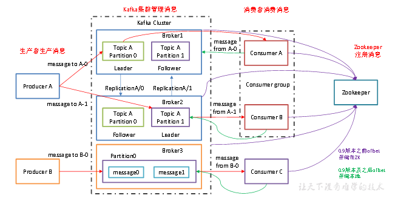

# Kafka

## Kafka 概述

kafka 是一个**分布式**的基于**发布/订阅**的**消息队列**（Message Queue），其所有的构件broker(服务端集群)、producer(消费生产)、consumer(消息消费者)都可以是分布式的。

在消息的生产时可以使用一个标识topic来区分，且可以进行分区，每一个分区都是一个顺序的，不可变的消息队列，并且可以持续的添加。

同时为发布和订阅提供高吞吐靓。

消息被处理的状态是在consumer端维护，而不是由server端维护，当失败时自动平衡。

## 消息队列

传统消息队列的应用场景


### 使用消息队列的好处

1）解耦

2）可恢复性

3）缓冲

4）灵活性 & 峰值处理能力

5）异步通信

### 消息队列的两种模式

（1）**点对点模式**（**一对一**，消费者主动拉取数据，消息收到后消息清除）（比如忘记密码）

（2）**发布/订阅模式** （**一对多**，消费者消费数据之后不会清除消息）


## Kafka 基础架构



## 常用的场景

- 监控
- 消息队列
- 站点的用户活动追踪
- 流处理
- 日志聚合
- 持久性日志

## Kafka中包含以下基础概念

```
1.Topic(话题)：Kafka中用于区分不同类别信息的类别名称。由producer指定
2.Producer(生产者)：将消息发布到Kafka特定的Topic的对象(过程)
3.Consumers(消费者)：订阅并处理特定的Topic中的消息的对象(过程)
4.Broker(Kafka服务集群)：已发布的消息保存在一组服务器中，称之为Kafka集群。集群中的每一个服务器都是一个代理(Broker). 消费者可以订阅一个或多个话题，并从Broker拉数据，从而消费这些已发布的消息。
5.Partition(分区)：Topic物理上的分组，一个topic可以分为多个partition，每个partition是一个有序的队列。partition中的每条消息都会被分配一个有序的id（offset）
    Message：消息，是通信的基本单位，每个producer可以向一个topic（主题）发布一些消息。
```

## 消息’

消息由一个固定大小的报头和可变长度但不透明的字节阵列负载。报头包含格式版本和CRC32效验和以检测损坏或截断。

## 消息格式

```
1. 4 byte CRC32 of the message
2. 1 byte "magic" identifier to allow format changes, value is 0 or 1
3. 1 byte "attributes" identifier to allow annotations on the message independent of the version
       bit 0 ~ 2 : Compression codec
           0 : no compression
           1 : gzip
           2 : snappy
           3 : lz4
       bit 3 : Timestamp type
           0 : create time
           1 : log append time
       bit 4 ~ 7 : reserved
4. (可选) 8 byte timestamp only if "magic" identifier is greater than 0
5. 4 byte key length, containing length K
6. K byte key
7. 4 byte payload length, containing length V
8. V byte payload
```

## docker 安装kafka 

1、安装 zookeeper  `docker pull wurstmeister/zookeeper`

2、**运行ZooKeeper容器**  `docker run -d --name zookeeper -p 2181:2181 wurstmeister/zookeeper`

3、运行kafka `docker pull wurstmeister/kafka`

4、启动Kafka容器  

```go
docker run -d --name kafka -p 9092:9092 --link zookeeper:zookeeper --env KAFKA_ZOOKEEPER_CONNECT=zookeeper:2181 --env KAFKA_ADVERTISED_LISTENERS=PLAINTEXT://localhost:9092 --env KAFKA_LISTENERS=PLAINTEXT://0.0.0.0:9092 --env KAFKA_OFFSETS_TOPIC_REPLICATION_FACTOR=1 wurstmeister/kafka

```

这里，我们链接了ZooKeeper容器，并且设置了几个环境变量来配置Kafka。

在这个命令中：

--name kafka: 设置容器的名字为“kafka”。

-p 9092:9092: 将容器的9092端口映射到宿主机的9092端口。

--link zookeeper:zookeeper: 连接到名为“zookeeper”的另一个Docker容器，并且在当前的容器中可以通过zookeeper这个别名来访问它。

--env KAFKA_ZOOKEEPER_CONNECT=zookeeper:2181: 设置环境变量，指定ZooKeeper的连接字符串。

--env KAFKA_ADVERTISED_LISTENERS=PLAINTEXT://localhost:9092: 设置环境变量，指定Kafka的advertised listeners。

--env KAFKA_LISTENERS=PLAINTEXT://0.0.0.0:9092: 设置环境变量，指定Kafka的listeners。

--env KAFKA_OFFSETS_TOPIC_REPLICATION_FACTOR=1: 设置环境变量，指定offsets topic的副本因子。

wurstmeister/kafka: 使用的Docker镜像名字。

确保在运行这个命令之前ZooKeeper容器已经在运行，并且可以通过zookeeper:2181来访问。如果你的ZooKeeper容器有一个不同的名字或者你使用的是不同的网络设置，你需要相应地调整--link和KAFKA_ZOOKEEPER_CONNECT的值。
5、验证结果 

```
docker exec -it kafka /bin/bash
```

6、创建测试主题

在Kafka容器中，运行以下命令创建一个测试主题：

```
kafka-topics.sh --create --topic test --partitions 1 --replication-factor 1 --zookeeper zookeeper:2181
```

执行创建生产者命令：

```
kafka-console-producer.sh --broker-list localhost:9092 --topic test
```

然后你可以输入一些消息（比如输入hell按下enter）

```
hell // 回车
```

在另一个终端窗口中，创建一个消费者来读取测试主题的消息（也需要进入kafka容器哈），执行创建消费者命令：

```
docker exec -it kafka /bin/bash

kafka-console-consumer.sh --bootstrap-server localhost:9092 --topic test --from-beginning

```

如果一切设置正确，你应该能在消费者终端中看到你在生产者终端输入的消息

```
hell 
```

这就完成了使用Docker运行ZooKeeper和Kafka，并进行基本验证的过程。
