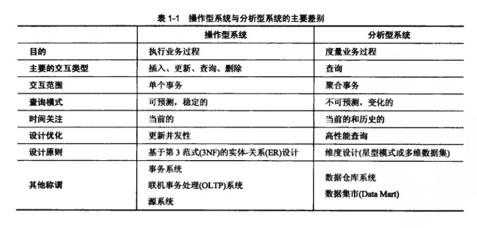
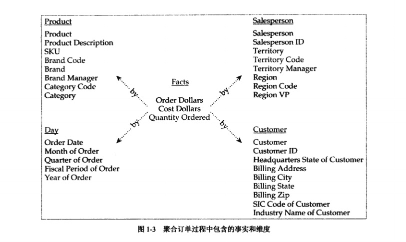

# 第一章 分析型数据库与维度设计
```md
Whatever you do, do it a hundred percent.
倾尽所能，力求极致。
```

业务过程的维度模型由两个组件构成：度量以及度量的环境。又称为事实和维度。

- **维度模型应用于关系数据库环境时被称为星型模式。**
- **维度模型应用于多维数据库环境时，维度模型被称为多维数据集。**

## 1.1 维度设计

维度设计理念：来源于分析型系统特有的需求。每个维度模型的核心都是业务度量的集合，业务度量反映了对业务过程的评价，并描述各种度量的环境。

**业务过程角度，信息系统分为两个主要的类别：**

1. 用于支持业务过程的执行；（操作型系统）
2. 用于支持业务过程的分析；（分析型系统）

### 1.1.1 目的

分析型系统和操作型系统具有完全不同的目的。



> 第三范式 (Third Normal Form,3rd NF)就是指表中的所有数据元素不但要能唯一地被主关键字所标识,而且它们之间还必须相互独立,不存在其他的函数关系。 


- 维度建模的原则专门用于解决分析型系统特有的需求。
- 维度设计用于优化对大量事务而不是单个事务的查询。
- 支持并发和高性能更新不是维度设计的主要目标。
- 维度设计支持对历史数据的维护，即使这些数被操作型系统修改或删除过。

### 1.1.2 度量和环境

维度设计的基本原则非常简单。维度设计支持对业务过程的分析，这是通过对业务过程度量进行建模来实现的。

> 注意:在缺乏应用环境的情况下，度量没有任何意义。

度量和环境这两个简单概念构成了维度设计的基础. 所有的维度设计方案对业务过程的描述都是通过获取度量内容和度量所在的环境来构建的.

### 1.1.3 事实和维度

在维度设计中,将度量称为_"事实",将环境描述称为"维度".在开展维度设计时，需要将信息需求分类到事实和维度中。具体的分类方法是根据需求陈述或问题，以及报表中获取分类依据。在理解了如何发现分类的依据后，将信息需求分类到事实和维度的工作将非常简单。

维度发现关键词：`通过`，`根据`，`按照`后通常能发现维度。比如：
- 按照产品分类，在一月份订单额度是多少？ （产品分类是维度，多少是事实，一月份为细节层次）
类似的，表示"在......时间"的词汇通常也表明存在维度。

事实通常表现为数值,通常人们期望考查不同细节层次的事实.

### 1.1.4 聚合维度和事实

订单流程包含的事实和维度聚合到一起的一种结果。



图中所展示的事实和维度的组织方式被称为星型模式。图中多个事实增加单词“by”,然后结合任意维度，可以构成特定的可回答的问题。

“需要度量的事情”处于中间的事实表中，“给定考查度量的视角”存在于周围的方框中，它们松散地进行了分组或分类。

## 1.2 星型模式

针对关系型数据库的维度设计被称为星型模式。相关的维度组合成为维度表中的列，事实则存储在事实表中的各个列中。


### 1.2.1 维度表

维度表用于提供分析事实所需要的多样的环境。在查询或报表中，维度可用于对事实如何上卷进行定义 --- 给予它们的聚集层次。维度值既可用于过滤报表，为每种度量提供环境，通常以文本标签的形式处于报表每行中事实的前面：也可用于对主从关系、分类汇总、交叉报表或排序的获取中。

关键字：`雪花模式`，`如何设计能更好的满足第3范式的要求`

### 1.2.2 键与历史

在星型模式中，每个维度表都分配有一个代理键（surogate key）.该列是维度表的唯一标识符。

维度表也包含类似操作型系统中存在的用于唯一区分实体的键列。这些列通常称为自然键(natural key)。

### 1.2.3 事实表

作为星型模式核心的事实表，除了表达事实以外，还包含与其相关的维度表的代理键。

## 1.3 星型模式的应用

思考：用于考查星型模式的重要特征：如何实际使用星型模式？理解星型模式的基本使用模式可以帮助开展维度设计的人员做出明智的选择。

## 1.4 指导原则

本书其他部分涵盖了可用于描述任何业务过程的维度设计技术。有时理解开发这些技术的原因非常有用。另外，设计者有必要从多种设计选项中进行选择。这些选择可以参考两个知道原则：**精度和性能**

精度的考虑非常考虑，也是非常明显的事情：
- 操作型系统的查询问题一般会预先确定，并在整个过程中保持一致。
- 分析型系统的查询总是产生新的问题，并随着时间的变化发生变化，有时这一情况非常突出。
- 设计者必须注意维度模式是如何表示事实的，是否聚集了没有意义的事实，是否有其他的设计方式可以防止此问题的发生。

模式的性能，如果不能及时生成结果，分析型设计可能不会提供比操作型设计更高的价值。

对于大量不可预期的问题，维度设计能够提供快速的响应。当基本的设计不能有效地满足重要业务需求时，使用维度设计恰逢其时。对解决方案性能的评测可能会促使产生用多种格式提供信息的决策，这一点在本书中将得到体现。


## 1.5 本章小结 

维度建模是应用于分析型系统的最佳设计。维度模型获取了对过程的度量结果。表达度量的数据元素称为事实。提供度量环境的数据元素称为维度。这些元素的聚集便构成了维度表和事实表。应用于关系型数据库时，维度设计称为星型模式。

星型模式中的维度表采用代理键来确保分析型系统能够以自己的方式响应操作型数据的变化。星型模式中不同粒度的事实可以通过各种细节级别进行查询，并根据需求的维度环境进行聚集。在维度探索细节被称为浏览。


