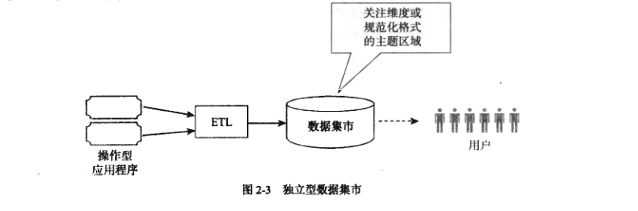

# 第二章 数据仓库体系结构

```md
Words and ideas can change the world
一知一言皆有撼世之力。
```
数据仓库体系结构三类，前两类经常被称为企业级数据仓库体系结构，分别以W.H.Inmon 和 Ralph Kimball为代表人物。第三类虽然没有代表性人物，但同样被普遍应用。

思考：
- 什么是最好的数据仓库体系结构？
- 在高层上理解每种方法。
- 理解星型模式在每种体系结构中的地位。
- 消除一些普遍存在的错误概念。

## 2.1 Inmon 的企业信息化工厂 

> 如果明天非设计一个数据集市，我将不考虑使用任何其他的方法。 -- W.H.Inmon《DM Review杂志》


图所示是对企业信息化工厂的高度简化的描述。去掉了一些特定要求以及与该讨论无关的组件，并且使用了一些通用的术语。

左边：操作型系统或事务系统支持着业务，组织形式有：分层数据、关系数据、甚至简单的电子表格。


ETL：表示数据从操作型系统移动到企业数据仓库的过程（通过“提取、转换、加载”）。

ETL过程整合从不同操作型系统得到的信息，并且加载到称作企业数据仓库的一个独立的仓库中。这个过程很不平凡（数据挖掘过程不是线性的）

企业数据仓库是企业信息化工厂的枢纽。它是原子数据的集成仓库，从各种操作型系统集成而来，包含一个确定的且一致的业务活动表示法。基于原子数据的性质，该仓库尽可能地包括最底层的细节数据。


在企业信息化工厂体系结构中，企业数据仓库不是通过分析型应用程序、商务智能工具或类似方法来直接查询。相反，它的目的是将附加的数据存储用于各种分析型系统。企业数据仓库通常存储于关系型数据库管理系统中，并且 $Inmon$ 主张使用第 3 范式进行数据库设计。

数据集市：数据都是从企业数据仓库中获取信息，并且为后续的分析做好准备。

数据集市作为分析型活动的焦点，它可能包含查询、报告以及其他许多活动。这些活动可以利用各种不同的工具，包括商务智能工具和报表工具。

## 2.2 Kimball 的维度数据仓库 

- 20世纪90年代，着重推广星型模式
- 开发了“总线体系结构”，一种基于维度设计的企业体系结构，该结构与企业信息化工厂有许多相似支出。考虑原子数据的集成仓库并且依赖维度设计来支持数据分析。

与Inmon 的企业信息化工厂比较：

- 考虑原子数据的集成仓库并且依赖维度设计来支持数据分析。
- 假设操作型系统与分析型系统是分离的。


维度数据仓库和企业数据仓库的两个重要区别：

1. 维度数据仓库是根据维度建模的原则来设计的。它由一系列星型模式或多维数据集组成，并由它们获取尽可能详尽的细节数据。
2. 维度数据仓库也许能被分析型系统直接访问。
3. 维度数据仓库不一定要集中在一个单一的数据库中，维度数据仓库可以是一个单独的逻辑仓库，分布在许多物理数据库中。

## 2.3 独立型数据集市

独立性数据集市没有任何知名的倡导者。独立型数据集市的短期内获取快速的、廉价的结果的同时，会导致长期费用的提高和效率的低下。这些缺点并不是避免采用独立型数据集市的充分理由，但是它们对星型模式体系结构的功能造成了混乱。

特点：
- 只关注主题区域。
- 一个或多个操作型系统可以满足一个被称作数据集市的数据库。
- 可能采用维度设计、实体关系模型或是其他形式的设计。
- 不要求做跨功能的分析，可以很快投入到生产中。
- 能迅速、廉价地获得结果，所以被很多机构应用。




缺点：短期的成功会带来长期的棘手问题。原因在于支持多主题区域造成的复杂情况,多重独立型数据集市的出现会导致效率低下（信息孤岛），即缺乏兼容性。


## 2.4 体系结构和维度设计

三种体系结构范型的总结：


### 2.4.1 方法的对比


Inmon 的企业信息化工厂 和 Kimball 的维度数据仓库  关注企业级应用。目的是支持跨企业或组织机构的分析型需求。

数据仓库设计必须以一种统一的试图来适应所有不同的观点，通常无法通过仅凭倾听几次需求就能设计出来。


独立型数据集市在关注企业级应用方面显示出了不足。其开发只考虑了来自一个小组或部门的需求。


### 2.4.2 公共元素

- Inmon 的企业信息化工厂： 依靠维度模型在企业级解决方案的背景下提供部门级解决方案。
- Kimball 的维度数据仓库： 强调维度设计，依赖维度数据体系结构为企业和部门的需求提供服务。 
- 独立型数据集市：在使用维度设计时不考虑企业环境。

常见维度设计的错误观念：

- Inmon反对使用星型模式。
- Kimball认为关注企业级应用是不必要的。
- 数据集市是信息孤岛。
- 维度设计是为了聚合数据。
- 星型模式是信息孤岛。

### 2.4.3 使用本书的术语

- 数据仓库描述任何包含分析型数据库的解决方案，包括独立型数据集市。该术语并不表示一个中心或集成仓库。
- 企业数据仓库指的是企业信息化工厂的中央存储仓库。使用该术语并不表示其他数据仓库缺乏对企业级应用的关注。
- 数据集市是指任何体系结构中的一个主题区域。使用该术语并不意味着仅仅关注部门或者缺少企业环境。
- ETL 是指结构化数据存储之间移动信息的活动。通常使用该术语并不表示忽略企业信息化工厂，企业信息化工厂有一个更为精准的含义。
- 源系统指的是一个采用星型模式来获取数据的计算机系统。以一个企业信息化工厂的数据集市的情境中，源系统就是企业数据仓库。以维度数据仓库或独立型数据集市的一个星型模式的情境中，源系统是一个操作型系统。
- 商业智能用来描述任何可为终端用户完成报表和其他信息产品的软件产品。它既不表示应用一个分离的分析型数据存储，也不表示使用任何特殊形式的 封装软件。

## 2.5 本章小结 

在数据仓库体系结构中可以使用多种方式进行维度设计。

Inmon 的企业信息化工厂将整个企业的信息整合到一个称为企业数据仓库的中央存储仓库内。它以第三范式设计为特征，不能被数据仓库应用软件直接查询。数据集市由中心向外辐射，每一个合适的需求和视图都有一个特殊业务分组。数据集市突出维度设计并可由数据仓库应用程序查询。


Kimball 的维度数据仓库也关注企业级应用，它将整个企业的数据整合到一个称为维度数据仓库的中央存储仓库中。该仓库的特点是维度设计，并且可以被直接查询。数据集市是一个逻辑结构，或是报表的子集。可以构建不同的维度结构以支持部门级需求。

独立型数据集市处理主题区域内的需求，不需要考虑整个企业环境。它可以使用维度设计，也可以采用其他技术。如果一个组织需要快速获得处理结果或是降低成本，可以使用这种方法，但这不应该被视为数据集市或维度设计的缺陷。

每一种体系结构都与星型模式有关。


