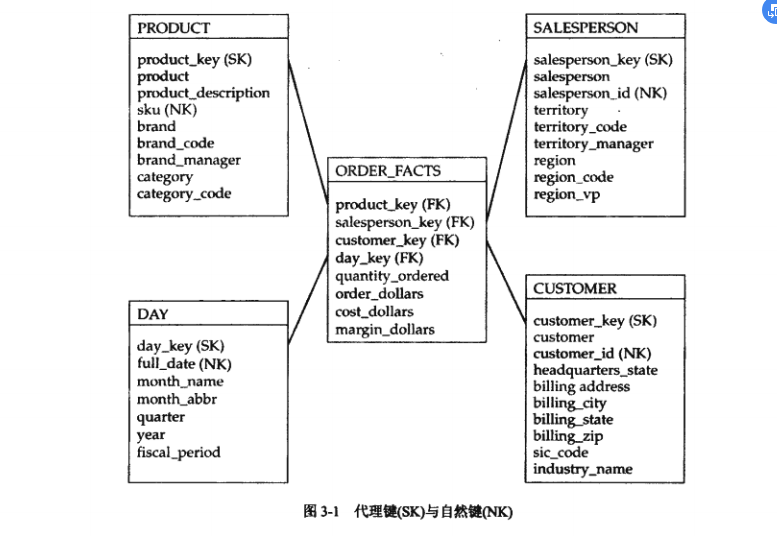
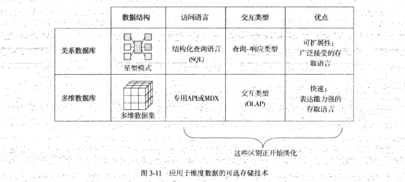

# 第3章 星型模式与多维数据集
---
```md
It takes incredible strength and courage to be different from everybody else.
成为与众不同的人，需要极大的力量和勇气。
```

前面的学习中，我们理解了度量的基本概念，了解了多种在维度设计时可以采用的方法。基于这些知识，我们开始学习维度设计的原理。

维度设计的四种基本原理：`维度表特性`，`事实表特性`，`缓慢变化表`，`多维数据集`

**本章学习要点：**

- 维度设计时，通常使用代理键来区分维度表的行，本章将讨论使用该方法的原因。
- 了解作为度量环境的提供者，维度表在星型模式起到的作用
- 维度冗余问题的探讨
- 掌握如何设置事实表的粒度，以及为什么将一些事实表称为稀疏的以及何时使用退化维。

数据仓库强大的功能部分来自于其提供的对历史数据的查询能力。数据仓库必须能够响应信息变化，而不妨碍对历史数据的跟踪。针对这类问题，维度设计采用了一系列被称为“缓慢变化维”的技术。

- 本章将讨论三种处理变化的主要方法以及各种方法的使用时机。

本章描述了在多维数据库环境下维度设计的实现，即多维数据集。 本章还将分析星型模式和多维数据之间的差异，学习将多维数据集运用到维度结构中的不同方法。

## 3.1 维度表特性 

维度提供了环境信息，如果没有环境信息，报表将显得毫无意义。

成功的维度设计要点在于适当地使用键，维度列集合包含丰富的细节信息，摒弃节省存储空间的主张。

### 3.1.1 代理键与自然键

星型模式中，每个维度表都分配有一个代理键。

- 代理键并不是从操作型系统中获得的。
- 代理键仅仅是为数据仓库和数据集市创建的。
- 代理键通常表现为整数，在星型模式加载时的获取、转换、加载（ETL）过程中产生并被管理。
- 键值不包含内在的含义，因此对数据仓库使用者来说并无特殊的意义。
- 维度表的每一行都包含一个唯一的代理键与之对应。

本书代理键标记为`SK`,代理键都在列名后带有后缀$`_key`,自然键列表示为`NK`,外键列表示为`FK`




**自然键** 

- 多维表可以包含一个或多个自然键，但是只能并且只有一个代理键。

- 自然键键值对数据仓库使用者来说可能包含一定的意义。即使自然键不具有明确的含义，用于加载事实表的ETL例程也仍然需要它们。

将代理键作为唯一标识符的使用方法允许数据仓库对源系统发生的变化做出响应，这种方式适应了分析型系统的需求。由于维度表不依赖于自然键来区分行的唯一性，因此维度表能够维护历史信息，即使源系统不能也无所谓。 

```md
技巧：
为每个维度表分配一个代理键，用于唯一地区分表中的每行记录。
```

替代代理键的方法：

1. 自然键附加一个序列号： 例如（custoemr_id + version_number）（不推荐，两列需要存在与事实表中，多列表示的外键将使得连接过程复杂化，也使得sql语句难以理解，不利于星型模式做连接查询时关系数据库管理系统的优化工作）
2. 自然键附加一个时间戳（同上面一样不推荐，类似的原因，时间一致性的考量也是一个因素）
3. 采用版本号或时间戳方式取代代理键的技术不太常见。代理键简化了模式设计，并可采用单一列实施连接操作。

### 3.1.2 丰富的维度集合 

维度为事实提供了环境。 没有环境，事实就无法理解。

维度揭示了事实的价值。

```md
技巧：
提供丰富和全面的维度属性集合，每个新增的属性都将会现住地提高分析的可能性。
```

除了存储公共属性外，维度表通常用到的存储属性组合的方式：

1). 公共组合

在操作型系统中，经常采用的方法是将数据元素尽可能分解为构成其内容的多个组件。 采用这种方法，可以将不同的组件按照需要加以合并。 

例如：客户姓名分解为：first_name,middle_iinitial,last_name的方式存储，在需要时可以将这些属性加以组合形成全名。

2). 代码与描述符 

在操作型系统中，通常将某一领域中的可列值以代码的形式表示，同时使用另外的表来描述这些代码。

3). 标志及标志值 

如果列的值为布尔类型，那么通常将它当作标志。在操作型系统中，这些值可以以几种方式存储。

4). 多列组合字段  

操作型系统通常包含由多个部分组合而成的字段列，每个部分各自具有不同的含义。

5). 带有数字值的维度 

尽管多数维度包含的数据为文本类型，有时维度也包含数字型数据。考虑到事实通常时数字型，因此在维度也包含数字型时，，有时会产生混淆。

```md
技巧：
数字型数据是维度还是事实通常并不容易区分。在出现疑问时，一定要注意应根据应用情况分析。如果一个元素值用于过滤查询、排序数据、控制聚集、区分主从关系等，该元素通常是维度。
```

数字单位一般是维度，数量汇总一般是事实。

6). 行为维度与混合属性 

利用行为模式分析事实是一种强有力的分析技术。

给予事实计算得到的维度称为行为维度。若对行为分组的更新不太频繁，采用这样的方法将会起到很好的效果。

### 3.1.3 维度表中的组合维度

维度属性分组到维度表中，用于表示引用信息的主要分类。 杂项维度将那些本身没有相似性的属性收集起来。如将规范化理论应用到维度表中，结果称为雪花模式。 即使不采用规范化理论，雪花模式也仍然可以作为特定软件工具使用。与实体关系设计不同，维度设计完全接纳对信息的冗余存储。

1. 基于相似性组合维度

星型模式中的维度表包含组合的维度属性以表示引用信息的主要分类。这些分类往往带有强烈的业务特征。 

2. 无相似性的杂项维度

3. 雪花模式及支架表

使用实体关系建模时，通过采用规范化理论从关系设计中消除冗余。比如：产品表中去掉品牌属性，只引用新的品牌表的外键。 此时，品牌表被称为支架表。

该技术对于操作型系统带来很多好处，分析型系统没有这么做的必要。

```md
技巧：
不要采用规范化理论指导维度表的设计工作。分析型数据库很难从这些技术中获取帮助。需要采用雪花模式和支架表的情况是一种特例而不能当作规则来使用。
```

4. 冗余带来的好处 

在分析型环境中，预先计算和存储这些冗余数据元素具有三个优点：`性能`、`可用性`和`一致性`。

首先，如前所述，维度通常用于定义查询谓词、定义聚集范围、控制数据排序、为报表建立主从结构等。

其次，这些冗余方便了使用者与分析型数据库的交互。

最后，显式存储所有的维度数据，无论应用于何处，都可以保证它们的一致性。 

```md
技巧：
在进行维度设计时应该容忍冗余的存在。详尽地存储每一个维度属性将大大提高系统性能，增强可用性，确保在多个应用中保持一致性。规范化理论更适合于操作型系统而不是分析型系统。
```

详尽地存储维度可以提高性能、确保可用性和一致性，而在查询时即时生成计算维度的方法仅仅能够节省磁盘空间而已。

## 3.2 事实性特性

每个事实表通过获取描述业务过程的度量来表达业务过程。将相关的度量完整地表达出来至关重要，即时这样的表达可能存在一些冗余。然而，一些事实不能被聚集。这些不可求和的事实通常可以分解到其他能够求和的事实表中。

事实表记录的细节程度被称为粒度。 

### 3.2.1 事实表与过程 

- 事实表是度量业务过程的引擎。 
- 事实表存储用来描述过程的详细度量。
- 事实采用外键为每个度量提供维度环境。

### 3.2.2 获取事实

作为过程度量的核心，事实表应包含与其描述的过程有关的所有事实，当然也包含从其他方面获得的一些事实。

事实以特定的细节层次存储，但可以通过上卷产生各种级别的维度。

1. 获取所有的度量 

```md
注意：
不要将上述解释作为在模式设计中排除使用数量单位的理由。在很多情况下，数量单位是对开展分析工作有价值的维度。如果没有合适的维度表用于存储数量单位，可以将它们放置于退化维中，本章将对此加以说明。
```

2. 非可加事实

```md 
注意：
关于非可加性的讨论还没有结束。除了非可加及可加的事实之外，还存在半可加的事实。关于半可加事实将在第11章"事务、快照和累计快照"中讨论。
```

### 3.2.3 粒度


事实表行所表达的细节层次被称为粒度。清楚地声明事实表的粒度是模式设计过程中的一个重要工作。明确的粒度能够确保对事实表中的行的意思的理解不会产生混淆，保证所有的事实按照同样的细节层次记录。

### 3.2.4 稀疏性

记录在事实表中的行表达了业务活动的发生情况，这意味着事实表中的行没有包含所有可能的维度组合。出现在事实表中的组合数量远远小于可能存在的组合数量。事实表的该项特性被称为稀疏性。

```md
注意：
可能会存在一些比较稠密的事实表。在第11章对快照模型的讨论中讲提供一些示例。
```

### 3.2.5 退化维

有时，不可能讲所有于业务相关的维度分类到一个紧凑的表集合中。类似这样的情况，将一个或多个维度存储到事实表中是合适的选择。若采用了这种方法，存储到事实表中的维度列被称为退化维度，简称退化维。

```md 
技巧：
避免过度使用退化维。如果一个属性不是事务标识，应考虑将其放置到杂项维度中。
```

## 3.3 缓慢变化维


### 3.3.1 变化类型 1 

当一个维度值的源发生变化，并且不需要在星型模式中保留变化历史时，通常采用类型1来响应变化情况。

1. 重写维度值：一般来说该方法可以达到逾期的效果，如果存在与变化前关联的事实，就说明历史环境发生了改变。
2. 先前事实存在的环境发生了变化
3. 不能维护维度历史

### 3.3.2 变化类型 2 


多数操作型系统的变化采用变化类型 2 处理。变化类型 2 保存了变化的历史事实。描述变化前的事实与过去的值关联，描述变化后的事件的事实将与新值关联。

1. 插入新维度行 
2. 保留事实的历史环境
3. 维护历史部分可维护 

```md
技巧：
变化类型2保存了围绕事实的维度细节。这可能给用户带来困惑，因为在维度表中包含重复的信息。避免这种困惑的方法是提出浏览查询时在select 语句中包含 "distinct" 值，并提供标志指明是否每个行代表了自然键所表示的当前版本。
```

### 3.3.3 选择并实现响应类型  

1. 设计响应类型

缓慢变化由数据源触发，但讨论它们时经常针对的是维度表。


```md
技巧：
对所有的维度属性，选择并文档化适当的缓慢变化响应方式。如果难以确定，选择变化类型2是安全的。当源系统记录了变化的原因时，单个属性可以选择任意响应类型。
```

变化类型有：`变化类型1`，`变化类型2`，`响应类型3`，`混合响应`，`增加时间戳等`；

变化类型1的复杂性

变化类型1还引入了其他的复杂性。如果某一维度属性被指定为变化类型1，并且该属性不完全依赖于表的自然键，就必须仔细评估对更新的响应。 

当从星型模式中抽取数据来聚集表或多维数据集时，所有的变化类型1属性可能会带来维护上的问题。 


2. 实现缓慢变化处理

## 3.4 多维数据集

1. 多维存储与关系存储

多维数据库主要的优势在于速度。多维数据集使用户能够交互式地改变对数据的观察视角。

联机分析处理（OLAP）: 通过视角的变化以及即时的反馈，增加或删除属性。OLAP与多维数据集的交互是高级敏感的。

多维数据库的另外一个优点是不受到SQL的限制，并且数据通过专用接口来访问。  




## 3.5 本章小结

文章讨论了星型模式的基本特性。这一主题可以分为4类:

**维度表**

- 维度表包含自然键和代理键。允许分析模式独立地跟踪源系统的历史。
- 维度表包含众多属性。丰富的维度属性集合是具备强大分析环境的保证。应该为代码和与之相关的描述、组合字段及其各个组成部分、公共组合值、标志的描述性表示构建列。
- 一些维度是数字型的。它们与事实的区别主要通过使用情况来确定。
- 不要将按照第3范式构建维度表。
- 杂项维度积累不相关的维度属性。
- 行为维度从事实中获得并将产生强大的分析能力。

**事实表**

- 事实表由紧凑的包含引用维度和事实的外键构成。
- 事实表应该包含所有与过程有关的事实，即使某些事实可以由其他事实计算得来。
- 类似比率等非可加事实应该分解为完全可加的组成部分，其计算应该在创建报表时执行。
- 事实表时稀疏的，只有当某些事实发生时才产生相应的记录行。
- 存储在事实表中的维度被称为退化维度。这种技术通常应用于具有较高基数（cardinality）的事务标识符中。

**缓慢变化**

- 数据仓库针对源数据发生的变化而进行响应，这样的过程被缓慢变化维。
- 缓慢变化类型1在响应数据源变化时，重写维度属性。维度表不能反映历史情况，已存在事实的历史环境被改变了。
- 当源数据值发生改变时，缓慢变化类型2创建一个新版本的维度行。尽管不能与时间关联，但维度表维护了版本历史。历史事实的环境得到保存。


**多维数据集**

- 维度模型可以采用多维数据库实现，这种方式就是广为人知的多维数据集。
- 多维数据集能保证实现具有快速和强大的被称为OLAP的交互方式。
- 与多维数据集交互支持某些分析类型的语言，而采用SQL则难以表达。
- 当维度属性增加或者事务的数量增加时，对存储的需求会相应增加。
- 多维数据可以用于存储主要的维度数据，但其扩展能力有限。
- 多维数据集可以作为星型模式强有力的补充，确保交互式分析的实现。


