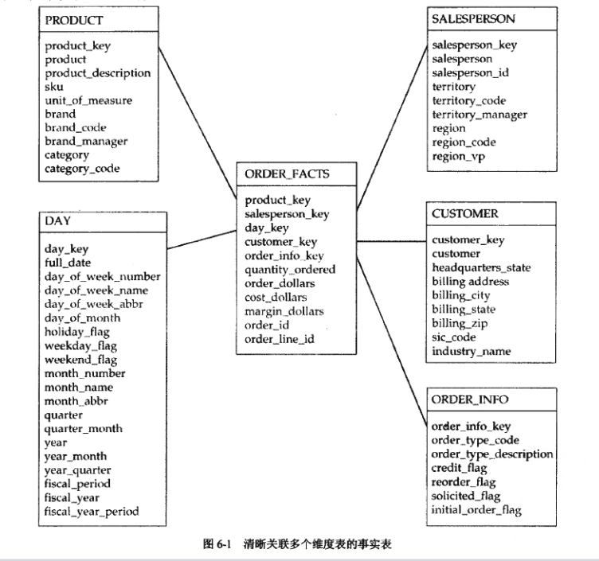

# 第6章 深入学习维度表
---
```md
We're all travelling through time together.
人生就是一场时间旅行。
```
**本章学习要点：**
- “将维度分组到表中”描述了确定何时将维度归入相同的表中，何时应该放入不同的表中的方法。
- “分解大型维度”解释了由于维度表太大而无法有效维护时，应该做什么以及不应该做什么的问题。该部分探讨了几种可选的方案，其中包含微型维度---具有独特的无须牺牲细节信息而生长的能力。
- “维度角色和别名使用”涵盖了当事实表与单一的维度表具有多重关系时发生的情况。这些关系称为角色。它们不需要为了维度表建立副本。多重角色的问题可以通过在查询中通过SQL别名加以解决。
- “避免空值”讲述了由空值造成的分析难题以及如何避免空值。事实表中的空值外键可以通过“特例行”来避免。当事实表与维度存在可选关系时，当事实的维度环境无效时，当维度细节可用之前事实已经存在于数据仓库时，都可以使用这些方法。
- “行为维度”描述了如何将事实添加到附加的维度中，确保既往历史能够在分析能力强大的报表中为事实提供环境。

## 6.1 将维度分组到表中

多数对应分析类别的维度表具有深刻的业务特征，以此作为初步划分的基本依据。

### 6.1.1 关联维度属性的两种方法 

星型模式中，给定一对维度属性，它们可能以明确或者隐含的方式表达出来（明确的关系或隐含关系）

当两个属性处于同一个表中，可能存在**隐含关系**，这意味着属性间存在**天然的相关性**，而不是存在于多个环境中的关系。这些关系更具有一致的趋向，并且是可浏览的。


**1. 描述环境的明确的关系**

每个事实表都有一个引用维度表的“外键”，外键为事实表提供了维度环境。 由事实表来衡量的商业过程是这种关系的环境。

如图所示，以订单过程为例，订单为星型模式，事实表的粒度是独立的订单列。维度表描述了订单的日期、已订购的产品、提交订单的客户以及接受订单的销售人员。 退化维用来确定特定的订单线，杂项维度ORDER_INFO定义了订单的多样化特征。

明确的关系用E-R模型（实体-关系建模）显示：




**2. 描述亲和性的隐含的关系**

与实体-关系模型不同，维度模型还包含不能通过连接而明确的关系。维度建模人员不会根据这类条件考虑建模。

维度之间的隐含关系：

-只在单独环境中存在，表示自然亲和性而不是基于过程活动的关系。
- 隐含关系发生变化时，其历史信息可以通过采用类型2缓慢变化响应方法得以保护。

示例：产品表中品牌和商品的维度属性具有隐含关系。

构建维度模型的目的不是用于操作型环境。维度模型的构建目的时能够支持需要聚集大量数据的查询。跟操作型系统不同，产品和品牌应该放于相同的表中。（避免涉及海量数据连接查询操作造成性能降低）

```md 
注意：
在某些情况下，维度模型设计人员使用主键/外键关系来明确这种关系。这通常会使星型模式转换为雪花模式。
```

### 6.1.2 对维度分组时的考虑

考虑属性在何处相关以及在何处使用时：对于给定的一对属性，考虑关系的环境，它们是否具有自然的亲和力，或者它们在不同的环境中是否有关系？那些趋向于共享稳定关系的属性可能被存储在一起；那些仅在事件、事务或条件等情况下相关的属性，可以将它们归入不同的事实表中。在疑惑不定时，可以考虑不同设计方法的可浏览性。

**1. 基于亲和性分组维度**

- 一对属性只能以一种方法或在一种环境中关联（不基于事务或活动发生关联，**归入同一个表**），例如产品-品牌的关系
- -对属性基于事务或活动发生关联（归入不同的表）；例如销售人员和客户产生订单才会建立关联；

> 当凉饿维度属性共享一个自然的亲和性关系，并且同时出现在一种环境中时，它们属于同一个维度表。当它们的关系由事务或活动来决定，并且存在于不同的环境中时，应该将它们放置在不同的维度表。


**2. 可浏览性测试**

如果难以确定两个属性是否属于同一个维度表，您可以考虑它们被使用的情况。第1章提到的关注维度值被称为浏览查询的查询。


## 6.2 分解大型维度 

大量的维度属性能够保证具有丰富的分析能力，使数据仓库更有价值。

当数据库管理员无法 忍受维度行的增长时，就该重新考虑唯独设计了。

**任意分割维度表**

具体做法：分割的两个表具有相同的代理键

缺点：对于ETL提出了独特的挑战，虽然具有两个物理存在的表，但是开发人员必须在逻辑上将它当作一个表来处理。 这样使ETL处理变得复杂，同时意味着分裂维度表不能缓解任何与大规模维度处理有关的问题。

**分割维度方法的替代方法**

- 两个维度：当某个维度具有海量的属性时，通常可以作为存在两个相异维度的标志。（测验评估属性的关系是否易变，它们在其他环境相关联等因素判别划分为不同的维度）
- 将自有形态的文本字段定位到支架表：大量属性造成过长的行通常是在维度表中包含多个自由形态的文本字段的结果（文本字段来自于操作型系统，包含偶尔用于过滤报表的非结构化数据）。
注意：支架表可能会影响某些DBMS优化程序，但是当查询中包含对自由形态的文本字段的查询时，其性能本身就已经受到影响了。
- 寻找子类型：许多情况下，维度包含大量的属性组，每个属性组只作为所在行的一个子集。在操作型系统中，通常将这种情况称为子类型。
- 考虑微型维度：最后将维度属性的子集分离，使用子集作为被称为微型维度的新维度的基础。

### 6.2.3 微型维度缓解ETL瓶颈和过度增长 

将不稳定的属性分离到不同的表中将会带来令人震惊的结果，几乎可以消除表的快速增长，即时变化发生在数据源。

同样采用微型维度也有益于ETL处理。 对于ETL开发人员来说，了解每个保单的当前覆盖范围特性非常重要。（微型维度当发生变化时，不需要扫描整个POLICY维度表以确定是否需要类型2变化）。主要维度的ETL过程不会受到变化的影响。

 ```md
 技巧：
 当表增长过快或存在大量的类型2属性，导致对变化的处理成为瓶颈时，一个或多个微型维度可能会有用。将不稳定的属性移动到微型维度表中，用所有可能值的组合填充。
 ```

微信维度银行的问题：采用微型维度破坏了可浏览性。维度表和微型维度之间只通过事实关联。（可通过在引用微型维度的维度表中添加外键实现可浏览性）

```md
技巧：
维度可以包含对微型维度的外键引用。该引用有助于ETL开发人员填充事实表行，并允许用户交叉浏览维度和微型维度。但不支持维护历史信息，如果需要支持维护历史信息，将会破坏微型维度设计的初衷。
```

> 分类维度表方法所看到，外键引用对自动生成查询的商务智能工具配置造成技术障碍。


## 6.3 角色维度和别名使用 

维度表可以参与事实表中的多个关系，每个关系称作一个角色，(比如：销售人员和审批经理）角色利用别名来存取角色。

当事实表和维度表有多重关系时，没有必要为维度建立多个副本，每个角色都能通过在事实表中连接维度的试图或别名到适当的外键来存取。


## 6.4 避免空值 

在数据库管理系统中，可能最有争议的问题就是空值。空值会带来诸多问题，从实用的角度考虑，最好避免使用空。

对于维度属性来说，一个不太规范却实际的解决方案时当数据无效时存储特定的值，如使用 0 或 "N/A" 来表示。

```md
技巧：
不要允许在外键列中使用空值。即时并未存储NULL值，也需要替换维度列的连接语法并创建NULL实例值。
```


## 6.5 行为维度

一种使用过去的行为模式来理解当前行为的强大分析技术。

行为问题是一种基于对过去维度成员的行为进行分组或过滤事实的方法。行为维度将事实转换为维度，以确保获得强大的分析能力，不需要使用复杂查询或详细处理的分析。

在设计行为维度时，必须仔细考虑维护的含义。维度具有的缓慢变化特征将导致表大小的快速增长，并且它们频繁地更新将给ETL处理带来巨大的压力。


## 6.6 本章小结

本章覆盖了有关维度表的几个高级主题，包含了相同维度表中的两个属性的确定以及维度中事实的转换等，主要包括以下几个方面:
- 如果两个维度共享某个不稳定的关系或者不同环境中的多重关系，那么它们属于单独的表，如果存在稳定的亲和性并且在单一环境关联，那么它们属于单个维度表。
- 当维度有大量的属性时，可以将表分解成两个，但是可能出现一些技术难题。然而，可以通过观察发现表实际上是否表示两个维度，将具有自由形态的字段移动到支架表中，或者使用后面讨论到的从属于子类型的形式。
- 当维度表快速增长或者需要维护过程时，这将变成处理瓶颈，需要将不稳定的属性加入到微型维度中。通过来源的变化和使ETL过程流水线化，使得该技术几乎消除了添加新行的需要。
- 对于给定的维度，事实表可能与之存在多种关系，这些关系称作角色，它们不要求维度表的多个副本；SQL的别名使用允许在单独的查询中存取所有的角色。
- 当试图构造报表时，维度列中空值的存在带来了过度的复杂性，应该避免在维度列中使用空值。
- 当不可能将事实表行关联到相关的维度时，不要使用空值外键。相反，在这种情况下可以在维度表中添加一行，并且连接到改行。
- 使用过去的行为来解释事实，需要采用复杂的SQL,并且性能较差，相反在维度表中添加行为将捕获过去行为的信息，这种方式易于使用并且能提供强大的分析能力。
- 
