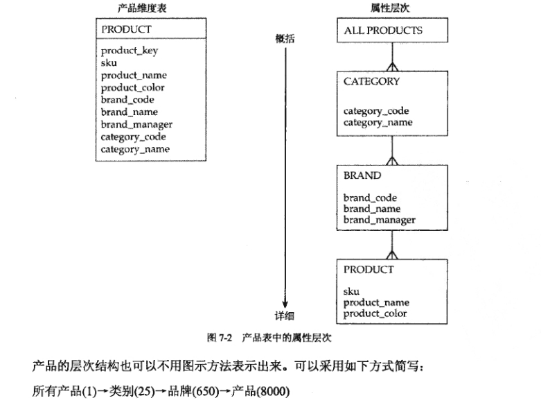
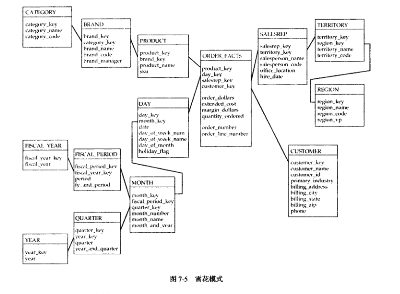

# 第7章 层次结构与雪花模式
---

```md
The simplest answer is often the correct one.
最简单的答案往往是对的。
```

维度表可以描述成属性组之间的一系列主从关系。例如，月份由天构成，季度由月份构成，年由季度构成。

本章学习要点：

- 层次结构、钻取（上钻、下钻）的介绍
- 雪花模式和支架表

## 7.1 钻取 

我们将分析当作"钻取数据"的过程。阅读一本书，可能想指导更多的东西，此时可以选择“向下钻取”。

**钻取的定义** 

钻取这个词意味着对某系事情的深入挖掘。从维度环境来看，钻取就是添加维度细节。 

关键词：`向上钻取`，`向下钻取`，`深入钻取`，`跳跃钻取`

## 7.2 属性层次和钻取 

属性层次提供了一种自然的方法，用于顺序地在不断深入的层次上组织事实。用户理解它们很直观，并且通过层次来钻取，可能会更加适合许多用户所倾向的划分关键业务度量的方法。

在每个维度表中，文档化属性层次是非常重要的。


### 7.2.1 属性层次

许多维度可以被理解为包含连续主从关系的属性层次。此类层级的最底层代表维度表中描述的最低级的详细信息，最高层代表最高级别的概要信息。每一集别都可能有一个属性的集合，该集合与下一级别存在主从关系。

产品维度表




在层次中，每一个级别的数字代表一个基数或实例数，添加数字是为了方便。产品存在25种类别，650种品牌和8000种产品。

将维度属性组织成一个层次结构的方法不止一种，每一种方法都是下钻的有效方法。

- 维度的多重层次结构
- 维度交叉‘
- 回避层次结构
- 实例层次结构

### 7.2.4 文档化属性层次结构


商业智能工具应优先关注属性层次结构。通过定义维度的层次结构，能够预测用户可能做或期望做的事情并做好准备。

许多工具只允许针对一个维度生命层次结构，如果存在多个层次机构，可能需要配置两个不同的环境来执行下钻。

属性层次结构最适合采用图形方法文档化。 

如果多维数据集或者聚集表中包含类型1维度属性，则对多维数据集或聚集表的增量维护将受到限制。

属性层次结构是非常有用的，但是它不是钻取和汇总数据的唯一方法。不要让属性层次结构约束使用者的分析能力或者限制多维数据集和聚集表的设计可能性。

## 7.3 雪花模式

当维度属性间存在的关系在维度设计时被清楚地定义时，产生的结果就是雪花模式。雪花模式的称谓是由它的性状决定的，模式的中心包含一个事实表，维度表以发射状围绕着中心，就像雪花的分支一样。 



**避免采用雪花模式**

采用雪花模式方法构建维度与被称为规范化的过程类似，规划化方法用于指导操作型系统的设计。

该技术用于确保操作型系统中的数据的引用完整性，它支持广泛的高粒度的并发事务处理。

分析型数据库不支持这样的使用模式，引用完整性可以在ETL过程中执行，因此不需要规范化。

事实上，对维度属性之间的关系建模会降低可用性，使ETL复杂化，甚至可能会带来性能问题。

**雪花模式的优点：**

实体关系模型经常用于设计支持操作型系统或者OLTP(联机事务处理)系统的数据库。构建方式跟雪花模式相似，非常强调获取属性之间的关系。 **通过规划化处理，数据模型中存在的冗余被系统地消除。**

```md
技巧：
在操作型环境中，数据集被规范化以确保数据在面对大量的，并发事务的插入、更新、删除操作时具有完整性。节省空间是规范化带来的一个额外的好处，但这不是规范化的目的。
```

**分析型系统不需要规范化：**

规范化原则适用于操作型系统的应用模式，支持各种能更新数据的并发事务。分析型数据库不能共享该应用模式且不需要此类规范化。没有必要为确保数据的完整性而增加复杂性。规范化降低了可用性，使ETL过程复杂化，并且可能会对性能产生影响。

分析型系统需要查询大量的事务并且关注大量的数据而不是原子操作。插入、更新和删除操作都是由ETL过程产生的，而不是大量的个人用户产生。因为ETL过程本身能保证数据的完整性，所以不需要规范化。

数据冗余带来的好处：1. 可理解性。 2.简化了ETL过程。

```md
技巧：
没有充分的理由认为需要在分析型环境中使用雪花模式。雪花模式指挥带来复杂性，并且使系统性能降低。星型模式配置易于理解和维护，可能执行得更好。
```

### 7.3.2 采用雪花架构 

如果您的架构和工具在雪花模式中能工作的更好，这将是采用雪花模式的理由。由于此类工具不是很多，因此做出这样的选择既是一种设计决策，也是一种策略决策。在制定这样的决策时，要保证让适当的人员参与决策。


## 7.4 支架表

支架表可用于合理化ETL或者减少行长度，但是带来了复杂性问题，并且可能会对查询性能造成影响。如果考虑使用支架表，那么应该评估它对数据库优化程序性能的影响，以及模式的可用性。

### 支架表和缓慢变化处理

使用支架表需要特别注意缓慢变化过程的有关规则。在使用支架表时，即时维度行并未发生变化，也可能需要对其应用类型2变化。变化的原因时支架表的类型2变化所导致的。

```md
技巧：
支架表中的类型2变化会导致连锁反应，要求对所有相关的维度表中的所有关联行执行类型2变化。
```

## 7.5 本章小结

本章探索了隐藏在维度表中的一些复杂的问题。很多工具与钻取的属性层次架构概念有关，所以可能要将其文档化。通常在物理表中不需要实例化属性关系，除非使用的工具要求这么做。有时，设计支架表在以下场合可能是有用的，它在确保关系的一致性有很大的优势。文章的关键内容包括：

- 钻取是为一个事实增加维度细节的过程。尽管很多软件工具要求层次架构，但是钻取没有这样的要求。
- 属性层次架构描述了在维度的属性组之间存在的父子关系。
- 尽管一些报表工具将钻取定义为向上和向下钻取层次结构，但也存在其他一些方法可用于从报表中添加和删除细节，其中一些方法即使在上钻层次结构时也能添加细节。
- 如果您使用一个将钻取链接到层次结构上的商业只能工具，那么将属性层次文档化时非常有用的。这一工作也会有助于对一致性维度、多维数据集和聚集的设计。
- 当一个维度的属性之间的关系被明确的表达出来时，其结果被称为雪花模式。
- 只有当雪花模式使得报表工具或者DBMS的性能达到最大值时，采用雪花模式才是有意义的。为适应特定的工具而改变设计，将会限制将来使用其他工具的能力。
- 只有当属性重复出现在一个表中或者出现在多个表中时可以使用支架表。此受限形式的雪花模式保证了单一的ETL过程的一致性。
- 如果维度行的长度引起了技术问题并且其他的选择都没有效果时，采用支架表可能会有一些帮助。


