# 1 动手学数理统计

## 1.1 总体与样本

* 总体：将试验的全部可能的观察值称为**总体**，这些观察值可能是有限的，也可能是无限的，分别对应有限总体和无限总体，每一个可能观察值称为**个体**。
> 由于总体的每一个个体都是随机试验的一个观察值，因此它是某一随机变量$X$的值，一个总体便对应一个随机变量$X$，对随机变量$X$的研究就是对总体的研究，随机变量$X$和总体具有相同的分布函数和数字特征。

* 样本：设$X$是具有分布函数$F$的随机变量，若$X_{1}, X_{2}, \cdots, X_{n}$是具有同一分布函数$F$的、相互独立的随机变量，则称$X_{1}, X_{2}, \cdots, X_{n}$为从分布函数$F$（或总体$F$、或总体$X$）得到的容量为$n$的简单随机样本，简称**样本**，他们的观察值$x_{1}, x_{2}, \cdots, x_{n}$称为**样本值**，又称为$X$的$n$个独立的观察值。

> 由样本的定义（样本中$n$个随机变量相互独立）得：
> - 1. 样本（$X_{1}, X_{2}, \cdots, X_{n}$）的分布函数为$$F^{*}(x_{1}, x_{2}, \cdots, x_{n})=\prod_{i=1}^{n}F(x_{i})$$
> - 2. 样本（$X_{1}, X_{2}, \cdots, X_{n}$）的概率密度为$$f^{*}(x_{1}, x_{2}, \cdots, x_{n})=\prod_{i=1}^{n}f(x_{i})$$

## 1.2 经验分布函数、直方图与箱线图

* 经验分布函数：设  $x_{1}, x_{2}, \cdots, x_{n}$  是取自总体分布函数为  $F(x)$  的样本，若将样本观测值由小到大进行排列，记为  $x_{(1)}, x_{(2)}, \cdots, x_{(n)}$ , 则  $x_{(1)}, x_{(2)}, \cdots, x_{(n)}$  称为有序样本，用有序样本 定义如下函数
$$
F_{n}(x)=\left\{\begin{array}{ll}
0, & \text { 当 } x<x_{(1)}, \\
k / n, & \text { 当 } x_{(k)} \leqslant x<x_{(k+1)}, k=1,2, \cdots, n-1, \\
1, & \text { 当 } x \geqslant x_{(n)},
\end{array}\right.
$$
则  $F_{n}(x)$  是一非减右连续函数，且满足
$$
F_{n}(-\infty)=0 \text { 和 } F_{n}(\infty)=1 .
$$

称  $F_{n}(x)$  为该样本的经验分布函数。


> 经验分布函数$F_{n}(x)$是总体分布函数$F(x)$的良好的近似。

🔥例子: 随机观察总体  $X$ , 得到一个容量为 10 的样本:
$$
3.2, \quad 2.5, \quad-2, \quad 2.5, \quad 0, \quad 3, \quad 2, \quad 2.5,2, \quad 4
$$
求  $\mathrm{X}$  经验分布函数。


🦊解:    
1. 排序  $$-2, \quad 0, \quad 2, \quad 2, \quad 2.5, \quad 2.5, \quad 2.5, \quad 3, \quad 3.2, \quad 4 $$
2. 利用公式计算：
$$
F_{n}(x)=\left\{\begin{array}{ll}
0, & \text { 当 } x<x_{(1)}, \\
k / n, & \text { 当 } x_{(k)} \leqslant x<x_{(k+1)}, k=1,2, \cdots, n-1, \\
1, & \text { 当 } x \geqslant x_{(n)},
\end{array}\right.
$$
3. 得:
$$
F_{10}(x)=\left\{\begin{array}{cc}
0, & x<-2 \\
1 / 10, & -2 \leq x<0 \\
2 / 10, & 0 \leq x<2 \\
4 / 10, & 2 \leq x<2.5 \\
7 / 10, & 2.5 \leq x<3 \\
8 / 10, & 3 \leq x<3.2 \\
9 / 10, & 3.2 \leq x<4 \\
1, & x \geq 4
\end{array}\right.
$$

* 直方图：为研究总体分布的性质，通过独立重复试验得到其样本的观察值$x_{1}, x_{2}, \cdots, x_{n}$，将这些数据进行整理，并以表格或图形的方式展现出来，从而推测出总体的分布。直方图可以反映样本的概率密度，由于样本和其总体服从同一分布，且具有相同的数字特征，则样本的概率密度可看作是总体的概率密度。直方图包括**频数直方图**和**频率直方图**。

> 直方图的绘制步骤：假设一样本包含$n$个样本值$（x_{1}, x{2}, \cdots, x_{n}）$
> - 1. 选取区间$[a, b]$， $a$要小于样本中最小的样本值，$b$要大于样本中最大的样本值;
> - 2. 将选取的区间分为$k$个小区间，小区间的长度记为$\bigtriangleup , \bigtriangleup  = \frac{b-a}{k}$;💡tips:当$n< 50$时，$k$取$5 \sim 6$, 当$n$较大时，$k$取$10 \sim 20$，若$k$取太大，则会出现小区间内频数为$0$的情况（应尽量避免）;
> - 3. 统计小区间$([a+i\bigtriangleup , a+(i+1)\bigtriangleup ], i = 0, 1, \cdots,k-1)$内样本中个体出现的次数$\{f_{j}, j = 1, 2, \cdots, k-1 \}$，或频率$\{ f_{j}/n, j = 1, 2, \cdots, k-1 \}$;
> - 4. 将选取的区间$[a, b]$作为横轴，样本中个体出现的次数$\{ f_{j}, j = 1, 2, \cdots, k-1 \}$或频率$\{ f_{j}/n, j = 1, 2, \cdots, k-1 \}$作为纵轴；
> - 5. 画出每个小区间及其对应的样本中个体次数（频数）的柱状图则得到直方图。

> 将样本中个体出现的次数$\{ f_{j}, j = 1, 2, \cdots, k-1\}$作为纵轴得到的直方图为频数直方图，将样本中个体出现的频率$\{f_{j}/n, j = 1, 2, \cdots, k-1\}$作为纵轴得到的直方图为频率直方图。

🔥例子：画出下列样本的直方图
$$
\begin{aligned}
 &138, \quad 142, \quad 148, \quad 145, \quad 140, \quad 141 \\
 &138, \quad 139, \quad 144, \quad 138, \quad 139, \quad 136 \\
 &138, \quad 137, \quad 137, \quad 133, \quad 140, \quad 130\\
 &145, \quad 141, \quad 135, \quad 131, \quad 136, \quad 131\\
 &134, \quad 132, \quad 135, \quad 134, \quad 132, \quad 134\\
 &130, \quad 135, \quad 135, \quad 134, \quad 136, \quad 131\\
 &139, \quad 140, \quad 141, \quad 138, \quad 137, \quad 137\\
 &131, \quad 127, \quad 136, \quad 128, \quad 138, \quad 132\\
 &134, \quad 136, \quad 137, \quad 133, \quad 121, \quad 129\\
 &137, \quad 132, \quad 131, \quad 139, \quad 136, \quad 135\\
 \end{aligned}
$$

python代码（求解题）


```python
# 1. 按照直方图的步骤一步一步画图
import matplotlib.pyplot as plt
# 图像嵌入
%matplotlib inline  
plt.rcParams['font.sans-serif']=['SimHei','Songti SC','STFangsong']
plt.rcParams['axes.unicode_minus'] = False  # 用来正常显示负号
import numpy as np
import warnings
warnings.filterwarnings("ignore")

# 样本值
x = [138, 142, 148, 145, 140, 141,
    138, 139, 144, 138, 139, 136,
    138, 137, 137, 133, 140, 130,
    145, 141, 135, 131, 136, 131,
    134, 132, 135, 134, 132, 134,
    130, 135, 135, 134, 136, 131,
    139, 140, 141, 138, 137, 137,
    131, 127, 136, 128, 138, 132,
    134, 136, 137, 133, 121, 129,
    137, 132, 131, 139, 136, 135]

# 1. 选取区间 [a, b]
a = np.min(x) - 1
b = np.max(x) + 1

# 2. 分区间
n = len(x)
if n < 50:
    k = 6
elif n < 100:
    k = 8
else:
    k =15

delta = (b - a) / k

# 3. 统计
region_ab = np.zeros(k)   # 存储区间[a, b]的每个小区间
fi = np.zeros(k)      # 存储每个小区间样本值的频数
for i in range(k):
    region_ab[i] = a+i*delta + (delta / 2)

for idx, cen in enumerate(region_ab):
    for data in x:
        if data >= (cen - delta/2) and data <= (cen + delta/2):
                fi[idx] += 1
        else:
            continue

fi_n = fi / n     # 计算频率
# 4. 画图

# plt.figure(figsize=(10, 8))
plt.bar(region_ab, fi, width=delta)   # 频数直方图
plt.title('频数直方图')
plt.xlabel('x')
plt.ylabel('fi')
plt.show()
# plt.figure(figsize=(10, 8))
plt.bar(region_ab, fi_n, width=delta)  # 频率直方图
plt.title('频率直方图')
plt.xlabel('x')
plt.ylabel('fi/n')
plt.show()
```


    

    


    

    


```python
# 2. 利用matplotlib.pyplot 中的hist方法直接画图
import matplotlib.pyplot as plt
# 图像嵌入
%matplotlib inline  
plt.rcParams['font.sans-serif']=['SimHei','Songti SC','STFangsong']
plt.rcParams['axes.unicode_minus'] = False  # 用来正常显示负号
import numpy as np
import warnings
warnings.filterwarnings("ignore")
# 样本值
x = [138, 142, 148, 145, 140, 141,
    138, 139, 144, 138, 139, 136,
    138, 137, 137, 133, 140, 130,
    145, 141, 135, 131, 136, 131,
    134, 132, 135, 134, 132, 134,
    130, 135, 135, 134, 136, 131,
    139, 140, 141, 138, 137, 137,
    131, 127, 136, 128, 138, 132,
    134, 136, 137, 133, 121, 129,
    137, 132, 131, 139, 136, 135]
    
a = np.min(x) - 1
b = np.max(x) + 1
k = 8
# plt.figure(figsize=(10, 8))
plt.hist(x, bins=k, alpha=0.8, range=(a, b), density=None)  # density = None, 频数直方图
plt.title('频数直方图')
plt.xlabel('x')
plt.ylabel('fi')
plt.show()
# plt.figure(figsize=(10, 8))
plt.hist(x, bins=k, alpha=0.8, range=(a, b), density=True)  # density = True, 频率直方图
plt.title('频率直方图')
plt.xlabel('x')
plt.ylabel('fi/n')
plt.show()
```


    
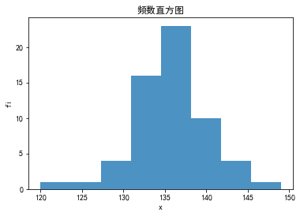
    


    
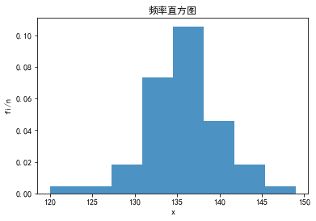
    


* 箱线图

&emsp;&emsp;首先介绍**样本分位数**：设有容量为$n$的样本观察值$x_{1}, x_{2}, \cdots, x_{n}$，样本$p$分位数$(0<p<1)$记为$x_{p}$，它具有以下性质：(1)至少有$np$个观察值小于或等于$x_{p}$；(2)至少有$n(1-p)$个观察值大于或等于$x_{p}$.

> 样本分位数的求解步骤：
> - 1. 将$x_{1}, x_{2}, \cdots, x_{n}$按自小到大的次序排列成$x_{(1)}\le x_{(2)}\le \cdots\le x_{(n)}$
> - 2. 使用下述公式计算$x_{p}$分位数$$x_{p}=\left \{ \begin{aligned} &x_{([np]+1)}, &当np不是整数\\&\frac{1}{2}[x_{(np)}+x_{(np+1)}], &当np是整数 \end{aligned}\right.$$其中，$[\cdot]$表示取整。

> 特别地，当$p=0.25$时，$0.25$分位数$x_{0.25}$也记为$Q_{1}$, 称为第一四分位数；当$p=0.5$时，$0.5$分位数$x_{0.5}$也记为$Q_{2}或M$，称为样本中位数；当$p=0.75$时，$0.75$分位数$x_{0.75}$也记为$Q_{3}$，称为第三四分位数。

> **箱线图的画法**：箱线图基于以下$5$个数字特征概括，即 最小值$Min$、第一四分位数$Q_{1}$、中位数$M$、第三四分位数$Q_{3}$和最大值$Max$。箱线图的形式如下
<div align=center>

</div>

🔥例子：以下是$8$个病人的血压(收缩压，$mmHg$)数据，请作出箱线图
$$
110 \quad 102 \quad 117 \quad 122 \quad 118 \quad 150 \quad 132 \quad 123
$$

🦊解：
1. 排序
$$
102 \quad 110 \quad 117 \quad 118 \quad 122 \quad 123 \quad 132 \quad 150
$$

2. 计算各分位点及最小最大值
$$
\begin{aligned}
&\because np=8\times 0.25 = 2, \quad &\therefore Q_{1}=\frac{1}{2}(110+117)=113.5 \\
&\because np=8\times 0.2=5 = 4, \quad &\therefore Q_{2}=\frac{1}{2}(118+122)=120 \\
&\because np=8\times 0.75 = 6, \quad &\therefore Q_{3}=\frac{1}{2}(123+132)=127.5 \\
& Min = 110, Max = 123.
\end{aligned}
$$
3. 画图

python代码(画箱线图）


```python
import matplotlib.pyplot as plt 
%matplotlib inline 
plt.rcParams['font.sans-serif']=['SimHei','Songti SC','STFangsong']
plt.rcParams['axes.unicode_minus'] = False  # 用来正常显示负号

x = [102, 110, 117, 118, 122, 123, 132, 150]

# 程序会自动找出异常点，即相差太大的点，该点< Q1-1.5(Q3-Q1)=Q1-1.5IQR 或> Q3+1.5(Q3-Q1)=Q3+1.5IQR
fig, ax = plt.subplots()
plt.figure(figsize=(6,4))
ax.boxplot(x)
plt.show()
```


    
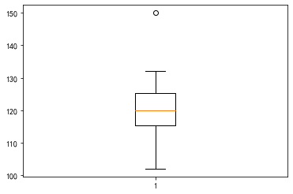
    


    <Figure size 432x288 with 0 Axes>


## 1.3 统计量与三大抽样分布

* 统计量：设$X_{1}, X_{2}, \cdots, X_{n}$是来自总体$X$的一个样本，$g(X_{1}, X_{2}, \cdots, X_{n})$是$X_{1}, X_{2}, \cdots, X_{n}$的函数，若$g$中不含任何未知参数，则称$g(X_{1}, X_{2}, \cdots, X_{n})$是一个**统计量**。
> 常用统计量，设$X_{1}, X_{2}, \cdots, X_{n}$是来自总体$X$的一个样本，$x_{1}, x_{2}, \cdots, x_{n}$是这一样本的观察值。
> - 1. 样本均值$$\overline{X} = \frac{1} {n} \sum_{i=1}^{n}X_{i}$$对应的观察值为$\overline{x} = \frac{1} {n} \sum_{i=1}^{n}x_{i}$
> - 2. 样本方差$$\begin{aligned} &1) S_{n}^{2} = \frac{1} {n} \sum_{i=1}^{n}(X_{i} - \overline{X})^{2} \\ &2) S^{2} = \frac{1} {n-1} \sum_{i=1}^{n}(X_{i} - \overline{X})^{2}, 无偏方差，应用较多\end{aligned}$$对应的观察值分别为$s_{n}^{2} = \frac{1} {n} \sum_{i=1}^{n}(x_{i} - \overline{x})^{2}和s^{2} = \frac{1} {n-1} \sum_{i=1}^{n}(x_{i} - \overline{x})^{2}$
> - 3. 样本标准差$$S = \sqrt{S^{2}} = \sqrt{\frac{1} {n-1} \sum_{i=1}^{n}(X_{i} - \overline{X})^{2}}$$对应的观察值为$s = \sqrt{\frac{1} {n-1} \sum_{i=1}^{n}(x_{i} - \overline{x})^{2}}$
> - 4. 样本$k$阶（原点）矩$$A_{k} = \frac{1}{n}\sum_{i=1}^{n}X_{i}^{k}, k =1, 2, \cdots$$对应的观察值为$a_{k} = \frac{1}{n}\sum_{i=1}^{n}x_{i}^{k}, k =1, 2, \cdots$
> - 5. 样本$k$阶中心矩$$B_{k} = \frac{1}{n}\sum_{i=1}^{n}(X_{i} - \overline{X})^{k}, k =1, 2, \cdots$$对应的观察值为$b_{k} = \frac{1}{n}\sum_{i=1}^{n}(x_{i} - \overline{x})^{k}, k =1, 2, \cdots$

* 三大抽样分布

&emsp;&emsp; (1) $\chi ^{2}$分布：设$X_{1}, X_{2}, \cdots, X_{n}$是来自总体$N(0, 1)$的样本，则称统计量
$$\chi ^{2} = X_{1}^{2} + X_{2}^{2} + \cdots + X_{n}^{2}$$
服从自由度为$n$的$\chi ^{2}$分布，记为$\chi ^{2} \sim \chi ^{2}(n)$。 自由度表示上式中右端包含的独立变量的个数。

&emsp;&emsp;$\chi ^{2}$分布的概率密度函数(不需要记)为
$$
f(y) = 
\left \{ 
    \begin{aligned}
    & \frac{1}{2^{n/2}\Gamma {(n/2})}y^{n/2-1}e^{-y/2}, &y>0 \\
    & 0, & 其他
    \end{aligned}
\right.
$$


python代码（$\chi ^{2}分布的图形$）


```python
import matplotlib.pyplot as plt
%matplotlib inline
from scipy.stats import chi2
import numpy as np

fig, ax = plt.subplots(1, 1)
x = np.linspace(0.01, 30, 10000)
ax.plot(x, chi2.pdf(x, df=2), '-', label='n = 2')
ax.plot(x, chi2.pdf(x, 4), '--', label='n = 4')
ax.plot(x, chi2.pdf(x, df=10), '-.', label='n = 10')
ax.set_ylim([0, 0.5])
ax.set_xlabel("y")
ax.set_ylabel("f(y)")
ax.legend()
plt.show()
```


    
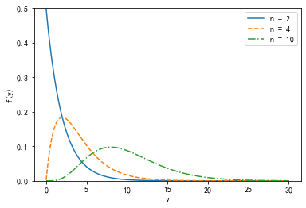
    


```python
# 利用定理画卡方分布的图形
import matplotlib.pyplot as plt
%matplotlib inline
from scipy.stats import norm, chi2
import numpy as np

def demonstate_chi(n):
    x = 0
    for i in range(n):
        x += np.square(norm(loc=0, scale=1).rvs(size=10000))
    
    return x

x = np.linspace(0.01, 30, 10000)

n_2 = demonstate_chi(2)
n_4 = demonstate_chi(4)
n_10 = demonstate_chi(10)

plt.figure(figsize=(10, 5))
plt.subplot(1,3, 1)
plt.plot(x, chi2.pdf(x, 2), '-', label='n = 2', c='blue')
plt.hist(n_2, density=True, histtype='stepfilled', alpha=0.5)
plt.legend()
plt.subplot(1,3, 2)
plt.plot(x, chi2.pdf(x, df = 4), '--', label='n = 4', c='gray')
plt.hist(n_4, density=True, histtype='stepfilled', alpha=0.5)
plt.legend()
plt.subplot(1,3, 3)
plt.plot(x, chi2.pdf(x, 10), '-.', label='n = 10', c='red')
plt.hist(n_10, density=True, histtype='stepfilled', alpha=0.5)
plt.legend()
plt.tight_layout(w_pad=3)
plt.show()
```


    
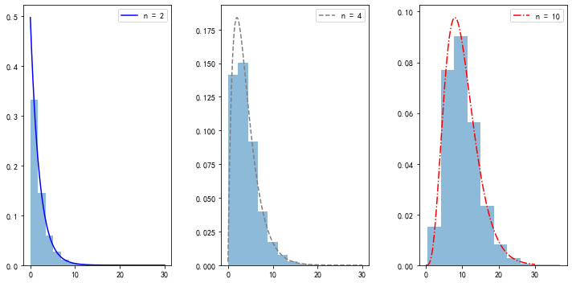
    


> $\chi ^{2}$分布的性质
> - 1. $\chi ^{2}$分布的**可加性**：设$\chi_{1}^{2} \sim \chi ^{2}(n1), \chi_{2}^{2} \sim \chi ^{2}{n2}$，且$\chi_{1}^{2}, \chi_{2}^{2}$相互独立，则$$\chi_{1}^{2} + \chi_{2}^{2} \sim \chi ^{2} (n1 + n2)$$
> - 2. $\chi ^{2}$分布的**期望**和**方差**:若$\chi ^{2} \sim \chi ^{2}(n)$，则$$E(\chi ^{2}) = n, D(\chi ^{2}) = 2n$$ 证：$$\begin{aligned} &\chi ^{2} = X_{1}^{2} + X_{2}^{2} + \cdots + X_{n}^{2}, X_{i} \sim N(0, 1) \\ & 故 E(X_{i})=0, E(X_{i}^{2}) = D(X_{i}) = 1 \\ & E(\chi ^{2}) = \sum_{i=1}^{n}E(X_{i}^{2}) = n  \\ &D(X_{i}^{2}) = E(X_{i}^{4}) - E^{2}(X_{i}^{2}) = 3 - 1 = 2 \\ & D(\chi ^{2}) = \sum_{i=1}^{n}D(X_{i}^{2}) = 2n\end{aligned}$$
> - 3. $\chi ^{2}$分布的**分位点**：对于给定的正数$\alpha, 0 <\alpha <1$，称满足条件$$P\{\chi^{2} > \chi_{\alpha} ^{2}(n)\} = \int_{\chi_{\alpha} ^{2}(n)}^{\infty}f(y)dy = \alpha$$ 的点$\chi_{\alpha} ^{2}(n)$为$\chi ^{2}(n)$分布上的$\alpha$分位点。

&emsp;&emsp; (2) $t$ 分布：设$X \sim N(0, 1), Y \sim \chi^{2}(n)$，且$X, Y$相互独立，则称随机变量
$$
t = \frac{X}{\sqrt{Y/n}}
$$
服从自由度为$n$的$t$分布，记为$t \sim t(n)$。

&emsp;&emsp;$t$分布的概率密度函数为：
$$
h(t) = \frac{\Gamma [(n+1)/2]}{\sqrt{\pi n} \Gamma (n/2)}(1 + \frac{t^{2}}{n})^{-(n+1)/2}, -\infty < t < \infty
$$

python代码（画$t$分布的图像）


```python
import matplotlib.pyplot as plt
%matplotlib inline
from scipy.stats import t
import numpy as np

fig, ax = plt.subplots(1, 1)
x = np.linspace(-10, 10, 10000)
ax.plot(x, t.pdf(x, df=2), '-', label='n = 2', c='blue')
ax.plot(x, t.pdf(x, 9), '--', label='n = 9', c='gray')
ax.plot(x, t.pdf(x, df=10000), '-.', label='n = 10000', c='red')
ax.set_xlabel("t")
ax.set_ylabel("h(t)")
ax.legend()
plt.show()
```


    
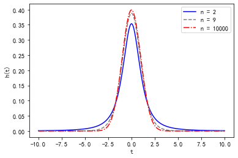
    


```python
# 利用定理画 t 分布的分布函数
import matplotlib.pyplot as plt
%matplotlib inline
from scipy.stats import norm, chi2
import numpy as np

def demonstate_t(n):
    x = 0
    y = 0
    x = norm(loc=0, scale=1).rvs(size=10000)
    y = chi2.rvs(df=n)
    t = x / np.sqrt(y/ n)
    
    return t

x = np.linspace(-10, 10, 10000)

n_2 = demonstate_t(2)
n_9 = demonstate_t(9)
n_10000 = demonstate_t(10000)

plt.figure(figsize=(10, 5))
plt.subplot(1,3, 1)
plt.plot(x, t.pdf(x, 2), '-', label='n = 2', c='blue')
plt.hist(n_2,bins=15, density=True, histtype='stepfilled', alpha=0.5)
plt.legend()
plt.subplot(1,3, 2)
plt.plot(x, t.pdf(x, df = 9), '--', label='n = 9', c='gray')
plt.hist(n_9, density=True, histtype='stepfilled', alpha=0.5)
plt.legend()
plt.subplot(1,3, 3)
plt.plot(x, t.pdf(x, 10000), '-.', label='n = 10000', c='red')
plt.hist(n_10000, density=True, histtype='stepfilled', alpha=0.5)
plt.legend(loc="upper right")
plt.tight_layout(w_pad=3)
plt.show()

```


    
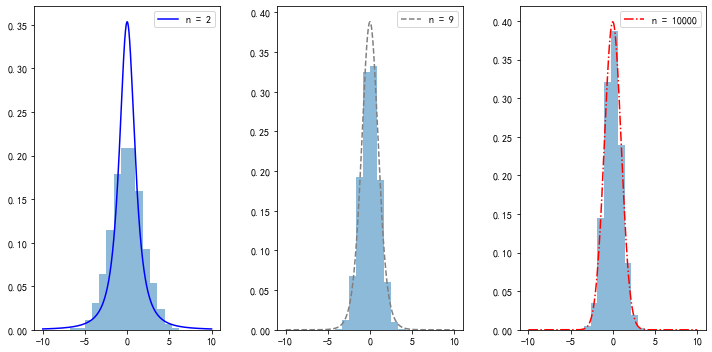
    


> 当$n \rightarrow \infty$时，$t$分布近似为$N(0 ,1)$分布。

> - $t$分布的分位点：对于给定的正数$\alpha, 0 <\alpha <1$，称满足条件$$P\{t > t_{\alpha}(n)\} = \int_{t_{\alpha}(n)}^{\infty}h(t)dt = \alpha$$ 的点$t_{\alpha}(n)$为$t(n)$分布上的$\alpha$分位点。
> - $h(t)$图形具有对称性，即$t_{1 - \alpha}(n) = -t_{\alpha}(n)$

&emsp;&emsp; (3) $F$ 分布：设$U \sim \chi ^{2}(n1), V \sim \chi ^{2}(n2)$，且$U, V$相互独立，则称随机变量
$$
F = \frac{U/n1}{V/n2}
$$
服从自由度为$(n1, n2)$的$F$分布，记为$F \sim F(n1, n2)$。

&emsp;&emsp;$F$分布的概率密度函数为：
$$
\psi (y) = 
\left \{
    \begin{aligned}
    & \frac{\Gamma [(n1 +n2)/2](n1/n2)^{n1/2}y^{(n1/2)-1}}{\Gamma (n1/2)\Gamma (n2/2)[1+(n1y/n2)]^{(n1+n2)/2}}, &y>0 \\
    & 0, &其它
    \end{aligned}
\right.
$$


python代码(画$F$分布函数)


```python
import matplotlib.pyplot as plt
%matplotlib inline
from scipy.stats import f
import numpy as np

fig, ax = plt.subplots(1, 1)
x = np.linspace(0.01, 10, 10000)
ax.plot(x, f.pdf(x, dfn=10, dfd=40), '-', label='F~(10, 40)', c='blue')
ax.plot(x, f.pdf(x, dfn=40, dfd=10), '--', label='F~(40, 10)', c='orange')
ax.plot(x, f.pdf(x, dfn=11, dfd=3), '-.', label='F~(11, 3)', c='red')
ax.set_xlabel("y")
ax.set_ylabel("f(y)")
ax.legend()
plt.show()
```


    
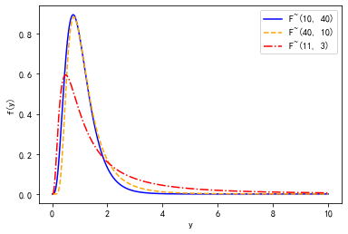
    


```python
# 利用定理
import matplotlib.pyplot as plt
%matplotlib inline
from scipy.stats import chi2
import numpy as np

def demonstate_f(n1, n2):
    u = 0
    v = 0
    u = chi2.rvs(df=n1, size=10000)
    v = chi2.rvs(df=n2, size=10000)
    f = (u/n1) / (v/n2)
    
    return f

x = np.linspace(0.01, 10, 10000)

n_10_40 = demonstate_f(10, 40)
n_40_10 = demonstate_f(40 ,10)
n_11_3 = demonstate_f(11, 3)

plt.figure(figsize=(10, 5))
plt.subplot(1,3, 1)
plt.plot(x, f.pdf(x, dfn=10, dfd=40), '-', label='F~(10, 40)', c='blue')
plt.hist(n_10_40, bins=300, density=True, histtype='stepfilled', alpha=0.5)
plt.legend()
plt.subplot(1,3, 2)
plt.plot(x, f.pdf(x, dfn=40, dfd=10), '--', label='F~(40, 10)', c='orange')
plt.hist(n_40_10, bins=300, density=True, histtype='stepfilled', alpha=0.5)
plt.legend()
plt.subplot(1,3, 3)
plt.plot(x, f.pdf(x, dfn=11, dfd=3), '-.', label='F~(11, 3)', c='red')
plt.hist(n_11_3,bins=550, density=True, histtype='stepfilled', alpha=0.5)
plt.xlim([0, 10])
plt.legend(loc="upper right")
plt.tight_layout(w_pad=3)
plt.show()


```


    
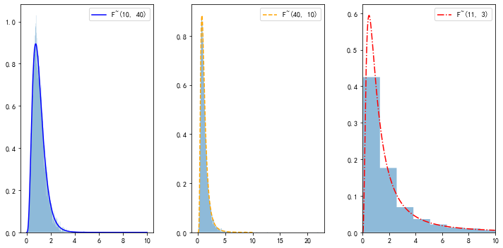
    


> - $F$分布的分位点：对于给定的正数$\alpha, 0 <\alpha <1$，称满足条件$$P\{F > F_{\alpha}(n1, n2)\} = \int_{F_{\alpha}(n1, n2)}^{\infty}\psi (y)dy = \alpha$$ 的点$F_{\alpha}(n1, n2)$为$F(n1, n2)$分布上的$\alpha$分位点。
> - 若$F \sim F(n1, n2)$，则$$\frac{1}{F} \sim F(n2, n1)$$
> - $F_{1-\alpha}(n1, n2) =\frac{1} {F_{\alpha}(n2, n1)}$。

* 📕重要定理：关于正态总体的样本均值与样本方差的分布

&emsp;&emsp;**定理一**：设$X_{1}, X_{2}, \cdots, X_{n}$是来自正态总体$N(\mu, \sigma^{2})$的样本，$\overline{X}$是样本均值，则
$$
\overline{X} \sim N(\mu, \sigma^{2}/n).
$$

&emsp;&emsp;**定理二**：设$X_{1}, X_{2}, \cdots, X_{n}$是来自正态总体$N(\mu, \sigma^{2})$的样本，$\overline{X} {和} S^{2}$分别是样本均值和样本方差，则有
$$
\begin{aligned}
& 1. \frac{(n-1)S^{2}}{\sigma^{2}} \sim \chi^{2}(n-1) \\
& 2. \overline{X}与S^{2}相互独立
\end{aligned}
$$

&emsp;&emsp;**定理三**：设$X_{1}, X_{2}, \cdots, X_{n}$是来自正态总体$N(\mu, \sigma^{2})$的样本，$\overline{X} {和} S^{2}$分别是样本均值和样本方差，则有
$$
\frac{\overline{X} - \mu}{S/\sqrt{n}} \sim t(n-1).
$$

&emsp;&emsp;**定理四**：设$X_{1}, X_{2}, \cdots, X_{n1}{和}Y_{1}, Y_{2}, \cdots, Y_{n2}$分别是来自正态总体$N(\mu_1, \sigma_{1}^{2})和N(\mu_2, \sigma_{2}^{2})$的样本，且这两个样本相互独立，则有
$$
\begin{aligned}
& 1. \frac{S_{1}^{2}/S_{2}^{2}}{\sigma_{1}^{2}/\sigma_{2}^{2}} \sim F(n1-1, n2-1) \\
& 2. 当\sigma_{1}^{2} = \sigma_{2}^{2} = \sigma^{2}时，\frac{(\overline{X} - \overline{Y}) - (\mu_{1} - \mu_{2})}{S_{w}\sqrt{\frac{1}{n1}+\frac{1}{n2}}} \sim t(n1+n2-2) 
\end{aligned}
$$
其中，$S_{w}^{2} = \frac{(n1-1)S_{1}^{2}+(n2-1)S_{2}^{2}}{n1+n2-2}$.

python代码(验证定理)


```python
import matplotlib.pyplot as plt
%matplotlib inline
from scipy.stats import chi2, t, norm, f
import numpy as np

def theory_1(mu, sigma, n):
    x_mean = []
    for i in range(10000):
        x_mean.append(np.sum(norm.rvs(loc=mu, scale=sigma, size=n))/n)
    return x_mean

def theory_2(mu, sigma, n):
    res = []
    for i in range(10000):
        x = norm.rvs(loc=mu, scale=sigma, size=n)
        x_mean = np.mean(x)
        s2 = np.sum(np.square(x - x_mean))/(n-1)
        res.append((n-1)*s2/(sigma**2))
    return res

def theory_3(mu, sigma, n):
    res = []
    for i in range(10000):
        x = norm.rvs(loc=mu, scale=sigma, size=n)
        x_mean = np.mean(x)
        s = np.sqrt(np.sum(np.square(x - x_mean))/(n-1))
        res.append((x_mean-mu)/(s/np.sqrt(n)))
    return res

def theory_4(mu1, mu2, sigma1, sigma2, n1, n2):
    res = []
    for i in range(10000):
        x1 = norm.rvs(loc=mu1, scale=sigma1, size=n1)
        x1_mean = np.mean(x1)
        x2 = norm.rvs(loc=mu2, scale=sigma2, size=n2)
        x2_mean = np.mean(x2)
        s1_2 = np.sum(np.square(x1-x1_mean)) / (n1-1)
        s2_2 = np.sum(np.square(x2-x2_mean)) / (n2-1)
        temp1 = (s1_2/s2_2)
        temp2 = (sigma1**2/sigma2**2)
        res.append(temp1/temp2)
    return res 

mu = 5
sigma = 10
n = 5
mu1, mu2 = 1, 2
sigma1, sigma2 = 3, 4
n1, n2 = 10, 40
x_mean = theory_1(mu, sigma, n)
t2 = theory_2(mu, sigma, n)
t_ = theory_3(mu, sigma, n)
f_ = theory_4(mu1, mu2, sigma1, sigma2, n1, n2)

x1 =np.linspace(-10, 20, 10000)
x2 = np.linspace(0.01, 30, 10000)
x3 = np.linspace(-5, 5, 10000)
x4 = np.linspace(0.01, 10, 10000)

plt.figure(figsize=(10, 8))
plt.subplot(2,2, 1)
plt.plot(x1, norm.pdf(x1,loc=mu, scale=sigma/np.sqrt(n)), '-', label='N({}, {})'.format(mu, sigma**2/n), c='blue')
plt.hist(x_mean,bins=50, density=True, histtype='stepfilled', alpha=0.5)
plt.title("Theory_1")
plt.xlabel("x")
plt.ylabel("p(x)")
plt.legend()
plt.subplot(2,2, 2)
plt.plot(x2, chi2.pdf(x2, df=n-1), '--', label='X({})'.format(n-1), c='orange')
plt.hist(t2, bins=50,  density=True, histtype='stepfilled', alpha=0.5)
plt.title("Theory_2")
plt.xlabel("x")
plt.ylabel("p(x)")
# plt.xlim([0, 30])
plt.legend()
plt.subplot(2,2, 3)
plt.plot(x3, t.pdf(x3, df=n-1), '-.', label='t({})'.format(n-1), c='red')
plt.hist(t_,bins=50, density=True, histtype='stepfilled', alpha=0.5)
plt.title("Theory_3")
plt.xlabel("x")
plt.ylabel("p(x)")
plt.legend(loc="upper right")
plt.subplot(2,2, 4)
plt.plot(x4, f.pdf(x4, dfn=n1-1, dfd=n2-1), '--', label='F({}, {})'.format(n1-1, n2-1), c='orange')
plt.hist(f_, bins=50, density=True, histtype='stepfilled', alpha=0.5)
plt.title("Theory_4")
plt.xlabel("x")
plt.ylabel("p(x)")
plt.xlim([0, 10])
plt.legend()

plt.tight_layout(w_pad=3)
plt.show()
```


    
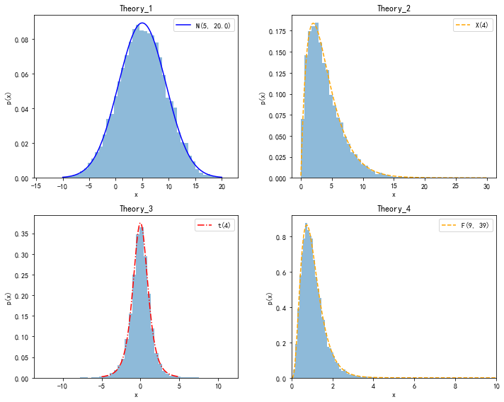
    


## 1.4 参数估计之点估计的概念

* 点估计：设总体$X$的分布函数$F(x;\theta)$的形式为已知，$\theta$是待估计参数，$X_{1}, X_{2}, \cdots, X_{n}$是$X$的一个样本，$x_{1}, x_{2}, \cdots, x_{n}$是相应的一个样本值，点估计问题就是要构造一个适当的统计量$\hat{\theta}(X_{1}, X_{2}, \cdots, X_{n})$，用它的观察值$\hat{\theta}(x_{1}, x_{2}, \cdots, x_{n})$作为未知参数$\theta$的近似值。称$\hat{\theta}(X_{1}, X_{2}, \cdots, X_{n})$为$\theta$的**估计量**，$\hat{\theta}(x_{1}, x_{2}, \cdots, x_{n})$为$\theta$的**估计值**。统称它们为**估计**，简记为$\hat{\theta}$。
> 点估计就是用样本统计量去估计总体分布的未知参数。由于估计量是样本的函数，因此，对于不同的样本值，$\theta$的估计值一般是不相同的。

## 1.5 参数估计之点估计的方法：矩估计

* 矩估计法：设$X$为连续型随机变量，其概率密度为$f(x;\theta_{1},\theta_{2}, \cdots, \theta_{k})$，或$X$为离散随机变量，其分布律为$P\{X=x\}=p(x;\theta_{1},\theta_{2}, \cdots, \theta_{k})$，其中$\theta_{1},\theta_{2}, \cdots, \theta_{k}$为待估计参数，$X_{1}, X_{2}, \cdots, X_{n}$是来自$X$的样本。假设总体$X$的前$k$阶矩
$$
\mu_{l} = E(X^{l}) = \int_{-\infty}^{\infty}x^{l}f(x;\theta_{1},\theta_{2}, \cdots, \theta_{k})dx
$$
或
$$
\mu_{l} = E(X^{l}) = =\sum x^{l}p(x;\theta_{1},\theta_{2}, \cdots, \theta_{k})
$$
**然后假设样本$k$阶矩$A_{k}$等于总体$k$阶矩$\mu_{k}$，即$A_{k} = \mu_{k}$**，这种利用样本矩估计总体矩，从而估计未知参数的方法称为**矩估计法**。
> 样本矩公式
> - 1. 样本原点矩 $$A_{k} = \frac{1}{n}\sum_{i=1}^{n}X_{i}^{k}, k =1, 2, \cdots$$
> - 2. 样本中心矩 $$B_{k} = \frac{1}{n}\sum_{i=1}^{n}(X_{i} - \overline{X})^{k}, k =1, 2, \cdots$$

> 矩估计法的解题步骤：
> - 1. 确定总体分布待估计参数$\theta_{i}$的个数$n$
> - 2. 列出总体分布的前$n$阶矩$\mu_{1}到\mu_{n}$，$\mu_{n}$是关于待估计参数$\theta_{i}$的函数
> - 3. 将$\mu_{1}到\mu_{n}$联立方程组，求解待估计参数$\theta_{i}$
> - 4. 将求得的$\theta_{i}$中的$\mu_{k}$换成相应的$A_{k}$，即得到待估计参数的估计值

🔥例子：设总体$X$在$[a, b]$上服从均匀分布，$a, b$未知，$X_{1}, X_{2}, \cdots, X_{n}$是来自总体$X$的样本，求$a, b$的矩估计量。

🦊解：   
1. 确定估计参数个数，$a, b$, $n=2$
2. 求总体的前$2$阶矩
$$
\begin{aligned}
&\mu_{1} = E(X) = \frac{b-a}{2} \\
&\mu_{2} = E(X^{2}) = D(X) + E^{2}(X) = \frac{(b-a)^{2}}{12} + \frac{(b-a)^{2}}{4} \\
\end{aligned}
$$
3. 联立方程组并求解
$$
\left \{
\begin{aligned}
&\mu_{1} = \frac{b-a}{2} \\
&\mu_{2} =  \frac{(b-a)^{2}}{12} + \frac{(b-a)^{2}}{4} \\
\end{aligned}
\right.
$$
解得
$$
a = \mu_{1} - \sqrt{3(\mu_{2}-\mu_{1}^{2})}, b = \mu_{1} + \sqrt{3(\mu_{2}-\mu_{1}^{2})}
$$
4. 将相应的$\mu_{k}$换成$A_{k}$
$$
\begin{aligned}
&a = A_{1} - \sqrt{3(A_{2}-A_{1}^{2})} = \frac{1}{n}\sum_{i=1}^{n}X_{i} - \sqrt{3(\frac{1}{n}\sum_{i=1}^{n}X_{i}^{2}-(\frac{1}{n}\sum_{i=1}^{n}X_{i})^{2})} \\
& b = A_{1} + \sqrt{3(A_{2}-A_{1}^{2})} = \frac{1}{n}\sum_{i=1}^{n}X_{i} + \sqrt{3(\frac{1}{n}\sum_{i=1}^{n}X_{i}^{2}-(\frac{1}{n}\sum_{i=1}^{n}X_{i})^{2})}
\end{aligned}
$$

python代码(求解上题)


```python
import numpy as np
from scipy.stats import uniform

a_real = 1
b_real = 6
n = 1000
x = uniform.rvs(loc=1, scale=5, size=n)

A1 = np.sum(x) / n
A2 = np.sum(np.square(x)) / n

a_estimate = A1 - np.sqrt(3 *(A2-A1**2))
b_estimate = A1 + np.sqrt(3 *(A2-A1**2))
print("a的真实值：{}, b的真实值：{}".format(a_real, b_real))
print("a的矩估计值：{:.2f}, b的矩估计值：{:.2f}".format(a_estimate, b_estimate))
```

    a的真实值：1, b的真实值：6
    a的矩估计值：1.08, b的矩估计值：6.07
    

## 1.6 参数估计之点估计的方法：极大似然估计

* 最大似然估计法：

&emsp;&emsp;对于离散型随机变量:设其分布律为$P\{X=s\}=p(x;\theta), \theta \in \Theta$的形式已知，$\theta$为待估计参数，$\Theta 是 \theta$可能取值的范围。设$X_{1}, X_{2}, \cdots, X_{n}$是来自$X$的样本，则$X_{1}, X_{2}, \cdots, X_{n}$的联合分布律为
$$
\prod{i=1}^{n}p(x_{i};\theta).
$$
又设$x_{1}, x_{2}, \cdots, x_{n}$是相应样本$X_{1}, X_{2}, \cdots, X_{n}$的样本值。易知样本$X_{1}, X_{2}, \cdots, X_{n}$取到观察值$x_{1}, x_{2}, \cdots, x_{n}$的概率，即事件$\{X_{1}=x_{1}, X_{2}=x_{2}, \cdots, X_{n}=x_{n}\}$发生的概率为
$$
L(\theta) = L(x_{1}, x_{2}, \cdots, x_{n}; \theta) = \prod{i=1}^{n}p(x_{i};\theta), \theta \in \Theta.
$$
这一概率随$\theta$的取值而变化，它是$\theta$的函数，$L(\theta)$称为样本的**似然函数**（注意，这里$x_{1}, x_{2}, \cdots, x_{n}$是已知的样本值，即常数）。

最大似然估计思想：固定样本观察值$x_{1}, x_{2}, \cdots, x_{n}$，在$\theta$取值的可能范围$\Theta$内挑选使似然函数$L(x_{1}, x_{2}, \cdots, x_{n}; \theta)$达到最大的参数$\hat{\theta}$，作为参数$\theta$的估计值。即取$\hat{\theta}$使
$$
L(x_{1}, x_{2}, \cdots, x_{n}; \hat{\theta}) = \max_{\theta \in \Theta} L(x_{1}, x_{2}, \cdots, x_{n}; \theta)
$$
这样得到的$\hat{\theta}$与样本值$x_{1}, x_{2}, \cdots, x_{n}$有关，记为$\hat{\theta}(x_{1}, x_{2}, \cdots, x_{n})$，称为参数$\theta$的**最大似然估计值**，相应的统计量$\hat{\theta}(X_{1}, X_{2}, \cdots, X_{n})$称为参数$\theta$的**最大似然估计量**。

&emsp;&emsp;对于连续型随机变量：似然函数
$$
L(\theta) = L(x_{1}, x_{2}, \cdots, x_{n}; \theta) = \prod{i=1}^{n}f(x_{i};\theta)
$$
$f(x_{i};\theta)$为连续随机变量的概率密度函数。

> 最大似然函数方法的求解步骤
> - 1. 确定随机变量的分布律（概率密度）
> - 2. 确定似然函数
> - 3. 令 $\frac{d}{d\theta}L(\theta) = 0$，求驻点，便可以找到使$L(\theta)$取极值的估计参数$\hat{\theta}$
> - 4. 对于$L(\theta)$函数中存在大量连乘项或指数项时，可令$\frac{d}{d\theta}ln L(\theta) = 0$，也可以求得$\hat{\theta}$，因为$ln\cdot$函数是单调递增函数，对似然函数做$ln\cdot$变换不会改变原函数的特征。

🔥例子一：设$X\sim b(1, p)（二项分布）. X_{1}, X_{2}, \cdots, X_{n}$是来自$X$的一个样本，求参数$p$的最大似然估计。

🦊解：
1. 确定随机变量的分布律（概率密度）
$$
P\{X=x\} = p^{x}(1-p)^{1 - x}, x=0, 1
$$
2. 确定似然函数
$$
L(p) = \prod_{i=1}^{n}P\{X=x_{i}\} = \prod_{i=1}^{n}p^{x_{i}}(1-p)^{1 - x_{i}} = p^{\sum_{i=1}^{n}x_{i}}(1-p)^{\sum_{i=1}^{n}(1-x_{i})}
$$
出现连乘，取对数
$$
ln L(p) = ln[p^{\sum_{i=1}^{n}x_{i}}(1-p)^{\sum_{i=1}^{n}(1-x_{i})}] = ln[p^{\sum_{i=1}^{n}x_{i}}] + ln [(1-p)^{\sum_{i=1}^{n}(1-x_{i})}] = \sum_{i=1}^{n}x_{i}ln p + \sum_{i=1}^{n}(1-x_{i})ln(1-p)
$$
3. 令$\frac{d}{dp}ln L(p) = 0$， 解得
$$
\hat{p} = \frac{1}{n}\sum_{i=1}{n}x_{i} = \overline{x}
$$

python代码（求解上题）


```python
from sympy import *
from sympy.abc import p
from scipy.stats import bernoulli

p_real = 0.4

x = bernoulli.rvs(p_real, size=1000)

Lp = p ** sum(x) * (1-p)**sum(1-x)

dLp = diff(Lp, p, 1)
p_estimate = solve(dLp)
# 寻找符合要求的p值
for i in p_estimate:
    if i > 0 and i < 1:
        p_e = i
print("p的真实值：{}".format(p_real))
print("p的最大似然估计值：{}".format(p_e))
```

    p的真实值：0.4
    p的最大似然估计值：389/1000
    

🔥例子二：设$X\sim N(\mu, \sigma^{2}), \mu, \sigma^{2}$为未知参数，$x_{1}, x_{2}, \cdots, x_{n}$是来自$X$的一个样本值，求$\mu, \sigma^{2}$的最大似然估计量。

🦊解：
1. 确定随机变量的概率密度函数
$$
f(x;\mu, \sigma^{2}) = \frac{1}{\sqrt{2\pi }\sigma}e^{-\frac{(x-\mu)^{2}}{2\sigma^{2}}}
$$
2. 确定似然函数
$$
L(\mu, \sigma) = \prod_{i=1}^{n} f(x_{i};\mu, \sigma^{2}) = \prod_{i=1}^{n}(\frac{1}{\sqrt{2\pi }\sigma}e^{-\frac{(x_{i}-\mu)^{2}}{2\sigma^{2}}}) = (\frac{1}{\sqrt{2\pi }\sigma})^{n}e^{-\sum_{i=1}^{n}\frac{(x_{i}-\mu)^{2}}{2\sigma^{2}}}
$$
出现指数求和项，整理成对数似然函数
$$
ln L(\mu, \sigma) = ln [(\frac{1}{\sqrt{2\pi }\sigma})^{n}e^{-\sum_{i=1}^{n}\frac{(x_{i}-\mu)^{2}}{2\sigma^{2}}}] = -n ln\sqrt{2\pi }\sigma - \sum_{i=1}^{n}\frac{(x_{i}-\mu)^{2}}{2\sigma^{2}}
$$
3. 令$\frac{\partial }{\partial \mu}ln L(\mu, \sigma) = 0,  \frac{\partial }{\partial \sigma}ln L(\mu, \sigma) = 0$，建立似然方程组
$$
\left \{
\begin{aligned}
&\frac{\partial }{\partial \mu}ln L(\mu, \sigma) = -2 \sum_{i=1}^{n}\frac{(x_{i}-\mu)}{2\sigma^{2}} = 0 \\
&\frac{\partial }{\partial \sigma}ln L(\mu, \sigma) = - \frac{n}{\sigma} + \sum_{i=1}^{n}\frac{(x_{i}-\mu)^{2}}{\sigma^{3}} = 0
\end{aligned}
\right.
$$
4. 解得
$$
\left \{
\begin{aligned}
&\mu = \frac{1}{n}\sum_{i=1}^{n}x_{i} \\
&\sigma^{2} = \frac{1}{n}\sum_{i=1}^{n}(x_{i} - \mu)^{2}
\end{aligned}
\right.
$$

python代码(验证上题结果)


```python
from sympy import *
from sympy.abc import mu, sigma 
from scipy.stats import norm

mu_real = 2
sigma_real = 3
n = 1000

x = norm.rvs(loc=mu_real, scale=sigma_real, size=n)

mu_estimate = sum(x) / n 
sigma2_estimate = sum((x - mu_estimate)**2) / n

print("随机变量的原均值为：{}， 方差为：{}".format(mu_real, sigma_real**2))
print("最大似然估计的均值为：{:.2f}， 方差为：{:.2f}".format(mu_estimate,sigma2_estimate))
```

    随机变量的原均值为：2， 方差为：9
    最大似然估计的均值为：2.01， 方差为：9.39
    

> 💡最大似然估计性质：设$\theta$的函数$u=u(\theta), \theta \in \Theta$具有*单值反函数*$\theta=\theta(u), u\in \vartheta$.又假设$\hat{\theta}$是$X$的概率分布中参数$\theta$的最大似然估计，则$\hat{u}=\hat{u}(\theta)$是$u(\theta)$的最大似然估计，这一性质称为最大似然估计的**不变性**。

## 1.7 估计量的评选标准：无偏性、有效性、相合性（一致性）

设$X_{1}, X_{2}, \cdots, X_{n}$是总体$X$的一个样本，$\theta \in \Theta$是包含在总体$X$的分布中的待估计参数，$\Theta 是\theta$的取值范围。

* 无偏性：若估计量$\hat{\theta} = \hat{\theta}(X_{1}, X_{2}, \cdots, X_{n})$的数学期望$E(\hat{\theta})$存在，且对于任意的$\theta \in \Theta$有
$$
E(\hat{\theta}) = \theta
$$
则称$\hat{\theta}$为$\theta$的**无偏估计量**。即估计值的期望等于待估计参数的真实值。

> 估计量的无偏性是说，对于总体的样本值，由某个估计量得到的估计值与真值存在偏差，但反复将这估计量使用多次得到多个估计值，这多个估计值的期望（平均）与真值之间的偏差$E(\hat{\theta})-\theta$为零。在科学技术中$E(\hat{\theta})-\theta$称为以$E(\hat{\theta})$作为$\theta$的估计的系统误差。无偏估计的实际意义就是无系统误差。

* 有效性：假设要比较参数$\theta$的两个无偏估计量$\hat{\theta_{1}}{和}\hat{\theta_{2}}$，如果在样本容量$n$相同的情况下，$\hat{\theta_{1}}$的观察值较$\hat{\theta_{2}}$更密集在真值$\theta$的附近，则认为$\hat{\theta_{1}}{比}\hat{\theta_{2}}$更为理想。又由于方差是随机变量取值与其数学期望（此时数学期望$E(\hat{\theta_{1}})=E(\hat{\theta_{2}}) = \theta$）的偏离程度的度量。所以无偏估计以方差小者为好。设$\hat{\theta_{1}} = \hat{\theta_{1}}(X_{1}, X_{2}, \cdots, X_{n})$与$\hat{\theta_{2}} = \hat{\theta_{2}}(X_{1}, X_{2}, \cdots, X_{n})$都是$\theta$的无偏估计量，若对于任意$\theta \in \Theta$，有
$$
D(\hat{\theta_{1}}) \le D(\hat{\theta_{2}})
$$
且至少对于某一个$\theta \in \Theta$上式中的不等号成立，则称$\hat{\theta_{1}}$较$\hat{\theta_{2}}$**有效**。

* 相合性（一致性）：设$\hat{\theta} = \hat{\theta}(X_{1}, X_{2}, \cdots, X_{n})$为参数$\theta$的估计量，若对于任意$\theta \in \Theta$，当$n \rightarrow \infty$时$\hat{\theta} = \hat{\theta}(X_{1}, X_{2}, \cdots, X_{n})$依概率收敛于$\theta$，则称$\hat{\theta}$为$\theta$的**相合估计量**。即对于任意$\varepsilon > 0$，有
$$
\lim_{n\rightarrow \infty}P\{| \hat{\theta} - \theta| < \varepsilon\} = 1
$$

## 1.8 参数估计之区间估计

* 背景：对于一个未知量或未知参数的估计，常不以得到近似值为满足，还需估计误差，即要求知道近似值的精确程度（也就是所求真值的所在范围）。类似地，对于未知参数$\theta$，除了求出它的点估计$\hat{\theta}$外，还希望估计出一个范围，并希望知道这个范围包含参数$\theta$真值的可信程度。这样的范围通常以区间的形式给出，同时还给出此区间包含参数$\theta$真值的可信程度，这种形式的估计称为**区间估计**。这样的区间即所谓**置信区间**。

* 置信区间：设总体$X$的分布函数$F(x;\theta)$含有一个未知参数$\theta, \theta \in \Theta（\Theta{是}\theta 可能取值的范围）$，对于给定值$\alpha（0 < \alpha < 1）$，若来自$X$的样本$X_{1}, X_{2}, \cdots, X_{n}$确定的两个统计量$\underline{\theta} = \underline{\theta}(X_{1}, X_{2}, \cdots, X_{n}) {和}\overline{\theta} = \overline{\theta}(X_{1}, X_{2}, \cdots, X_{n}), (\underline(\theta)<\overline{\theta})$，对于任意$\theta \in \Theta$满足
$$
P\{\underline{\theta}(X_{1}, X_{2}, \cdots, X_{n}) <\theta <\overline{\theta}(X_{1}, X_{2}, \cdots, X_{n})\} \ge 1 -\alpha
$$
则称随机区间$(\underline{\theta}, \overline{\theta})$是$\theta$置信水平为$1 -\alpha$的**置信区间**，$\underline{\theta} {和} \overline{\theta}$分别称为置信水平为$1 -\alpha$的双侧置信区间的**置信下限和置信上限**，$1 -\alpha$称为置信水平。

&emsp;&emsp;上式的含义为：对总体进行多次重复抽样（每次抽样的样本容量相同，均为$n$）,每一次抽样都确定待估计参数的一个区间$(\underline{\theta}, \overline{\theta})$，每个这样的区间有两种可能，即要么包含待估计的真值$\theta$，要么不包含待估计的真值$\theta$。根据大数定理，包含真值$\theta$的区间数量约占$100(1-\alpha)\%$，不包含真值$\theta$的区间数量约占$100\alpha \%$。例如，若$\alpha=0.01$，反复抽样$1000$次，则得到的$1000$个区间中不包含$\theta$真值的约为$10$个。

🔥例子：设总体$X \sim N(\mu, \sigma^{2})$，$\sigma^{2}$为已知，$\mu$为未知，设$X_{1}, X_{2}, \cdots, X_{n}$是来自$X$的样本，求$\mu$的置信水平为$1-\alpha$的置信区间。

🦊解：

由于$\overline{X}{是}X$的无偏估计，且
$$
\frac{\overline{X} - \mu}{\sigma/\sqrt{n}} \sim N(0, 1)
$$
$\frac{\overline{X} - \mu}{\sigma/\sqrt{n}}$所服从的分布$N(0, 1)$不依赖于任何未知参数，按标准正态分布的上$\alpha$分位点定义，有
$$
P\left\{\left|\frac{\overline{X} - \mu}{\sigma/\sqrt{n}}\right| < z_{\alpha/2}\right\} = 1-\alpha
$$
即
$$
P\left\{ \overline{X} - \frac{\sigma}{\sqrt{n}}z_{\alpha/2}< \mu < \overline{X} + \frac{\sigma}{\sqrt{n}}z_{\alpha/2}\right\} = 1-\alpha
$$
由定义知，$\mu$的一个置信水平为$1-\alpha$的置信区间为：

$$
(\overline{X} - \frac{\sigma}{\sqrt{n}}z_{\alpha/2}, \overline{X} + \frac{\sigma}{\sqrt{n}}z_{\alpha/2})
$$
或写为
$$
(\overline{X} \pm \frac{\sigma}{\sqrt{n}}z_{\alpha/2})
$$

python代码（通过例题理解置信区间）


```python
import numpy as np
import matplotlib.pyplot as plt
%matplotlib inline 
plt.rcParams['font.sans-serif']=['SimHei','Songti SC','STFangsong']
plt.rcParams['axes.unicode_minus'] = False  # 用来正常显示负号
from scipy.stats import norm 

# 令上题中 mu = 0.1 sigma = 1, alpha = 0.05，然后估计 参数 mu 的置信区间

def get_confident_interval(mu, sigma, n, interval_num, alpha):
    confident_intervals = []
    for i in range(interval_num):
        x = norm.rvs(loc=mu, scale=sigma, size=n)
        # 置信区间上限计算 因为alpha/2 的分位点z_alpha/2 是从负无穷到-z_alpha/2 进行积分，因此得到的分位点需要加一个负号
        right = np.sum(x)/n - (sigma/np.sqrt(n))*norm.ppf(loc=mu, scale=sigma, q=alpha/2)
        # 置信区间下限计算
        left = np.sum(x)/n + (sigma/np.sqrt(n))*norm.ppf(loc=mu, scale=sigma, q=alpha/2)
        confident_intervals.append((left, right))
    return confident_intervals

mu, sigma = 0.1, 1
n, alpha = 1000, 0.05
interval_num = 100
confident_intervals = get_confident_interval(mu, sigma, n, interval_num, alpha)
count = 0
plt.figure(figsize=(10, 8))
for idx, temp in enumerate(confident_intervals):
    plt.vlines(x=idx+1, ymin=temp[0], ymax=temp[1])
    plt.scatter(x=np.array([idx+1]*2),y=np.array([temp[0], temp[1]]), c='r')
    if mu >= temp[0] and mu <= temp[1]:
        count += 1


print("在{}个置信区间里，有{}个置信区间包含未知参数mu".format(interval_num, count))
print("包含未知参数mu的置信区间数{}>={}[区间数x(1-alpha)]".format(count, interval_num*(1-alpha)))
plt.axhline(y=0.1, ls='--', c='r')
plt.show()


```

    在100个置信区间里，有89个置信区间包含未知参数mu
    包含未知参数mu的置信区间数89>=95.0[区间数x(1-alpha)]
    


    
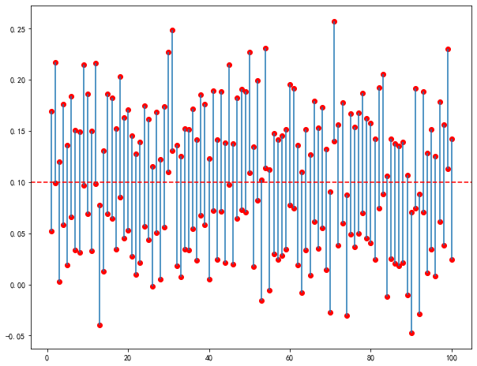
    


> 寻求未知参数$\theta$的置信区间的具体步骤：
> - 1. 寻求一个**枢轴量$W$**，枢轴量的分布不依赖于参数$\theta$以及其它未知参数。枢轴量是关于样本$X_{1}, X_{2}, \cdots, X_{n}$和未知参数$\theta$的函数，即$W =W(X_{1}, X_{2}, \cdots, X_{n};\theta)$，其中$X_{1}, X_{2}, \cdots, X_{n}$为已知。
> - 2. 对于给定的置信水平$1-\alpha$，定出两个常数$a, b$，使$$P\left\{ a <W(X_{1}, X_{2}, \cdots, X_{n};\theta) < b\right \} = 1-\alpha $$则$(a, b)$既是未知参数$\theta$的一个置信水平为$1-\alpha$置信区间。

🧭表1.8：正态总体均值、方差的置信区间与单侧置信限（置信水平为$1-\alpha$）

| |待估计参数|其他参数|枢轴量的分布|置信区间|单侧置信限|
|:---:|:---:|:---:|:---:|:---:|:---:|
|一个正态总体|$\mu$|$\sigma^{2}已知$|$Z=\frac{\bar{X}-\mu}{\sigma / \sqrt{n}} \sim N(0,1)$|$\left(\bar{X} \pm \frac{\sigma}{\sqrt{n}} z_{a / 2}\right)$|$\bar{\mu}=\bar{X}+\frac{\sigma}{\sqrt{n}} z_{\alpha} \quad \underline{\mu}=\bar{X}-\frac{\sigma}{\sqrt{n}} x_{\alpha}$|
|一个正态总体|$\mu$|$\sigma^{2}未知$|$t=\frac{\bar{X}-\mu}{S / \sqrt{n}} \sim t(n-1)$|$\left(\bar{X} \pm \frac{S}{\sqrt{n}} t_{\alpha / 2}(n-1)\right)$|$\bar{\mu}=\bar{X}+\frac{S}{\sqrt{n}} t_{\alpha}(n-1) \quad \underline{\mu}=\bar{X}-\frac{S}{\sqrt{n}} t_{\alpha}(n-1)$|
|一个正态总体|$\sigma^{2}$|$\mu未知$|$\chi^{2} =\frac{(n-1) S^{2}}{\sigma^{2}} \sim \chi^{2}(n-1)$|$\left(\bar{X} \pm \frac{S}{\sqrt{n}} t_{\alpha / 2}(n-1)\right)$|$\overline{\sigma^{2}}=\frac{(n-1) S^{2}}{\chi_{1-\alpha}^{2}(n-1)} \quad \underline{ \sigma^{2}}=\frac{(n-1) S^{2}}{\chi_{\alpha}^{2}(n-1)}$|
|两个正态总体|$\mu_{1}-\mu_{2}$|$\sigma{1}^{2}, \sigma{2}^{2}已知$|$\begin{aligned}Z &=\frac{\bar{X}-\bar{Y}-\left(\mu_{1}-\mu_{2}\right)}{\sqrt{\frac{\sigma_{1}^{2}}{n_{1}}+\frac{\sigma_{2}^{2}}{n_{2}}}} \\& \sim N(0,1)\end{aligned}$|$\left(\bar{X}-\bar{Y} \pm z_{\alpha / 2} \sqrt{\frac{\sigma_{1}^{2}}{n_{1}}+\frac{\sigma_{2}^{2}}{n_{2}}}\right)$|$\begin{aligned}{l}\overline{\mu_{1}-\mu_{2}}=\bar{X}-\bar{Y}+z_{\alpha} \sqrt{\frac{\sigma_{1}^{2}}{n_{1}}+\frac{\sigma_{2}^{2}}{n_{2}}}\\\underline{\mu_{1}-\mu_{2}}=\bar{X}=\bar{Y}-z_{\alpha} \sqrt{\frac{\sigma_{1}^{2}}{n_{1}}+\frac{\sigma_{2}^{2}}{n_{2}}}\end{aligned}$|
|两个正态总体|$\mu_{1}-\mu_{2}$|$\sigma{1}^{2}=\sigma{2}^{2}=\sigma^{2}未知$|$\begin{array}{c}t=\frac{(\bar{X}-\bar{Y})-\left(\mu_{1}-\mu_{2}\right)}{S_{w} \sqrt{\frac{1}{n_{1}}+\frac{1}{n_{2}}}} \\\sim t\left(n_{1}+n_{2}-2\right) \\S_{w}^{2}=\frac{\left(n_{1}-1\right) S_{1}^{2}+\left(n_{2}-1\right) S_{2}^{2}}{n_{1}+n_{2}-2}\end{array}$|$\left(\bar{X}-\bar{Y} \pm t_{\alpha / 2}\left(n_{1}+n_{2}-\right.\right.2)  \left.S_{w} \sqrt{\frac{1}{n_{1}}+\frac{1}{n_{2}}}\right) $|$\begin{array}{l}\overline{\mu_{1}-\mu_{2}}=\bar{X}-\bar{Y} \\\quad+t_{\alpha}\left(n_{1}+n_{2}-2\right) S_{w} \sqrt{\frac{1}{n_{1}}+\frac{1}{n_{2}}} \\\underline{\mu_{1}-\mu_{2}}=\bar{X}-\bar{Y} \\\quad-t_{\alpha}\left(n_{1}+n_{2}-2\right) S_{w} \sqrt{\frac{1}{n_{1}}+\frac{1}{n_{2}}}\end{array}$|
|两个正态总体|$\frac{\sigma{1}^{2}}{\sigma{2}^{2}}$|$\mu_{1}, \mu_{2}未知$|$\begin{aligned}F &=\frac{S_{1}^{2} / S_{2}^{2}}{\sigma_{1}^{2} / \sigma_{2}^{2}} \\& \sim F\left(n_{1}-1, n_{2}-1\right)\end{aligned}$|$\begin{array}{c}\left(\frac{S_{1}^{2}}{S_{2}^{2}} \frac{1}{F_{a / 2}\left(n_{1}-1, n_{2}-1\right)}\right. ,\\\left.\frac{S_{1}^{2}}{S_{2}^{2}} \frac{1}{F_{1-\alpha / 2}\left(n_{1}-1, n_{2}-1\right)}\right)\end{array}$|$\begin{aligned}&\frac{\overline{\sigma_{1}^{2}}}{\sigma_{2}^{2}}= \frac{S_{1}^{2}}{S_{2}^{2}}\frac{1}{F_{1-\alpha / 2}\left(n_{1}-1, n_{2}-1\right)} \\ &\frac{\sigma_{1}^{2}}{\underline{\sigma_{2}^{2}}} = \frac{S_{1}^{2}}{S_{2}^{2}} \frac{1}{F_{a / 2}\left(n_{1}-1, n_{2}-1\right)} \end{aligned}$|

## 1.9 假设检验之基本思想

* 假设检验问题：在总体的分布函数完全未知或只知其形式、但不知其参数的情况下，为了推断总体的某些未知特性，便提出关于总体的假设，例如，假设某糖果车间生产的糖果的均值为$0.5kg$；需要根据已知的样本（例如某一天生产的糖果）对所提出的假设（判断糖果均值是否为$0.5kg$）作出是接受（糖果均值是$0.5kg$）还是拒绝（糖果均值不是$0.5kg$）的决策。假设检验就是做出这一决策的过程。

* 🔥引入：某生产葡萄糖车间，袋装糖的质量是一个随机变量，服从正态分布，在车间正常工作时，袋装糖质量的均值为$0.5kg$，标准差为$0.015kg$，某日车间生产了$9$袋葡糖糖，其袋装质量为：
$$
0.479 \quad 0.506 \quad 0.518 \quad 0.524 \quad 0.498 \quad 0.511 \quad 0.520 \quad 0.515 \quad 0.512
$$
问当日机器是否正常工作？

假设标准差是一意已知量，现在要判断当日机器是否正常工作即判断当日所生产的样本的均值是否等于正常工作时的均值即可，于是，提出如下假设
$$
H_{0}: \mu = 0.5 ; \quad H_{1}:\mu \ne 0.5
$$
假设$H_{0}$表示当日生产的样本的均值等于正常工作时的均值，即机器正常工作，假设$H_{1}$表示当日生产的样本的均值不等于正常工作时的均值，即机器不正常工作。

* 🦊分析：**如何对上述假设做出决策呢？根据引入知，假设是对未知参数做出假设，要通过样本对未知参数做出的假设进行决策，则需要构造一个关于样本和未知参数的函数，上一节区间估计的计算也有和这里相似的一步，没错，就是枢轴量，可以通过枢轴量将样本和未知参数联系起来，不过在假设检验里将枢轴量称为检验统计量**，在本例中构造检验统计量（枢轴量）
$$
\frac{\overline{X} - \mu}{\sigma/\sqrt{n}}
$$
其实，只判断$|\overline{x} - \mu|$的大小也可以做出做出决策，但取上述的检验统计量会使决策的过程更加简便化。

因为，当$H_{0}$为真时，$\frac{\overline{X} - \mu}{\sigma/\sqrt{n}} \sim N(0, 1)$。而判断$|\overline{x} - \mu|$的大小也可以转化为判断$\frac{\overline{x} - \mu}{\sigma/\sqrt{n}}$的大小。适当选定一正数$k$，使当观察值$\overline{x}$满足$\frac{\overline{x} - \mu}{\sigma/\sqrt{n}}\ge k$时就拒绝$H_{0}$，反之，$\frac{\overline{x} - \mu}{\sigma/\sqrt{n}}< k$，就接受$H_{0}$.

&emsp;&emsp;然而，由于做出决策的依据是总体中的样本，所以$H_{0}$为真时也可能做出拒绝$H_{0}$的决策(*即做出的决策是错误的决策，例如，判断假设为假的，但实际假设是真的*)，将犯这种错误的概率记为
$$
P\{当H_{0}为真时拒绝H_{0}\} \quad 或 P_{\theta}\{拒绝H_{0}\}， \theta 为假设的未知参数
$$
希望将犯这类错误控制在一定范围内，即给出一个较小的数$\alpha（0<\alpha<1）$，使犯这类错误的概率不超过$\alpha$，即
$$
P\{当H_{0}为真时拒绝H_{0}\} \le \alpha
$$

&emsp;&emsp;为确定刚才需要选定的正数$k$，允许犯这类错误的最大概率为$\alpha$，将上式取等号
$$
P\{当H_{0}为真时拒绝H_{0}\} = \alpha
$$
则对于例题，即使
$$
P\{\left | \frac{\overline{X} - \mu}{\sigma/\sqrt{n}} \right| \ge k\} = \alpha
$$
由于$\frac{\overline{X} - \mu}{\sigma/\sqrt{n}} \sim N(0, 1)$，所以$k$取$z_{\alpha/2}$便于查表。即
$$
\left | \frac{\overline{X} - \mu}{\sigma/\sqrt{n}} \right| \ge k 时
$$
则拒绝假设$H_{0}$，若
$$
\left | \frac{\overline{X} - \mu}{\sigma/\sqrt{n}} \right| < k 时
$$
则接受假设$H_{0}$，$\alpha$称为**显著性水平**。

python代码（检验`引入`例题）


```python
from scipy.stats import norm 
import numpy as np 

# 显著性水平 alpha = 0.05
# H0: mu = 0.5; H1: mu != 0.5;  
# sigma = 0.015

x = [0.479, 0.506, 0.518, 0.524, 0.498, 0.511, 0.520, 0.515, 0.512]

mu = 0.5
sigma = 0.015 
alpha = 0.05

k = - norm.ppf(loc=0, scale=1, q=alpha/2)
check = np.abs((np.mean(x) - mu)/(sigma/np.sqrt(9)))

if check >= k:
    print("检验统计量{:.2f} >= {:.2f}, 拒绝假设H0, 则mu != 0.5, 机器工作不正常".format(check, k))
else:
    print("检验统计量{:.2f} < {:.2f}, 接受假设H0, 则mu = 0.5, 机器工作正常".format(check, k))
```

    检验统计量1.84 < 1.96, 接受假设H0, 则mu = 0.5, 机器工作正常
    

&emsp;&emsp;对于上述例题，假设的未知参数$\theta$为等于或不等于某一假设常量，形如这类的假设检验称为**双边假设检验**。还有一些其它的问题要求假设的未知参数$\theta$大于等于或小于等于某一假设常量，分别将其称为**左边检验**和**右边检验**

* 左边检验：即检验假设
$$
H_{0}:\theta \le \theta_{0}; \quad H_{1}:\theta > \theta_{0}
$$
* 右边检验：即检验假设
$$
H_{0}:\theta \ge \theta_{0}; \quad H_{1}:\theta < \theta_{0}
$$

* **讨论单边检验的拒绝域**：

🔥(右边检验)设总体$X \sim N(\mu, \sigma^{2})$，$\mu {未知}, \sigma {已知}$，$X_{1}, X_{2}, \cdots, X_{n}$是来自总体$X$的样本，给定显著性书平$\alpha$，求检验问题
$$
H_{0}:\mu \le \mu_{0}; \quad H_{1}:\mu > \mu_{0}
$$
的拒绝域（默认$H_{0}$）。

🦊解：
求拒绝域即寻找满足$H_{1}$假设的区间，因$H_{0}$中的$\mu$都比$H_{1}$中的$\mu$要小，当拒绝$H_{0}$时，观察值$\overline{x}$会向假设$H_{1}$靠拢，即观察值$\overline{x}$会偏大，因此，拒绝域的形式为
$$
\overline{x} \ge k (k为适当正数)
$$
接下来即确定正数$k$
$$
\begin{aligned}
P\left\{ H_{0}为真时拒绝H_{0}\right\} &= P\left\{\overline{X} \ge k \right \} \\
& = P\left\{ \frac{\overline{X} - \mu_{0}}{\sigma/\sqrt{n}} \ge \frac{k - \mu_{0}}{\sigma/\sqrt{n}}\right\} \\ 
&\le P\left\{ \frac{\overline{X} - \mu}{\sigma/\sqrt{n}} \ge \frac{k - \mu_{0}}{\sigma/\sqrt{n}}\right\}
\end{aligned}
$$
上式不等号成立是由于$\mu \le \mu_{0}, \frac{\overline{X} - \mu}{\sigma/\sqrt{n}} \ge \frac{k - \mu_{0}}{\sigma/\sqrt{n}}$，事件$\left\{ \frac{\overline{X} - \mu_{0}}{\sigma/\sqrt{n}} \ge \frac{k - \mu_{0}}{\sigma/\sqrt{n}}\right \} \subset \left\{ \frac{\overline{X} - \mu}{\sigma/\sqrt{n}} \ge \frac{k - \mu_{0}}{\sigma/\sqrt{n}}\right \}$，要控制$P\{H_{0}为真时拒绝H_{0}\} \le \alpha$，只需令
$$
P\left\{ \frac{\overline{X} - \mu}{\sigma/\sqrt{n}} \ge \frac{k - \mu_{0}}{\sigma/\sqrt{n}}\right\} = \alpha
$$
由于 $\frac{\overline{X} - \mu}{\sigma/\sqrt{n}} \sim N(0, 1)$，则令$\frac{k - \mu_{0}}{\sigma/\sqrt{n}} = z_{\alpha}$分位点。得检验问题得拒绝域为
$$
\overline{x} \ge k =\sigma/\sqrt{n}z_{\alpha} + \mu_{0} \\
$$
即
$$
\frac{\overline{x} - \mu_{0}}{\sigma/\sqrt{n}} \ge z_{\alpha}
$$

🔥（左边检验）设总体$X \sim N(\mu, \sigma^{2})$，$\mu {未知}, \sigma {已知}$，$X_{1}, X_{2}, \cdots, X_{n}$是来自总体$X$的样本，给定显著性书平$\alpha$，求检验问题
$$
H_{0}:\mu \ge \mu_{0}; \quad H_{1}:\mu < \mu_{0}
$$
的拒绝域（默认$H_{0}$）。

🦊解：

拒绝$H_{0}$时，均值$\mu$向$H_{1}$靠拢，即$\mu$的无偏估计$\overline{x}$较小，取一适当正数$k$，$H_{0}$的拒绝域形式为：
$$
\overline{x} \le k
$$

当$H_{0}$为真时
$$
\frac{\overline{X}- \mu_{0}}{\sigma/\sqrt{n}} \sim N(0, 1)
$$
确定$k$的取值
$$
\begin{aligned}
P\left\{ H_{0}为真时拒绝H_{0}\right\} &= P\left\{\overline{x} \le k\right\} \\
& = P\left\{\frac{\overline{X}- \mu_{0}}{\sigma/\sqrt{n}} \le \frac{\overline{k}- \mu_{0}}{\sigma/\sqrt{n}}\right\} \\
& \le P\left\{\frac{\overline{X}- \mu}{\sigma/\sqrt{n}} \le \frac{\overline{k}- \mu_{0}}{\sigma/\sqrt{n}}\right\}, (H_{0}为真时，\mu \ge \mu_{0}) 
\end{aligned}
$$

取
$$
P\left\{\frac{\overline{X}- \mu}{\sigma/\sqrt{n}} \le \frac{\overline{k}- \mu_{0}}{\sigma/\sqrt{n}}\right\} = \alpha
$$
则 
$$
\begin{aligned}
&\frac{\overline{k}- \mu_{0}}{\sigma/\sqrt{n}} = -z_{\alpha} \\
& k = -z_{\alpha}\sigma/\sqrt{n} + - \mu_{0}
\end{aligned}
$$
得拒绝域
$$
\begin{aligned}
&\overline{x} \le k= -z_{\alpha}\sigma/\sqrt{n} +  \mu_{0} \\
&\frac{\overline{x}- \mu_{0}}{\sigma/\sqrt{n}} \le -z_{\alpha}
\end{aligned}
$$

> 💡讨论：在右边检验中，为什么令$\frac{k - \mu_{0}}{\sigma/\sqrt{n}} = z_{\alpha}$，而在左边检验中令$\frac{k - \mu_{0}}{\sigma/\sqrt{n}} = -z_{\alpha}$？      
> 因为(左边检验)$$P\left\{ \frac{\overline{X} - \mu}{\sigma/\sqrt{n}} \le \frac{k - \mu_{0}}{\sigma/\sqrt{n}}\right\} = \int_{-\infty}^{\frac{k - \mu_{0}}{\sigma/\sqrt{n}}}f(x)dx, \quad (f(x)为x的概率密度函数)$$要使，$$P\left\{ \frac{\overline{X} - \mu}{\sigma/\sqrt{n}} \le \frac{k - \mu_{0}}{\sigma/\sqrt{n}}\right\}=\alpha$$则取$$\frac{k - \mu_{0}}{\sigma/\sqrt{n}} = -z_{\alpha}$$    
>同理(右边检验)$$P\left\{ \frac{\overline{X} - \mu}{\sigma/\sqrt{n}} \ge \frac{k - \mu_{0}}{\sigma/\sqrt{n}}\right\} = \int_{\frac{k - \mu_{0}}{\sigma/\sqrt{n}}}^{\infty}f(x)dx, \quad (f(x)为x的概率密度函数)$$要使，$$P\left\{ \frac{\overline{X} - \mu}{\sigma/\sqrt{n}} \ge \frac{k - \mu_{0}}{\sigma/\sqrt{n}}\right\}=\alpha$$则取$$\frac{k - \mu_{0}}{\sigma/\sqrt{n}} = z_{\alpha}$$

> 这里只讨论了犯第一类错误得情况（即H_{0}为真时拒绝H_{0}），犯第二类错误（即H_{0}不真时接受H_{0}）情况的分析过程与第一类相似，掌握一种即可，这种只限制第一类错误概率，而不考虑第二类错误概率的假设检验称为**显著性检验（显著性水平为$\alpha$）**。

🔥例子：公司购买了$5$批牛奶，现公司怀疑牛奶掺了水，已知天然牛奶的冰点温度服从正太分布，均值为$-0.545$，标准差为$0.008$，牛奶掺水可视牛奶的冰点温度升高至近似水的冰点温度，测得公司购买的$5$批牛奶的冰点温度均值$\overline{x}=-0.535$，问牛奶是否掺了水？取$\alpha=0.05$.

🦊解:
1. 作出假设
$$
H_{0}: \mu \le \mu_{0}=-0.545; \quad H_{1}: \mu > \mu_{0}=-0.545
$$
问题即是判断假设$H_{0}$是否为真，通过假设可知该问题是**右边检验**问题

2. 找拒绝域
当拒绝$H_{0}$时，$\mu$大于$\mu_{0}$，因此，拒绝域的形式为
$$ \overline{x} \ge k$$

3. 确定常数$k$
$$
\begin{aligned}
P\left\{H_{0}为真时拒绝H_{0}\right\} &= P\left\{ \overline{x} \ge k \right\} \\
& = P\{ \frac{\overline{X} - \mu_{0}}{\sigma/\sqrt{n}} \ge \frac{k - \mu_{0}}{\sigma/\sqrt{n}}\} \\
&\le P\{ \frac{\overline{X} - \mu}{\sigma/\sqrt{n}} \ge \frac{k - \mu_{0}}{\sigma/\sqrt{n}}\}  \quad  (\mu \le \mu_{0})\\
&= \alpha
\end{aligned}
$$
4. 取$\frac{k - \mu_{0}}{\sigma/\sqrt{n}}=z_{\alpha}$，得
$$
k = \sigma/\sqrt{n}z_{\alpha} + \mu_{0}
$$
即
$$
\begin{aligned}
&\overline{x} \ge \sigma/\sqrt{n}z_{\alpha} + \mu_{0} \\
&\frac{\overline{x} - \mu_{0}}{\sigma/\sqrt{n}} \ge z_{\alpha}
\end{aligned}
$$
时拒绝$H_{0}$

python代码（求解例题）


```python
from scipy.stats import norm 
import numpy as np

n = 5
alpha = 0.05 
mu, sigma = -0.545, 0.008
x_mean = -0.535

z_alpha = - norm.ppf(loc=0, scale=1, q=0.05)
k = (sigma/np.sqrt(n))*z_alpha + mu 

if x_mean >= k:
    print("检验统计量{:.4f} >= {:.4f}, 拒绝假设H0, 即牛奶掺了水".format(x_mean, k))
else:
    print("检验统计量{:.4f} < {:.4f}, 接受假设H0, 即牛奶未掺水".format(x_mean, k))
```

    检验统计量-0.5350 >= -0.5391, 拒绝假设H0, 即牛奶掺了水
    

## 1.10 假设检验之正态总体参数的假设检验

* 单个总体$N(0, 1)$均值$\mu$的检验

&emsp;&emsp;(1) **$\sigma^{2}$已知，关于$\mu$的检验（$Z$检验）**：上面已经讨论过这种情况，这种情况下，检验统计量为$Z = \frac{\overline{X}-\mu_{0}}{\sigma/\sqrt{n}}$

&emsp;&emsp;(2) **$\sigma^{2}$未知，关于$\mu$的检验（$t$检验）**：设总体$X\sim N(\mu, \sigma^{2})$，$\mu, \sigma^{2}$未知，求检验问题
$$
H_{0}: \mu =\mu_{0}; \quad H_{1}:\mu \ne \mu_{0}
$$
的拒绝域(显著性水平为$\alpha$)

&emsp;&emsp;🦊：这时，令检验统计量为
$$
\frac{\overline{X}-\mu_{0}}{S/\sqrt{n}}  , \quad (S为样本标准差)
$$
根据之前学的定理知，$H_{0}$为真时：
$$
\frac{\overline{X}-\mu_{0}}{S/\sqrt{n}} \sim t(n-1)
$$
选定适当正数$k$
$$
\begin{aligned}
P\left\{ H_{0}为真时拒绝H_{0}\right\} &=  P\left\{ \left| \frac{\overline{X}-\mu_{0}}{S/\sqrt{n}} \right| \ge k \right\}
&= \alpha
\end{aligned}
$$
取$k = t_{\alpha/2}(n-1)$
则拒绝域为
$$
\left| \frac{\overline{X}-\mu_{0}}{S/\sqrt{n}} \right | \ge k = t_{\alpha/2}(n-1)
$$
这类检验方法称为 **$t$检验法**。

🔥例子：某元件寿命$X（单位：h）$服从正态分布$N(\mu, \sigma^{2})，\mu, \sigma^{2}$未知，现测得16只元件寿命如下:
$$
\begin{aligned}
& 159 \quad 280 \quad 101 \quad 212 \quad 224 \quad 379 \quad 179 \quad 264 \\
& 222 \quad 362 \quad 168 \quad 250 \quad 149 \quad 260 \quad 485 \quad 170
\end{aligned}
$$
问元件的平均寿命是否大于$225h$（取$\alpha = 0.05$）?

🦊解：

1. 作出假设
$$
H_{0}: \mu \le \mu_{0} = 225; \quad H_{1}: \mu > \mu_{0} = 225
$$
拒绝$H_{0}$时，观察值$\overline{x}$较大，取一适当正数$k$，拒绝域的形式为
$$
\overline{x} \ge k
$$
2. 确定正数$k$
$$
\begin{aligned}
P\left\{H_{0}为真时拒绝H_{0}\right\} &= P\left\{\overline{X} \ge k\right\} \\
&= P\left\{\frac{\overline{X} - \mu_{0}}{S/\sqrt{n}} \ge \frac{k- \mu_{0}}{S/\sqrt{n}}\right\} \\
&\le P\left\{\frac{\overline{X} - \mu}{S/\sqrt{n}} \ge \frac{k- \mu_{0}}{S/\sqrt{n}}\right\}, \quad (\mu \le \mu_{0}) \\
&= \alpha
\end{aligned}
$$
令$\frac{k- \mu_{0}}{S/\sqrt{n}} = t_{\alpha}(n-1)$

4. 则拒绝域为
$$
\overline{x} \ge k = t_{\alpha}(n-1)S/\sqrt{n} + \mu_{0}
$$
即
$$
\frac{\overline{x} - \mu_{0}}{S/\sqrt{n}} \ge t_{\alpha}(n-1)
$$
若满足上列不等式时，拒绝$H_{0}$，接受$H_{1}$，即元件的平均寿命大于$225h$，反之，则接受$H_{0}$，拒绝$H_{1}$，即元件的平均寿命小于$225h$。


python代码(求解上题)


```python
from scipy.stats import t
import numpy as np

# H0: mu <= 225; H1: mu > 225,  mu0 = 225, alpha=0.05
alpha = 0.05
n = 16
mu0 = 225
x = [159, 280, 101, 212, 224, 379, 179, 264, 222, 362, 168, 250, 149, 260, 485, 170]
x_mean = np.mean(x)
S = np.sqrt(np.sum(np.square(x - x_mean))/(n-1))

check = (x_mean - mu0)/(S/np.sqrt(n))
t_alpha = - t.ppf(df=n-1, q=alpha)

if check >= t_alpha:
    print("检验统计量 : {:.4f} >= {:.4f} (t_alpha(n-1)), 拒绝H0, 接受H1, 即元件平均寿命大于 225 h".format(check, t_alpha))
else:
    print("检验统计量 : {:.4f} < {:.4f} (t_alpha(n-1)), 接受H0, 拒绝H1, 即元件平均寿命小于 225 h".format(check, t_alpha))
```

    检验统计量 : 0.6685 < 1.7531 (t_alpha(n-1)), 接受H0, 拒绝H1, 即元件平均寿命小于 225 h
    

* 两个正态总体均值差的检验（$t$检验）

设$X_{1}, X_{2}, \cdots, X_{n1}$是来自正态总体$N(\mu_{1}, \sigma_{1}^{2})$的样本，$Y_{1}, Y_{2}, \cdots, Y_{n2}$是来自正态总体$N(\mu_{2}, \sigma_{2}^{2})$的样本，设两样本独立，样本均值和方差分别为$\overline{X}, \overline{Y}, S_{1}^{2}, S_{2}^{2}$，求检验问题
$$
H_{0}:\mu_{1} - \mu_{2} = \delta; \quad H_{1}:\mu_{1} - \mu_{2} \ne \delta
$$
$\delta$为常数，显著性水平取$\alpha$

&emsp;&emsp;**（1）$\mu_{1}, \mu_{2}$未知, $\sigma_{1}^{2} = \sigma_{2}^{2} = \sigma^{2}$未知**，取检验统计量
$$
t = \frac{\overline{X} - \overline{Y} - \delta}{S_{w}\sqrt{\frac{1}{n1}+\frac{1}{n2}}}, \quad S_{w}^{2} = \frac{(n1-1)S_{1}^{2}+(n2-1)S_{2}^{2}}{n1+n2-2} , \quad S_{w} = \sqrt{S_{w}^{2}}
$$
拒绝域为
$$
\frac{\left|\overline{x} - \overline{y} - \delta \right |}{s_{w}\sqrt{\frac{1}{n1}+\frac{1}{n2}}} \ge t_{\alpha/2}(n1+n2-2)
$$
&emsp;&emsp;**（2）$\mu_{1}, \mu_{2}$未知, $\sigma_{1}^{2}, \sigma_{2}^{2}$已知**，取检验统计量
$$
Z = \frac{\overline{X} - \overline{Y} - \delta}{\sqrt{\frac{\sigma_{1}^{2}}{n1} + \frac{\sigma_{2}^{2}}{n1}}}
$$
拒绝域为
$$
\frac{\left|\overline{x} - \overline{y} - \delta\right|}{\sqrt{\frac{\sigma_{1}^{2}}{n1} + \frac{\sigma_{2}^{2}}{n1}}} \ge z_{\alpha/2}
$$


* 正态总体方差的假设检验（单个总体的情况）

&emsp;&emsp;设总体$X \sim N(\mu, \sigma^{2})，\mu, \sigma^{2}$均未知，$X_{1}, X_{2}, \cdots, X_{n}$，是来自$X$的样本，要求检验假设
$$
H_{0}:\sigma^{2}=\sigma_{0}^{2}; \quad H_{1}=\sigma^{2} \ne \sigma_{0}^{2}
$$
$\sigma_{0}^{2}$为已知常数

由于$S^{2}$是$\sigma^{2}$的无偏估计，当$H_{0}$为真时，观察值$s^{2}$与$\sigma^{2}$应该在$1$附近摆动，而不应过分大于或小于$1$，由前面学习的定理知，当$H_{0}$为真时
$$
\frac{(n-1)S^{2}}{\sigma_{0}^{2}} \sim \chi^{2}(n-1)
$$
取检验统计量
$$
\chi^{2} = \frac{(n-1)S^{2}}{\sigma_{0}^{2}}
$$
如上所说，上述问题的拒绝域具有以下的形式：
$$
\frac{(n-1)S^{2}}{\sigma_{0}^{2}} \le k_{1} \quad 或 \frac{(n-1)S^{2}}{\sigma_{0}^{2}} \ge k_{2}
$$
其中$k_{1}, k_{2}$的值由下式确定
$$
\begin{aligned}
&P\left\{H_{0}为真时拒绝H_{0}\right\} \\
&P\left\{(\frac{(n-1)S^{2}}{\sigma_{0}^{2}} \le k_{1}) \cup  (\frac{(n-1)S^{2}}{\sigma_{0}^{2}} \ge k_{2}) \right\}
& = \alpha
\end{aligned}
$$
为方便计算，取
$$
P\left\{\frac{(n-1)S^{2}}{\sigma_{0}^{2}} \le k_{1}\right\} =\frac{\alpha}{2}  P\left\{ \frac{(n-1)S^{2}}{\sigma_{0}^{2}} \ge k_{2}\right\}=\frac{\alpha}{2}
$$
得$k_{1}=\chi_{1-\alpha/2}^{2}(n-1), k_{2}=\chi_{\alpha/2}^{2}(n-1)\quad (这里因为\chi^{2}分布的图像不是对称的)$ ，于是得拒绝域为
$$
\frac{(n-1)S^{2}}{\sigma_{0}^{2}} \le \chi_{1-\alpha/2}^{2}(n-1) {或} \frac{(n-1)S^{2}}{\sigma_{0}^{2}} \ge \chi_{\alpha/2}^{2}(n-1)
$$

📕**表1.10 正态总体均值、方差的检验法（显著性水平为$\alpha$）**

<style>
table
{
    margin: auto;
}
</style>

| |原假设$H_{0}$|检验统计量|备择假设$H_{1}$|拒绝域|
|:--:|:--:|:--:|:--:|:--:|
|$1$|$\begin{aligned} &\mu \leqslant \mu_{0} \\ &\mu \geqslant \mu_{0} \\ &\mu=\mu_{0}\\ &\left(\sigma^{2}\right. 已知)\end{aligned}$|$ Z=\frac{\bar{X}-\mu_{0}}{\sigma / \sqrt{n}}$|$\begin{aligned} &\mu>\mu_{0} \\ & \mu<\mu_{0} \\ & \mu\ne\mu_{0}\end{aligned}$|$\begin{aligned} &z\ge z_{\alpha} \\ &z \le -z_{\alpha} \\ & \|z\| \ge z_{\alpha / 2}\end{aligned}$|
|$2$|$\begin{aligned}&\mu \leqslant \mu_{0} \\ &\mu \geqslant \mu_{0} \\ &\mu=\mu_{0}\\ &\left(\sigma^{2}\right. 未知)\end{aligned}$|$\begin{aligned} t =\frac{\overline{X}-\mu_{0}}{S/\sqrt{n}} \end{aligned}$|$\begin{aligned} &\mu>\mu_{0} \\ & \mu<\mu_{0} \\ & \mu\ne\mu_{0}\end{aligned}$|$\begin{aligned}& t \geqslant t_{\alpha}(n-1) \\&t \leqslant-t_{\alpha}(n-1) \\& \|t\| \geqslant t_{\alpha / 2}(n-1) \\ \end{aligned}$|
|$3$|$\begin{aligned} &\mu_{1}-\mu_{2}\le \delta \\&\mu_{1}-\mu_{2}\ge \delta \\&\mu_{1}-\mu_{2}= \delta\\&(\sigma_{1}^{2},\sigma_{2}^{2}已知) \end{aligned}$|$\begin{aligned}Z=\frac{\overline{X}-\overline{Y}-\delta}{\sqrt{\frac{\sigma_{1}^{2}}{n1}+\frac{\sigma_{1}^{2}}{n2}}} \end{aligned}$|$\begin{aligned}&\mu_{1}-\mu_{2}> \delta \\&\mu_{1}-\mu_{2}< \delta \\&\mu_{1}-\mu_{2}\ne \delta  \end{aligned}$|$\begin{aligned} &z\ge z_{\alpha} \\ & z\le -z_{\alpha}\\ & \| z\| \ge z_{\alpha/2}\end{aligned}$|
|$4$|$\begin{aligned}&\mu_{1}-\mu_{2}\le \delta \\&\mu_{1}-\mu_{2}\ge \delta \\&\mu_{1}-\mu_{2}= \delta\\&(\sigma_{1}^{2}=\sigma_{2}^{2}=\sigma^{2}未知) \end{aligned}$|$\begin{aligned}&t=\frac{\overline{X}-\overline{Y}-\delta}{S_{w}\sqrt{\frac{1}{n1}+\frac{1}{n2}}} \\ & S_{w}^{2}=\frac{(n1-1)S_{1}^{2}+(n2-1)S_{2}^{2}}{n1+n2-2} \end{aligned}$|$\begin{aligned}&\mu_{1}-\mu_{2}> \delta \\&\mu_{1}-\mu_{2}< \delta \\&\mu_{1}-\mu_{2}\ne \delta \end{aligned}$|$\begin{aligned}&t\ge t_{\alpha}(n1+n2-2) \\&t \le -t_{\alpha}(n1+n2-2)\\&\|t\| \ge t_{\alpha/2}(n1+n2-2) \end{aligned}$|
|$5$|$\begin{aligned}&\sigma_{1}^{2}\le \sigma_{2}^{2} \\&\sigma_{1}^{2}\ge \sigma_{2}^{2}\\ &\sigma_{1}^{2}= \sigma_{2}^{2}\\ &(\mu 未知) \end{aligned}$|$\begin{aligned}\chi^{2}=\frac{(n-1)S^{2}}{\sigma_{0}^{2}} \end{aligned}$|$\begin{aligned}&\sigma_{1}^{2}>\sigma_{2}^{2} \\&\sigma_{1}^{2}< \sigma_{2}^{2}\\ &\sigma_{1}^{2}\ne \sigma_{2}^{2} \end{aligned}$|$\begin{aligned}&\chi^{2}\ge \chi_{\alpha}^{2}(n-1) \\&\chi^{2}\le \chi_{1-\alpha}^{2}(n-1) \\&\chi^{2}\ge \chi_{\alpha/2}^{2}(n-1)或\\&\chi^{2}\le \chi_{1-\alpha/2}^{2}(n-1) \end{aligned}$|
|$6$|$\begin{aligned}&\sigma_{1}^{2}\le \sigma_{2}^{2} \\&\sigma_{1}^{2}\ge \sigma_{2}^{2}\\ &\sigma_{1}^{2}= \sigma_{2}^{2}\\ &(\mu_{1},\mu_{2}未知)\end{aligned}$|$\begin{aligned}F=\frac{S_{1}^{2}}{S_{2}^{2}} \end{aligned}$|$\begin{aligned}&\sigma_{1}^{2}>\sigma_{2}^{2} \\&\sigma_{1}^{2}< \sigma_{2}^{2}\\ &\sigma_{1}^{2}\ne \sigma_{2}^{2} \end{aligned}$|$\begin{aligned}&F\ge F_{\alpha}(n1-1, n2-1) \\&F\le F_{1-\alpha}(n1-1, n2-1) \\ & F\ge F_{\alpha/2}(n1-1, n2-1)或\\&F\le F_{1-\alpha/2}(n1-1, n2-1)\end{aligned}$|
|$7$|$\begin{aligned}&\mu_{D}\le 0\\&\mu_{D}\ge 0 \\&\mu_{D}= 0\\&(成对数据)\end{aligned}$|$\begin{aligned}t=\frac{\overline{D}-0}{S_{D}/\sqrt{n}} \end{aligned}$|$\begin{aligned}&\mu_{D}> 0\\&\mu_{D}< 0 \\&\mu_{D}\ne 0 \end{aligned}$|$\begin{aligned}&t\ge t_{\alpha}(n-1) \\&t\le -t_{\alpha}(n-1)\\&\|t\|\ge t_{\alpha/2}(n-1) \end{aligned}$|

> 置信区间与假设检验之间的关系, 假设置信区间$(\underline{\theta}, \overline{\theta})$，显著性水平为$\alpha$
> - 1. 检验问题$$H_{0}: \theta=\theta_{0};\quad H_{0}: \theta\ne \theta_{0}$$ 若检验统计量在区间$(\underline{\theta}, \overline{\theta})$内，则接受$H_{0}$，否则，拒绝$H_{0}$。
> - 2. 检验问题$$H_{0}: \theta\ge \theta_{0};\quad H_{0}: \theta < \theta_{0}$$ 若检验统计量在区间$(-\infty, \overline{\theta})$内，则接受$H_{0}$，否则，拒绝$H_{0}$。
> - 3. 检验问题$$H_{0}: \theta\le \theta_{0};\quad H_{0}: \theta > \theta_{0}$$ 若检验统计量在区间$(\underline{\theta}, \infty)$内，则接受$H_{0}$，否则，拒绝$H_{0}$。

## 1.11 假设检验之似然比检验与Bootstrap方法

* 似然比检验：

&emsp;&emsp;定义（广义似然比）：设  $x_{1}, \cdots, x_{n}$  为来自密度函数为  $p(x ; \theta), \theta \in \Theta$  的样本，考虑检验问题
 $$
 H_{0}: \theta \in \Theta_{0} \quad v s \quad H_{1}: \theta \in \Theta_{1}=\Theta-\Theta_{0}
 $$  
 令
 $$\Lambda\left(x_{1}, \cdots, x_{n}\right)=\frac{\sup _{\theta \in \Theta} p\left(x_{1}, \cdots, x_{n} ; \theta\right)}{\sup _{\theta \in \Theta_{0}} p\left(x_{1}, \cdots, x_{n} ; \theta\right)}  \quad \sup 表示最小上界$$
那么称它为假设检验问题的广义似然比。

&emsp;&emsp;由上式可以看出，广义似然比定义下的分子分母都有一个上确界（$\sup$）的符号，仔细观察，分子就相当于在**全参数空间**下取联合概率密度的最大值，分母相当于在**原假设参数空间**下取联合概率密度的 最大值，所以这个比值就是两个极大似然估计的比值。直观来看，如果原假设是正确的，那么参数 应该会落在原假设的参数空间内，换句话说，分子的最大值对应的参数应该落在  $\Theta_{0}$  ，所以这个 比值就不会太大。但是，反过来说，如果原假设应该被拒绝，那么参数就有很大可能落在拒绝域， 那么全参数空间的最大值就会在  $\theta \in \Theta_{1}$  中取到，那么这个时候比值就会变大。所以可以看出 来，拒绝域顺理成章的应该设置为
$$
W=\left\{\Lambda\left(x_{1}, \cdots, x_{n}\right) \geq c\right\}
$$
其中临界值  $c$  要满足  $P_{\theta}\left(\Lambda\left(x_{1}, \cdots, x_{n}\right) \geq c\right) \leq \alpha, \forall \theta \in \Theta_{0}$. 

>💡 $2ln \Lambda (\left(x_{1}, \cdots, x_{n}\right))$服从$\chi^{2}$分布，自由度为独立参数的个数（需要检验参数的维度）

🔥例子:假设观察某种疾病的发生情况:  $n=100$  人中发生了  $k=10$  个事件。假定数据服从二项分布, 理论已知人群中每个人发生该事件的概率为  $\pi_{0}=0.2$  。试对该假设做似然比假设检验（显著性水平$\alpha=0.05$）?

🦊解：
1. 作出假设
$$
H_{0}: \pi = \pi_{0}=0.2; \quad H_{1}: \pi\ne \pi_{0}=0.2
$$
2. 写出参数空间
$$
\Theta_{0}=\{\pi_{0}\}, \quad \Theta = \{\pi, \pi \in \textbf{R}\}
$$
3. 计算全参数空间（$\Theta$）下的极大似然估计
$$
\begin{aligned}
&f(x) = C_{n}^{k}p^{k}(1-p)^{n-k}\\
&ln f(x) = lnC_{n}^{k} + lnp^{k}+ ln(1-p)^{n-k}\\
&令 \frac{d}{dp}ln f(x) = 0 \\
&解得 \\
&p = \frac{k}{n}
\end{aligned}
$$
4. 在$H_{0}$假设下，$p = 0.2$，计算$2ln\frac{\sup_{\theta\in\Theta }p(x_{1}, x_{2}, \cdots, x_{n})}{\sup_{\theta\in\Theta_{0}} p(x_{1}, x_{2}, \cdots, x_{n})}$，为
$$
check = 2ln\frac{k/n}{0.2}
$$
5. 因为
$$2ln\frac{\sup_{\theta\in\Theta }p(x_{1}, x_{2}, \cdots, x_{n})}{\sup_{\theta\in\Theta_{0}} p(x_{1}, x_{2}, \cdots, x_{n})}\sim \chi^{2}(1)$$
6. 因此，拒绝域为
$$
check \ge \chi_{\alpha/2}(1) 或 check \le \chi_{1 - \alpha/2}(1)
$$
7. 判断$check$值是否在拒绝域，若在，则拒绝$H_{0}$，否则接受$H_{0}$.

python代码（求解上题）


```python
import numpy as np 
from scipy.stats import chi2 

p0 = 0.2
n = 100
k = 10
alpha = 0.05
check = 2 * np.log((k/n)/p0)
left = chi2.ppf(df=1, q=alpha/2)
right = chi2.ppf(df=1, q=(1-alpha/2))
print("似然比统计量为:{}".format(check))
print("拒绝域为(0, {})或({}, oo)".format(left, right))
if check <= left or right >= right:
    print("拒绝假设H0, 即每个人发生该事件得概率不为0.2")
```

    似然比统计量为:-1.3862943611198906
    拒绝域为(0, 0.0009820691171752555)或(5.023886187314888, oo)
    拒绝假设H0, 即每个人发生该事件得概率不为0.2
    

* Bootstrap方法：在上述方法中，如果分布的自由度难以确定，这个方法将难以进行下去。换句话说，当碰到某个统计量的分布难以确定或者未知的时候如何做假设检验呢？Bootstrap方法就是在这一背景下产生的。设总体得分布$F$未知，但已经有一个容量为$n$得来自分布$F$的数据样本，自这一样本按放回抽样的方法抽取一个容量为$n$的样本，这种样本称为**bootstrap**样本或自助样本，相继地、独立地自原始样本中抽取很多个bootstrap样本，利用这些样本对总体$F$进行统计推断，这种方法称为**非参数bootstrap方法**。

> bootstrap置信区间：设$X=X_{1}, X_{2}, \cdots, X_{n}$是来自总体$F$容量为$n$的样本，$x=x_{1}, x_{2}, \cdots, x_{n}$是一个已知的样本值，$F$中含有未知参数$\theta$，$\hat{\theta}=\hat{\theta}(X_{1}, X_{2}, \cdots, X_{n})$是$\theta$的估计量，$\theta$的置信水平为$1-\alpha$（显著性水平为$\alpha$）的置信区间为:相继地、独立地从样本$x=x_{1}, x_{2}, \cdots, x_{n}$中抽出B个容量为n的bootstrap样本，对于每个样本求出的$\theta$的bootstrap估计：$\hat{\theta_{1}}, \hat{\theta_{2}}, \cdots, \hat{\theta_{n}}$,将他们从小到大排序：$$\hat{\theta_{(1)}}<\hat{\theta_{(2)}}< \cdots< \hat{\theta_{(n)}}$$ 置信区间取$$(\hat{\theta}(k_{1}), \hat{\theta}(k_{2}))$$其中，$k_{1}=[B \frac{\alpha}{2}], k_{2}=[B (1-\frac{\alpha}{2})], \quad ([ \cdot]表示取整)$

🔥例子：某工厂生产以发光产品，发光产品的发光时长服从正态分布  $N\left(\mu, \sigma^{2}\right)$  ，产品的发光时长设定均值为  $250 \mathrm{~h}$  。现在从一批产品中抽取 $10$ 个产品，测得发光时长为（单位 为: $ h  $) :

$$248.8, \quad 249.2, \quad 250.7, \quad 251.2, \quad 248.0, \quad 253.0, \quad 248.9, \quad 250.2, \quad 251.2, \quad 249.2$$

问该厂的发光产品是否符合要求（显著性水平$\alpha = 0.05$）?

🦊解：该问题为左边检验，单侧置信区间的形式应为$(a, +oo)$

1. 作出假设
$$
H_{0}:\mu \ge \mu_{0}=250; \quad H_{1}:\mu < \mu_{0}=250
$$
2. 确定检验统计量$\overline{x}$
3. 进行$B$次bootstrap采样并计算参数$\mu_{i}, (i=1, 2, \cdots, B)$后从小到大排序$\mu_{(1)}<\mu_{(2)}<\cdots<\mu_{(B)}$
4. 取$\alpha/2, 1-\alpha/2$分位点，得到置信区间$(\hat{\theta}(k_{1}), \hat{\theta}(k_{2}))（这是双边检验的置信区间，这里须修改为单边）$, $k_{1}=[B \frac{\alpha}{2}], k_{2}=[B (1-\frac{\alpha}{2})], \quad ([ \cdot]表示取整)$
5. 判断检验统计量是否在置信区间内，若在接受$h_{0}$，否则，拒绝$H_{0}$.


python代码(计算上题)


```python
import numpy as np

# 例题为左边检验，单侧置信区间为（k1, oo）,拒绝域为(-oo, k1]

mu0 = 250
alpha = 0.05
B = 1000
x = [248.8, 249.2, 250.7, 251.2, 248.0, 253.0, 248.9, 250.2, 251.2, 249.2]
x_mean= np.mean(x)
params = []
for i in range(B):
    x_resample = np.random.choice(x, len(x), replace=True)
    params.append(np.mean(x_resample))

params = np.sort(params)

k1 = int(B*alpha)
left = params[k1-1]
# right = np.percentile(params, (1-alpha)*100-1)
print("检验统计量为:{}".format(x_mean))
print("拒绝域为:(-oo, {}]".format(left))
if x_mean > left:
    print("接受H0, 该厂的发光产品符合要求")
else:
    print("拒绝H0, 该厂的发光产品不符合要求")
```

    检验统计量为:250.03999999999996
    拒绝域为:(-oo, 249.32000000000002]
    接受H0, 该厂的发光产品符合要求
    
