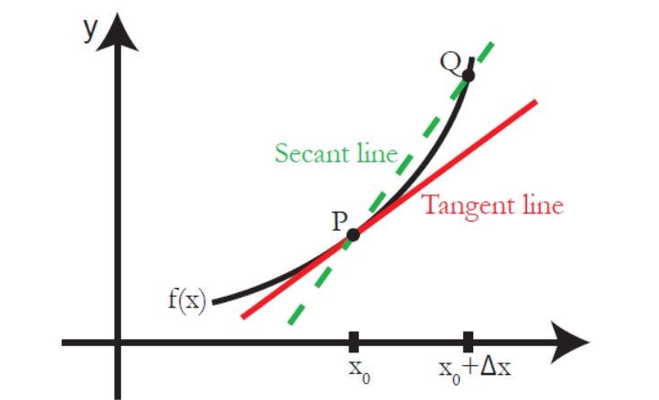

# 导数和微分

## 导数的定义

#### 几何直观解释：

图中的绿色虚线代表了函数 f(x) 的一条割线（secant line），即经过函数图像任意两个不重复的点的直线。直观的解释就是当这两个点（P 和 Q ）无限接近的时候，这条割线就和曲线f(x) 只有一个交点，即在点 P 的切线，也被称为点 P 的导数。

#### 代数定义：

函数$f(x)$ 在点$ x = x_0$ 

## 参考

1、[MIT—单变量微积分笔记01 导数、斜率、速率和变化率 - 知乎 (zhihu.com)](https://zhuanlan.zhihu.com/p/46688904)
