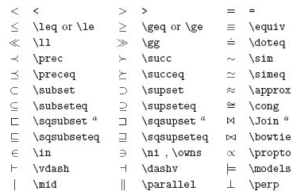

# $R2（R-Square）$ 预测评价指标

`机器学习`  `预测评价指标`

## 预备知识

搞清楚R2_score计算之前，我们还需要了解几个统计学概念。

若用 $y_i$ 表示真实值，用 $\bar{y}$ 表示真实观测值的平均值，用 $\hat{y_i}$ 表示预测值,则：

1、 ESS

英文全称：Explained Sum of Squares

中文全称：回归平方和，或者解释平方和

$$
ESS = \sum_{i=1}^{n}(\hat{y_i} - \bar{y})^2
$$

即预测值 $\hat{y_i}$ 与平均值 $\bar{y}$ 的误差，反映自变量与因变量之间的相关程度的偏差平方和

2、RSS

英文全称：Residual Sum of Squares；

中文全称：残差平方和，或者剩余平方和；

$$
RSS = \sum_{i=1}^{n}(y_i-\hat{y_i} )^2
$$

即预测值 $\hat{y_i}$ 与真实值 $y_i$ 的误差，反映模型拟合程度

3、TSS

英文全称：Total Sum of Squares，

中文全称：总离差平方和，或者总平方和

$$
TSS = RSS + ESS= \sum_{i=1}^{n}(y_i - \bar{y})^2
$$

即平均值 $\bar{y}$ 与真实值 $y_i$  的误差（总平均值），反映与数学期望的偏离程度，数学推导公式对感兴趣的的同学，可以参阅[此处](https://www.freesion.com/article/6863427798/)

## R2_score计算公式

$R2\_score$ ，即决定系数，反映因变量的全部变异能通过`回归关系`被自变量解释的比例。

**R2（R-Square）的公式为**：

$$
R^{2}=1-\frac{RSS}{TSS}=1-\frac{\sum\left(y_{i}-\hat{y}_{i}\right)^{2}}{\sum\left(y_{i}-\overline{y}\right)^{2}}
$$

$R^2$用于度量因变量的变异中可由自变量解释部分所占的比例，取值范围是 ${0}\sim{1}$，$R^2$越接近1,表明回归平方和占总平方和的比例越大,回归线与各观测点越接近，用x的变化来解释y值变化的部分就越多,回归的拟合程度就越好。所以$R^2$也称为拟合优度（Goodness of Fit）的统计量。

$y_{i}$表示真实值，$\hat{y}_{i}$表示预测值，$\overline{y}_{i}$表示样本均值。得分越高拟合效果越好。

我们可以进一步简化理解：

$$
R^{2}==1 - \frac{\sum\left(y_{i}-\hat{y}_{i}\right)^{2}}{\sum\left(y_{i}-\overline{y}\right)^{2}} =  1-\frac{RMSE}{Var}
$$

分子就变成了常用的评价指标均方误差MSE，分母就变成了方差。

对于R2可以通俗地理解为使用均值作为误差基准，看预测误差是否大于或者小于均值基准误差。

R2_score = 1，样本中预测值和真实值完全相等，没有任何误差，表示回归分析中自变量对因变量的解释越好。

R2_score = 0。此时分子等于分母，样本的每项预测值都等于均值。

R2_score不是r的平方，也可能为负数(分子>分母)，模型等于盲猜，还不如直接计算目标变量的平均值。

## R2_score使用方法

根据公式，我们可以写出`R2_score`的实现代码

```python
    1 - mean_squared_error(y_test,y_preditc)/ np.var(y_test)
```

#### `scikit-learn`实现

```python
sklearn.metrics.r2_score(y_true, y_pred, sample_weight=None, multioutput='uniform_average')

# @ y_true：观测值
# @ y_pred：预测值
# @ sample_weight：样本权重，默认None
# @ multioutput：多维输入输出，
#    可选‘raw_values’, ‘uniform_average’, ‘variance_weighted’或None。
#    默认为’uniform_average’;
#    raw_values：分别返回各维度得分
#    uniform_average：各输出维度得分的平均
#    variance_weighted：对所有输出的分数进行平均，并根据每个输出的方差进行加权。
```

**安装**

```python
pip install -U scikit-learn
```

**代码**

```python
import matplotlib.pyplot as plt
import numpy as np
from sklearn import datasets, linear_model
from sklearn.metrics import r2_score
#导入数据
diabetes_X, diabetes_y = datasets.load_diabetes(return_X_y=True)
diabetes_X = diabetes_X[:, np.newaxis, 2]
#划分测试集验证集
diabetes_X_train = diabetes_X[:-20]
diabetes_X_test = diabetes_X[-20:]
diabetes_y_train = diabetes_y[:-20]
diabetes_y_test = diabetes_y[-20:]
# 创建线性回归模型
regr = linear_model.LinearRegression()
# 训练模型
regr.fit(diabetes_X_train, diabetes_y_train)
# 预测
diabetes_y_pred = regr.predict(diabetes_X_test)
# 模型评价
print('r2_score: %.2f'
      % r2_score(diabetes_y_test, diabetes_y_pred))
# 绘制预测效果图
plt.scatter(diabetes_X_test, diabetes_y_test,  color='black')
plt.plot(diabetes_X_test, diabetes_y_pred, color='blue', linewidth=3)
plt.xticks(())
plt.yticks(())
plt.show()

```

#### 注意

1、R2 一般用在线性模型中（非线性模型也可以用）

2、R2不能完全反映模型预测能力的高低,某个实际观测的自变量取值范围很窄，但此时所建模型的R2 很大，但这并不代表模型在外推应用时的效果肯定会很好。

3、数据集的样本越大，R²越大，因此，不同数据集的模型结果比较会有一定的误差，此时可以使用Adjusted R-Square (校正决定系数）,能对添加的非显著变量给出惩罚:

$$
R^2_{Adj}=1−(1−R2)\frac{n−p−1}{n−1}
$$

n是样本的个数，p是变量的个数

#### Latex符号



#### 参考文献：

- [深度研究：回归模型评价指标R2_score](https://aijishu.com/a/1060000000079690)
- [线性回归之总离差平方和=回归平方和+残差平方和（TSS = ESS + RSS）及证明](https://www.freesion.com/article/6863427798/)
