# 第三章　分析企业财务报表  :id=cp_3
<p class="tip">  
声明：本文内容是学习吴世农、吴育辉编写书籍《CEO财务分析与决策（第二版）》笔记记录，仅用于个人学习，研究，不传播，不用于商业用途；
</p>

```md
I learned in life that you have to take the hard knocks the way they are.
生活教会我，要经受得住它带来的羁绊。
``` 

## 第一节、财务指标体系  :id=cp_301

### 一、财务报表分析的重要性

**思考：**  
①公司盈利了吗？        
②公司面临哪些风险，包括经营和财务方面的风险？     
③公司应该如何通过调整财务政策来解决面临的问题和风险？     
④公司是否具有充裕的资金实现新增投资项目？   

作为CEO，当你拿到公司的财务报表时，你最想知道的无非是这么四个方面： `盈利`、`风险`、`调控`、`增长`
- `盈利`是当前的成绩
- `风险`是面临的问题
- `调控`是行动的手段
- `增长`是最终的目的

财务报表分析的目的在于了解企业的财务和经营状况，从中发现存在的问题，为管理决策提供系统而科学的依据。


**分析自己所经营或管理的企业的财务报表具有四大作用：**  

**一：**评价企业的经营业绩，了解企业销售的盈利能力、资产的盈利能力和资本的盈利能力，并分析各种盈利能力的影响因素和成因。  
**二：**诊断企业财务和经营的健康状况，了解企业的负债状况，判断企业的偿债能力或财务风险；分析企业的收入—成本—利润状况，判断企业的经营能力或经营风险。  
**三：**评价、调整和规划企业的财务政策，包括营运资本管理政策、负债政策、股利政策、筹资和投资政策等。  
**四：**通过财务报表分析，全面了解企业的财务经营状况、面临的经营环境和内外部问题、竞争优势和劣势，从而制定和调整企业的发展战略，把握企业的发展机遇。  

### 二、财务指标体系的基本框架

CEO、股东、债权人和有关政府部门，都需要分析和评价企业整体的财务状况、问题和未来趋势，但是，他们各自关注的重点、分析的角度和分析的深度有所不同。因此，构造一个系统的财务指标体系，使之能够综合考虑各类财务报表使用者的需要，特别是满足企业高层管理者的需要，以便高层管理者能够全面而深入地分析和评价企业的财务绩效，及时发现企业面临的问题及其成因，并为解决这些问题提供科学的决策依据，就显得十分必要。

财务指标体系有三种基本的设计思路：

- 一是按照财务报表使用者来分类，可以分为高层管理者使用的指标、股东使用的指标和债权人使用的指标。  
- 二是按照财务管理的三大功能来分类，可以分为投资类指标、经营类指标和筹资类指标。  
- 三是按照财务报表之间的相互关系及其与公司价值的相互关系来分类，可以分为盈利能力指标、资产流动性指标、债务管理能力指标、资产营运效率指标、现金生成能力指标、财富增值能力指标及上市公司的市场表现指标。


企业财务指标体系的基本框架：  

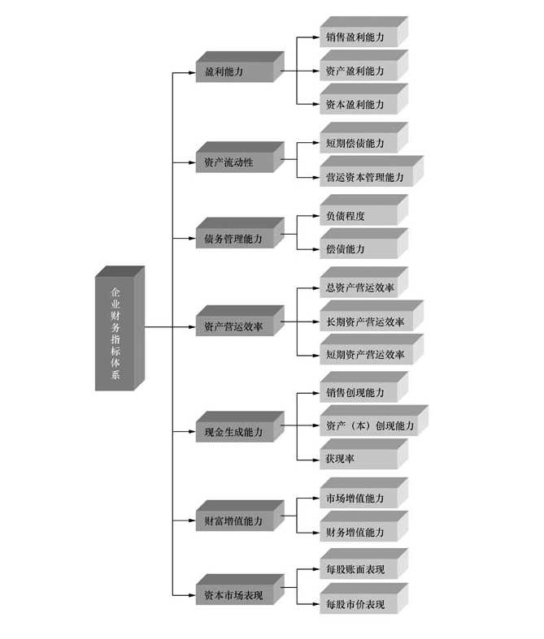

- **第一，盈利能力指标。**  
  盈利能力指标用于反映公司的利润与营业收入、资产和资本之间的比例关系，可以分为三类：  
  ①反映利润占营业收入之间比例关系的销售利润率；  
  ②反映利润与资产之间比例关系的资产利润率或资产收益率；  
  ③反映利润与资本之间比例关系的资本利润率或资本收益率。  
  
- **第二，资产流动性指标。**   
  资产流动性指标用于反映公司的流动资产与流动负债之间的比例关系，可以分为两类：  
  ①表明流动负债偿还能力的短期偿债能力指标；
  ②表明营运资本管理水平的营运资本管理能力指标。  
  
- **第三，债务管理指标。**   
  债务管理指标用于反映公司的负债管理状况，可以分为两类：  
  ①反映公司负债程度的指标；  
  ②反映公司偿债能力或付息还本能力的指标。  
  
- **第四，资产营运效率指标。**   
  资产营运效率指标用于反映公司使用资产的效率或管理水平，可以分为三类：  
  ①反映总资产营运效率的指标；  
  ②反映长期资产营运效率的指标；  
  ③反映短期资产营运效率的指标。  
  
- **第五，现金生成能力指标。**  
  现金生成能力指标用于反映公司的销售、资产、资本所带来的现金，可以分为三类：    
  ①反映现金与销售之间关系的指标；  
  ②反映现金与资产或资本之间关系的指标；  
  ③反映实际经营净现金与应得经营净现金之间关系的指标。 
  
- **第六，财富增值能力指标。**   
  财富增值指标用于反映公司是否为股东增加财富，可以分为两类：  
  ①从资本市场投资的角度衡量和反映股东财富是否增值的指标；  
  ②从公司财务管理的角度衡量和反映股东财富是否增值的指标。  
  
- **第七，资本市场表现指标。**   
  资本市场表现指标用于反映股东持有公司股份所获得的收益或拥有的财富，可以分为两类：    
  ①基于账面价值计算的收益或财富类指标（如每股收益、每股净资产、每股经营性净现金、每股分红等）；  
  ②基于股票价格计算的收益或财富类指标（如市盈率、股利收益率、资本利得率等）。
    

## 第二节　财务比率分析   :id=cp_302
 
### 一、李宁和安踏2007—2010年的财务报表

1) 李宁2007—2010年的三张财务表：

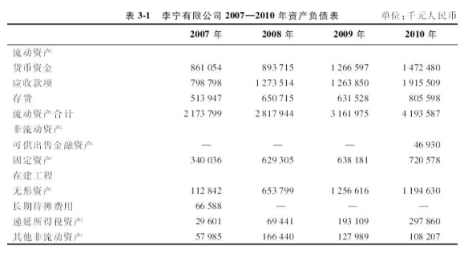

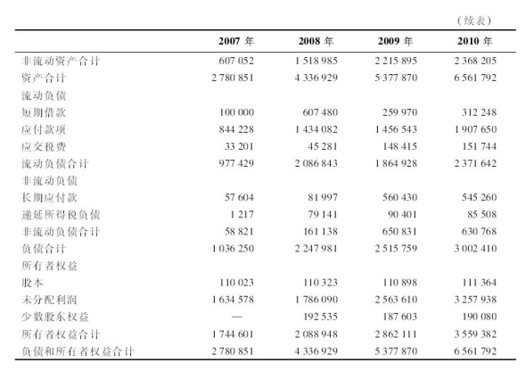

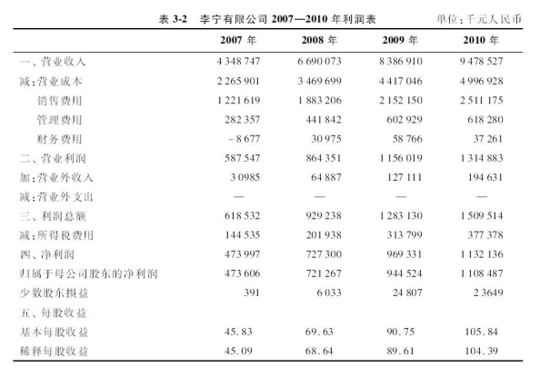

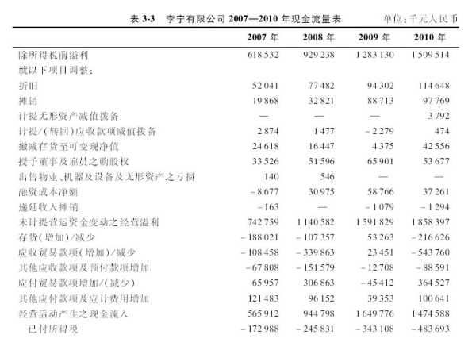

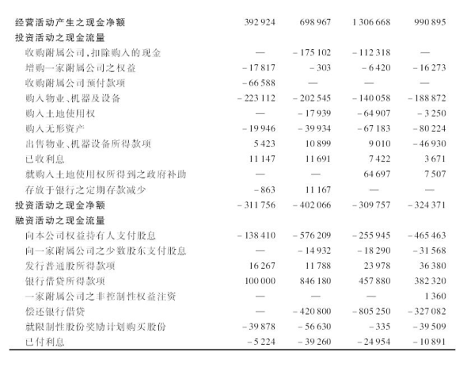

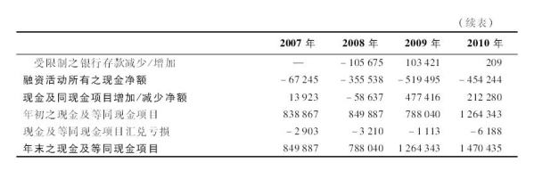

2) 安踏2007—2010年的三张财务表：

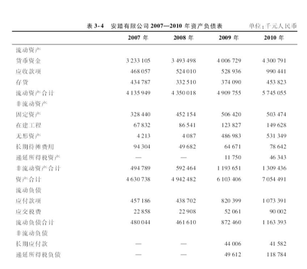

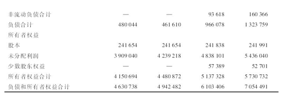

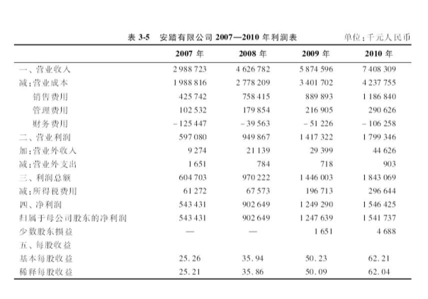

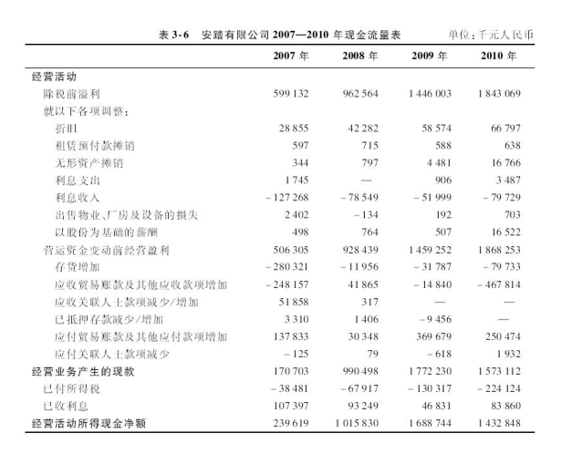

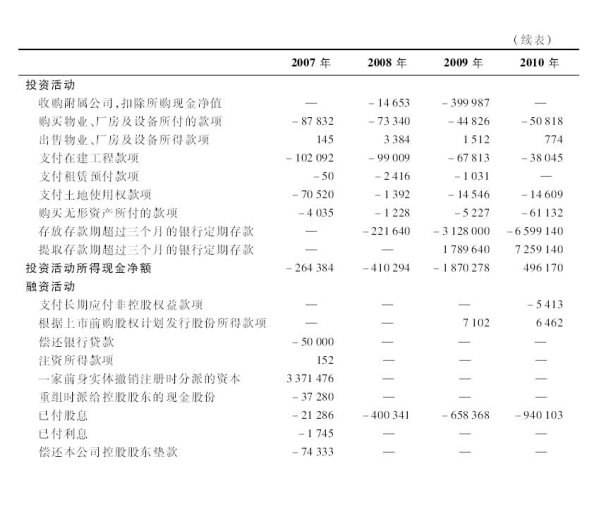

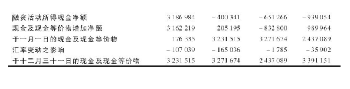
   
资料来源：李宁公司和安踏公司2007—2010年年度报告。

### 二、盈利能力指标

**1. 销售利润率**

它是企业一段时期（例如，年度、半年度、季度、月份）的净利润占这一时期营业收入的比重，表明企业每一元营业收入所产生的净利润。该指标越高，说明企业营业收入的盈利能力越高，反之越低。计算公式是：

$$
    销售利润率 = \frac{净利润}{营业收入}
$$

- 2010年李宁公司的销售利润率=1132136/9478527=`11.94%`
- 2010年安踏公司的销售利润率=1546425/7408309=`20.87%`

**2. EBIT利润率**

它是企业一段时期（例如，年度、半年度、季度、月份）的息税前利润（EBIT）占这一时期营业收入的比重，表明企业每一元营业收入所带来的利息、税收和净利润。该指标越高，说明企业营业收入的盈利能力越强，反之越弱。

$$
    营业利润率 = \frac{息税前利润}{营业收入} = \frac{EBIT}{营业收入}
$$

- 2010年李宁公司的营业利润率=1546775/9478527=`16.32%`
- 2010年安踏公司的营业利润率=1736811/7408309=`23.44%`

**3.EBITDA利润率**

它是企业一段时期（例如，年度、半年度、季度、月份）的息税前利润与折旧和摊销之和，即“息税前利润+折旧+摊销”占这一时期营业收入的比重，表明企业每一元营业收入所带来的利息、税收和净利润，以及收回的折旧和摊销费用。

由于从理论上来说，EBITDA必须不少于税后经营性净现金，因此该指标又俗称“现金利润率”。对于一些基础设施企业，

该指标越高，说明企业营业收入的盈利能力及折旧和摊销的回收能力越强，反之越弱。

$$
    EBITDA利润率 = \frac{息税前利润 + 折旧 + 摊销}{营业收入} = \frac{EBITDA}{营业收入}
$$

- 2010年李宁公司的EBITDA利润率=1759192/9478527=`18.56%`
- 2010年安踏公司的EBITDA利润率=1821012/7408309=`24.58%`

**4.总资产利润率** 

它是企业一段时期（例如，年度、半年度、季度、月份）的净利润除以企业总资产，反映企业净利润与总资产之间的比例关系（注：在使用资产负债表数据计算财务比率时，既可以使用资产负债表本期的期末数据，也可以使用资产负债表上期期末和本期期末的平均数据。只要在分析过程中保持一贯性，两种方法对企业财务状况的分析结果不会有太大的出入。本书在计算财务比率时，统一采用资产负债表本期的期末数据。）
表明企业每一元总资产所产生的净利润。该指标越高，说明企业总资产的盈利能力越高，反之越低。


$$
    总资产利润率 = \frac{净利润}{总资产}
$$

- 2010年李宁公司的总资产利润率=1132136/6561792=`17.25%`
- 2010年安踏公司的总资产利润率=1546425/7054491=`21.92%`

**5.总资产盈利能力**

有时又称“基础盈利能力”（Basic Earning Power，BEP），它反映企业一段时期（例如，年度、半年度、季度、月份）的息税前利润与总资产之间的比例关系，表明企业每一元总资产所产生的利息、税收和净利润。其中，利息属于债权人，税收属于政府，净利润属于股东。该指标越高，说明企业总资产的基础盈利能力越高，反之越低。

$$
    总资产盈利能力 = \frac{息税前利润}{总资产} = \frac{EBIT}{总资产}
$$

- 2010年李宁公司的总资产盈利能力=1546775/6561792=`23.57%`
- 2010年安踏公司的总资产盈利能力=1736811/7054491=`24.62%`

**6.权益资本利润率**

又称“净资产收益率”或“权益收益率”（Return on Equity），即ROE，它反映企业一段时期（例如，年度、半年度、季度、月份）的净利润与期末权益资本（或期末净资产）之间的比例关系，表明股东资本的盈利能力，即企业使用每一元股东资本所带来的净利润，是一种从企业会计利润的角度反映股东回报率的指标。该指标越高，说明企业权益资本的盈利能力越强，股东的收益越高，反之越弱越低。

$$
    权益资本利润率 = \frac{净利润}{权益资产} = \frac{净利润}{净资产}
$$

- 2010年李宁公司的权益资本利润率=1132136/3559382=`31.81%`
- 2010年安踏公司的权益资本利润率=1546425/5730732=`26.98%`

>值得注意的是：在现行会计制度下，ROE比较好地反映了股东资本的报酬率，但也存在一定的局限性。

- 一是ROE是基于会计利润计算的权益资本收益率，并非基于经济利润计算的权益资本收益率，因此ROE实际上并未考虑股东资本的机会成本，并不是股东获得的超过其权益资本机会成本的报酬率。 所以，尽管有些企业的ROE大于零，但当ROE低于股东权益资本机会成本的时候，股东实际上并非盈利，而是亏损。

- 二是在权责会计制的条件下，企业的净利润并不一定具有相应的现金为保障，企业的经营性净现金可能小于净利润，因此ROE并不能反映权益资本的现金收益。

- 三是ROE实际上受营业利润率、企业资产周转速度、负债程度、利息高低和所得税税率等的影响，有些企业可以通过提高负债率或享受税收优惠政策来提高其ROE。

**7.投入资本利润率（Return on Invested Capital，ROIC）**

它反映企业一段时期（例如，年度、半年度、季度、月份）的息税前利润与这一时期投入资本之间的比例关系，表明企业每投入一元权益资本和债务资本（银行长期和短期借款、企业发行的长期和短期债券），即企业“所有需要支付成本的资本”，所带来的利息、税收和净利润。其中，利息归债权人所有，税收归政府所有，净利润归股东所有。该指标越高，说明企业投入资本的盈利能力越强，反之越弱。

$$
    投入资本利润率 = \frac{息税前利润}{投入资本} = \frac{EBIT}{投入资本}
$$

- 2010年李宁公司的投入资本利润率=1546775/3871630=`39.95%`
- 2010年安踏公司的投入资本利润率=1736811/5730732=`30.31%`

> 其中：由于没有长期借款和长期债券，李宁公司的投入资本仅包括短期借款和所有者权益；而安踏公司的财务政策更为保守，不仅没有长期借款和长期债券，连短期借款和短期债券都没有，因此安踏公司的投入资本等于股权资本，即安踏公司的所有者权益。


**值得指出的是：**  
首先，ROIC也是一种从会计利润的角度衡量股东和债权人所投入资本的综合回报率的指标。  
此外，ROIC的意义或应用价值在于其与加权平均资本成本（WACC）的关系。  

**WACC的计算公式是：**


$$
    WACC = \frac{负债价值}{企业总价值}  * K_{d} ( 1 - T)  + \frac{权益价值}{企业总价值} * K_{s}
$$

其中： 
- $K_{d}$表示企业须付息的负债资本的平均成本；
- $K_{s}$表示企业的权益资本的成本；
- 企业总价值=负债价值+权益价值

一般是指其市场价值，但在没有市场价值信息的情况下，可以采用调整的账面价值或重估价值代替。

此外，我们也可以使用投入资本的比例来计算WACC:


$$
    WACC = \frac{各类需要支付成本的负债}{投入资本}  * K_{d} ( 1 - T)  + \frac{权益资本}{投入资本} * K_{s}
$$

可见，WACC实际上代表着股东和债权人的平均预期收益。当ROIC大于WACC，说明企业投入资本的收益超过其投入资本的成本，超过股东和债权人的平均预期收益，因此为股东创造了更多的价值；当ROIC小于WACC，说明企业投入资本的收益不足其投入资本的成本，低于股东和债权人的平均预期收益，因此损害了股东的价值。

### 三、资产流动性指标

**1.流动比率**

它反映流动资产与流动负债之间的比例关系，表明企业以流动资产偿还流动负债的能力，实际上也表明了企业流动资产的变现能力。该指标越高，说明企业短期偿债能力越强，反之越弱。

$$
    流动比率 = \frac{流动资产}{流动负债}
$$

- 2010年李宁公司的流动比率=4193587/2371642=`1.77`
- 2010年安踏公司的流动比率=5745055/1163393=`4.94`

**2.速动比率**  

它反映企业变现能力较强的流动资产与流动负债之间的比例关系，表明企业以具有较强变现能力的流动资产抵偿流动负债的能力。在流动资产中，一般而言，变现能力最差的是存货。在企业陷入财务困境或破产时，存货往往无法变现，因此所谓“变现能力较强的流动资产”通常是指扣除了存货之外的流动资产。所以，速动比率的计算公式是

$$
    速动比率 = \frac{流动资产 - 存货}{流动负债}
$$

- 2010年李宁公司的速动比率=（4193587-805598）/2371642=`1.43`
- 2010年安踏公司的速动比率=（5745055-453823）/1163393=`4.55`

**3.现金比率**

它反映企业变现能力最强的流动资产与流动负债之间的比例关系，表明企业以现金或银行存款抵偿流动负债的能力。

$$
    现金比率 = \frac{货币资金}{流动负债}
$$

- 2010年李宁公司的现金比率=1472480/2371642=`0.62`
- 2010年安踏公司的现金比率=4300791/1163393=`3.70` 

**4.营运资本需求量比率**

它反映企业营运资本需求量与总资产之间的比例关系，即营运资本需求量占总资产的比重，表明企业超过流动负债的流动资产占总资产的比重。该指标越大，说明企业流动资产的超额变现能力越强，反之越弱。

$$
    营运资本需求量比率 = \frac{营运资本需求量}{总资产} =  \frac{流动资产 - 流动负债}{总资产}
$$

- 2010年李宁公司的营运资本需求量比率=（4193587-2371642）/6561792=`0.28`
- 2010年安踏公司的营运资本需求量比率=（5745055-1163393）/7054491=`0.65`

**5.营运资本比率**

它反映企业经营性流动资产（非收息的流动资产）与经营性流动负债（非付息的流动负债）之间的比例关系。非收息流动资产表示企业的存货和被他人占用的资本，非付息流动负债表示企业占用他人的资本。因此，当企业充分利用非付息流动负债进行经营，就等于减少使用股东或债权人的资本来购买流动资产，从而降低企业的资本成本。该指标越小，说明企业运用非付息流动负债来经营的能力越强，企业的资本成本越低，营运资本管理水平越高；反之，说明企业运用非付息流动负债来经营的能力越弱，企业的资本成本越高，营运资本管理水平越低。


$$
    营运资本比率 = \frac{非收息流动资产}{非付息流动负债}
$$

其中：非收息流动资产主要包括各类应收款、存货和预付款，非付息流动负债主要包括各类应付款和预收款。

- 2010年李宁公司的营运资本比率=（1915509+805598）/1907650=`1.43`
- 2010年安踏公司的营运资本比率=（990441+453823）/1073391=`1.35` 


**6.营运资本周转天数**

它反映企业营运资本的管理水平。该指标越大，说明企业无偿占用供货商的能力越低，或企业被应收账款和存货占用的资金越多，企业营运资本管理水平越低；反之，说明企业无偿占用供货商的能力越高，或企业被应收账款和存货占用的资金越少，企业营运资本管理水平越高。

$$
营运资本周转天数＝应收账款周转天数+存货周转天数-应付账款周转天数
$$

- 2010年李宁公司的营运资本周转天数=73.76+58.84-73.46=59.14（天）
- 2010年安踏公司的营运资本周转天数=48.80+39.09-52.88=35.01（天）

### 四、负债管理能力指标
 
**1.总资产负债率**

它反映企业总负债，包括流动负债和非流动负债，与总资产之间的比例关系，表明企业总资产中负债所占的比重。该指标越大，说明企业的负债比例越高，企业的债务风险越大，债权人的债权资本在企业破产清算时所受到的保护程度越低；反之，企业的负债比例越低，企业的债务风险越小，债权人的债权资本在企业破产清算时所受到的保护程度越高。

$$
总资产负债率＝ \frac{总负债}{总资产}
$$

**值得注意的是：**
-首先，企业的总资产负债率并非越低越好，也并非越高越好，企业的负债比例因行业和企业特征而异，负债管理的关键问题是适度负债；
- 其次，总资产负债率的分子包括**流动负债**，流动负债中包括非付息的流动负债，这部分非付息流动负债越多，说明企业营运资本管理能力越强或管理水平越高，但是企业的总资产负债比率越高。因此，在使用总资产负债率考核企业高层管理者业绩或评价企业负债状况时，应该注意这一问题。
- 再次，总资产包括负债总额和权益资本总额，如何计算总资产的价值是个有争议的问题。一些专家认为应该使用市场价值计算总资产的价值，但是，由于负债的市场价值比较难于计量，而权益的市场价值易于计量，因此，总资产的市场价值＝负债总额+股份数×每股价格，即总资产等于负债的账面价值与权益的市场价值之和。

- 2010年李宁公司的总资产负债率=3002410/6561792=`0.46`
- 2010年安踏公司的总资产负债率=1323759/7054491=`0.19`

**2.权益资产比**

它反映企业权益资本与总资产之间的比例关系，表明企业总资产中权益资本所占的比重。该指标越大，说明企业权益资本所占比例越高，负债所占比例越低，债权人的债权资本越安全，反之越不安全。

$$
权益资产比＝ \frac{权益资本}{总资产} = 1 - \frac{总负债}{总资产} = 1 - 总资产负债率 
$$


- 2010年李宁公司的权益资产比=3559382/6561792=`0.54`
- 2010年安踏公司的权益资产比=5730732/7054491=`0.81`

**值得指出的是：**   
**权益资产比的倒数称为权益乘数**，其反映企业每元权益资本所支持或带来的总资产。  
- 权益乘数越高，说明企业的权益资本占总资产的比例越低，负债比例越高；
- 反之，说明企业的权益资本占总资产的比例越高，负债比例越低。

$$
权益乘数＝ \frac{总资产}{权益资本} = \frac{1}{权益资产比} 
$$

- 2010年李宁公司的权益乘数=6561792/3559382=`1.84`
- 2010年安踏公司的权益乘数=7054491/5730732=`1.23`  

**3. 权益负债比**

又称“**权益长债比**”，是企业权益资本与长期负债之比，反映作为企业长期资本的权益资本与长期负债之间的比例关系。  
该指标越大，说明企业的长期资本中，来自股东的权益资本的比例越多，而来自债权人的长期负债越少，企业长期负债相对于权益资本越低，长期债务的保障程度越高，  
反之，则长期债务的保障程度越低。

$$
权益负债比＝ \frac{权益资产}{长期负债}
$$


- 2010年李宁公司的权益负债比=3559382/630768=`5.64`
- 2010年安踏公司的权益负债比=5730732/160366=`35.74`


**4.利息保障倍数**

它反映企业可用于支付利息的利润（EBIT）或现金（税前经营性净现金—折旧—摊销）与利息支出之间的比例关系，表明企业支付利息能力的高低。该指标越大，说明企业利息支付能力越强；反之越弱。值得指出的是，利润和现金在衡量企业付息能力时有何不同呢？在权责会计制条件下，企业的EBIT并不一定是现金，因此在计算利息保障倍数时，既要考虑企业使用EBIT付息的能力，还要考虑企业使用现金付息的能力。在实践中，分析评价企业现金的付息能力比利润的付息能力更加重要。因此，利息保障倍数的计算公式，根据计算公式的分子是使用利润指标还是现金指标，分为基于EBIT的利息保障倍数和基于现金的利息保障倍数

$$
基于EBIT的利息保障倍数 ＝ \frac{EBIT}{利息支出}
$$

$$
基于现金的利息保障倍数 ＝ \frac{税前经营净现金}{利息支出}
$$

- 2010年李宁公司基于EBIT的利息保障倍数=1546775/37261=41.51（倍）
- 2010年李宁公司基于现金的利息保障倍数=1474588/37261=39.57（倍）
- 2010年安踏公司基于EBIT的利息保障倍数 =1736811/（-106258）=-16.35（倍）（注：由于安踏公司没有有息负债，故利息保障倍数这一指标对安踏公司没有实际意义。）
- 2010年安踏公司基于现金的利息保障倍数=1573112/（-106258）=-14.80（倍）


**5.本息保障倍数**

它反映企业以可用于付息还本的利润（EBITDA）或现金（税前经营性净现金）与利息支出和应还本金的比例关系，表明企业付息还本能力的高低。与利息保障倍数的计算原理相似，该指标越大，说明企业的还本付息的能力越强；反之越弱。根据计算公式的分子是使用利润指标还是现金指标，分为基于EBIT的本息保障倍数和基于现金的本息保障倍数：


$$
基于EBITDA的本息保障倍数 ＝ \frac{EBITDA}{利息支出 + 年应还本金}
$$

$$
基于现金的本息保障倍数 ＝ \frac{税前经营净现金}{利息支出 + 年应还本金}
$$

- 2010年李宁公司基于EBITDA的本息保障倍数 =1759192/（37261+312248）=5.03（倍）
- 2010年李宁公司基于现金的本息保障倍数 =1474588/（37261+312248）=4.22（倍）
- 2010年安踏公司基于EBITDA的本息保障倍数 =1821012/（-106258）=-17.14（倍）（注：由于安踏公司没有有息负债，故本息保障倍数这一指标对安踏公司同样没有实际意义。）
- 2010年安踏公司基于现金的本息保障倍数 =1573112/（-106258）=-14.80（倍）

### 五、资产运营效率指标

**1.总资产周转率**

它反映企业一段时期的营业收入与其所使用的总资产之间的比例关系，表明一段时期内企业使用每一元总资产所创造的营业收入。该指标越大，说明企业总资产的使用效率越高，反之越低。

$$ 总资产周转率 =  \frac{营业收入}{总资产} $$

- 2010年李宁公司的总资产周转率=9478527/6561792=`1.44`
- 2010年安踏公司的总资产周转率=7408309/7054491=`1.05`

与总资产周转率相对应的是总资产周转天数，该指标反映按照目前的情况，企业总资产需要多长时间才能回收一次。该指标越大，表明企业总资产的使用效率越低，反之越高。计算公式是

$$ 总资产周转天数 =  \frac{365}{总资产周转率} =  \frac{365}{营业收入 / 总资产} $$


- 2010年李宁公司的总资产周转天数=365/（9478527/6561792）=`252.68（天）`
- 2010年安踏公司的总资产周转天数=365/（7408309/7054491）=`347.57（天）`


**2.固定资产周转率**

它反映企业一段时期的营业收入与其所使用的固定资产之间的比例关系，表明一段时期内企业使用每元固定资产所创造的营业收入。该指标越大，说明企业固定资产的使用效率越高，反之越低。

$$ 固定总资产周转率 =  \frac{营业收入}{固定资产} $$

- 2010年李宁公司的固定资产周转率=9478527/720578=`13.15`
- 2010年安踏公司的固定资产周转率=7408309/503474=`14.71`

与固定资产周转率相对应的是固定资产周转天数，该指标反映按照目前的情况，企业固定资产需要多长时间才能回收一次。该指标越大，表明企业固定资产的使用效率越低，反之越高。计算公式是：

$$ 固定资产周转天数 =  \frac{365}{固定资产周转率} =  \frac{365}{营业收入 / 固定资产} $$


- 2010年李宁公司的固定资产周转天数=365/（9478527/720578）=`27.75（天）`
- 2010年安踏公司的固定资产周转天数=365/（7408309/503474）=`24.81（天）`

**3. 存货周转率**

它反映企业营业收入或营业成本与存货之间的比例关系（注：在一些教科书中，用营业收入与存货的比值来计算存货周转率。本书在计算存货周转率和存货周转天数时，统一使用营业成本。），表明一段时期内企业存货转化为营业成本的效率。该指标越大，说明企业存货的使用效率越高，反之越低。


$$ 资产周转率 =  \frac{营业成本本}{存货}  $$


- 2010年李宁公司的存货周转率=4996928/805598=`6.20`
- 2010年安踏公司的存货周转率=4237755/453823=`9.34`