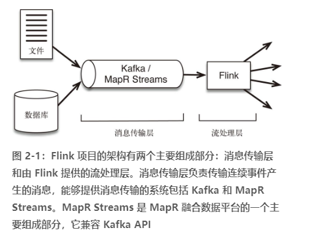
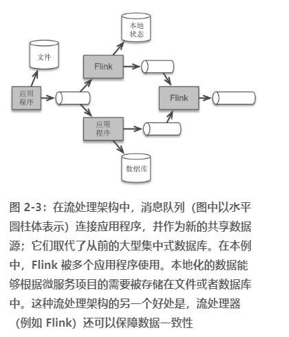

# 第 2 章　流处理架构
---
> 《flink基础教程》学习笔记2

## 传统架构与流处理架构

传统架构是采用一个中心化的数据库系统，该系统用于存储事务性数据

特点：

- 在许多项目中，从数据到达到数据分析所需的工作流程太复杂、太缓慢。
- 传统的数据架构太单一：数据库是唯一正确的数据源，每一个应用程序都需要通过访问数据库来获得所需的数据。
- 采用这种架构的系统拥有非常复杂的异常问题处理方法。当出现异常问题时，很难保证系统还能很好地运行。

传统架构的另一个问题是，需要通过在大型分布式系统中不断地更新来维持一致的全局状态。
随着系统规模扩大，维持实际数据与状态数据间的一致性变得越来越困难；

流处理架构解决了企业在大规模系统中遇到的诸多问题。

以流为基础的架构设计让数据记录持续地从数据源流向应用程序，并在各个应用程序间持续流动。没有一个数据库来集中存储全局状态数据，取而代之的是共享且永不停止的流数据，它是唯一正确的数据源，记录了业务数据的历史。在流处理架构中，每个应用程序都有自己的数据，这些数据采用本地数据库或分布式文件进行存储。

## 消息传输层和流处理层

**（1）消息传输层** 从各种数据源（生产者）采集连续事件产生的数据，并传输给订阅了这些数据的应用程序和服务（消费者）

**（2）流处理层 ** 有3个用途：   
1. 持续地将数据在应用程序和系统间移动；
2. 聚合并处理事件；
3. 在本地维持应用程序的状态。

在设计高效的流处理架构时，不仅流处理器的选择会造成架构的巨大差异，消息传输层也很关键。**现代系统之所以更容易处理大规模的流数据，其中很大一部分原因就是消息传输方式的改进，以及流处理器与消息传输系统的交互方式的改变。**

## 消息传输层的理想功能

**1. 兼具高性能和持久性**

具有持久性的好处之一是消息可以重播 

**2. 将生产者和消费者解耦**

采用高效的消息传输技术，可以从多个源（生产者）收集数据，并使这些数据可供多个服务或应用程序（消费者）使用，
如图 2-2 所示。
- Kafka 和 MapR Streams 把从生产者获得的数据分配给既定的主题。
- 数据源将数据推送给消息队列，消费者（或消费者群组）则拉取数据。
- 事件数据只能基于给定的偏移量从消息队列中按顺序读出。
- 生产者并不向所有消费者自动广播。

这一点听起来微不足道，但是对整个架构的工作方式有着巨大的影响。

采用解耦的消息传输系统很有意义，因为它能支持**微服务** ，也支持将处理步骤中的实现过程隐藏起来，从而允许自由地修改实现过程。

## 支持微服务架构的流数据

微服务方法指的是将大型系统的功能分割成通常具有单一目的的简单服务，从而使小型团队可以轻松地构建和维护这些服务。

> “（微服务的）目标是给予每个团队一项工作，并授以完成工作的方法，然后就放手。” --- 《Streaming Architecture 》 by Ted Dunning 和 Ellen Friedman 

**1. 数据流作为中心数据源**

流处理架构不需要集中式数据库。取而代之的是消息队列，它作为共享数据源，服务于各种不同的消费者。

## 欺诈检测：流处理架构用例

