# Docker的常用命令

## 帮助命令

```
docker version      # 显示docker的版本
docker info         # 显示docker的系统信息，包括镜像和容器的数量
docker 命令 --help   # 帮助命令

```

帮助文档的地址：https://docs.docker.com/get-docker/

## 镜像命令

**docker images** 查看所有本地的主机上的镜像

```
C:\WINDOWS\system32>docker images
REPOSITORY    TAG       IMAGE ID       CREATED         SIZE
ubuntu        latest    a8780b506fa4   4 weeks ago     77.8MB
jinaai/jina   latest    8f2d64dae286   5 weeks ago     293MB
alpine/git    latest    b80d2cac43e4   8 weeks ago     43.6MB
ubuntu        14.04     13b66b487594   20 months ago   197MB

# 解释
REPOSITORY  	镜像的仓库源
TAG				镜像的标签
IMAGE ID		镜像的ID
CREATED			镜像的创建时间
SIZE			镜像的大小

# 可选项

  -a, --all             Show all images (default hides 
  -q, --quiet           Only show image IDs
  


```

**docker search 搜索镜像**

```
C:\WINDOWS\system32>docker search mysql
NAME                            DESCRIPTION                                     STARS     OFFICIAL   AUTOMATED
mysql                           MySQL is a widely used, open-source relation…   13551     [OK]
mariadb                         MariaDB Server is a high performing open sou…   5168      [OK]

# 可选项 

  -f, --filter filter   Filter output based on conditions provided
      --format string   Pretty-print search using a Go template
      --limit int       Max number of search results (default 25)
      --no-trunc        Don't truncate output
      
-- filter=STARS=3000 #搜索出来stars>3000的(大小写敏感)

(base) choi@DESKTOP-B1FCICA:~$ docker search mysql --filter=STARS=3000
NAME      DESCRIPTION                                     STARS     OFFICIAL   AUTOMATED
mysql     MySQL is a widely used, open-source relation…   13551     [OK]
mariadb   MariaDB Server is a high performing open sou…   5168      [OK]


```

**docker pull 下载镜像**

````
# 下载镜像 docker pull 镜像名[:tag]

(base) choi@DESKTOP-B1FCICA:~$ docker pull mysql
Using default tag: latest	# 如果不写tag,默认就是latest
latest: Pulling from library/mysql
996f1bba14d6: Pull complete	# 分层下载，docker image核心，联合文件系统
a4355e2c82df: Pull complete
a9d7aedb7ad7: Pull complete
24ee75d8667d: Pull complete
da8c1ec8ff26: Pull complete
ea8748759282: Pull complete
e0859d5816ee: Pull complete
26e144df551b: Pull complete
9878df6a0cc3: Pull complete
b43b187428e3: Pull complete
202e454031c6: Pull complete
Digest: sha256:66efaaa129f12b1c5871508bc8481a9b28c5b388d74ac5d2a6fc314359bbef91	# 签名
Status: Downloaded newer image for mysql:latest
docker.io/library/mysql:latest	# 真实地址 

# 等价于它
docker pull mysql
docker pull docker.io/library/mysql:latest

# 指定版本下载
(base) choi@DESKTOP-B1FCICA:~$ docker pull mysql:5.7
5.7: Pulling from library/mysql
d96bccd7291f: Pull complete
feae47af51d5: Pull complete
a64d38b9fa31: Pull complete
da689aaabebf: Pull complete
6a2a532732de: Pull complete
9063a4855045: Pull complete
625a84b6adf6: Pull complete
7084e7269f30: Pull complete
161795475ff3: Pull complete
6b2f7a84c8fc: Pull complete
cf120096e55e: Pull complete
Digest: sha256:4149a92977a54d27cbd6f81cca3817e6278a844d566b45f9ff1908bb2714b1ca
Status: Downloaded newer image for mysql:5.7
docker.io/library/mysql:5.7

````

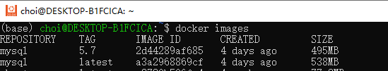

**docker rmi 删除镜像**

````
(base) choi@DESKTOP-B1FCICA:~$ docker rmi -f 镜像id	#删除指定镜像
(base) choi@DESKTOP-B1FCICA:~$ docker rmi -f 镜像id 镜像id 镜像id 	#删除多个镜像
(base) choi@DESKTOP-B1FCICA:~$ docker rmi -f $(docker images -aq) 	#删除所有镜像
````

## 容器命令

**说明：我们有了镜像才可以创建容器，linux，下载一个centos镜像来测试学习**

```
docker pull centos
```

**新建容器并启动**

```
docker run [可选参数] image

# 参数说明

--name = "name" 容器名称 tomcat1, tomcat2, 用来区分容器
-d 				后台方式运行
-it				使用交互方式运行，进入容器查看内容
-p				指定容器端口 -p 8080:8080
	-p 主机端口：容器端口（常用）
	-p ip:主机端口:容器端口
	-p 容器端口
	容器端口
-P              随机指定端口

# 测试，启动并进入容器

(base) choi@DESKTOP-B1FCICA:~$ docker run -it centos /bin/bash
[root@4284fe604616 /]# ls	#查看容器内的centos,基础版本
bin  dev  etc  home  lib  lib64  lost+found  media  mnt  opt  proc  root  run  sbin  srv  sys  tmp  usr  var

# 从容器中退回主机
[root@4284fe604616 /]# exit
exit
(base) choi@DESKTOP-B1FCICA:~$

```

**列出所有的运行容器**

```
# docker ps 命令
-a		# 列出当前正在运行的容器+带出历史运行过的容器
-n=?    # 显示最近创建的容器（？为数字-1，1，2等）
-q      # 只显示容器的编号
```

**退出容器**

```
exit	 # 直接容器停止并退出
CTRL+Q+P # 容器不停止退出

```

**删除容器**

```
docker rm  容器id				# 删除指定容器，不能删除正在运行的容器，如果要强制删除 rm -f 
docker rm -f $(docker ps -aq) # 删除所有容器

docker ps -a -q|xargs docker rm #删除所有的容器
```


**启动和停止容器的操作**

```
docker start 容器id
docker restart 容器id
docker stop  容器id
docker kill 容器id
```


## 常用其他命令

**后台启动容器**

```
# 命令 docker run -d 镜像名！
(base) choi@DESKTOP-B1FCICA:~$ docker ps
CONTAINER ID   IMAGE     COMMAND   CREATED   STATUS    PORTS     NAMES
(base) choi@DESKTOP-B1FCICA:~$ docker  run -d centos
f40b408b7e2e89f06df6c0788fbb4dd326901f6d5c32327daa222ffd400e7b62
(base) choi@DESKTOP-B1FCICA:~$ docker ps
CONTAINER ID   IMAGE     COMMAND   CREATED   STATUS    PORTS     NAMES
(base) choi@DESKTOP-B1FCICA:~$


# 问题docker ps ,发现 centos 停止了

# 常见的坑，docker 容器使用后台运行，就必须要有一个前台进程，docker发现没有应用，就会自动停止
# nginx , 容器启动后，发现自己没有提供服务，就会立刻停止，就是没有程序了。
```

**查看日志**

```
docker logs -f -t --tail 容器id


# 自己编写一段shell脚本

docker run --name="centos_bash" -d centos /bin/bash -c "while true;do echo hello;sleep 1;done"

# 
(base) choi@DESKTOP-B1FCICA:~$  docker ps
CONTAINER ID   IMAGE     COMMAND       CREATED         STATUS         PORTS     NAMES
6b30b11f5f64   centos    "/bin/bash"   9 minutes ago   Up 9 minutes             intelligent_williams
(base) choi@DESKTOP-B1FCICA:~$ docker run --name="centos_bash" -d centos /bin/bash -c "while true;do echo hello;sleep 1;done"
b40795558ae567fcf70830e576bb473b72b6bf047044e5b2d3a92c980edc767a
(base) choi@DESKTOP-B1FCICA:~$ docker ps
CONTAINER ID   IMAGE     COMMAND                  CREATED         STATUS         PORTS     NAMES
b40795558ae5   centos    "/bin/bash -c 'while…"   5 seconds ago   Up 4 seconds             centos_bash
6b30b11f5f64   centos    "/bin/bash"              9 minutes ago   Up 9 minutes             intelligent_williams

# 显示日志
-tf			# 显示日志
--tail number # 要显示日志条数 

(base) choi@DESKTOP-B1FCICA:~$ docker logs -f -t --tail 10 b40795558ae5
2022-12-04T06:53:13.129914100Z hello
2022-12-04T06:53:14.131894900Z hello
2022-12-04T06:53:15.134249200Z hello
2022-12-04T06:53:16.136450800Z hello
2022-12-04T06:53:17.138767600Z hello
2022-12-04T06:53:18.140918400Z hello
2022-12-04T06:53:19.142949000Z hello
2022-12-04T06:53:20.145114200Z hello
2022-12-04T06:53:21.147281200Z hello
2022-12-04T06:53:22.149584000Z hello
2022-12-04T06:53:23.153852700Z hello
2022-12-04T06:53:24.155855700Z hello
2022-12-04T06:53:25.157962200Z hello
2022-12-04T06:53:26.159968700Z hello
2022-12-04T06:53:27.161805600Z hello
2022-12-04T06:53:28.164095500Z hello
2022-12-04T06:53:29.166462700Z hello
```

**查看容器中的进程信息 top**

```
# 命令 docker top  容器id
(base) choi@DESKTOP-B1FCICA:~$ docker  top  6b30b11f5f64
UID                 PID                 PPID                C                   STIME               TTY                 TIME                CMD
root                8481                8461                0                   06:43  
```

**查看镜像的元数据**

```
(base) choi@DESKTOP-B1FCICA:~$ docker inspect 6b30b11f5f64

[
    {
        "Id": "6b30b11f5f64776d6922064e13af5241e22916e8e022734ce8f194d450accf66",
        "Created": "2022-12-04T06:43:48.9131646Z",
        "Path": "/bin/bash",
        "Args": [],
        "State": {
            "Status": "running",
            "Running": true,
            "Paused": false,
            "Restarting": false,
            "OOMKilled": false,
            "Dead": false,
            "Pid": 8481,
            "ExitCode": 0,
            "Error": "",
            "StartedAt": "2022-12-04T06:43:49.5530219Z",
            "FinishedAt": "0001-01-01T00:00:00Z"
        },
        "Image": "sha256:5d0da3dc976460b72c77d94c8a1ad043720b0416bfc16c52c45d4847e53fadb6",
        "ResolvConfPath": "/var/lib/docker/containers/6b30b11f5f64776d6922064e13af5241e22916e8e022734ce8f194d450accf66/resolv.conf",
        "HostnamePath": "/var/lib/docker/containers/6b30b11f5f64776d6922064e13af5241e22916e8e022734ce8f194d450accf66/hostname",
        "HostsPath": "/var/lib/docker/containers/6b30b11f5f64776d6922064e13af5241e22916e8e022734ce8f194d450accf66/hosts",
        "LogPath": "/var/lib/docker/containers/6b30b11f5f64776d6922064e13af5241e22916e8e022734ce8f194d450accf66/6b30b11f5f64776d6922064e13af5241e22916e8e022734ce8f194d450accf66-json.log",
        "Name": "/intelligent_williams",
        "RestartCount": 0,
        "Driver": "overlay2",
        "Platform": "linux",
        "MountLabel": "",
        "ProcessLabel": "",
        "AppArmorProfile": "",
        "ExecIDs": null,
        "HostConfig": {
            "Binds": null,
            "ContainerIDFile": "",
            "LogConfig": {
                "Type": "json-file",
                "Config": {}
            },
            "NetworkMode": "default",
            "PortBindings": {},
            "RestartPolicy": {
                "Name": "no",
                "MaximumRetryCount": 0
            },
            "AutoRemove": false,
            "VolumeDriver": "",
            "VolumesFrom": null,
            "CapAdd": null,
            "CapDrop": null,
            "CgroupnsMode": "host",
            "Dns": [],
            "DnsOptions": [],
            "DnsSearch": [],
            "ExtraHosts": null,
            "GroupAdd": null,
            "IpcMode": "private",
            "Cgroup": "",
            "Links": null,
            "OomScoreAdj": 0,
            "PidMode": "",
            "Privileged": false,
            "PublishAllPorts": false,
            "ReadonlyRootfs": false,
            "SecurityOpt": null,
            "UTSMode": "",
            "UsernsMode": "",
            "ShmSize": 67108864,
            "Runtime": "runc",
            "ConsoleSize": [
                0,
                0
            ],
            "Isolation": "",
            "CpuShares": 0,
            "Memory": 0,
            "NanoCpus": 0,
            "CgroupParent": "",
            "BlkioWeight": 0,
            "BlkioWeightDevice": [],
            "BlkioDeviceReadBps": null,
            "BlkioDeviceWriteBps": null,
            "BlkioDeviceReadIOps": null,
            "BlkioDeviceWriteIOps": null,
            "CpuPeriod": 0,
            "CpuQuota": 0,
            "CpuRealtimePeriod": 0,
            "CpuRealtimeRuntime": 0,
            "CpusetCpus": "",
            "CpusetMems": "",
            "Devices": [],
            "DeviceCgroupRules": null,
            "DeviceRequests": null,
            "KernelMemory": 0,
            "KernelMemoryTCP": 0,
            "MemoryReservation": 0,
            "MemorySwap": 0,
            "MemorySwappiness": null,
            "OomKillDisable": false,
            "PidsLimit": null,
            "Ulimits": null,
            "CpuCount": 0,
            "CpuPercent": 0,
            "IOMaximumIOps": 0,
            "IOMaximumBandwidth": 0,
            "MaskedPaths": [
                "/proc/asound",
                "/proc/acpi",
                "/proc/kcore",
                "/proc/keys",
                "/proc/latency_stats",
                "/proc/timer_list",
                "/proc/timer_stats",
                "/proc/sched_debug",
                "/proc/scsi",
                "/sys/firmware"
            ],
            "ReadonlyPaths": [
                "/proc/bus",
                "/proc/fs",
                "/proc/irq",
                "/proc/sys",
                "/proc/sysrq-trigger"
            ]
        },
        "GraphDriver": {
            "Data": {
                "LowerDir": "/var/lib/docker/overlay2/d9f6c97feee3f58dc2cdff1b18f3c357a103d59ea591c995f1e60f16da22d6de-init/diff:/var/lib/docker/overlay2/18db7ee621fe248143e52f49a722b6ad97a20fb6261058b236c768050b787138/diff",
                "MergedDir": "/var/lib/docker/overlay2/d9f6c97feee3f58dc2cdff1b18f3c357a103d59ea591c995f1e60f16da22d6de/merged",
                "UpperDir": "/var/lib/docker/overlay2/d9f6c97feee3f58dc2cdff1b18f3c357a103d59ea591c995f1e60f16da22d6de/diff",
                "WorkDir": "/var/lib/docker/overlay2/d9f6c97feee3f58dc2cdff1b18f3c357a103d59ea591c995f1e60f16da22d6de/work"
            },
            "Name": "overlay2"
        },
        "Mounts": [],
        "Config": {
            "Hostname": "6b30b11f5f64",
            "Domainname": "",
            "User": "",
            "AttachStdin": true,
            "AttachStdout": true,
            "AttachStderr": true,
            "Tty": true,
            "OpenStdin": true,
            "StdinOnce": true,
            "Env": [
                "PATH=/usr/local/sbin:/usr/local/bin:/usr/sbin:/usr/bin:/sbin:/bin"
            ],
            "Cmd": [
                "/bin/bash"
            ],
            "Image": "centos",
            "Volumes": null,
            "WorkingDir": "",
            "Entrypoint": null,
            "OnBuild": null,
            "Labels": {
                "desktop.docker.io/wsl-distro": "Ubuntu-20.04",
                "org.label-schema.build-date": "20210915",
                "org.label-schema.license": "GPLv2",
                "org.label-schema.name": "CentOS Base Image",
                "org.label-schema.schema-version": "1.0",
                "org.label-schema.vendor": "CentOS"
            }
        },
        "NetworkSettings": {
            "Bridge": "",
            "SandboxID": "84f1be9208c0e295b6fd8428d31287ecf54ee4e2bb038f79c86c55da476b77a2",
            "HairpinMode": false,
            "LinkLocalIPv6Address": "",
            "LinkLocalIPv6PrefixLen": 0,
            "Ports": {},
            "SandboxKey": "/var/run/docker/netns/84f1be9208c0",
            "SecondaryIPAddresses": null,
            "SecondaryIPv6Addresses": null,
            "EndpointID": "69e97113fdc40caa7604002b8818e838d0f06957670348aeec4aa2af27b962df",
            "Gateway": "172.17.0.1",
            "GlobalIPv6Address": "",
            "GlobalIPv6PrefixLen": 0,
            "IPAddress": "172.17.0.2",
            "IPPrefixLen": 16,
            "IPv6Gateway": "",
            "MacAddress": "02:42:ac:11:00:02",
            "Networks": {
                "bridge": {
                    "IPAMConfig": null,
                    "Links": null,
                    "Aliases": null,
                    "NetworkID": "48d17cb471e2fa92898f19dcdec6048008b66c8004976182aeee7fa1c76a4ee4",
                    "EndpointID": "69e97113fdc40caa7604002b8818e838d0f06957670348aeec4aa2af27b962df",
                    "Gateway": "172.17.0.1",
                    "IPAddress": "172.17.0.2",
                    "IPPrefixLen": 16,
                    "IPv6Gateway": "",
                    "GlobalIPv6Address": "",
                    "GlobalIPv6PrefixLen": 0,
                    "MacAddress": "02:42:ac:11:00:02",
                    "DriverOpts": null
                }
            }
        }
    }
]
```

**进入当前正在运行的容器**

```
#  容器通常都是使用后台方式运行的，需要进入容器，修改一些配置

# 命令
docker exec -it 容器id bashshell 

# 测试
(base) choi@DESKTOP-B1FCICA:~$ docker exec -it 6b30b11f5f64  /bin/bash
[root@6b30b11f5f64 /]# ls
bin  dev  etc  home  lib  lib64  lost+found  media  mnt  opt  proc  root  run  sbin  srv  sys  tmp  usr  var

# 方式二
docker attach 容器id

(base) choi@DESKTOP-B1FCICA:~$ docker attach 6b30b11f5f64
[root@6b30b11f5f64 /]#
正在执行当前的代码....


# docker exec		# 进入容器后开启一个新的终端，可以在里面操作（常用）
# docker attach		# 进入容器正在执行的终端，不会启动新的进程！
```

**从容器内拷贝文件到主机上**

```
(base) choi@DESKTOP-B1FCICA:~$ docker attach 6b30b11f5f64
[root@6b30b11f5f64 /]# ls
bin  dev  etc  home  lib  lib64  lost+found  media  mnt  opt  proc  root  run  sbin  srv  sys  tmp  usr  var
[root@6b30b11f5f64 /]# cd ..
[root@6b30b11f5f64 /]# ls
bin  dev  etc  home  lib  lib64  lost+found  media  mnt  opt  proc  root  run  sbin  srv  sys  tmp  usr  var
[root@6b30b11f5f64 /]# cd home
[root@6b30b11f5f64 home]# ls
[root@6b30b11f5f64 home]# touch kuangshen.java
[root@6b30b11f5f64 home]# ls
kuangshen.java
(base) choi@DESKTOP-B1FCICA:~$ sudo docker cp 6b30b11f5f64:/home/kuangshen.java /home
(base) choi@DESKTOP-B1FCICA:/home$ ls
choi  kuangshen.java
```

## 小结


****Docker命令大全****

```
docker attach			# 连接到正在运行中的容器
docker build			# 使用Dockerfile 创建镜像
docker builder 		 	# 管理builds
	docker builder prune	# 清除build缓存
docker checkpoint 		# 管理checkpoints
    docker checkpoint create# 从正在运行的容器创建检查点
    docker checkpoint ls    # 列出容器的检查点
    docker checkpoint rm    # 删除指定的检查点
docker commit			# 从容器创建一个新的镜像
docker config 			# 管理docker配置
    docker config create	# 创建配置文件 
    docker config inspect   # 查看配置文件信息
    docker config ls  		# 显示docker里已经保存的配置文件
    docker config rm 		# 删除配置文件
docker container		# 管理
	docker container prune	#删除所有已停止的容器
docker context	#管理contexts
    docker context create	#创建一个上下文
    docker context export	#将上下文导出到tar或kubecconfig文件中
    docker context import	#从tar或zip文件导入上下文
    docker context inspect	#在一个或多个上下文上显示详细信息
    docker context ls		#列出上下文
    docker context rm		#删除一个或多个上下文
    docker context update	#更新
    docker context use		#设置当前docker的上下文
    
    docker cp		#用于容器与主机之间的数据拷贝
docker create	#创建一个新的容器但不启动它
docker diff		#检查容器里文件结构的更改
docker events	#从服务器获取实时事件
docker exec		#在运行的容器中执行命令
docker export	#将文件系统作为一个tar归档文件导出到STDOUT
docker history	#查看指定镜像的创建历史
docker image	#管理镜像
    docker image inspect	#显示一个或多个镜像的元数据
    docker image ls			#列出本地镜像
    docker image prune		#删除没有使用的镜像
    docker image rm			#删除一个或多个镜像
docker images	#列出本地镜像
docker import	#从归档文件中创建镜像
docker info		#显示 Docker 系统信息，包括镜像和容器数
docker inspect	#获取容器/镜像的元数据
docker kill		#杀掉一个运行中的容器
docker load		#导入使用 docker save 命令导出的镜像
docker login	#登陆到一个Docker镜像仓库，如果未指定镜像仓库地址，默认为官方仓库 Docker Hub
docker logout	#登出一个Docker镜像仓库，如果未指定镜像仓库地址，默认为官方仓库 Docker Hub
docker logs		#获取容器的日志
docker manifest	#管理manifest(实验，不应用于生产环境)
    docker manifest annotate	#向本地镜像清单添加附加信息
    docker manifest create		#创建用于注释和推入注册表的本地清单列表
    docker manifest inspect		#显示镜像清单或清单列表
    docker manifest push		#将清单列表推入仓库
    docker manifest rm			#从本地存储中删除一个或多个清单列表
docker network	#管理网络
    docker network connect		#将容器连接到网络
    docker network create		#创建一个网络
    docker network disconnect	#断开容器的网络
    docker network inspect		#显示一个或多个网络的元数据
    docker network ls			#列出网络
    docker network prune		#删除所有没有使用的网络
    docker network rm			#删除一个或多个网络
docker node		#管理集群(swarm)节点
    docker node demote			#从群集(swarm)管理器中降级一个或多个节点
    docker node inspect			#显示一个或多个节点的元数据
    docker node ls				#列出群集(swarm)中的节点
    docker node promote			#将一个或多个节点推入到群集管理器中
    docker node ps				#列出在一个或多个节点上运行的任务，默认为当前节点
    docker node rm				#从群集(swarm)删除一个或多个节点
    docker node update			#更新一个节点
docker pause	#暂停容器中所有的进程
docker plugin	#管理插件
    docker plugin create		#从rootfs和配置创建一个插件。插件数据目录必须包含config.json和rootfs目录。
    docker plugin disable		#禁用插件
    docker plugin enable		#启用插件
    docker plugin inspect		#显示一个或多个插件的元数据
    docker plugin install		#安装一个插件
    docker plugin ls			#列出所有插件
    docker plugin push			#将插件推送到注册表
    docker plugin rm			#删除一个或多个插件
    docker plugin set			#更改插件的设置
    docker plugin upgrade		#升级现有插件
docker port		#列出指定的容器的端口映射，或者查找将PRIVATE_PORT NAT到面向公众的端口
docker ps		#列出容器
docker pull		#从镜像仓库中拉取或者更新指定镜像
docker push		#将本地的镜像上传到镜像仓库,要先登陆到镜像仓库
docker rename	#重命名容器
docker restart	#重启容器
docker rm		#删除一个或多个容器
docker rmi		#删除一个或多个镜像
docker run		#创建一个新的容器并运行一个命令
docker save		#将指定镜像保存成 tar 归档文件
docker search	#从Docker Hub查找镜像
docker secret	#管理Docker secrets
    docker secret create	#从文件或STDIN创建一个秘密作为内容
    docker secret inspect	#显示有关一个或多个秘密的详细信息
    docker secret ls		#列出秘密
    docker secret rm		#删除一个或多个秘密
docker service	#管理服务
    docker service create	#创建一个服务
    docker service inspect	#查看服务的元数据
    docker service logs		#获取服务的日志
    docker service ls		#列出服务
    docker service ps		#列出一个或多个服务的任务
    docker service rm		#删除一个或多个服务
    docker service rollback	#将更改恢复到服务的配置
    docker service scale	#缩放一个或多个复制服务
    docker service update	#更新服务
docker stack	#管理堆栈
    docker stack deploy		#部署新的堆栈或更新现有堆栈
    docker stack ls			#列出现有堆栈
    docker stack ps			#列出堆栈中的任务
    docker stack rm			#删除堆栈	
    docker stack services	#列出堆栈中的服务
docker start	#启动一个或多个已经被停止的容器
docker stats	#显示容器的实时流资源使用统计信息
docker stop		#停止一个运行中的容器
docker swarm	#管理集群(Swarm)
    docker swarm ca			#查看或旋转当前群集CA证书。此命令必须针对管理器节点
    docker swarm init		#初始化一个群集(Swarm)
    docker swarm join		#加入群集作为节点和/或管理器
    docker swarm join-token	#管理加入令牌
    docker swarm leave		#离开群集(Swarm)
    docker swarm unlock		#解锁群集(Swarm)
    docker swarm unlock-key	#管理解锁钥匙
    docker swarm update		#更新群集(Swarm)
docker system	#管理Docker
    docker system df		#显示docker磁盘使用情况
    docker system events	#从服务器获取实时事件
    docker system info		#显示系统范围的信息
    docker system prune		#删除未使用的数据
docker tag		#标记本地镜像，将其归入某一仓库
docker top		#查看容器中运行的进程信息，支持 ps 命令参数
docker trust	#管理Docker镜像的信任
    docker trust inspect	#返回有关key和签名的低级信息
    docker trust key		#管理登入Docker镜像的keys
    	docker trust key generate	#生成并加载签名密钥对
		docker trust key load		#加载私钥文件以进行签名
    docker trust revoke		#删除对镜像的认证
    docker trust sign		#镜像签名
    docker trust signer		#管理可以登录Docker镜像的实体
    	docker trust signer add		#新增一个签名者
		docker trust signer remove	#删除一个签名者
docker unpause	#恢复容器中所有的进程
docker update	#更新一个或多个容器的配置
docker version	#显示 Docker 版本信息
docker volume	#管理volumes
    docker volume create	#创建一个卷
    docker volume inspect	#显示一个或多个卷的元数据
    docker volume ls		#列出卷
    docker volume prune		#删除所有未使用的卷
    docker volume rm		#删除一个或多个卷
docker wait		#阻塞运行直到容器停止，然后打印出它的退出代码
```

## 作业练习

> Docker安装nginx

```
(base) choi@DESKTOP-B1FCICA:~$ docker ps
CONTAINER ID   IMAGE     COMMAND       CREATED       STATUS       PORTS     NAMES
6b30b11f5f64   centos    "/bin/bash"   2 hours ago   Up 2 hours             intelligent_williams
(base) choi@DESKTOP-B1FCICA:~$ docker pull nginx
Using default tag: latest
latest: Pulling from library/nginx
a603fa5e3b41: Pull complete
c39e1cda007e: Pull complete
90cfefba34d7: Pull complete
a38226fb7aba: Pull complete
62583498bae6: Pull complete
9802a2cfdb8d: Pull complete
Digest: sha256:e209ac2f37c70c1e0e9873a5f7231e91dcd83fdf1178d8ed36c2ec09974210ba
Status: Downloaded newer image for nginx:latest
docker.io/library/nginx:latest
(base) choi@DESKTOP-B1FCICA:~$ docker images
REPOSITORY    TAG       IMAGE ID       CREATED         SIZE
mysql         5.7       2d44289af685   4 days ago      495MB
nginx         latest    88736fe82739   2 weeks ago     142MB
ubuntu        latest    a8780b506fa4   4 weeks ago     77.8MB
jinaai/jina   latest    8f2d64dae286   5 weeks ago     293MB
alpine/git    latest    b80d2cac43e4   8 weeks ago     43.6MB
centos        latest    5d0da3dc9764   14 months ago   231MB
ubuntu        14.04     13b66b487594   20 months ago   197MB
(base) choi@DESKTOP-B1FCICA:~$ docker run -d --name nginx01 -p 3344:80 nginx
486a5977ca40cce5a310bc7e1180002ef636cd431162d8a444241122020c4d6e
(base) choi@DESKTOP-B1FCICA:~$ docker ps
CONTAINER ID   IMAGE     COMMAND                  CREATED          STATUS          PORTS                  NAMES
486a5977ca40   nginx     "/docker-entrypoint.…"   11 seconds ago   Up 10 seconds   0.0.0.0:3344->80/tcp   nginx01
6b30b11f5f64   centos    "/bin/bash"              2 hours ago      Up 2 hours                             intelligent_williams
(base) choi@DESKTOP-B1FCICA:~$ curl localhost:3344
```


> docker 安装tomcat

```
#官方的使用
docker run -it --rm tomcat:9.0
#我们之前的启动都是都是在后台，停止了容器之后，容器还可以查到，docker run -it --rm,一般用来测试，用完就删除

#下载并启动
docker pull tomcat

#启动运行
docker run -d -p 3355:8080 --name tomcat01 tomcat


#常用方法

#下载启动
docker run tomcat 
(base) choi@DESKTOP-B1FCICA:~$ docker images
REPOSITORY    TAG       IMAGE ID       CREATED         SIZE
tomcat        latest    1ca69d1bf49a   2 weeks ago     474MB
(base) choi@DESKTOP-B1FCICA:~$ docker ps
CONTAINER ID   IMAGE     COMMAND   CREATED   STATUS    PORTS     NAMES
(base) choi@DESKTOP-B1FCICA:~$ docker run -d -p 3355:8080 --name tomcat01 tomcat
f22e80f3236c89a2eaaa8b0003bce13cb8f36a365a5630f44dc15ec6ab3812f8
(base) choi@DESKTOP-B1FCICA:~$ docker ps
CONTAINER ID   IMAGE     COMMAND             CREATED         STATUS         PORTS                    NAMES
f22e80f3236c   tomcat    "catalina.sh run"   4 seconds ago   Up 2 seconds   0.0.0.0:3355->8080/tcp   tomcat01
(base) choi@DESKTOP-B1FCICA:~$ docker exec -it tomcat01 /bin/bash

# 发现问题：1. linux命令少了，2.没有webapps,阿里云镜像的原因，默认是最小的镜像，所有不必要的都删除掉。
# 保证最小可运行的环境!
root@f22e80f3236c:/usr/local/tomcat# ls
bin           conf             lib      logs            NOTICE     RELEASE-NOTES  temp     webapps.dist
BUILDING.txt  CONTRIBUTING.md  LICENSE  native-jni-lib  README.md  RUNNING.txt    webapps  work
root@f22e80f3236c:/usr/local/tomcat# cd webapps
root@f22e80f3236c:/usr/local/tomcat/webapps# ls
root@f22e80f3236c:/usr/local/tomcat/webapps# cd ..
root@f22e80f3236c:/usr/local/tomcat# ls
bin           conf             lib      logs            NOTICE     RELEASE-NOTES  temp     webapps.dist
BUILDING.txt  CONTRIBUTING.md  LICENSE  native-jni-lib  README.md  RUNNING.txt    webapps  work
root@f22e80f3236c:/usr/local/tomcat# cd webapps.dist/
root@f22e80f3236c:/usr/local/tomcat/webapps.dist# ls
docs  examples  host-manager  manager  ROOT
root@f22e80f3236c:/usr/local/tomcat/webapps.dist# cd ..
root@f22e80f3236c:/usr/local/tomcat# cp webapps.dist/* webapps
cp: -r not specified; omitting directory 'webapps.dist/docs'
cp: -r not specified; omitting directory 'webapps.dist/examples'
cp: -r not specified; omitting directory 'webapps.dist/host-manager'
cp: -r not specified; omitting directory 'webapps.dist/manager'
cp: -r not specified; omitting directory 'webapps.dist/ROOT'
root@f22e80f3236c:/usr/local/tomcat# cp -r webapps.dist/* webapps


```

在网页上浏览效果：http://127.0.0.1:3355/

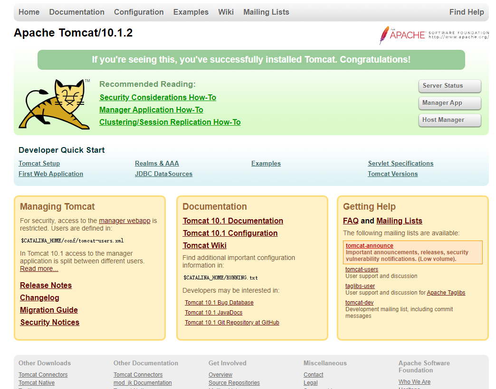

​    思考问题：我们以后要部署项目，如果每次都要进入容器是不是十分麻烦？我要是可以在容器外部提供一个映射路径，webapps,我们在外部放置项目，就自动同步到内部就好了！

> 作业：部署es+kibana

```
# es 暴露的端口很多！
# es 的数据一般需要放置到安全目录！挂载
# --net somenetwork ? 网络配置

# 启动elasticsearch
(base) choi@DESKTOP-B1FCICA:~$ docker run -d --name elasticsearch -p 9200:9200 -p 9300:9300 -e "discovery.type=single-node" elasticsearch:7.7.0
# 启动了之后linux系统就卡住了（1核2g），es是十分耗内存的。
# 测试一下es是否成功启动
(base) choi@DESKTOP-B1FCICA:~$  curl localhost:9200
// 20221204184838
// http://127.0.0.1:9200/

{
  "name": "65866eac8d5c",
  "cluster_name": "docker-cluster",
  "cluster_uuid": "ykjH6wbvTYegttGzqFw6bQ",
  "version": {
    "number": "7.7.0",
    "build_flavor": "default",
    "build_type": "docker",
    "build_hash": "81a1e9eda8e6183f5237786246f6dced26a10eaf",
    "build_date": "2020-05-12T02:01:37.602180Z",
    "build_snapshot": false,
    "lucene_version": "8.5.1",
    "minimum_wire_compatibility_version": "6.8.0",
    "minimum_index_compatibility_version": "6.0.0-beta1"
  },
  "tagline": "You Know, for Search"
}
(base) choi@DESKTOP-B1FCICA:~$  docker stats # 查看docker容器使用内存情况


```

```
#关闭，添加内存的限制，修改配置文件 -e 环境配置修改

(base) choi@DESKTOP-B1FCICA:~$  docker run -d --name elasticsearch01 -p 9201:9200 -p 9301:9300 -e "discovery.type=single-node" -e ES_JAVA_OPTS="-Xms64m -Xmx512m" elasticsearch:7.6.2


// 20221204185040
// http://127.0.0.1:9201/

{
  "name": "60a00db15979",
  "cluster_name": "docker-cluster",
  "cluster_uuid": "UiZOiT9HS9SMxp1jPe9eNA",
  "version": {
    "number": "7.6.2",
    "build_flavor": "default",
    "build_type": "docker",
    "build_hash": "ef48eb35cf30adf4db14086e8aabd07ef6fb113f",
    "build_date": "2020-03-26T06:34:37.794943Z",
    "build_snapshot": false,
    "lucene_version": "8.4.0",
    "minimum_wire_compatibility_version": "6.8.0",
    "minimum_index_compatibility_version": "6.0.0-beta1"
  },
  "tagline": "You Know, for Search"
}


```

```

```

## 可视化

- portainer（先用这个）
- Rancher（CI/CD时再用这个）

### 什么是portainer ?

Docker图形化界面管理工具！提供一个后台面板供我们操作！

```
DESKTOP-B1FCICA:~$ docker run -d -p 8088:9000 --restart=always -v /var/run/docker.sock:/var/run/docker.sock --privileged=true portainer/portainer
Unable to find image 'portainer/portainer:latest' locally
latest: Pulling from portainer/portainer
772227786281: Pull complete
96fd13befc87: Pull complete
0bad1d247b5b: Pull complete
b5d1b01b1d39: Pull complete
Digest: sha256:47b064434edf437badf7337e516e07f64477485c8ecc663ddabbe824b20c672d
Status: Downloaded newer image for portainer/portainer:latest
24fbfe25bbc7e9894535a3d7315bb49c31ce9a32446796315fa1e3d9652bb186
```

访问测试：[http://ip:8088](http://ip:8088/) admin 1234567890098

## 容器数据卷

### 什么是容器数据卷

#### docker的理念回顾

docker技术是将应用和环境打包成一个镜像！

数据？如果数据都在容器中，那么我们容器删除，数据就会丢失！（需求：数据可以持久化）Mysql，容器删了，删库跑路!

容器之间可以有一个数据共享的技术! Docker容器中产生的数据，同步到本地！

这就是卷技术！目录的挂载，将我们容器内的目录，挂载到Linux主机上面!

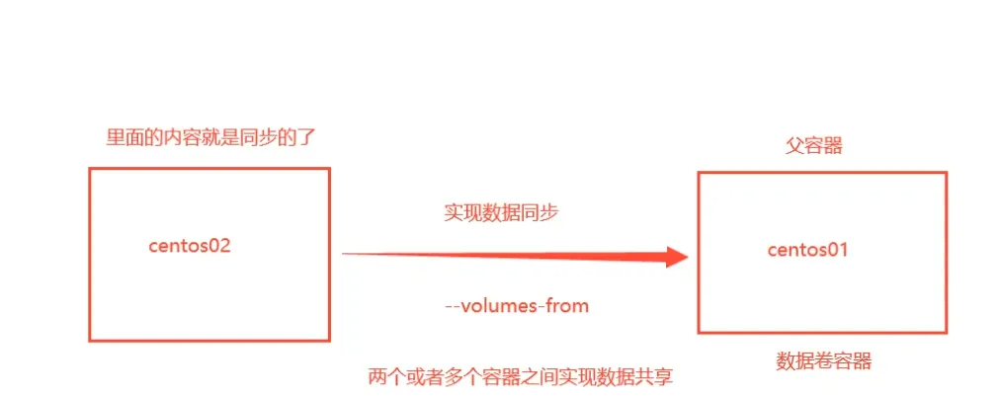

> 一句话总结：容器的持久化和同步操作！容器间也是可以数据共享的！


### 使用数据卷

直接使用命令来挂载   `-v`

```
C:\Users\choi>docker run -it -v d:/dockerdata:/home ubuntu /bin/bash

# 测试，查看容器信息
docker inspect 容器id
```

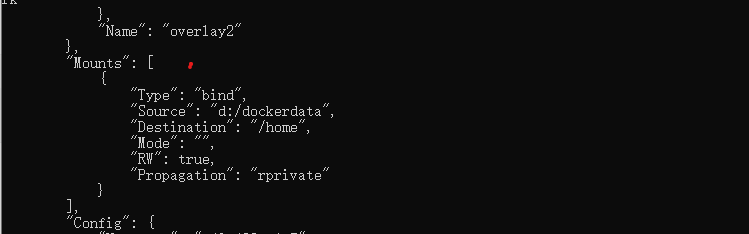

测试文件的同步：
在容器的/home文件夹下，新建test.java文件，会同步到主机的d:/dockerdata文件夹下。

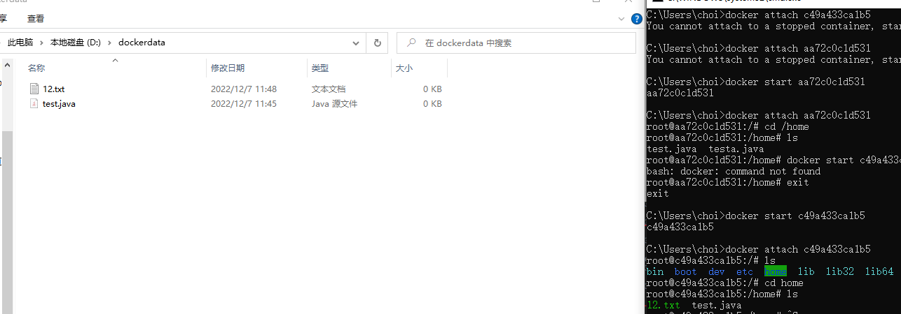

测试：停止容器后，在主机的d:/dockerdata文件夹下，修改文件或新增文件，启动容器，查看容器的/home文件夹，发现容器内的数据依旧是同步的

1. 停止容器。
2. 宿主机上修改文件。
3. 启动容器。
4. 容器内的数据依旧是同步的。

> 好处：我们以后修改只需要在本地修改即可，容器内会自动同步！|

### 实战：安装MySQL

思考：Mysql的数据

```
# 获取镜像
docker pull mysql:5.7
# 运行容器，需要做数据目录挂载。（安装启动mysql，注意：需要配置密码）
# 官方启动mysql
docker run --name some-mysql -e MYSQL_ROOT_PASSWORD=my-secret-pw -d mysql:tag
# 我们启动mysql（-e是环境配置）
-d 后台运行
-p 端口映射
-v 卷挂载

(base) choi@DESKTOP-B1FCICA:/home/mysql$ docker run -d -p 7777:3306 -v /home/mysql/conf:/etc/mysql/conf.d -v /home/mysql/data:/var/lib/mysql -e MYSQL_SQL_ROOT_PASSWORD=123456 --name mysql01 mysql:5.7


# 启动成功之后，我们在本地使用navicat来接测试一下。
# navicat连接到服务器的7777端口和容器内的3306映射，这个时候我们就可以连接上了！
# 在本地测试创建一个数据库，查看一下我们映射的路径是否ok！（OK的）


```

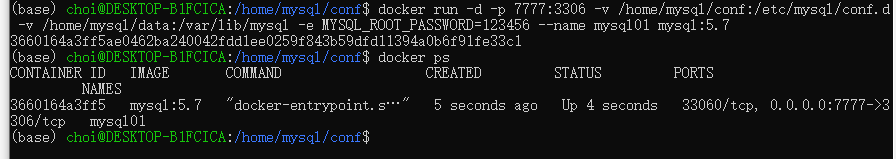

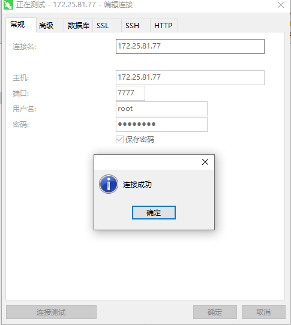

### 匿名和具名挂载

```
# 匿名挂载
docker run -d -p --name nginx01 -v /etc/nginx nginx
# 查看所有的volume的情况
[root@iZbp13qr3mm4ucsjumrlgqZ ~]# docker volume ls
DRIVER    VOLUME NAME
local     964b8e505f12f65fb23fd21f05cfa9ecd6c2c6b2ca89c0e44f168bb017dfabd6
# 这种就是匿名挂载：我们在-v挂载目录时，只写了容器内的路径，没有写容器外的路径。
# 具名挂载
[root@iZbp13qr3mm4ucsjumrlgqZ ~]# docker run -d -p 3344:80 --name nginx02 -v juming-nginx:/etc/nginx nginx
[root@iZbp13qr3mm4ucsjumrlgqZ ~]# docker volume ls
DRIVER    VOLUME NAME
local     964b8e505f12f65fb23fd21f05cfa9ecd6c2c6b2ca89c0e44f168bb017dfabd6
local     juming-nginx
# 通过 -v 卷名:容器内的路径（具名挂载）
# 查看一下这个卷
```


```
# 如何确定是具名挂载，还是匿名挂载，还是指定路径挂载
-v 容器内的路径                # 匿名挂载
-v 卷名:容器内的路径        # 具名挂载
-v /宿主机路径:容器内路径    # 指定路径挂载
```

扩展

```
# 通过 -v 容器内的路径:ro    rw    改变读写权限
ro    read only    # 只读
rw    read write    # 可读可写
# 一旦设置了容器权限，容器对我们挂载出来的内容就有了限定。
docker run -d -p 3344:80 --name nginx02 -v juming-nginx:/etc/nginx:ro nginx
docker run -d -p 3344:80 --name nginx02 -v juming-nginx:/etc/nginx:rw nginx
# 只要看到ro就说明这个路径只能通过宿主机来操作，容器内部是无法操作！
```

### 初识Dockerfile

Dockerfile就是用来构建 docker 镜像的构建命令！命令脚本！先体验一下！
通过这个脚本可以生成镜像，镜像是一层一层的，脚本一个一个的命令，每个命令都是一层！

```
docker build -f ./dockerfile1 -t choi.centos:1.0 .
```

```
# 创建一个dockerfile文件，名字可以随机，建议dockerfile
# 文件中的内容：指令都是大写
FROM centos
VOLUME ["volume01","volume02"]
CMD echo "-----end-----"
CMD /bin/bash
# 这里的每个命令，就是镜像的一层。


```

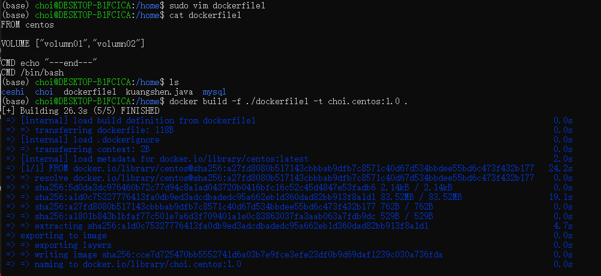

启动容器：

```
docker run -it cce7d725470b /bin/bash
```

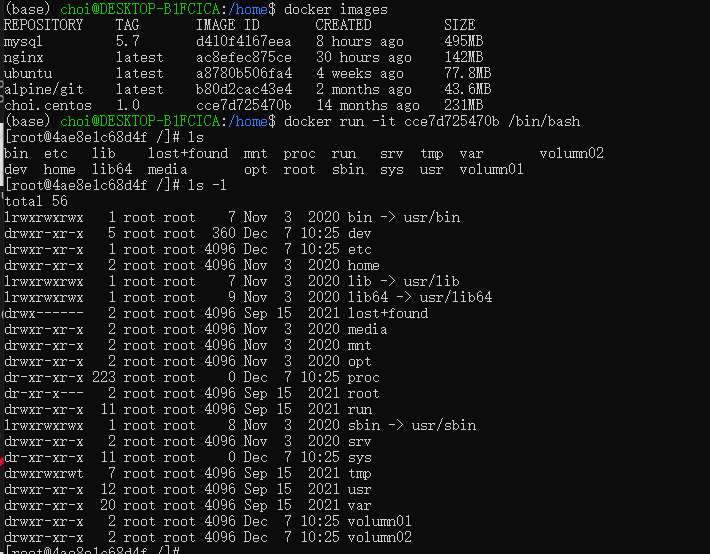

查看一下卷挂载的路径：`docker inspect 4ae8e1c68d4f`

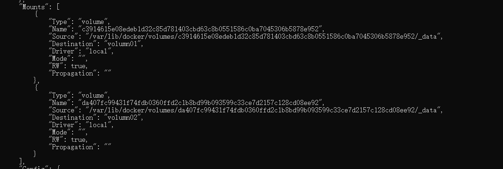

### 数据卷容器


多个mysql同步数据

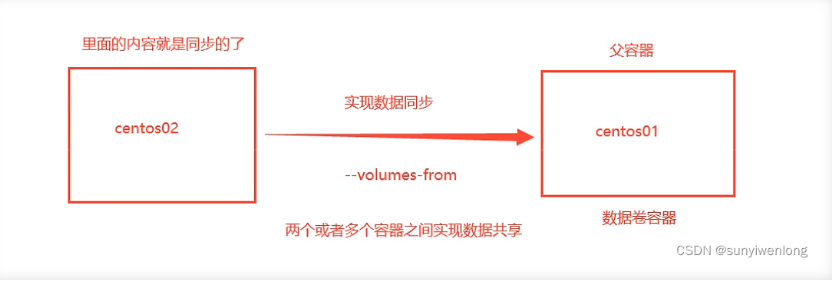

```
# 启动3个容器，通过我们刚才自己的写镜像启动。
```


```
# 测试：可以删除docker01，查看一下docker02和docker03是否还可以访问这个文件
# 测试依旧可以访问
```


多个mysql实现数据共享：

```
[root@iZbp13qr3mm4ucsjumrlgqZ ~]# docker run -d -p 7777:3306 -v /home/mysql/conf:/etc/mysql/conf.d -v /home/mysql/data:/var/lib/mysql -e MYSQL_ROOT_PASSWORD=123456 --name mysql01 mysql:5.7
[root@iZbp13qr3mm4ucsjumrlgqZ ~]# docker run -d -p 7777:3306 -e MYSQL_ROOT_PASSWORD=123456 --name mysql02 --volumes-from mysql01 mysql:5.7
# 这个时候，可以实现两个容器数据同步！
```

结论：
容器之间配置信息的传递，数据卷容器的生命同期一直持续到没有容器使用为止。
但是一旦你持久化到了本地，这个时候，本地的数据是不会删除的！

推荐参考学习：https://www.cnblogs.com/liuyuelinfighting/p/16043559.html

## DockerFile

### DockerFile介绍

dockerfile是用来构建dockerfile镜像的文件！命令参数脚本！

构建步骤：

1. 编写一个dockerfile文件
2. docker build 构建成为一个镜像
3. docker run 运行镜像
4. docker push发布

### DockFile的构建过程

#### 基础知识

1. 每个保留关键字（指令）都是必须是大写字母
2. 执行从上到下顺序执行
3. #表示注释
4. 每个指令都会创建提交一个新的镜像层，并提交！


dockerfile是面向开发的，我们以后要发布项目，做镜像，就需要编写dockerfile文件，这个文件十分简单！
Docker镜像逐渐成为企业交付的标准，必须要掌握！
步骤：开发，部署，运维。。。缺一不可！|
DockerFile：构建文件，定义了一切的步骤，源代码。
Dockerlmages：通过DockerFile构建生成的镜像，最终发布和运行的产品。
Docker容器：容器就是镜像运行起来提供服务的。


####  DockerFile的命令

```
FROM 		# 基础镜像，一切从这里开始构建
MAINTAINER 	# 镜像是谁写的：姓名+邮箱
RUN			# 镜像构建的时候需要运行的命令
ADD         # 步骤：tomcat镜像，这个tomcat压缩包！添加内容
WORKDIR		# 镜像的工作目录
WOLUME		# 挂载的目录
EXPOSE		# 保留端口配置
CMD			# 指定这个容器启动的时候要运行的命令，只有最后一个会生效，可被替代
ENTRYPOINT	# 指定这个容器启动的时候要运行的命令，可以追加命令
ONBUILD		# 当构建一个被继承DockerFile这个时候就会运行ONBUILD的指令。触发指定
COPY		# 类似ADD,将我们文件拷贝到镜像中。
ENV			# 构建的时候设置环境变量。·
```

### 实战测试

Docker Hub 中99% 镜像都是从这个基础镜像过来的`FROM Scratch`,然后配置需要的软件


> 创建一个自己的文件

```
FROM centos
MAINTAINER choi<297495363@qq.com>

ENV MYPATH/usr/local
WORKDIR $MYPATH

RUN yum -y install python
RUN yum -y install redis

EXPOSE 80

CMD echo $MYPATH
CMD echo "-----end------"
CMD /bin/bash-----end------

~                                                                                                                                                                                       ~                                
```

## 参考文献：

1. https://www.kuangstudy.com/bbs/1552836707509223426