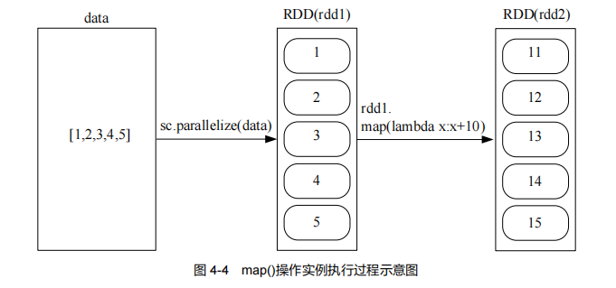

# 1. 第4章　RDD编程 :id=cp_4
---

## 本章学习内容：

1、RDD的创建方法、各种操作APP以及持久化和分区方法；
2、RDD的各种操作
3、RDD编程案例实现

**RDD是什么？**

- Spark核心概念
- 一个只读的、可分区的分布式数据集
- 可全部或部分缓存在内存中，在多次计算间重用。
- RDD API 采用scala语言实现

## RDD编程基础

本节介绍RDD编程的基础知识、包括RDD的创建、操作、API、持久化和分区等。

### RDD 创建

#### 1. 从文件系统中加载数据创建RDD

1) 本地文件系统加载数据

- pyspark交互式环境中，执行如下命令

```
>>> lines = sc.textFile("file:///opt/spark/data/word.txt")
>>> lines.foreach(print)
Spark is better                                                     (0 + 2) / 2]
Hadoop is good 
Spark is fast 

```
在上述语句中，使用了 Spark 提供的 `SparkContext` 对象，名称为 `sc`，这是 `pyspark` 启动的时候自
动创建的，在交互式编程环境中可以直接使用。如果是编写独立应用程序，则可以通过如下语句生成 `SparkContext` 对象：

```shell
from pyspark import SparkConf,SparkContext
conf = SparkConf().setMaster("local").setAppName("My App")
sc = SparkContext(conf = conf)
```

2) 从分布式文件系统HDFS中加载数据 

先满足hadoop已运行正常 
```shell
root@datawhale001:/opt/spark/data# jps
539225 SparkSubmit
536177 NodeManager
535378 SecondaryNameNode
535012 DataNode
545460 Jps
534758 NameNode
536007 ResourceManager
```
这里使用python运行，使用`pyspark`命令如下：
```shell
root@datawhale001:/opt/spark/bin# pyspark  

....省略
Welcome to
      ____              __
     / __/__  ___ _____/ /__
    _\ \/ _ \/ _ `/ __/  '_/
   /__ / .__/\_,_/_/ /_/\_\   version 3.2.0
      /_/

Using Python version 3.10.6 (main, Nov 14 2022 16:10:14)
Spark context Web UI available at http://datawhale001:4040
Spark context available as 'sc' (master = local[*], app id = local-1678254096249).
SparkSession available as 'spark'.
>>> lines = sc.textFile("hdfs://datawhale001:9000/README.txt")
>>> lines.foreach(print)
hello world                                                         (0 + 2) / 2]
hello spark
hello hadoop
hello spark
hello hdfs

```

#### 通过并行集合（列表）创建 RDD

可以调用 `SparkContext` 的 `parallelize` 方法，从一个已经存在的集合（列表）上创建 RDD（见图
4-2），从而可以实现并行化处理，命令如下：
```shell
>>> array = ["hello world","this is a spark programing","spark is fast","spark is better"]
>>> rdd = sc.parallelize(array)
>>> rdd.foreach(print)
spark is fast
spark is better
hello world
this is a spark programing
```

## RDD 操作 

RDD操作包括两种类型：**转换（Transformation）操作**和 **行动(Action)操作**。

1. 转换操作 

- 每一次转换操作都会产生不同的RDD,供给下一个操作者使用。
- RDD的转换过程是惰性求值的，整个转换过程只是记录了转换的轨迹，并不会发生真正的计算，只有遇到行动操作时，才会触发“从头到尾”的真正的计算。

**RDD转换操作API:**

- filter(func): 筛选出满足函数func的元素，并返回一个新的数据集。
- map(func)：将每个元素传递到函数func中，并将结果返回为一个新的数据集。
- flatMap(func)：与map()相似，但每个输入元素都可以映射到0或多个输出结果。
- groupByKey()：应用于(K,V)键值对的数据集时，返回一个新的（K,Iterable）形式的数据集。
- reduceByKey(func)：应用于（K,V）键值对的数据集时，返回一个新的(K,V)形式的数据集，其中每个值是将每个key传递到函数func中进行聚合后的结果。

（1）filter(func)

```shell
root@datawhale001:/opt/spark/data# cat word.txt
Hadoop is good 
Spark is fast 
Spark is better

>>> lines = sc.textFile("file:///opt/spark/data/word.txt") # 生成RDD 
>>> linesWithSpark = lines.filter(lambda line: "Spark" in line) # 匿名函数 ，Lambda 表达式 筛选行符合条件的的行元素
>>> linesWithSpark.foreach(print)
Spark is better                                                     (0 + 2) / 2]
Spark is fast 

```

（2）map(func)

map(func)操作将每个元素传递到函数func中，并将结果返回为一个新的数据集。例如：

```shell
>>> data = [1,2,3,4,5]
>>> rdd1 = sc.parallelize(data) # 从列表 data 中生成一个 RDD
>>> rdd2 = rdd1.map(lambda x:x+10)
>>> rdd2.foreach(print)                                                         
11
12
13
14
15
```



```shell

```
