# 第一章 解决企业财务报表 :id=cp_1
```html
声明：本文内容是学习吴世农、吴育辉编写书籍《CEO财务分析与决策（第二版）》笔记记录，仅用于个人学习，研究，不传播，不用于商业用途；
```


> 不懂得财务报表的经营管理者，就好像是一个会投篮而不会得分的球员。  ---美国著名财务学家希金斯（Robert C.Higgins，2003）

## 第一节、财报报表的战略意义 :id=cp_101


所谓的财务报表，主要是指资产负债表、利润表和现金流量表，俗称“三表”。它们是企业按照企业会计准则编制出来的，向企业的股东、债权人、董事会、管理者和政府有关部门（如税务局）报告企业在过去某一时点财务状况和一段时期经营业绩的正式文件。

财务报表集中地反映了企业在过去某一时点（月、季、半年、年）的财务状况和一段时期的经营管理成果，是企业未来进行经营管理决策的重要依据。企业的董事会和高层管理者可以依据企业的财务报表评价企业过去一段时期的业绩，
调整和制定企业下一时期的经营计划、经营政策和财务政策，计算和评判高层管理者的业绩和给予薪酬激励的合理性等

财务分析是一项比较专业的工作，任何涉及企业财务状况的评价，都应该基于科学的分析，而不是表层现象的简单叙述。


知识小提示：品牌資產的價值=企業的凈利潤×品牌強度，参考文献。
- [品牌价值的评估标准有哪些](https://www.zhihu.com/question/19634445)
- [四種品牌價值品牌資產評估模型](https://zgogo.tw/brands-value-model/)

## 第二节、解读资产负债表  :id=cp_102

### 基本公式
资产负债表基本公式： 资产 = 负债 + 所有者权益

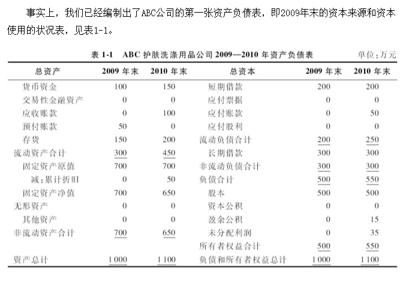

### 解读资产负债表

表1-1表明了ABC这家新创立的公司从首次筹资到首次投资，到生产经营一年后的全部资产使用和资本来源的状况，即2009—2010年末的资产负债表。在解读和分析资产负债表时，必须注意如下几个问题：

 第一，资产负债表的表格形式可以是“直列式”，也可以是“并列式”。

 第二，并列式资产负债表中，右边表示：资本的来源，资本来源于负债和所有者权益，反映了公司的筹资政策和效果；左边表明资本的使用结果，即资本的使用结果形成了流动资产和长期资产，反映了公司的投资政策和资产配置的效果。

 第三，在资产负债表中有三种重要的结构：

- 一是“资本结构”，反映各种资本的来源及其比例关系，例如，负债和所有者权益的比例关系，长期负债和短期负债的比例关系，所有者权益和长期负债的比例关系，有息负债和无息负债的比例关系。 
- 二是“资产结构”，反映了公司各种资产之间的比例关系，例如，流动资产与非流动资产的比例关系，流动资产中各项资产的比例关系，非流动资产中各项资产的比例关系，流动资产中现金资产与非现金流动资产的关系。 
- 三是“股权结构”，反映了公司投入资本与留存收益之间的关系、股本与资本溢价之间的关系。

第四，在流动资产这一栏目中，流动资产的各项资产按照其变现能力的高低，从高到低依序逐项排列。
      
排列依次：货币资金（现金和银行存款）> 交易性金融资产 > 存货

排列优势：有助于管理者和银行观察和分析公司流动资产的变现能力

> 比较流动资产与流动负债之间的关系，可以反映公司流动资产的变现能力和短期债务的偿还能力。

第五，当企业开始正式生产和销售时，就不可避免地产生了一些应收应付款和预收预付款。当应收款和预付款的总额超过应付款和预收款的总额，说明公司的资本（金）被他人无偿占用，从而增加了公司总的资本占用；当应收款和预付款的总额少于应付款和预收款的总额，说明公司无偿地占用了他人的资本（金），从而减少了公司总的资本占用。

> “占用资本”或“投入资本”（Invested Capital）是指企业需要支付成本的资本，而不需要支付成本的资本不在其中。

第六，在中国，权益资本除了“股本”和“未分配利润”，还有“资本公积”和“盈余公积”。其中，未分配利润、资本公积和盈余公积三者之和可视为国外的“留存利润”或“留存收益”。其中，盈余公积又分为“法定盈余公积”和“任意盈余公积”，法定盈余公积是按照公司税后利润的10%提取，法定盈余公积累计额达到注册资本的50%时可以不再提取。法定盈余公积主要用于弥补未来公司可能发生的亏损或转增资本。任意盈余公积则是上市公司按照股东大会的决议提取。

第七，资产负债表中的所有数据都是“时点数据”，表明在某一特定时点，如年末（12月31日）或上半年末（6月30日），公司的资本来源和资本使用状况，但不能反映公司1年期间或半年期间公司的资本来源和资本使用状况，因此是一种“静态数据”或“静态信息”。

## 第三节、解读利润表 :id=cp_103

### 定义

利润表，又称损益表，是一张反映公司销售收入、成本、费用、所得税和盈利关系的报表，它表明公司在过去一段时期，例如一个季度、半年或一年，通过销售产品或提供服务所确认或获得的销售收入和与之相应的成本及利润。

编制利润表的基本公式是：

净利润=营业收入-营业成本-营业税金及附加 -（销售费用+管理费用+财务费用）-资产减值损失 +公允价值变动收益+投资收益+营业外收支-所得税费用

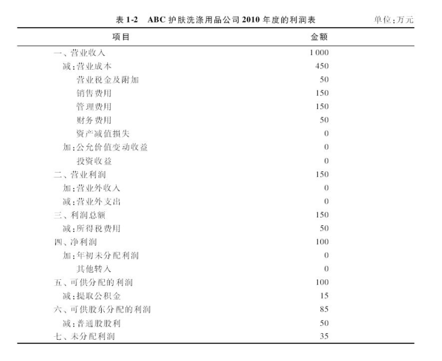


### 解读利润表

第一，利润表反映了公司的营业收入、总成本和利润之间的关系。当营业收入高于总成本时，企业就有盈利；反之，当营业收入低于总成本时，企业就发生亏损。

第二，利润表反映了股东和债权人之间的风险和收益的关系，也反映了企业和政府之间的关系。
- 债权人：拥有对公司的债权，因此获得利息作为其所拥有债权的回报；
- 政府：由于为企业提供公共管理而获得了税收；
- 股东：获得公司最后的剩余收益，即税后利润；

> 债权人由于拥有债权而获得的利息是在税前开支了，优先于股东获得回报；而股东虽然拥有股权，其所获得的利润却是税后的剩余收益。可见，同是出资人，债权人的收益是税前所得，而股东的收益是税后所得，所以股东承受的风险高于债权人承受的风险。

第三，在利润表中，公司的盈利状况可以表现为多个不同的盈利指标，其中：

  - ①营业利润等于公司的营业收入减去营业成本、营业税金及附加、“三项费用”（销售费用、管理费用和财务费用）及资产减值损失，再加上公允价值变动收益和投资收益；
  

  - ②利润总额，即税前利润，等于公司的营业利润加上公司的营业外收入减去营业外支出；
   

  - ③息税前利润（Earnings Before Interest&Taxes），即EBIT，等于公司的利润总额加上财务费用；
  

  - ④税后EBIT，即EBIT（1-所得税税率），实际上等于公司的税后利润加上税后利息费用或税后财务费用；
   

  - ⑤净利润，即税后利润，等于利润总额扣除所得税费用；
  

  - ⑥对于固定资产投资数额巨大的基础设施企业，如水、电、路、桥、通信等公用服务企业，由于这类企业每年的折旧和摊销费用巨大，而折旧和摊销费用是企业的“非付现成本”
     其作为成本的一部分计入产品的总成本，但又通过销售收入转化为现金回到企业，是企业经营净现金的重要组成部分， 因此需要计算另一个重要而特殊的盈利指标——息税前利润加折旧及摊销（Earnings Before Interest&Taxes plus Depreciation&Amortization），即EBITDA，俗称“现金利润”。
   


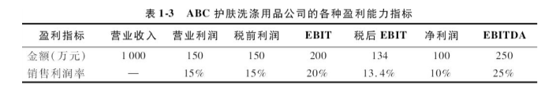

第四，在利润表中，企业的利润受到如何确认销售收入的影响。

表 1-3 当ABC公司的EBITDA小于税前经营净现金时，说明公司应收账款小于应付账款，占用了供货商的资金，或存货减少导致占用资金减少；反之，当EBITDA大于税前经营净现金时，说明公司应收账款大于应付账款，其资金被客户占用了，或存货增加导致资金占用增加。

第五，在利润表中，企业的利润还受到如何计算每年的固定资产折旧费用的影响。

确定某项特定固定资产的年折旧金额时，受到三个因素的影响：

    一是资产的使用年限，许多资产的物理生命周期长于其经济生命周期；
    二是资产的残值，即折旧年限到期后资产的剩余价值；
    三是年折旧费用的计算方法。

年折旧费用的计算有两种基本方法 ：

    一是直线折旧法，即年平均折旧费用=（资产的价值-残值）/资产使用年限；
    二是加速折旧法，具体有很多计算方法，但总的思路是一样的，即在资产使用年限内，前一年比后一年的折旧额多，每年的折旧额随着时间的推移而逐年减少直至等于资产的残值。

## 第四节、解读现金流量表 :id=cp_104

企业总的现金净流量，简称“总现金净流量”的计算公式如下：

> 企业总现金净流量=经营活动产生的现金流量净额+投资活动产生的现金流量净额+筹资活动产生的现金流量净额

### 概述

在编制利润表的时候，由于现行的会计制度采取的不是现金收付制，而是权责发生制，即企业是根据是否提供或取得产品或劳务来确认销售收入和成本支出，而不是根据是否收到现金或是否支付现金来确认销售收入和成本支出，这就可能导致企业的销售收入不等于现金收入，成本支出不等于现金支出，净利润不等于净现金收入。

无论是企业的利润表，还是企业的资产负债表，都没有反映企业具体的现金收支状况。但是，恰恰是被忽略的现金收支状况，可能是影响企业财务状况的主要因素，甚至是决定企业未来生存与发展的关键因素。实际上，现金比利润更加重要，企业必须重视现金，故有`“现金为王”（Cash is King）`之说！

企业的现金来源和去向与企业的经营、投资和筹资活动相关。

根据企业现金的来源进行分类，企业的现金流入主要有三个来源：
- 第一类是经营活动产生的现金流入；
- 第二类是投资活动产生的现金流入；
- 第三类是筹资活动产生的现金流入。

根据企业现金的去向进行分类，企业的现金流出也主要有三个去向：

- 第一类是经营活动产生的现金流出；
- 第二类是投资活动产生的现金流出；
- 第三类是筹资活动产生的现金流出；

企业经营活动、投资活动和筹资活动的现金流入、流出和净流量的关系，基于这样一个框架图：
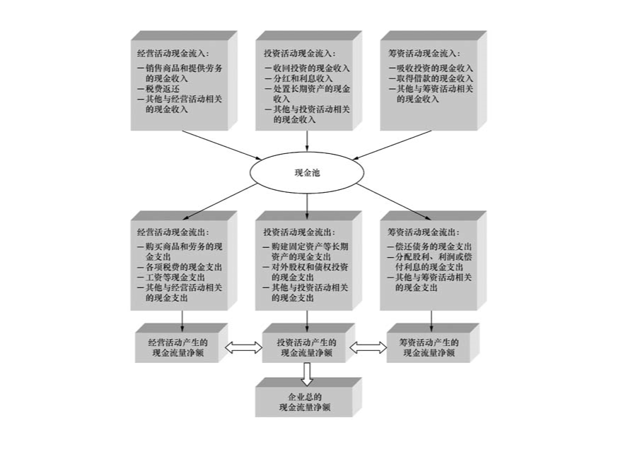

### 解读经营活动产生的现金流量

> 经营活动产生的现金流量净额又简称为 *“经营净现金”*。
> 
经营活动产生的现金流量是指企业在经营活动过程中形成的`现金流入`、`现金流出`和`现金净流量`。
- 现金流入主要包括：销售商品、提供劳务收到的现金；收到的税费返还；收到的其他与经营活动有关的现金等。
- 现金流出主要包括：购买商品、接受劳务支付的现金；支付给职工以及为职工支付的现金；支付的各项税费；支付的其他与经营活动有关的现金等。
- 现金流量净额是指现金流入与现金流出之差，公式：经营活动产生的现金流量净额 = 经营活动现金流入 - 经营活动现金流出。

**如何计算经营净现金呢？**

- 一种是间接法
- 另一种是直接法

在《企业会计准则第31号——现金流量表》中明确规定企业应当采用直接法列示经营活动产生的现金流量；但是在其他很多国家和地区，公司可以采用间接法编制现金流量表。）对于非财务专业的CEO和高级管理人员，按照间接法计算经营净现金更加直观、容易理解和接受。

**间接法**

企业应该获得的经营净现金。由于经营净现金有税前和税后之分，其公式如下：

> 应得税后经营净现金 = 税后利润+利息+折旧+摊销+资产减值损失　

> 应得税前经营净现金=EBIT+折旧+摊销+资产减值损失　

我国在税后利润基础上编制现金流量表，所以得到的是税后经营净现金；欧美国家在息税前利润（EBIT）基础上编制现金流量表，所得到的是税前经营净现金，然后扣除上缴所得税，即得到税后经营净现金。


遗憾的是，上述公式所描述的是**理想经营状态**中企业的经营净现金。

**在实践中，企业的销售收入不一定能收到如数的现金，企业的成本支出也不一定全是现金支出，因此净利润不等于经营净现金。**

- 现有企业的利润表编制方法不是采取现金收付制，而是采取权责发生制，因此就需要编制现金流量表作为利润表的补充，从而说明利润的质量——企业所实现的利润是否具有现金保证？

- 企业是否将应该获取的经营净现金如数收回？
  
- 企业是否因竞争劣势被他人占用现金或因库存激增导致经营净现金下降？
  
- 那么，如何在理想状态企业的经营净现金基础上，调整计算一般状态企业的经营净现金呢？

**首先** 区别于现金收付制，权责发生制在确认销售收入的时候，基于卖方是否已提供产品或劳务，而不是买方是否向卖方支付货款，根据实际情况由此可以推出：

- （1）当企业应收账款`增加`，其经营净现金`减少`，反之增加；
- （2）当企业预付账款`增加`，其经营净现金`减少`，反之增加；
- （3）当企业库存`增加`，其经营净现金`减少`，反之增加；
- （4）当企业应付账款`增加`，其经营净现金`增加`，反之减少；
- （5）当企业预收账款`增加`，其经营净现金`增加`，反之减少。

因此，对于一般状态的企业，其**实际获得的经营净现金**的计算公式是：
> 实际税后经营净现金=（税后利润+利息+折旧+摊销+资产减值损失）
-（应收账款增加额+预付账款增加额+库存增加额
-应付账款增加额-预收账款增加额）　（1-9）
> 
> 实际税前经营净现金=（EBIT+折旧+摊销+资产减值损失）
-（应收账款增加额+预付账款增加额+库存增加额
-应付账款增加额-预收账款增加额）　（1-10）


**因此**，在应得税后经营净现金（税后利润+利息+折旧+摊销+资产减值损失）的基础上，我们可以来调整计算公司实际的经营活动净现金。

如表1-4第一栏所示。 根据ABC公司利润表中的净利润和财务费用等数据及资产负债表中的库存、应收款、应付款、预收款和预付款增加额等数据。
我们可以计算该公司2010年的实际税后经营净现金为150万元，见表1-4第二栏。
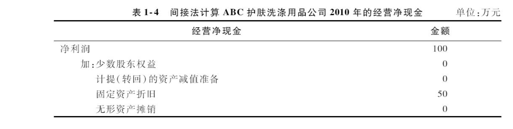
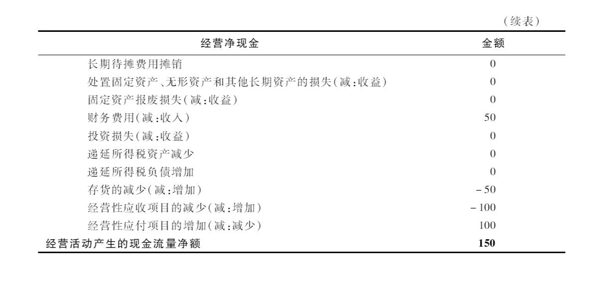


**直接法**

**经营净现金**和**实际经营净现金**这两个指标的比值来反映公司的**盈利**质量，并将该指标称为`获现率指标`，用公式表示如下：
     
> 获现率 = 实际经营净现金 / 应得经营净现金　（1-11）

在实际计算获现率指标时，我们还需调整除财务费用之外的其他非经营性收益对税后利润的影响，如处置`固定资产等长期资产的损失`、`投资收益`、`公允价值变动损失`等，
这些将影响公司的应得经营净现金和实际经营净现金，并最终影响获现率指标。


经营活动净现金是企业通过日常经营活动获取的现金，企业每天的经营活动都会发生现金流入和流出，具有频发性的特点。

若`经营活动净现金>0`，说明企业可以为未来的经营与发展提供稳定的现金支持，例如，增加投资、偿还负债或增加分红等，结果是企业持续健康发展；

若`经营活动净现金<0`，企业则可能需要通过不断筹资或减少投资来弥补经营活动所需的现金，例如，增加负债、增发新股、减少投资或减少分红等;

若失去举债和增资扩股的条件，结果可能导致企业经营规模不断萎缩，甚至发生债务危机。

因此，如果说“**现金为王**”，那么**经营活动的净现金**就是“**王中王**”（King of Kings），是企业生存和发展的血脉！

正因如此，从功能上来看，我们称经营活动净现金是“造血型现金”。

当然，还有一些公司常年来其经营净现金为负数，说明公司不仅无法通过经营活动创造经营净现金，无法“造血”，反而“失血”，这类企业我们称之为“失血型公司”。


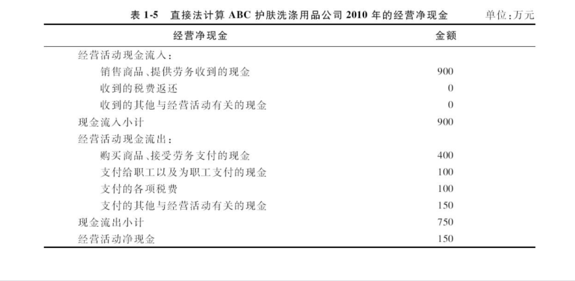

### 解读投资活动产生的现金流量

> 投资活动产生的现金流量净额，简称“**投资净现金**”


投资活动产生的现金流量是指企业通过投资活动形成的现金流入、现金流出和现金净流量。

**现金流入包括：**收回投资收到的现金，取得投资收益收到的现金，处置各类固定、无形资产或长期资产收回的现金，处置子公司及其他营业单位收到的现金和其他与投资活动相关的现金；

**现金流出包括：**购置各类固定、无形资产或长期资产的现金支出，投资支付的现金，取得子公司及其他营业单位支付的现金和支付其他与投资活动相关的现金。

投资活动产生的现金流量净额就是**流入与流出之差**，即
> 投资活动产生的现金流量净额=投资活动现金流入-投资活动现金流出　（1-12）


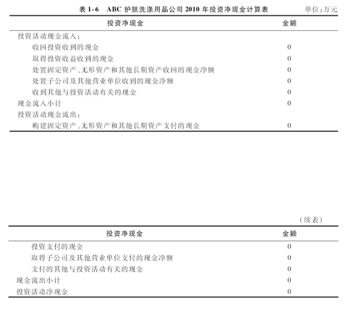

不同的企业、在不同的发展阶段可能表现出不同的投资净现金。

- **初创企业或快速成长企业:** 由于投资多、分红少，投资净现金通常是`负数`；
  
- **趋于成熟的企业:** 由于投资少、分红多、偿债多，投资净现金通常是`负数`。
  
- **收购兼并和投资买卖企业:** 投资`效益好`的公司，投资净现金通常是`正数`；
  
- **收购兼并和投资买卖企业:** 投资`效益差`的公司，投资净现金通常是`负数`。
  

一般来说，随着产业生命周期越来越短，企业必须不断去寻求新的投资机会，因此，**多数企业的投资净现金是`负数`**。

正因如此，从功能上来看，我们又称**投资净现金为“`放血型现金`”。**
```html
     有一些公司因经营管理不善，经营净现金严重短缺，同时失去举债和增资扩股的条件，
     不得不拍卖公司现有的资产或股权，获得投资净现金，此时其投资净现金为正数，这类公司我们称之为 “吸血型公司” 

```

### 解读筹资活动产生的现金流量

```html
筹资活动产生的现金流量净额，简称“筹资净现金”
```
筹资活动产生的现金流量是指企业通过筹集资金形成的现金流入、现金流出和现金净流量。

**现金流入包括：**吸收投资收到的现金，取得借款收到的现金，收到其他与筹资活动有关的现金；
  
**现金流出包括：**偿还债务支付的现金，分配股利、利润或偿付利息支付的现金，支付其他与筹资活动有关的现金。

筹资活动产生的现金流量净额就是流入与流出之差，即
> 筹资活动产生的现金流量净额=筹资活动现金流入-筹资活动现金流出　（1-13）


筹资活动产生的现金流量净额，简称“筹资净现金”，其计算方法如表1-7第一栏所示。根据ABC公司2010年的利润表和资产负债表，ABC公司在2010年发生利息费用50万元和股利支付50万元，所以其筹资净现金为-100万元，如表1-7第二栏所示。

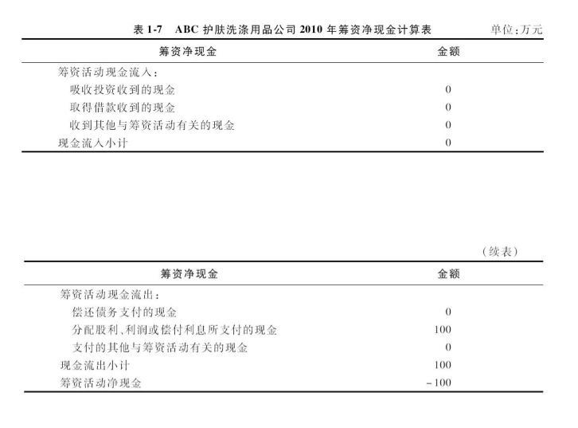


由表1-7可见，筹资活动现金流入的来源主要是权益筹资和债务筹资，其选择结果将影响到企业的所有者权益与负债的比例，即负债状况。

筹资活动的现金流出主要是偿还到期债务和支付各项筹资费用、利息、股息等。值得注意的是：

首先，企业筹集的现金用于投资和增加营运过程所需的资金，

若投资后经营活动能够产生足够的经营净现金，则企业将步入良性发展轨道；

若投资后经营活动不能产生足够的经营净现金，则企业将陷入财务危机——无力还本付息和给予股东必要的回报。

此外，股息的支付情况反映出企业的分红政策，而分红政策的实施不仅受到企业盈利能力的影响，而且受到企业现金生成能力的影响。

对于那种有利润而无现金的企业，支付利息和支付股息意味着现金流出，一般情况这部分现金流出是依赖于经营净现金；

- 若经营净现金为负数，则只能依赖于投资净现金；
  
- 若投资净现金也为负数，则只能依赖于筹资净现金，从而将出现用股东的本金和银行的贷款支付股息和利息的异常现象。
  

长期以往，股东和债权人必将停止为企业提供权益资本和贷款，企业也就难以为继。

由此可见，筹资净现金实际上是权益筹资和债务筹资过程中发生的现金收入与支出的差，而股东和债权人只愿意为盈利且经营活动现金生成能力强的企业提供权益资本和债务资本，所以又称筹资净现金是**“输血型现金”**。

当然，存在少数的一些优秀企业，其盈利能力强且经营净现金多，其创造的经营净现金不仅可用于投资、分红、偿债，结果还有剩余，因此继续偿债，负债比例相当低，期末结余的现金十分丰厚，结局是：其分红派息和偿债所支出的现金多于其增资扩股和举债的现金，这类公司的筹资净现金为负数，属于**“献血型公司”**。


## 第五节、解读企业总的现金流量 :id=cp_105

企业总的现金流量由四大部分构成，其从总体上反映当年企业现金流入、流出和净流量的状况，同时反映了企业当年总现金的来源和构成。

> 企业总的净现金流量，又称“现金及现金等价物净增额”，等于经营净现金、投资净现金、筹资净现金和汇率变化对现金影响额这四个项目的总和。


表1-8第一栏就是企业当年总的净现金流量的计算表。根据表1-5至表1-7，2010年ABC公司总现金净流入量为50万元。这50万元增加的现金也反映在2010年ABC公司资产负债表中的流动资产的第一项“现金和银行存款”，可见ABC公司的现金从2009年的100万元增加到2010年的150万元，净增50万元的现金。

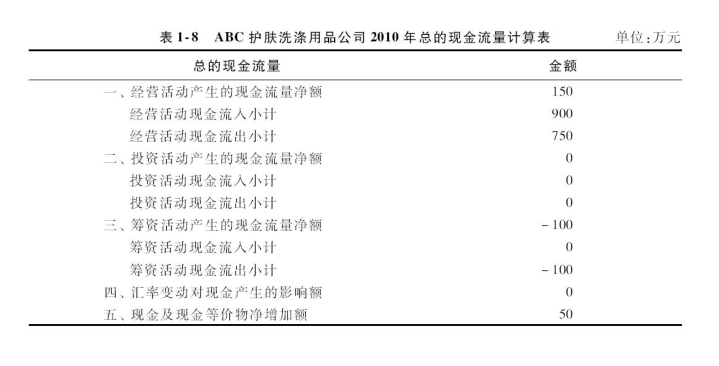

在资产负债表的现金栏目的数据，是企业年末的现金余额，反映了企业在年末所拥有的现金存量，是企业随时可以动用的现金。

企业年末的现金余额等于企业年初的现金余额，加上当年企业净增的现金流量。

显然，若企业当年净增的现金流量为正，则企业当年末的现金就会增加；

反之，若企业净增的现金流量为负，则企业当年末的现金就会减少。

- 绩优的公司其现金管理具有一个显著的特点：长期来看，其年末结余的现金越来越多，逐年增加；

- 绩差的公司其现金管理的特点则相反：年末结余的现金越来越少，逐年下降。

### 解读财务报表之间的关系

在解读完资产负债表、利润表和现金流量表之后，我们知道，资产负债表、利润表和现金流量表从不同角度反映了企业的资本来源和资本使用状况、经营成果和资金循环状况，但它们之间存在密切的联系，如图1-3所示。

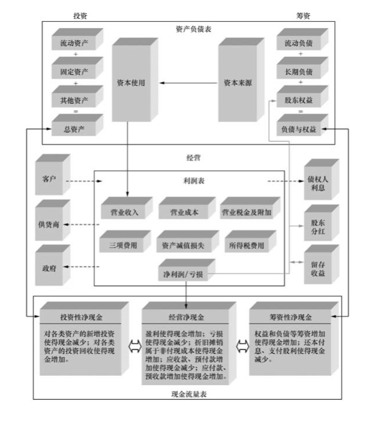

**企业财务报表之间的联系：**

第一，我们来分析一下资本是如何转化为资产的？

```html
企业通过向股东发行股票或受让股份获取权益资本，通过向债权人借款或发行债券获取债务资本，形成了资产负债表的右边，
其反映了企业的资本来源或筹资的结果，即来自股东的权益资本和来自债权人的负债。
由于企业高层管理者受托管理企业，负责将筹集的资本转化为资产，形成了资产负债表的左边，
其反映了企业资本的使用去向，表现为各种各样的资产，包括流动资产、固定资产和其他资产。
```

第二，我们来分析一下资产如何转化为营业收入和利润。

```html
企业高层管理者受托管理和经营资产负债表左边的那些资产，生产并出售产品或提供服务，
从而给企业带来营业收入，即利润表中的第一行，其受到产品价格和销售量的影响。
按照目前中国的企业会计准则，利润表就是在营业收入的基础上，扣除营业成本、营业税金及附加、三项费用（管理费用、营业费用、财务费用）、资产减值损失，
加上公允价值变动收益和投资收益，就得到营业利润。
营业利润加上营业外收入，扣除营业外支出，就得到利润总额，再扣除所得税费用，就是净利润。
我们可以将营业利润调整为息税前利润（EBIT），其将在政府、债权人和股东之间进行分配，政府获得所得税，债权人获得利息，股东获得净利润。
```


第三，我们再来分析一下筹资和投资（资产负债表的右边和左边）与经营（利润表）是如何影响企业现金流入和流出，从而形成企业总的现金流量。

```html
①当企业的权益资本或债务资本增加了，随之企业筹资性现金增加了。
②当企业投资增加，其长期性资产增加，但投资性现金减少了；反之，当企业收回投资或获得投资分红，其长期性资产减少，但产生现金收入，因此投资性现金增加了。
③当企业获得经营利润后，加上折旧和摊销，其经营性现金增加了；若亏损，其经营性现金将减少。
④当企业的营运资本需求量（应收款+预付款+存货-应付款-预收款）增加，经营性现金将减少；反之则增加。
⑤当企业分配经营利润，向债权人付息还本和支付股利给股东，使得筹资性现金减少；交纳税收使得企业的经营性现金减少。
```
## 总结
---

**本章小结** 

本章重点介绍三张财务报表的格式和基本原理，为掌握财务分析方法和财务管理理论及方法奠定基础。
> “三表”入手，由“表”及里。 企业的财务分析和财务管理，离不开“三张财务报表”。

财务报表涉及四大使用者：`股东`、`债权人`、`管理者`和`政府`。

**1，资产负债表**是一张反映企业资本来源和资本使用去向的财务报表，其基于“**总资产=负债+所有者权益**”这一平衡式来编制，该表说明企业的资本来源有两类：
- 一是来自`股东`的权益资本，
- 二是来自`债权人`的债务资本。

经营管理者将这些资本转化为资产，包括`流动资产`、`固定资产`和`无形资产`。
  
**2，利润表**是一张反映企业的`收入`、`成本`、`费用`、`所得税`和`利润关系`的财务报表，其说明了企业经营管理者使用了`股东`和`债权`人的资本所形成的资产带来的销售收入和利润，
因此是一张反映企业经营成果的财务报表。

**3，现金流量表**是一张反映企业现金流入和现金流出的财务报表，按照现金的来源和去向，其包括三类现金的流入和流出情况:
- 来自`经营活动`的现金流入和流出
- 来自`投资活动`的现金流入和流出
- 来自`筹资活动`的现金流入和流出

在权责发生制下，由于企业的销售收入不等于现金收入，成本支出不等于现金流出，加上企业有折旧和摊销之类的非付现成本，因此需要编制现金流量表来反映企业的现金变动情况。  
此外，在实践中，有利润而没有现金的企业往往陷入财务危机甚至破产，而利润低而现金充裕的企业则可安然生存甚至发展前景良好。
  
**可见，**在企业的生产经营活动中是“**现金为王**”！ 在三类现金中,  
如果经营净现金为`正`，说明企业的经营活动`带来了现金`；  
如果经营净现金为`负`，说明企业在经营活动中`损失了现金`；  
若企业在经营活动中不能带来正的经营性现金，其最终将失去投资机会和筹资机会，因此“**经营净现金是王中王**”！  

三张财务报表具有重要的关联关系，其从不同层面反映企业的“**资本—资产—销售—利润—现金**”的关系，从而全面而客观地揭示了企业实际的经营和财务状况。

