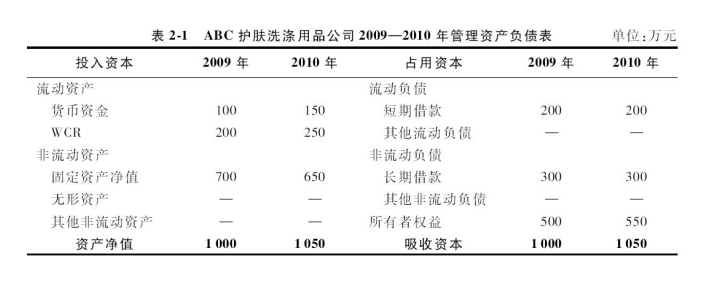
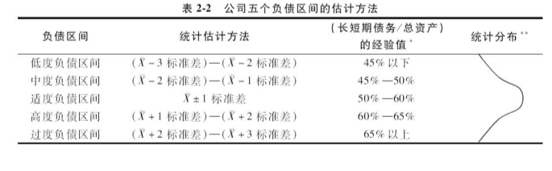
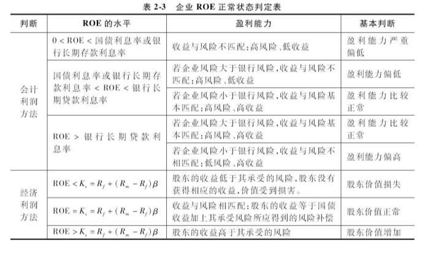
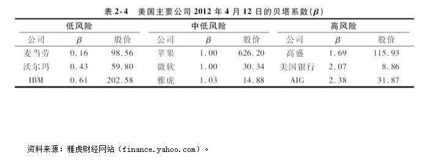
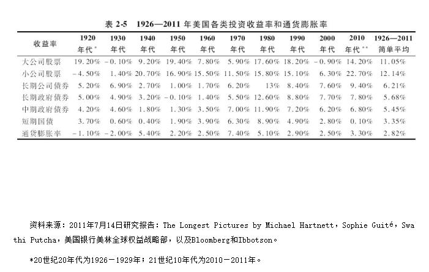
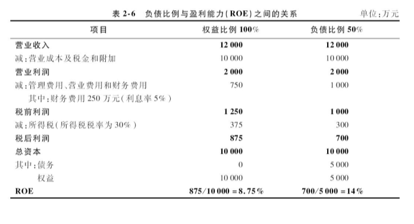
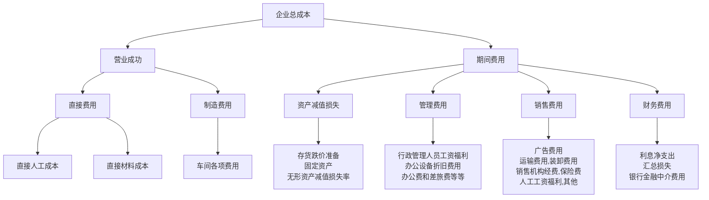
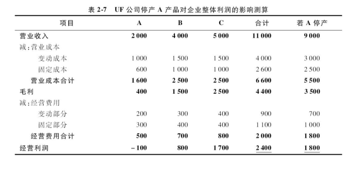
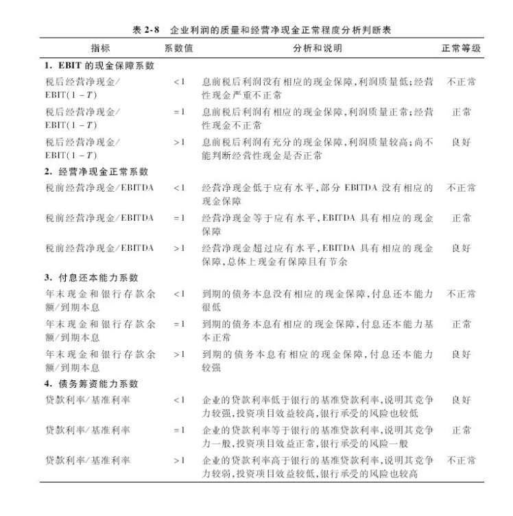

# 第二章　CEO解读企业财务报表 :id=cp_2
<p class="tip">  
声明：本文内容是学习吴世农、吴育辉编写书籍《CEO财务分析与决策（第二版）》笔记记录，仅用于个人学习，研究，不传播，不用于商业用途；
</p>

```md
Everything's going to work out. One way or another.
所有事情都将得到解决，这种不行就换一种方式。
``` 


## 第一节、CEO解读资产负债表 :id=cp_201


### 一、运资本管理与OPM战略 :id=cp_201_1

**思考：**

- 什么叫做营运资本呢？
- 为什么对营运资本进行有效管理可以取得经营上的成功呢？


解读资产负债表，首先应该关注公司的营运资本管理与OPM战略。

OPM是“Other People's Money”的简称，中文可以译为“无本经营战略”。

实际上，OPM是一种基于**营运资本管理战略**（Working Capital Management Strategy）的企业经营模式。

     OPM战略典范： 沃尔玛，世界上最大的计算机制造商之一戴尔，苏宁与国美堪称零售业中OPM战略的典范；茅台、五粮液、格力、美的、海尔等堪称制造业中OPM战略的典范。

营运资本需求量（Working Capital Requirement，WCR）计算公式：
$$ 
          WCR= 应收账款 + 存货 - 应付账款 (2-1)
$$

**公式解释** 

1、应收账款`增加`、存货`增加`、应付账款`减少`,则 **WCR**增长；

     表明公司的资金被购货商占用，自身却无法占用供货商的资金。
     因此，为了自身的发展，公司只能另想办法筹集资金来满足生产经营活动的需要。

2、应收账款`减少`、存货`减少`、应付账款`增加`,则 **WCR**减少；

     表明公司实施了有效的OPM战略，不仅减少了资金被购货商的占用，还有效地占用了供货商的资金。
     因此，公司现有的资金既能够满足公司生产经营活动的需要，还有富余的资金用于短期投资或者扩大生产经营的规模，从而提高公司的绩效。


**管理资产负债表**

管理资产负债表的原理无异于标准资产负债表：

- 右边合计数变化：“占用资本”或“吸收资本”，表示企业资本的来源；
- 左边合计数变化：“投入资本”或“资产净值”，表示资本的使用。
- 流动资产项变化：增加了一个项目——营运资本需求量（WCR）。



如上表所示，对比2009年度，ABC公司在2010年度的WCR从200万元增加到250万元。
其中：应收账款从0增加到100万元，存货从150万元增加到200万元，预付款从50万元下降到0万元，应付款从0增加到50万元。

因此，2009年和2010年ABC公司的WCR如下：
```
2009年度WCR=应收账款+预付款+存货-应付账款-预收款
=0+50+150-0-0=200（万元）

2010年度WCR=应收账款+预付款+存货-应付账款-预收款
=100+0+200-50-0=250（万元）

2010年度WCR净增额=250-200=50（万元）

```

上述结果表明：

对比2009年度，2010年度ABC公司的应收账款和存货增加了150万元， 但预付款减少了50万元，应付款增加了50万元，因此WCR净增了50万元。

可见，ABC公司今后应关注**应收账款和存货的变化趋势**，防止货卖出去而钱没有收回导致**应收账款增加**，或者产量增加但货**卖不出去导致存货增加**。

关于营运资本需求量的计算，公式（2-1）并非是一个唯一解的公式。每个公司可以根据自身营运资本管理的要求进行调整。在管理实践中，常用的计算公式为：

$$

WCR=应收账款+其他应收款+预付账款+其他预付款+存货-应付账款-其他应付款-预收账款-其他预收款　（2-2）

$$


由公式（2-2）可见：
一般而言，一个公司的WCR增加意味着： 

其应收款增加，预付款增加，存货增加，预收款和应付款减少，经营净现金减少，竞争力下降，财务状况转`差`；

反之，一个公司的WCR减少意味着：

其应收款减少，预付款减少，存货减少，预收款和应付款增加，经营净现金增加，竞争力上升，财务状况转`好`。


**成功实施OPM战略的公司在财务报表中主要存在如下特征：**

- 第一，从利润表来看，财务费用下降，甚至为负数。具体表现为两个方面：一方面，财务费用占比指标（财务费用/营业收入）逐年下降或为负数；另一方面，利息收入对利润的贡献程度（税前利润/EBIT）逐年上升，甚至大于1。
  
- 第二，从资产负债表来看，营运资本需求量下降。具体表现为两个方面：
    - 从流动资产看，应收款少，预付款少，存货少； 
    - 从流动负债看，短期借款少，预收款多，应付款多。
  
- 第三，从现金流量表看，其实际经营净现金逐年增强，甚至超过应得经营净现金。具体表现为两个方面：
    - 获现率（实际经营净现金/应得经营净现金）逐年上升，甚至等于1或大于1； 
    - 年末结余的现金逐年增加，结余数额越来越多。
    
---
 那么，哪些公司可以成功地实施**OPM战略**呢？

一、具有强大的技术优势和产品优势，例如美国的苹果公司，中国的茅台公司、五粮液公司等；

二、把持零售渠道形成竞争优势的连锁零售商业模式，例如欧美的沃尔玛、家乐福、宜家、百安居，中国的苏宁电器、国美电器等；

三、“规模+渠道”的制造业经营模式，例如美国的戴尔公司，中国的格力电器、美的电器和青岛海尔等； 

四、垄断，例如中国的石油公司和电信公司等。

---

### 二、资产流动性和“三控政策”  :id=cp_201_2

资产流动性是指一个公司使用流动资产保障其流动负债的程度，

当流动资产大于流动负债，说明公司流动负债的保障能力强，

反之，当流动资产小于流动负债，说明公司流动负债的保障能力弱。

基于**保护短期债权人利益的思路**——流动资产必须超过流动负债。 

例如：银行作为债权人，银行希望这一比例越高越好从防范短期债务危机的角度看，这是对的。

基于**企业营运资本管理效率**的角度看，这种传统的看法未必正确，正面临现实问题的挑战！

沃尔玛和戴尔成功的经验表明：**流动资产越高**，特别是其中的应收款、预付款和存货越高，营运资本需求量就越大，企业被他人拖欠和被存货占用的资金也越多，**营运资本管理效率就越低**。

**因此，必须辩证地、一分为二地看待资产流动性。**

流动资产的各个项目是按照其资产可变现性或流动性从**高到低**依序排列。

首先，可变现性或流动性最高的流动资产是货币资金，
其次，交易性金融资产，
再次，各种应收款和预付款，
最后，存货。

因此，高层管理者必须充分地认识到：
```md
①维持公司资产一定的流动性是必要的，但这并不意味着流动资产必须越多越好，关键是流动资产的质量，公司最有价值的流动资产是现金、银行存款和交易性金融资产；

②公司为了提高其流动资产的质量，必须注意实行严格的“三控政策”，即在销售环节严格控制应收款，在采购环节严格控制应付款，在生产环节严格控制多余或不必要的存货。

```

### 三、负债状况与适度负债政策 :id=cp_201_3

产负债表上的右边栏目反映了公司的资本来源——来源于债务的资本和来源于股权的资本。

这两种资本之间的关系反映出公司的负债状况，即股权资本是否大于债务资本。一般来说，在讨论股权资本与债权资本之间关系的时候，有三种主要的比例关系具有重要的现实意义，值得高层管理者密切关注。

第一，股权资本与债务资本的比例关系。
  - 当股权资本大于债务资本，债权人认为公司股东的资本超过自己借给公司的资本，因此债权的安全有一定保障； - 反之，则担心债权的安全保障不足。

第二，长期债务资本与股权资本的比例关系。
   
    公司的债务可分为短期债务和长期债务。由于股权资本是一种长期资本，因此其与公司长期债务的比例关系更加值得债权人和高层管理者关注。
   - 通常地，当“长期债务资本/股权资本”这一比例关系大于1时，说明一旦公司发生财务危机进入清算程序，按照账面价值，债权人的长期债权将无法如数通过转让股权得到补偿，除非股权在转让中产生“溢价”（超过账面价值）； 
     
   - 若股权在转让中产生“折价”（低于账面价值），则债权人的长期债权更加没有保障。反之，相对来说，债权人的长期债权就能够得到一定的保障。

第三，长期债务与长期资产的比例关系。
     
    企业的债务资本来源主要有银行长期借款，发行长期债券，银行短期借款，发行短期债券，应付账款和预收款等。


- 首先，由于应付账款和预收款属于流动负债的一部分，是本公司商业信用形成的拖欠其他公司的短期债务，相应地，可以认为被其他公司拖欠本公司的应收款和预付款所抵消。
- 其次，短期债券和银行短期贷款属于流动负债的一部分，相应地，可以认为由流动资产中的现金、银行存款、有价证券、存货来保障。
- 简言之，假定公司的流动负债由流动资产来保障，那么长期债务只能由长期资产来保障了。


长期以来，企业家和管理者都形成了比较一致的认识——**适度负债**。许多企业遵循“适度负债”的原则制定并管理其负债政策。

**总结：**不负债是傻瓜，但过度负债是大傻瓜！

- 负债至极点，一旦公司经营困难，容易发生债务危机；
- 零负债，不利于利用成本较低的债务资本来发展企业，容易失去发展机会。

**思考：** 为什么公司应遵循“**适度负债**”的原则制定并管理其负债政策？
```md
当公司的EBIT处于稳定状态时，其权益资本成本或股东的收益随着负债比例的提高呈现先下降后上升的趋势，
而其债务资本成本或债权人的收益随着负债比例的提高呈现先平稳后上升的趋势，
因此，公司的加权平均资本成本（Weighted Average of Capital Costs，简称WACC）
等于公司权益资本的比例（Ws）
乘上其权益资本成本（Ks），
再加上其债务比例（Wd）乘上税后债务资本成本（Kd（1-T）），
则随着公司负债比例的提高呈现先下降后上升的趋势。
```
公司总价值（V）的计算公式：
$$
V=EBIT（1-T）/WACC　（2-3）
$$ 
由于WACC随着负债比例的提高而呈现先下降后上升的趋势，公司的价值将随着负债比例的提高呈现出先上升后下降的趋势，即“**倒U形**”状态。

这说明存在一个适度的负债比例，使得公司的WACC最小，从而使得企业的价值最大。


**在实践中，公司的负债比例受什么因素影响呢？**

- 首先，公司的负债比例受到各种财务因素的影响，包括公司的盈利能力、经营性现金流量、销售增长、盈利增长、现金增长等；
- 此外，公司的负债比例实际上还受到公司规模、治理模式、债务的信用级别、税赋、所属行业及其特征、行业的未来发展前景、宏观经济变化等因素的影响。

**作为公司的高层管理者，如何把握适度负债呢？**

在实践中，我们可以用行业或先进企业的平均负债比例（）做基准，结合公司的实际情况，将公司主要的负债比例划分为五个区间： 

低度负债区间(<45%) > 中度负债区间（45% - 50%） > 适度负债区间（50% - 60%） > 高度负债区间 （60% - 65%）> 过度负债区间（>65%）。

上述五个负债区间可以近似地进行统计估计，方法如表所示。





**很多行业的负债比例分布呈偏态，而非正态分布。**

在适度负债区间的基础上，高层管理者可以根据自己公司的实际情况进行适当调整，最终决定本公司的负债比例。

一般来说，处于朝阳产业的企业，其销售和利润呈上升趋势，应收款少，现金充裕，可以实行适度偏高的负债政策；

反之，处于夕阳产业的企业，销售和利润呈下降趋势，应收款多，现金不充裕，可以实行适度偏低的负债政策。

## 第二节　CEO解读利润表 :id=cp_202

### 一、会计利润和经济利润 :id=cp_202_1

盈利能力实际上是一个容易引起联想和混淆的概念。

当我们问及：“**贵公司的收益率或利润率是多少？**”

答案很多且往往令人不解！

问题在于：**如何衡量一个公司的盈利能力或利润率？**

从理论上来说，至少有三种类型的盈利能力指标：
```md
①基于销售收入的利润率，例如营业利润占销售收入的比率、净利润占销售收入的比率等。
②基于资产的利润率，例如息税前利润（EBIT）与总资产的比率、净利润与所有者权益的比率等。
③基于资本的利润率，例如EBIT与投入资本的比率、税后EBIT与投入资本的比率等。
```

其中，投入资本来自于管理资产负债表的总合计数，是指公司占用或投入的需要支付成本的资本，其有两种计算方法：

- 第一，从管理资产负债表的右边看，
    投入资本=短期借款+交易性金融负债+非流动负债+所有者权益　（2-4）
- 第二，从管理资产负债表的左边看，
    投入资本=货币资金+交易性金融资产+WCR+非流动资产　（2-5）
  
**如何判断公司的盈利能力是否达到了应有的水平？**

高层管理者首先必须关注四个基本的**利润率**：
```md
①营业净利润率（净利润/营业收入），反映净利润占营业收入的比重；
②权益资本收益率或净资产收益率（净利润/权益资本），简称ROE（Return on Equity），反映股东的权益资本收益程度；
③投入资本收益率（EBIT/投入资本），反映所有需要支付成本的资本（权益资本和有息负债）获得收益的能力；
④总资产报酬率（EBIT/总资产；净利润/总资产），反映资产的盈利能力。
```

通过利润表中各个项目的顺序，我们可以知道：

利润表通过财务制度和法律制度，规定了股东、债权人和政府的应得收益或收入分配的先后顺序。

首先，债权人和股东同是资本的提供者，债权人的收益在财务费用中列支，即利息，在税前就获得了补偿；而股东的收益是剩余收益，即净利润，在税后才获得补偿。
事实上，股东所得到的净利润是在销售收入基础上扣除各项成本和费用（包括财务费用），然后再扣除所得税后的剩余收益。

> 股东头上压着“三座大山”——由管理者控制的成本、由债权人控制的利息、由政府控制的税收。

可见，股东的风险比债权人的风险大。按照“**高风险，高收益；低风险，低收益**”的原则，股东的收益（**Ks**）必须高于债权人的收益（**Kd**）。

股东的收益率应该等于多少是个充满争议的问题？

我们可以从两个角度来判断一个公司的ROE是否达到应有的水平，
 
一**会计利润（Accounting Profit）**： 告诉股东公司“赚钱了没有”？  
二**经济利润（Economic Profit）**：告诉股东公司为股东“赚够了没有”？ 

以第一章所提到的ABC公司为例，股东2005年末投资于公司`500`万元，2006年末权益资本达到`550`万元，会计的净利润为`100`万元，权益资本的收益率是`19.05%`。

$$
( ROE = \frac{100}{(500+550)/2})
$$


**如何计算一个公司的经济利润呢？**

经济利润又称经济增加值（Economic Value Added），即EVA。其一般计算公式是：

$$
EVA=EBIT（1-T）-WACC×投入资本=（ROIC-WACC）×投入资本　（2-6）
$$
其中：  
**EBIT（1-T）**: 表示企业经营管理者为债权人和股东创造的收益；       
**WACC**:是加权平均资本成本，表示经营管理者每使用一元资本（包括债权人的资本和股东的资本）所必须支付的成本；   
**投入资本**:是股东和债权人投入到企业且必须得到回报的资本；       
**ROIC**:是投入资本回报率，表示每一元投入资本所获得的回报。

WACC的计算公式，目前常用的有两个：
- 基于`企业市值`为分母计算的WACC，如公式（2-7）所示；用于既发行股票又发行债券的上市公司，或可将银行债务账面价值转换为市值的上市公司；
- 基于`投入资本`为分母计算的WACC，如公式（2-8）所示；用于一般的企业，包括上市公司和非上市公司。


$$
WACC = \frac{负债价值}{企业总价值} × K_{d}(1-T) + \frac{权益价值}{企业总价值} × k        (2-7)
$$


$$
WACC = \frac{有息负债}{投入资本} × K_{d}(1-T) + \frac{权益资本}{投入资本} × k           (2-8)
$$

由此可见： 
```md
如果EBIT（1-T）＞（WACC×投入资本），或ROIC＞WACC，则EVA＞0，说明经营管理者为企业增加价值；   
如果EBIT（1-T）＜（WACC×投入资本），或ROIC＜WACC，则EVA＜0，说明经营管理者损害了企业的价值。
```
（注：关于经济利润（EVA）的问题，将在下一章进一步讨论。）  





根据财务学的基本原理——**资本资产定价模型（Capital Asset Pricing Model）**：权益资本期望的收益率或股东期望的收益率（Ks），对于企业来说，也是权益资本的成本，取决于无风险资产的收益率（国债的利息率）加上其所承受的风险所应得到的风险补偿（Risk Premium），即

$$
            Ks=Rf+（Rm-Rf）β　（2-9）
$$

其中：
`Rf`是国债的利息率；  
`Rm`是资本市场上资本的平均收益率；  
`β`是公司的系统性风险系数，简称贝塔系数,关于 $\beta$ 可以参阅[知乎问题-贝塔系数](https://www.zhihu.com/question/21262543)

- 当`β＞1`时，`Ks＞Rf`，表明股东承受的风险大于市场的平均风险，故权益资本收益率＞国债的利息率；
- 当`β=1`时，`Ks=Rm`，表明股东承受的风险等于市场的平均风险，故权益资本收益率=市场的平均收益率；
- 当`β=0`时，`Ks=Rf`，表明股东承受的风险等于零，故权益资本收益率=国债的利息率。


美国主要公司2012年4月12日的贝塔系数。



若有些公司没有上市，则无法计算所谓的贝塔系数，但可借鉴同类上市公司的贝塔系数来估算。

根据一些主要市场化国家的历史数据，可以估算出股票收益率与国债收益率之间的差，即风险溢价；或股票收益率与公司债收益率之间的差，即风险溢价。
这样，就可在国债收益率或公司债收益率基础上，加上风险溢价，近似获得股东要求的回报率或权益资本预期的回报率


由此可以计算出1926—2011年期间，大公司股票收益率与政府长期债券收益率之差为（`11.05%-5.68%`），风险溢价为`5.37%`；与公司长期债券收益率的差为（`11.05%-6.21%`），风险溢价为`4.84%`。小公司股票收益率与政府长期国债收益率之差为（`12.14%-5.68%`），风险溢价为`6.46%`；与公司长期债券收益率的差为（`12.14%-6.21%`），风险溢价为`5.93%`。





总之，股东投入的权益资本必须得到回报。  
作为企业，从股东那里筹资必须支付成本，而不是“免费的午餐”。  
因此，目前利润表中的净利润或税后利润并非企业的纯利，还必须在税后利润基础上扣除股东投资的机会成本或股东预期的收益之后，剩余的那部分才是纯利，即**EVA**。

### 二、负债的节税效应和盈利效应 :id=cp_202_2

首先我们要回答关于负债的三个问题：

一是负债为什么可以节税？
```md
由利润表我们知道，企业的财务费用属于税前成本，这种制度安排形成了一种重要的现象：  
企业负债数量越大，财务费用就越高，税前成本也越大，税前利润就越少，税收越低。
因此，假设两个不同的企业，净利润和总资产都相同，一个负债高，一个负债低，那么，负债高的企业的ROE将显著高于负债低的企业。
对于同一个企业，在其他因素不变的情况下，其ROE也将随负债比例的提高而提高。可见，负债可以节税，并提高企业的净资产收益率。
```

二是负债为什么可以提高股东的收益？

三是负债的风险是如何形成的？

负债为什么可以节税呢？很多高层管理者说：无论企业负债多少，利息率都是一样，何来节税之说呢？如何理解负债的节税原理？这里需要指出的是：负债之所以能节税，是相对于企业资本结构而言的。我们知道，企业的资本结构总和为100%，当负债比例下降，企业就需要增加权益资本以提高权益资本的比例；当负债比例上升，企业负债增加了，就可以减少权益资本的投入，从而降低权益资本的比例。因此，企业因增加负债或提高负债比例将产生“节税效应”，按照税后来计算，其实际的债务资本成本或银行贷款利息率是：
$$ 实际的债务资本成本=银行贷款利息率×（1-所得税税率）　（2-10）
例如，当银行贷款利息率为5%，企业所得税税率为33%时，实际的或税后的银行贷款利息率等于3.35%。
负债果真能提高企业的ROE吗？我们假设一个企业，其总资本为1亿元，全部是所有者权益，没有负债。每年销售收入1.2亿元，利润表和资产负债表的主要数据如表2-6所示。由表2-6可见，当企业的负债比例从0%上升到50%的时候，虽然净利润从875万元下降到700万元，但其ROE却从8.75%上升到14%。




负债有利有弊。  

一方面，负债可以节税，并提高公司的盈利能力或ROE；  
另一方面，负债也可能给企业带来财务负担，甚至困境或财务危机，特别是当企业过度负债，或负债之后，债务资本闲置不用。  

我们知道，当企业的负债增加了，若其权益资本不变时，则其负债比例提高了，且其总资本增加了。 这样，当资产负债表右边的总资本增加了，若企业没有投资，则其资产负债表右边的总资本的增加将表现为资产负债表左边的“现金或银行存款”的增加。显然，由于企业的贷款利率超过其存款利率，这是一种“利不抵息”的错误决策，最终将增加企业的财务负担，减少企业的利润，导致其盈利能力下降。因此，当企业的负债增加了，意味着债务资本和总资本增加了。此时，企业的CEO必须将总资本的增加转化为产品或服务的增加，而不是现金和银行存款的增加，并运用增加的产品或服务，带来利润表中销售收入和利润的增加。不仅于此，这种销售收入和利润的增加必须具有相应的现金保障，即现金流量表中的经营净现金必须相应地增加，否则企业就可能陷入盈利下降或现金下降，或二者同时下降的局面。可见，企业的债务增加意味着资产增加，资产增加意味着收入必须增加，收入增加意味着利润必须增加，利润增加意味着现金必须增加。这是一个从资产负债表右边到资产负债表左边，再到利润表，最后到现金流量表环环相扣的资金循环，任何一个环节出了问题，都可能导致企业出现财务困境或财务危机。


### 三、成本管理和风险控制   :id=cp_202_3

> 思考：企业成本应该包括哪些项目呢？


成本管理和控制是企业克敌制胜、提高企业竞争力的法宝。为什么在同行业中，有些企业盈利，有些企业亏损呢？尽管原因很多，但最重要的原因是成本失控。企业任何决策错误最终都表现为成本的增加。不重视成本管理和控制的企业，其竞争力将丧失殆尽。


**CEO如何有效控制成本呢？**      

**第一**，必须要掌握企业成本的基本构架，了解某项成本的变化对利润表等财务报表短期乃至长期的影响。

图2-1是一个典型的企业总成本的基本构成。



<div style="align:center">图2-1　企业总成本的结构</div>


由图2-1可见：一个企业的总成本由营业成本和期间费用两大部分构成。营业成本包括：

    ①人工和原材料等直接费用，这些是“看得见的成本”（Visible Costs）；
    ②一系列发生在生产环节的制造费用，包括车间管理人员的工资福利、生产性固定资产的折旧、车间的维修、办公、水电、劳保等费用，其需要在企业所生产的各个产品中合理分摊。

期间费用是发生在经营、管理、销售和财务层面上的费用，其需要在各个分公司或生产部门之间合理分摊，具体包括管理费用、销售费用、财务费用和资产减值损失。  
因此，企业的成本构成可以看做是一个“一分为二、二分为六”或“2+4”的系统，即总成本分为营业成本和期间费用，而营业成本可分为人工和原材料等直接费用和制造费用，期间费用可分为管理费用、销售费用、财务费用和资产减值损失。

**第二，**企业的总成本按照其与业务量的关系，可以分为变动成本和固定成本。变动成本与企业的产量或销售收入的变化有关，随着企业产量或销售收入的变化而变化。  

**第三，**必须了解关闭亏损分公司、部门或生产线可能给企业利润造成的影响。  


**第四，**收入的分配分为五大部分：
- 一是支付变动成本；
- 二是承担固定成本；
- 三是支付财务费用；
- 四是贡献税收； 
- 五是为股东赚取利润。

由此可见：

    ①在变动成本既定的前提下，固定成本占销售收入的比重越高，公司支付财务费用和贡献利税的空间越小，盈利空间越小，经营风险越高；反之越低。
    ②在变动成本和固定成本既定的前提下，财务费用占销售收入的比重越高，公司贡献利税的空间越小，盈利空间越小，财务风险越高；反之越低。

因此，作为公司的高管和董事会成员，在经营管理决策中，既要控制公司的固定成本，又要控制公司的财务费用，才能降低公司的整体风险。




> 低价竞争是近年来商界重要的竞争武器，而低成本是低价竞争战略的基础。但是，低价并不意味着低利润，更不意味着无利可图。一系列“价格屠夫”以“低价保质”的面目出现，打破了商界原有的定价规则。例如沃尔玛，其2000—2002年的销售利润率在3%—3.3%，ROE在20%—23%。但德国的阿尔迪低价超市的规模虽然只有沃尔玛的1/8，却占有德国零售市场的1/4，产品价格虽然比沃尔玛低20%左右，利润率却是沃尔玛的3—4倍。戴尔通过外包、代工、减少研发投入降低其产品成本，保持较长一段时期的成长。面临日本廉价电子手表的竞争，斯沃琪在1980年本着“精确、廉价、可抛弃”的设计理念重新定义手表设计和制造，制表成本折合60元人民币，成为全球最大的物美价廉制表商、第二大制表集团。美国西南航空的票价比长途汽车的票价便宜，却连续34年盈利。在中国，春秋航空自己开发管理软件和自设销售系统，彻底摆脱传统的民航机票销售系统，此项节约9%的成本。莫泰168建立经济型连锁酒店，注重细节管理节约每一分成本，其每间客房复员数是0.4人/天，而同类三星级酒店是1.1人/天。神舟电脑通过削减手提电脑那些不必要、不常用的功能，有效降低成本，赢得低端用户。凡此种种低价战略，无不是在保证基本质量的前提下采取的成本节约措施，如通过省去名牌产品高昂的广告费用，通过削减不实用功能所带来的昂贵费用，通过减少昂贵的研发投入，通过OPM战略节约资金占用成本，通过直销以减少中间环节的流通成本，等等。


## 第三节、 CEO解读现金流量表

### 一、现金为王

"**现金为王**"至少可以体现四个方面：

- 一是经营净现金的充裕程度体现一个企业盈利的质量，即利润是否由经营净现金来保障？
- 二是经营净现金的充裕程度反映了一个企业的竞争力或竞争优势，真正具有竞争力的企业，其经营净现金充裕。
- 三是现金标志着企业是否具有正常的偿债能力。从防范财务危机的角度看，现金比利润更加重要，一个企业失去了现金流入就失去了偿债能力，等于步入死亡陷阱，尽管这个企业有利润。
- 四是总体现金流量的状况体现了企业投融资渠道的畅通程度。当经营净现金显著增加，筹资活动现金充裕、成本低且渠道畅通，投资活动的现金回收速度快或回报高，说明企业现金充裕、投融资渠道畅通；反之，则说明企业现金不足、投融资渠道不畅。

企业整体的现金流量状况，即当年企业总的净现金或净增的总现金，包括：`经营性净现金`、`筹资性净现金`和`投资性净现金`。

- 当企业总的净现金`大于`零，说明企业整体现金状况较好；
- 当企业总的净现金`等于`零，说明企业整体的现金状况一般；
- 企业总的净现金`小于`零，说明企业整体的现金状况不好。
  
**为什么呢？**

当我们把**企业本年度总的净现金与预计来年的到期本息**相比，企业能否按期还本付息取决于其是否具有现金，而不取决于其是否具有利润。 正如表2-8所示：

    ①当企业本年末总的净现金余额低于其明年预计的到期债务本息时，说明其明年到期的债务本息没有相应的现金保障，付息还本能力很低。
    ②当企业本年末总的净现金余额等于其明年到期债务的本息时，说明其明年到期的债务本息有相应的现金保障，付息还本能力正常。
    ③当企业本年末总的净现金余额超过其明年到期债务的本息时，说明其明年到期的债务本息有相应的现金保障，付息还本能力强。


### 二、经营净现金是王中王

经营净现金是唯一由企业自身经营创造的现金流，是企业现金最重要的来源。

对于一家成长型的企业，投资项目尚未形成效益之前，现金流出通常大于流入，因此投资净现金为负数。  
此外，对于成长型的企业，为了新增投资，企业经常需要向银行或股东筹资，但同时需要偿还银行贷款和支付利息和股息。  
一旦筹资不足，即筹资净现金为负数，就需要依靠企业自身的经营净现金来弥补。

**思考：**
- 如何衡量和判断企业的经营性现金是否处于正常状态？
- 如何利用经营净现金来衡量和判断企业盈利的质量？
- 如何衡量和判断企业的筹资和投资是否正常且有效益？
- 如何度量公司的经营净现金的创造能力？

**首先，**比较和分析税后经营净现金与EBIT（1-T）（息税前利润扣除所得税，又称税后息前利润）之间的关系：

    ①当企业的税后经营净现金小于EBIT（1-T），表明EBIT（1-T）没有相应的现金保障，说明企业EBIT（1-T）的质量很差，且经营净现金严重不正常；
    ②当企业的税后经营净现金等于EBIT（1-T），说明其EBIT（1-T）具有相应的现金保障，盈利质量正常，但经营性现金不正常；
    ③当企业的税后经营净现金大于EBIT（1-T），说明其EBIT（1-T）具有相应的现金保障，盈利质量良好，但还不能说明其经营性现金是否正常。

**其次，**比较和分析税前经营净现金与EBITDA（利息+税收+净利润+折旧+摊销）（注：若有流动资产减值损失，可再加上去。因为若企业计提流动资产减值损失，增加企业的成本，降低其利润，但相应增加其经营净现金。此原理类似折旧和摊销。）之间的关系：

    ①当税前经营净现金小于EBIT（利息+税收+净利润），说明EBIT的质量很差，且经营性现金严重不正常；
    ②当企业的税前经营净现金大于EBIT，但小于EBITDA，说明虽然EBIT的现金有保障，但折旧和摊销的现金没有保障，因此经营净现金仍然不正常，低于应该获得的经营净现金；
    ③当企业的税前经营净现金等于EBITDA，说明不但EBIT具有现金保障，而且折旧和摊销也有现金保障，因此经营净现金处于正常状态；
    ④当企业的税前经营净现金大于EBITDA，说明经营净现金超过EBITDA，EBIT具有现金保障，折旧和摊销也有现金保障，而且还有“现金保障节余”，因此经营净现金处于充裕状态。

据此，我们可用“经营净现金正常系数”来初步地判断企业现金的状况。同时，企业还可以把实际经营净现金除以销售收入，或除以总资产，或除以权益资本，或除以投入资本，形成销售创现率、资产创现率、权益资本创现率及投入资本创现率，反映企业销售、资产、资本的现金创造能力。




**再次，**比较和分析企业**年末现金余额和银行存款余额与到期本息**之间的关系。企业的**年末现金**和**银行存款**余额之和体现了企业偿还到期债务和利息的能力。因此，**企业年末现金**和**银行存款**与**到期本息**的比值越大，说明企业付息还本能力越强，反之越弱。

**最后，**具有竞争力和发展前景的企业其筹资渠道畅通，风险相对较低，无论是股东还是债权人都更愿意提供资金，因此筹资成本较低。

在中国

对于具有竞争力的企业和投资效益好的项目，银行风险相对较低，贷款利率在基准利率基础上可下调10%；  
对于竞争力较弱的企业和投资效益较低的项目，银行风险相对较高，贷款利率则在基准利率基础上可上浮30%。  

因此，当一个公司的债务筹资成本（贷款利率）低于银行的基准贷款利率，说明其竞争力较强，投资项目效益较高，银行的风险也较低；  
反之，当一个公司的债务筹资成本（贷款利率）高于银行的基准贷款利率，说明其竞争力较弱，投资项目效益较低，银行的风险也较高。  
同理，当一个公司的权益筹资成本（股东要求的收益率）低于同行业平均的净资产收益率（ROE），说明其竞争力较强，投资项目效益较高，股东的风险也较低；  
反之，当一个公司的权益筹资成本高于同行业平均的净资产收益率，说明其竞争力较弱，投资项目效益较低，股东的风险也较高。

## 第四节　协调发展和可持续增长   :id=cp_201_4

### 一、协调发展   :id=cp_201_401

在解读企业资产负债表、利润表和现金流量表的过程中，我们发现了“**资产—收入—成本—利润—现金**”之间存在内在的联系，环环相扣。  
一般来说，正常的企业其资产、收入、成本、利润和现金的增长具有一致性和稳定性的特点。

**第一，**CEO应该关注资产和销售收入之间的关系：
```md
    ①当资产增长使得销售收入同步增长，则资产周转速度（销售收入/总资产）处于稳定状态，资产使用效率稳定；
    ②当资产增长导致销售收入快速增长，则资产周转速度处于上升状态，资产使用效率好转；
    ③当资产增长没有导致销售收入同步增长，甚至销售收入下降，则资产周转速度处于下降状态，资产使用效率转差。
 ```
**第二，**CEO应该关注资产和利润之间的关系：
```md
    ①当资产增长导致EBIT同步增长，则总资产收益率（ROA=EBIT/总资产）处于稳定状态，资产盈利能力未变；
    ②当资产增长导致EBIT快速增长，则总资产收益率处于上升状态，资产盈利能力增强；
    ③当资产增长没有导致EBIT同步增长，甚至EBIT下降，则总资产收益率处于下降状态，资产盈利能力转差。
 ```
**第三，**CEO应该关注收入、成本和利润之间的关系：
```md
    ①当企业收入、成本、利润同步增长，说明企业的盈利能力没有变化；
    ②当企业收入的增长超过成本的增长，且利润的增长超过收入的增长，说明企业的盈利能力增强；
    ③当企业收入的增长低于成本的增长，且利润增长低于收入的增长，说明企业的盈利能力转差。
 ```
**第四，**CEO应该关注利润和现金之间的关系。
```md
    当企业的经营净现金在销售收入的比重上升，说明企业的经营性现金生成能力增强；
    反之，说明其经营性现金生成能力下降。
    关于这一问题，我们在前面已经多次讨论，且反复强调过。总之，企业的经营净现金不应低于EBITDA。
 ```
**第五，**CEO应该关注资产负债表中的应收账款、存货和预付款、营运资本需求量等占资产的比重，及其与销售收入之间的比例关系。
```md
    这些比例关系也是考察企业的经营是否处于正常状态的重要手段之一。若上述比例在销售收入或在总资产中的比例上升，说明企业的经营状况正在转差，反之说明企业的经营状况正在转好。
 ```
### 二、可持续增长  :id=cp_201_402

**企业可持续增长，至少有三个层面的含义：**

**第一，** 整体可持续增长。

从外部因素来看，未来市场的发展是驱动企业可持续增长的外在动力；  
从内部因素来看，企业的盈利能力和现金生成能力是其可持续增长的内在动力。  
上述内外部动力共同推动企业投资和销售的增长。   
可见，企业的可持续增长取决于具有发展潜力的市场需求、具有战略眼光的投资、健康的财务状况和充裕的现金。  
在其他因素既定的条件下，投资项目的成功与否，是企业能否实现可持续增长的关键。  

**第二，**自我可持续增长。

企业通常根据市场需求和未来销售收入的增长来决定是否要进行投资。  
当未来预计的销售收入增长等于企业现有的销售收入增长，说明企业没有投资需求，处于资金平衡状态，不需要通过增减外部筹资（增减负债或新股）、内部筹资（增减股利）来增减投资，可以实现稳定的增长，并保证自我可持续增长；  
当未来预计的销售收入增长大于企业现有的销售收入增长，说明企业具有投资需求，处于资金短缺状态，需要通过增加外部筹资（增加负债或新股）和内部筹资（减少股利）来新增投资， 以实现进一步的增长，并保证未来的自我可持续增长；  
当未来预计的销售收入增长小于企业现有的销售收入增长，说明企业没有投资需求，处于资金剩余状态，在没有其他高效益投资机会的条件下，则可以通过减少外部筹资（减少负债或回购股份）和内部筹资（增加股利）来控制投资，以减缓过度的增长，保证未来的自我可持续增长。

**第三，**资金可持续增长。

为防止现金危机或枯竭而失去发展机遇，CEO应该关注**现金收支情况**， 包括：
- 经营性现金流入与流出之间的关系；
- 投资性现金流入与流出之间的关系；
- 筹资性现金流入与流出之间的关系。

当投资净现金为负数，意味着企业具有投资需求，需要通过筹资净现金和经营净现金来补充。
当企业的负债比例偏高，债权人和股东担心企业陷入债务困境而不愿投资，则筹资性现金可能不足，导致“负筹资”，那么企业的新增投资就需要由当年经营净现金和节余的现金来支撑。

因此，CEO更应**关注经营净现金、投资净现金和筹资净现金三者之间的平衡关系，保证企业资金循环正常和资金链的安全**。
 

## 总结
----

**本章小结**

本章从企业战略的角度解读企业的财务报表，为企业高层管理者提供了进一步了解和认识企业财务状况、财务管理与财务战略的关键方法。

**1、根据资产负债表：**  

- 第一，关注流动资产与流动负债之间的关系，要注意资产的两面性——流动资产越多，说明企业资产的安全性越强，但同时也可能说明企业的盈利能力偏弱，同时占用公司的现金导致创造现金的能力下降，因此企业要注意流动资产中的应收款、存货和应付款的管理。    
- 第二，提高资产流动性，实施“**三控政策**”，即**控制应收款、控制存货、控制应付款**。     
- 第三，注意负债管理，了解负债的利弊，实行适度负债的政策；企业管层管理者还要力争构建技术、经营和财务竞争优势，加强营运资本管理，实施OPM战略，增强无息负债能力，提高现金创造能力。   

**2、根据利润表：**  

- 首先，企业高层管理者应注意企业财务管理的目标并非会计利润，而是经济利润或价值创造。经济利润或经济增加值（EVA）是衡量企业是否创造价值的重要指标。  
- 其次，企业应该适度负债，因为负债可以节税，进而提高企业的净资产收益率。但负债比例要适度，防止出现财务危机。   
- 再次，企业要加强成本管理，特别是固定成本的控制。同时，注意节约管理费用、销售费用等期间费用，也成为当前企业低价战略的重要手段。  
- 最后，企业要注意控制固定成本和财务费用，力求降低公司的经营风险、财务风险和总风险。  

**3、根据现金流量表：**  

一定要坚持“**现金为王**”的财务管理政策，并注意在三类现金中，经营活动的净现金是“**王中王**”，是企业生存与发展的血脉。  

- 关注在经营过程中，销售、资产和资本创造经营净现金的能力；        
- 关注获现率指标，力求实际经营净现金接近或超过应得经营净现金，尽可能赚取更多经营净现金。          
- 注意企业协调发展和可持续增长。  

> 协调发展是指企业要关注资产、收入、成本、利润、现金之间的比例关系。  
> 可持续增长则是指企业要注意整体的可持续增长、自我可持续增长和资金可持续增长。  

**总之，**作为一个企业的高层管理者或董事会成员，要学会客观、公正和全面地评价一个企业的经营管理和财务绩效，遵循“**创利—创现—创值—风险—成长**”的五大标准，做到不仅创造利润，而且创造经营净现金，创造超额利润，提高控制风险能力，增强公司的成长性！   