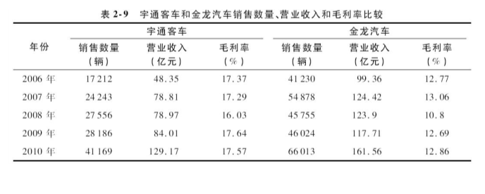
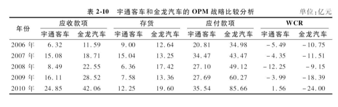
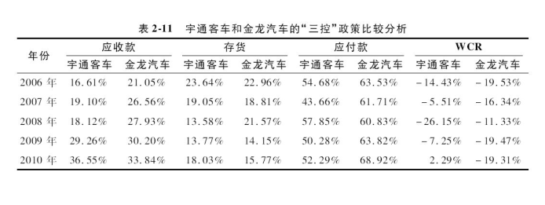
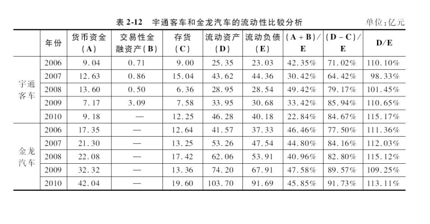

# 案例分析——解读宇通客车和金龙汽车的财务报表 :id=cp_e_2
--- 

## 背景  :id=cp_e_200

**（一）宇通客车**

    郑州宇通客车股份有限公司（以下简称“宇通客车”）是根据1993年经河南省体改委豫体改字（1993）第29号文批准，在郑州客车厂的基础上设立的股份有限公司。  
    1997年，宇通客车在上海证券交易所上市，成为国内大客车生产行业首家上市公司，股票代码600066。  
    1998年，宇通客车新厂区启用，成为亚洲最大规模客车生产基地。  
    2000年4月，宇通建成企业博士后科研工作站，为其生产技术的不断进步提供人力支持。

**（二）金龙汽车**

    厦门金龙汽车集团股份有限公司（以下简称“金龙汽车”）创立于1988年6月，前身是厦门汽车工业公司。  
    1988年12月，公司投资设立厦门金龙联合汽车工业有限公司（俗称“大金龙”）。  
    1992年3月，公司投资设立厦门金龙旅行车有限公司（俗称“小金龙”）。
    1992年5月改制为股份制企业，1993年集团股票在上海证券交易所挂牌上市，证券简称“厦门汽车”，证券代码600686。
    1998年，在大金龙成立10周年之际，设立苏州生产基地，即金龙联合汽车工业（苏州）有限公司（简称“苏州金龙”）。
    2005年4月，公司更名为厦门金龙汽车股份有限公司，证券简称改为“金龙汽车”。
    2006年5月，公司更名为“厦门金龙汽车集团股份有限公司”。

## 财务报表分析  :id=cp_e_201

**宇通客车与金龙汽车的财务报表分析**

**宇通客车解读：**
- 在2006—2010年各年的销售量和营业收入都保持双增长的态势。  
- 在毛利率表现上，宇通客车基本上维持在`17%`以上 ,    
- 客车销售数量从2006年的`17212`辆增长到2010年的`41169`辆，年均增长幅度将近`25%`；    
- 营业收入从2006年的`48`亿元增长到2010年的`129`亿元，年均增长幅度更是达到`27.85%`。  
  
**金龙汽车解读：**
- 尽管在客车销售数量和营业收入方面仍然保持领先优势，但在增长速度方面则落后于宇通客车，  
- 在毛利率表现上,金龙汽车则仅有不到`13%`的水平    
- 2006—2010年客车销售数量和营业收入的年均增长幅度分别只有`12.49%`和`12.92%`，远远低于宇通客车。    
- 在2008—2009年，金龙汽车的销售数量和营业收入更是出现下降的趋势。  

## 一、OPM战略与“三控”政策   :id=cp_e_202

从两家公司的营运资本管理政策和OPM战略的实施来看，金龙汽车由于具有更大的市场份额和销售数量，其在与客户和供应商之间的谈判能力也更强，无偿占有供应商资金的能力也更强，营运资本管理水平和OPM战略执行效果也相对更好。

根据表2-10的数据

**金龙汽车：**

2006年的应收款项（包括应收票据、应收账款、预付账款和其他应收款）合计为`11.59`亿元，存货为`12.64`亿元，应付款项（包括应付票据、应付账款、预收账款和其他应付款）合计为`34.98`亿元，营运资本需求量（应收款项+存货-应付款项）为`-10.75`亿元。到了2010年，金龙汽车的营运资本需求量变为`-24`亿元。

这意味着扣除应收款项和存货占用的资金之外，金龙汽车还无偿占用了供应商`24`亿元的资金。  

**宇通客车：** 

2006年的应收款项合计为`6.32`亿元，存货占款`9.00`亿元，应付款项`20.81`亿元，营运资本需求量为`-5.49`亿元；但到了2010年，宇通客车的营运资本需求量却变为`1.56`亿元。

这意味着宇通客车不仅被应收款项和存货占用了大量资金，而且其无偿占用供应商的资金无法抵消被应收款项和存货无偿占用的资金。

进一步比较两家公司的“三控”政策，根据表2-11，

**金龙汽车:**
- 应收款项占总资产比重在`2006—2010`年逐渐上升，从`21.05%`上升到`33.84%`。这与客车销售通常采用分期收款方式有关，
- 存货占总资产比重则有下降的趋势，从2006年的`22.96%`下降到2010年的`15.77%`，
- 在应付款项占总资产比重方面，金龙汽车从2006年的`63.53%`提高到2010年的`68.92%`，表明金龙汽车对供应商的议价能力进一步得到提高。

综合金龙汽车的“三控”政策，其整体上保持相对稳定的状态，在扣除应收款和存货占用的资金外，金龙汽车净无偿占用供应商资金占总资产的比重基本上保持在19%左右。
  
**宇通客车:**
- 应收款项和存货占总资产的比重在2006—2010年间的表现与金龙汽车类似，也表现出应收款项占比上升但存货占比下降的趋势，
- 应付款项占总资产比重不升反降，从2006年的`54.68%`下降到2010年的`52.29%`，这也直接导致了其2006—2010年营运资本需求量由负转正的结果。

综合上述分析，宇通客车销售数量和营业收入的快速增长可能是以牺牲其营运资本管理效率为代价取得的。宇通客车应该在未来进一步加强对营运资本和“三控”政策的管理。

## 二、资产流动性   :id=cp_e_203

**从资产的流动性来看（见表2-12）：**

1）金龙汽车2006—2010年的货币资金总额稳步提高，到2010年达到`42`亿元，占其总资产的比重达到`33.83%`。  
由于国内外金融市场整体表现低迷，金龙汽车并没有将资金投资到交易性金融资产或可供出售金融资产。  

2）宇通客车2006—2010年的货币资金总额并没有太大幅度的变动，2006年的货币资金总额为`9.04`亿元，2010年略微提高到`9.18`亿元。  
货币资金占总资产的比重则从2006年的`23.74%`下降到2010年的`13.50%`。当然，除了货币资金，宇通客车还将部分资金投资在交易性金融资产上面。  
尽管如此，宇通客车的货币资金和交易性金融资产合计数仍远远低于金龙汽车。  
 
因此，从最具流动性的货币资金和交易性金融资产来看，金龙汽车的资产流动性显然更强。  
其流动比率（流动资产与流动负债之比）在2010年高达`46%`，而宇通客车同期的速动比率（或称酸性比率，即扣除存货后的流动资产与流动负债之比）仅有`23%`，是金龙汽车的一半。

**从流动资产来看：**

金龙汽车的流动资产从2006年的41.57亿元上升到2010年的`103.7`亿元，增长幅度高达`150%`左右；流动资产占总资产比重从2006年的`75.51%`上升到2010年的`83.44%`。  
反观宇通客车，其流动资产从2006年的`25.35`亿元增加到2010年的`46.28`亿元，增长幅度为`83%`，略逊金龙汽车一筹；  
其流动资产占总资产比重同样较金龙汽车更低，2010年仅为`68.09%`。  
从流动比率来看，两家上市公司在2006—2010年间的流动比率基本保持在`110%`左右，旗鼓相当，都能较好地保障流动负债的偿付。  
进一步从速动比率来看，两家上市公司的速动比率都稳步增长，但金龙汽车的总体表现更胜一筹。  
金龙汽车的速动比率从2006年的`77.5%`上升到2010年的`91.73%`；  
而宇通客车的速动比率仅从2006年的`71.02%`上升到2010年的`84.67%`。   
总体而言，两家上市公司都保持了较好的资产流动性，但相对而言，金龙汽车的资产流动性要优于宇通客车。  

 

## 三、负债政策   :id=cp_e_204
## 四、会计盈利与股东价值   :id=cp_e_205
## 五、成本管理和控制   :id=cp_e_206
## 六、现金管理   :id=cp_e_207
## 七、协调发展和可持续增长   :id=cp_e_208
