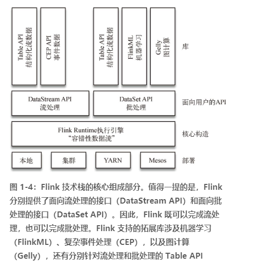

# 第 1 章　为何选择 Flink
---
> 《flink基础教程》学习笔记1

人们对某件事的正确理解往往来自基于有效论据的结论。要获得这样的结论，最有效的方法就是沿着事件发生的轨迹进行分析。

许多系统都会产生连续的事件流，如行驶中的汽车发射出GPS信号，金融交易，移动通信基站与繁忙的智能手机进行信号交换，网络流量，机器日志，工业传感器和可穿戴设备的测量结果，等等。 如果能够有效地分析大规模数据流，我们对上述系统的理解将会更清楚、更快速。简而言之，`流数据更真实地反映了我们的生活方式。`

**流处理技术的演变**

- 优秀的流处理技术可以容错，而且能保证 exactly-once。

- Spark Streaming: 通过采用微批处理方法实现了高吞吐和容错性，但是牺牲了低延迟和实时处理能力，也不能使窗口与自然时间相匹配，并且表现力欠佳

- Storm: 实现了低延迟，但是在作者撰写本书时还做不到高吞吐，也不能在故障发生时准确地处理计算状态；

## 初探Flink

“Apache Flink 是为分布式、高性能、随时可用以及准确的流处理应用程序打造的开源流处理框架。”

link 不仅能提供同时支持高吞吐和 exactly-once 语义的实时计算，还能提供批量数据处理。

> Flink 起源于 Stratosphere 项目，Stratosphere 是在 2010~2014 年由 3 所地处柏林的大学和欧洲的一些其他的大学共同进行的研究项目。
> 2014 年 4 月，Stratosphere 的代码被复制并捐献给了 Apache 软件基金会，参与这个孵化项目的初始成员均是 Stratosphere 系统的核心开发人员。不久之后，创始团队中的许多成员离开大学并创办了一个公司来实现 Flink 的商业化，他们为这个公司取名为 data Artisans。在孵化期间，为了避免与另一个不相关的项目重名，项目的名称也发生了改变。Flink 这个名字被挑选出来，以彰显这种流处理器的独特性：在德语中，flink 一词表示快速和灵巧。项目采用一只松鼠的彩色图案作为 logo，这不仅因为松鼠具有快速和灵巧的特点，还因为柏林的松鼠有一种迷人的红棕色。

### 批处理与流处理

**Flink 是如何同时实现批处理与流处理的呢？**

回答：Flink 将批处理（即处理有限的静态数据）视作一种特殊的流处理。

Flink 的核心计算构造是图 1-4 中的 Flink Runtime 执行引擎，它是一个分布式系统，能够接受数据流程序并在一台或多台机器上以容错方式执行。Flink Runtime 执行引擎可以作为 YARN（Yet Another Resource Negotiator）的应用程序在集群上运行，也可以在 Mesos 集群上运行，还可以在单机上运行（这对于调试 Flink 应用程序来说非常有用）。

## 参考资料

1. http://flink.apache.org
