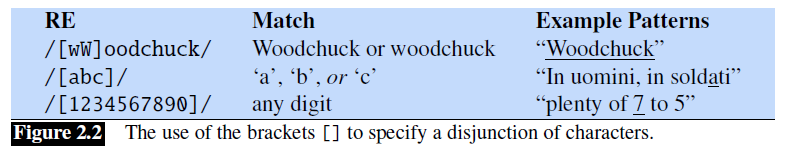
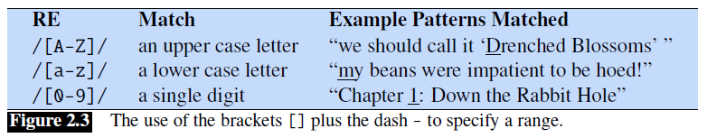
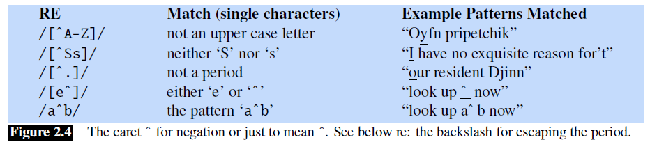
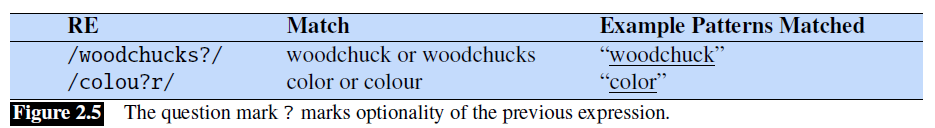
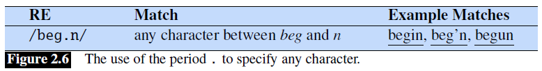
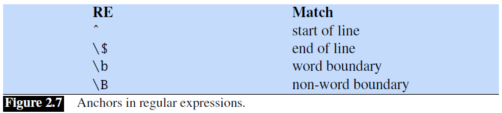
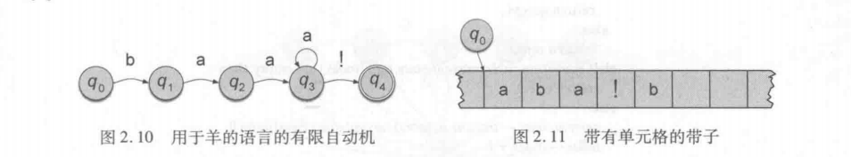
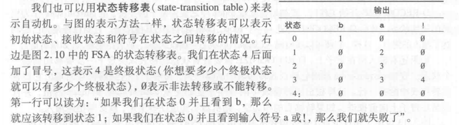

# 第2章 正则表达式与自动机
---


## 2.1 正则表达式 

正则表达式 (regular expression 简称RE )：一种用于描述文本搜索符号串的语言， 最初是由Kleene（1956）开发.


### 2.1.1 基本正则表达式模式 

正则表达式的搜索要求：一个试图搜索的模式（pattern）和 一个被搜索的文本语料库(corpus)。 正则表达式是区分大小写的;

例如：搜索woodchuck ，可以键入`/wookchuck/`这个正则表达式，表示包含字符串wookchuck的任何字符串相匹配。 /[Ww]/匹配的模式中或者包含w,或者包含W.

注意符号的代表的含义：`[]` `/./`,`*`,`?`,`^` 









**另外还有两个锚点,`\b` 匹配一个词的边界，`\B` 匹配非边界。**

因此，`/\bthe\b/` 匹配的是单词 the，而不是单词 other。从技术上讲，正则表达式中所说的“词”，是指任何由数字、下划线或字母构成的序列；这种定义是基于编程语言中“词”（译者注：标识符）的定义的。例如，`/\b99\b/` 将会匹配到 There are 99 bottles of beer on the wall 中的 99（因为 99 前面是空格），但不会匹配到 There are 299 bottles of beer on the wall（因为 99 前面是数字）。但会匹配到 `$99` 中的 99（因为 99 前面跟着一个美元符号 `$`，而不是数字、下划线或字母）。（译者注：99 前面跟着 `$`，而 `$` 不属于词的构成元素，所以被视为边界 boundary，所以才会匹配到 `$99`，同样也会匹配到 `^99`。所以特别注意，**并不是空格才会被视为边界。**）

### 2.1.2 析取、组合与优先关系 

一个运算符可能优先于另一个运算符，这就要求我们有时要用括号来表达我们的意图，这种做法是通过运算符优先级（operator precedence hierarchy）来实现的。下表给出了正则表达式中运算符优先级的顺序，从最高优先级到最低优先级。


## 2.2 有限状态自动机（FSA）

正则语言：有限自动机、正则表达式、正则语法


对于由下面的无限集合构成的任何符号串：

```
baa!
baaa!
baaaa!
...
```


正则表达式为:`/baa+!`,有限自动机表示如图：



我们也可以用**状态转移表**(state-transition table)来表示自动机。


一个有限自动机可以用5个参数来定义：

$ Q = q_o,q_1,q_2,...,q_{N-1}   \qquad  N种状态的有限集合$

$\sum \qquad 有限的输入符号字母表$

$q_o \qquad $ 初始状态

$F \qquad$ 终极状态的集合，$F\subseteq\ Q$

$\delta(q,i) \qquad$ 状态之间的**转移函数**或转移矩阵。给定一个状态$q\in Q$和一个输入符号$i \in \sum,\delta(q,i)$返回一个新的状态$q^{'} \in Q$,因此，$\delta(q,i)$是从$Q × \sum $ 到 $Q$ 的一个关系。

在图2.10的自动机中，$Q = {q_o,q_1,q_2,q_3,q_4},\sum = {a,b,!},F={q_4} $ 而$\delta(q,i)$由上面的转移表来确定。


参考文献：

1. https://github.com/secsilm/slp3-zh/tree/main/chapter2
1. https://www.jianshu.com/p/0ea47ae02262

