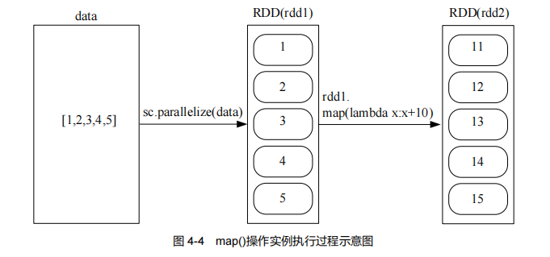
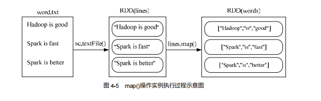
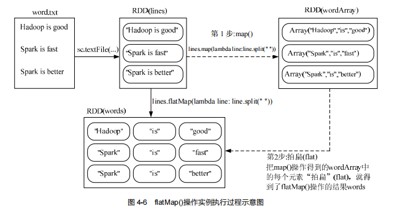
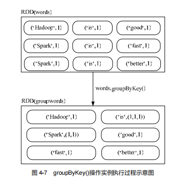
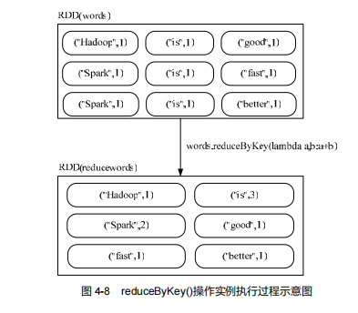
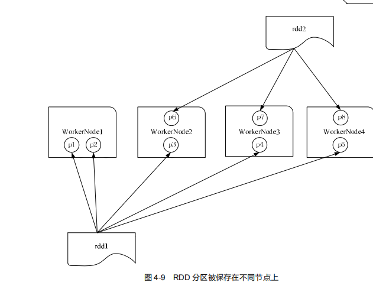

# 第4章　RDD编程 :id=cp_4

---

## 本章学习内容：

1、RDD的创建方法、各种操作APP以及持久化和分区方法；
2、RDD的各种操作
3、RDD编程案例实现

**RDD是什么？**

- Spark核心概念
- 一个只读的、可分区的分布式数据集
- 可全部或部分缓存在内存中，在多次计算间重用。
- RDD API 采用scala语言实现

## 4.1 RDD编程基础

本节介绍RDD编程的基础知识、包括RDD的创建、操作、API、持久化和分区等。

### RDD 创建

#### 1. 从文件系统中加载数据创建RDD

1) 本地文件系统加载数据

- pyspark交互式环境中，执行如下命令

```
>>> lines = sc.textFile("file:///opt/spark/data/word.txt")
>>> lines.foreach(print)
Spark is better                                                     (0 + 2) / 2]
Hadoop is good 
Spark is fast 

```
在上述语句中，使用了 Spark 提供的 `SparkContext` 对象，名称为 `sc`，这是 `pyspark` 启动的时候自
动创建的，在交互式编程环境中可以直接使用。如果是编写独立应用程序，则可以通过如下语句生成 `SparkContext` 对象：

```shell
from pyspark import SparkConf,SparkContext
conf = SparkConf().setMaster("local").setAppName("My App")
sc = SparkContext(conf = conf)
```

2) 从分布式文件系统HDFS中加载数据 

先满足hadoop已运行正常 
```shell
root@datawhale001:/opt/spark/data# jps
539225 SparkSubmit
536177 NodeManager
535378 SecondaryNameNode
535012 DataNode
545460 Jps
534758 NameNode
536007 ResourceManager
```
这里使用python运行，使用`pyspark`命令如下：
```shell
root@datawhale001:/opt/spark/bin# pyspark  

....省略
Welcome to
      ____              __
     / __/__  ___ _____/ /__
    _\ \/ _ \/ _ `/ __/  '_/
   /__ / .__/\_,_/_/ /_/\_\   version 3.2.0
      /_/

Using Python version 3.10.6 (main, Nov 14 2022 16:10:14)
Spark context Web UI available at http://datawhale001:4040
Spark context available as 'sc' (master = local[*], app id = local-1678254096249).
SparkSession available as 'spark'.
>>> lines = sc.textFile("hdfs://datawhale001:9000/README.txt")
>>> lines.foreach(print)
hello world                                                         (0 + 2) / 2]
hello spark
hello hadoop
hello spark
hello hdfs

```

#### 通过并行集合（列表）创建 RDD

可以调用 `SparkContext` 的 `parallelize` 方法，从一个已经存在的集合（列表）上创建 RDD（见图
4-2），从而可以实现并行化处理，命令如下：
```shell
>>> array = ["hello world","this is a spark programing","spark is fast","spark is better"]
>>> rdd = sc.parallelize(array)
>>> rdd.foreach(print)
spark is fast
spark is better
hello world
this is a spark programing
```

### RDD 操作

RDD操作包括两种类型：**转换（Transformation）操作**和 **行动(Action)操作**。

#### 1. 转换操作 

- 每一次转换操作都会产生不同的RDD,供给下一个操作者使用。
- RDD的转换过程是惰性求值的，整个转换过程只是记录了转换的轨迹，并不会发生真正的计算，只有遇到行动操作时，才会触发“从头到尾”的真正的计算。

**RDD转换操作API:**

- filter(func): 筛选出满足函数func的元素，并返回一个新的数据集。
- map(func)：将每个元素传递到函数func中，并将结果返回为一个新的数据集。
- flatMap(func)：与map()相似，但每个输入元素都可以映射到0或多个输出结果。
- groupByKey()：应用于(K,V)键值对的数据集时，返回一个新的（K,Iterable）形式的数据集。
- reduceByKey(func)：应用于（K,V）键值对的数据集时，返回一个新的(K,V)形式的数据集，其中每个值是将每个key传递到函数func中进行聚合后的结果。

（1）filter(func)

```shell
root@datawhale001:/opt/spark/data# cat word.txt
Hadoop is good 
Spark is fast 
Spark is better

>>> lines = sc.textFile("file:///opt/spark/data/word.txt") # 生成RDD 
>>> linesWithSpark = lines.filter(lambda line: "Spark" in line) # 匿名函数 ，Lambda 表达式 筛选行符合条件的的行元素
>>> linesWithSpark.foreach(print)
Spark is better                                                     (0 + 2) / 2]
Spark is fast 

```

（2）map(func)

map(func)操作将每个元素传递到函数func中，并将结果返回为一个新的数据集。例如：

```shell
>>> data = [1,2,3,4,5]
>>> rdd1 = sc.parallelize(data) # 从列表 data 中生成一个 RDD
>>> rdd2 = rdd1.map(lambda x:x+10)
>>> rdd2.foreach(print)                                                         
11
12
13
14
15
```



另外一个实例：
```shell
>>> lines = sc.textFile("file:///opt/spark/data/word.txt")
>>> words = lines.map(lambda line:line.split(" "))
>>> words.foreach(print)
['Hadoop', 'is', 'good', '']                                        (0 + 2) / 2]
['Spark', 'is', 'fast', '']
['Spark', 'is', 'better']

```


（3）flatMap(func)

flatMap(func)与map()相似，但每个输入元素都可以映射到0或多个输出结果。例如：

```shell
>>> lines = sc.textFile("file:///opt/spark/data/word.txt")
>>> words = lines.flatMap(lambda line:line.split(" "))
>>> words.foreach(print)
Hadoop                                                    
is
good
Spark
is
fast
Spark
is
better

```




（4）groupByKey()

groupByKey()应用于(K,V)键值对的数据集时，返回一个新的(K, Iterable)形式的数据集。下面给
出一个简单实例，代码如下:

```shell
>>> words = sc.parallelize([("Hadoop",1),("is",1),("good",1), ("Spark",1),("is",1),("fast",1),("Spark",1),("is",1),("better",1) ])
>>> words1 = words.groupByKey()
>>> words1.foreach(print)
('Hadoop', <pyspark.resultiterable.ResultIterable object at 0x7f4f6a55e380>)/ 2]
('fast', <pyspark.resultiterable.ResultIterable object at 0x7f4f6a55cf40>)
('better', <pyspark.resultiterable.ResultIterable object at 0x7f4f6a55e380>)
('is', <pyspark.resultiterable.ResultIterable object at 0x7f4f6a55e380>) 1) / 2]
('good', <pyspark.resultiterable.ResultIterable object at 0x7f4f6a55cf40>)
('Spark', <pyspark.resultiterable.ResultIterable object at 0x7f4f6a55e380>)

```

如图 4-7 所示，在这个实例中，名称为 words 的 RDD 中包含了 9 个元素，每个元素都是(K,V)
键值对类型。words1=words.groupByKey()操作执行以后，所有 key 相同的键值对，它们的 value 都被
归并到一起。比如，("is",1)、("is",1)、("is",1)这 3 个键值对的 key 相同，就会被归并成一个新的键值
对("is",(1,1,1))，其中，key 是"is"，value 是(1,1,1)，而且，value 会被封装成 Iterable 对象（一种可迭
代集合）。



（5）reduceByKey(func)

reduceByKey(func)应用于(K,V)键值对的数据集时，返回一个新的(K, V)形式的数据集，其中的每
个值是将每个 key 传递到函数 func 中进行聚合后得到的结果。这里给出一个简单实例，代码如下：

```shell
>>> words = sc.parallelize([("Hadoop",1),("is",1),("good",1), ("Spark",1),("is",1),("fast",1),("Spark",1),("is",1),("better",1) ])
>>> words1 = words.reduceByKey(lambda a,b:a+b)
>>> words1.foreach(print)
('Hadoop', 1)                                                       (0 + 2) / 2]
('fast', 1)
('better', 1)
('is', 3)
('good', 1)
('Spark', 2)

```

如图 4-8 所示，在这个实例中，名称为 words 的 RDD 中包含了 9 个元素，每个元素都是(K,V)
键值对类型。words.reduceByKey(lambda a,b:a+b)操作执行以后，所有 key 相同的键值对，它们的 value
首先被归并到一起，比如，("is",1)、("is",1)、("is",1)这 3 个键值对的 key 相同，就会被归并成一个新
的键值对("is",(1,1,1))，其中，key 是"is"，value 是一个 value-list，即(1,1,1)。然后，使用 func 函数把
(1,1,1)聚合到一起，这里的 func 函数是一个 Lambda 表达式，即 lambda a,b:a+b，它的功能是把(1,1,1)
这个 value-list 中的每个元素进行汇总求和。首先，把 value-list 中的第 1 个元素（即 1）赋值给参数
a，把 value-list 中的第 2 个元素（也是 1）赋值给参数 b，执行 a+b 得到 2，然后，继续对 value-list
中的元素执行下一次计算，把刚才求和得到的 2 赋值给 a，把 value-list 中的第 3 个元素（即 1）赋值
给 b，再次执行 a+b 计算得到 3。最终，就得到聚合后的结果('is',3)。



#### 2. 行动操作

行动操作是真正触发计算的地方。

spark程序只有执行到行动操作时，才会执行真正的计算，从文件中加载数据，完成一次又一次转换操作，最终，完成行动操作得到结果。

**RDD行动操作API:**

- count() 返回数据集中的元素个数
- collect() 以数据的形式返回数据集中的所有元素
- first() 返回数据集中的第1个元素
- take(n) 以数组的形式返回数据集中的前n个元素
- reduce(func) 通过函数func(输入两个参数并返回一个值)聚合数据集中的元素
- foreach(func) 将数据集中的每个元素传递到函数func中运行

`pyspark`环境中执行的代码及其执行结果:

```shell
>>> rdd = sc.parallelize([1,2,3,4,5])
>>> rdd.count()
5                                                                               
>>> rdd.first()
1                                                                               
>>> rdd.take(3)
[1, 2, 3]                                                                       
>>> rdd.reduce(lambda a,b:a+b)
15                                                                              
>>> rdd.collect()
[1, 2, 3, 4, 5]
>>> rdd = sc.parallelize([1,2,3,4,5,4])
>>> rdd.collect()
[1, 2, 3, 4, 5, 4]                                                              
>>> rdd.foreach(print)
1
2
3
4
5
4
>>> rdd.foreach(lambda elem:print(elem))                                 
4
5
4
1
2
3


```
rdd.foreach(lambda elem:print(elem)) rdd.foreach(print) 可以被简化成 ，执行效果是一样的。
Local rdd.foreach(print) RDD 需要特别强调的是，当采用 模式在单机上执行时， 语句会打印出一个
Worker Worker 中的所有元素。但是，当采用集群模式执行时，在 节点上执行打印语句是输出到 节
stdout Driver Driver stdout 点的 中，而不是输出到任务控制节点 中，因此，任务控制节点 中的 是不
Worker Driver 会显示打印语句的这些输出内容的。**为了能够把所有 节点上的打印输出信息也显示到
collect() print(rdd.collect()) collect() Worker 中，就需要使用 方法，比如， 。但是，由于 方法会把各个
RDD Driver Driver 节点上的所有 元素都抓取到 中，因此，这可能会导致 所在节点发生内存溢出。所
collect() 以，在实际编程中，需要谨慎使用 方法。**

#### 3. 惰性机制

惰性机制是指整个转换过程只是记录了转换的轨迹，并不会发生真正的计算，只有遇到行动操 “ ” Spark 作时，才会触发 从头到尾 的真正的计算。这里给出一段简单的语句来解释 的惰性机制。

```shell
>>> lineLengths = lines.map(lambda s:len(s))
>>> lineLengths.foreach(print)
15
15
14
>>> totalLength = lineLengths.reduce(lambda a,b:a+b)
>>> print(totalLength)
44
>>> print(lineLengths)
PythonRDD[55] at RDD at PythonRDD.scala:53

```

### 持久化

迭代计算例子：

```shell
>>> list = ['Hadoop','spark','Hive']
>>> rdd = sc.parallelize(list)
>>> print(rdd.count()) # 行动操作，触发一次真正从头到尾的计算
3                                                                               
>>> print(','.join(rdd.collect())) # #行动操作，触发一次真正从头到尾的计算
Hadoop,spark,Hive                                                               
>>> 

```

通过使用 persist()方法将一个 RDD 标记为持久化，之所以要“标记为持久化”，出现 persist()语句的地方，并不会马上计算生成 RDD 并把它持久化，而是要等到遇到第一个行动操作触发真正计算以后，才会把计
算结果进行持久化。

persist()的圆括号中包含的是持久化级别参数，可以有如下不同的级别。
- persist(MEMORY_ONLY):表示将RDD作为反序列化的对象存储于`JVM`中，如果内存不足，就要按照[LRU原则](https://www.cnblogs.com/linxiyue/p/10926944.html)替换缓存中的内容。
- persist(MEMORY_AND_DISK):表示将RDD作为反序列化的对象存储于`JVM`中，如果内存不足，超出的分区将会被存放在硬盘上。
  一般而言，使用 cache()方法时，会调用 persist(MEMORY_ONLY)。
```shell
>>> list = ['Hadoop','spark','Hive']
>>> rdd = sc.parallelize(list)
>>> rdd.cache()  #会调用 persist(MEMORY_ONLY)，但是，语句执行到这里，并不会缓存 rdd，因为这
 #时 rdd 还没有被计算生成
ParallelCollectionRDD[58] at readRDDFromFile at PythonRDD.scala:274
>>> print(rdd.count()) #第一次行动操作，触发一次真正从头到尾的计算，这时上面的 rdd.cache() 才会被执行，把这个 rdd 放到缓存中
3                                                                               
>>> print(','.join(rdd.collect()))  #第二次行动操作，不需要触发从头到尾的计算，只需要重复使用上面缓存中的 rdd
Hadoop,spark,Hive  
```

持久化 RDD 会占用内存空间，当不再需要一个 RDD 时，就可以使用 `unpersist()`方法手动地把持久化的 RDD 从缓存中移除，释放内存空间。

### 分区

#### 1. 分区的作用

RDD 是弹性分布式数据集，通常RDD很大，会被分区成很多个分区，分别保存在不同的节点上。

如图 4-9 所示，

**一个集群：** 

- 4 个工作节点（WorkerNode）- WorkerNode1、WorkerNode2、 WorkerNode3 和 WorkerNode4。

**两个RDD：** 
- rdd1 包含 5 个分区（即 p1、 p2、p3、p4 和 p5）
- rdd2 包含 3 个分区（即 p6、p7 和 p8）。



**RDD分区的作用：**

1). 增加处理数据的并行度。   

例如，1个RDD有n个分区，分布在n个不同工作节点(WorkerNode)上面，这n个工作节点分别启动n个线程对这n个分区的数据进行并行处理，从而增加了任务的并行度。（1个工作节点上面有几个分区，启动几个线程）

2). 减少通信开销 


#### **2. 分区的原则：**

RDD分区的原则：使得分区得个数尽量等于集群CPU核心（core）数目。

对于不同的 Spark 部署模式（Local 模式、Standalone 模式、YARN 模式、Mesos 模式）而言 ，都可以通过设置`spark.default.parallelism` 这个参数的值，来配置默认的分区数目。各种模式下的默认分区数目如下：

- Local 模式：默认为本地机器的 CPU 数目，若设置了 local[N]，则默认为 N。
- Standalone 或 YARN 模式：在“集群中所有 CPU 核心数目总和”和“2”这二者中取较大值作为
默认值。
- Mesos 模式：默认的分区数为 8。

#### 3. 设置分区的个数

可以手动设置分区的数量，主要包括两种方式：

> 创建 RDD 时手动指定分区个数  
> 使用 `repartition` 方法重新设置分区个数

1、创建RDD时手动指定分区个数

在调用textFile()和parallelize()方法的时候手动指定分区的个数。

①、sc.textFile(path, partitionNum)。其中，path参数为指定要加载的文件的地址，partitionNum参数为指定分区的个数。

对于textFile()方法而言，如果没有在方法中指定分区数，则默认为min(defaultParallelism, 2)，其中，defaultParallelism对应的就是spark.default.parallelism。如果是从 HDFS 中读取文件，则分区数为文件
分片数（比如，128MB/片）。

②、对于parallelize()方法而言，如果没有在方法中指定分区数，则默认为spark.default.parallelism。（由部署模式决定分区数）

```shell
>>> data = sc.parallelize([1,2,3,4,5,])
>>> len(data.glom().collect()) # 显示data这个RDD的分区数量
2

```
2、使用repartition方法重新设置分区个数 
```shell
>>> data = sc.parallelize([1,2,3,4,5,],3)
>>> len(data.glom().collect()) # 显示data这个RDD的分区数量
3
>>> rdd = data.repartition(1) #对 data 这个 RDD 进行重新分区
>>> len(rdd.glom().collect()) # 显示rdd 这个RDD的分区数量
1   
```

#### 4. 自定义分区方法

Spark提供了自带的 HashPartitioner（哈希分区）与 RangePartitioner（区域分区），Spark也支持自定义分区方式，即通过提供一个自定义的Partitioner对象来控制RDD的分区方式。

Spark 的分区函数针对的是(key,value)类型的 RDD，也就是说，RDD 中的每个元素都是(key,value)类型，然后，分区函数根据 key 对 RDD 元素进行分区。

当需要对一些非(key,value)类型的 RDD 进行自定义分区时， 需要首先把 RDD 元素转换为(key,value)类型，然后再使用分区函数。

```shell
root@datawhale001:/data/spark# sudo vim TestPartitioner.py
root@datawhale001:/data/spark# sudo cat TestPartitioner.py
from pyspark import SparkConf,SparkContext

def MyPartitioner(key):
    print("MyPartitioner is running ")
    print("The key is %d" % key)
    return key%10

def main():
    print("The main function is running")
    conf = SparkConf().setMaster("local").setAppName("MyApp")
    sc = SparkContext(conf = conf)
    data = sc.parallelize(range(10),5)
    data.map(lambda  x:(x,1) \
             .partitionBy(10,MyPartitioner) \
             .map(lambda x:x[0]) \
             .saveAsTextFile("file:///data/spark/rdd/partitioner")
             )
def main():
 print("The main function is running")
 conf = SparkConf().setMaster("local").setAppName("MyApp")
 sc = SparkContext(conf = conf)
 data = sc.parallelize(range(10),5)
 data.map(lambda x:(x,1)) \
 .partitionBy(10,MyPartitioner) \
 .map(lambda x:x[0]) \
 .saveAsTextFile("file:///usr/local/spark/mycode/rdd/partitioner")

if __name__ == '_main__':
    main()
root@datawhale001:/data/spark# python3 TestPartitioner.py
The main function is running


```


**报错1：**

```
2023-03-12 09:41:28,945 WARN util.Utils: Service 'SparkUI' could not bind on port 4040. Attempting port 4041
```

**解决：**

1. 关闭spark-shell
2. 杀掉进程

```
root@datawhale001:/data/spark# lsof -i:4041 
root@datawhale001:/data/spark# lsof -i:4040
```


**报错2**

```
2023-03-12 09:45:42,062 WARN util.NativeCodeLoader: Unable to load native-hadoop library for your platform... using builtin-java classes where applicable
```

解决思路：

` hadoop checknative -a` 查看环境：


查看版本:

datawhale@datawhale001:/opt/hadoop/lib/native$ file libhadoop.so.1.0.0
libhadoop.so.1.0.0: ELF 64-bit LSB shared object, x86-64, version 1 (SYSV), dynamically linked, BuildID[sha1]=30ce002bb1ee648ac42090156300dbf4f5f9c1c4, with debug_info, not stripped

1. https://datawhalechina.github.io/learn-nlp-with-transformers/#/


2. 查看 libhadoop.so 存放在这个目录下

/opt/hadoop目录紧接着输入以下代码

```

grep -R 'java.library.path' *
```

在hadoop包中搜索发现，`java.library.path`被定义为`$JAVA_LIBRARY_PATH`

接着输入代码`vim ~/.bashrc`进入编辑 在最上面输入

```
export HADOOP_OPTS="$HADOOP_OPTS -Djava.library.path=/opt/hadoop/lib/native"
export HADOOP_COMMON_LIB_NATIVE_DIR="/opt/hadoop/lib/native/"
# 接着保存退出:wq!
source ~/.bashrc
# 使环境变量配置有效

```

 重启Hadoop再试

### 综合实例

```
>>> lines = sc.textFile("file:///opt/spark/data/word.txt") 
>>> wordCount = lines.flatMap(lambda line:line.split(" ")).map(lambda word:(word,1)).reduceByKey(lambda a,b:a+b)
>>> print(wordCount.collect())
[('is', 3), ('good', 1), ('', 2), ('Spark', 2), ('Hadoop', 1), ('fast', 1), ('better', 1)]

```

## 4.2 键值对RDD

键值对RDD(Pair RDD)是指每个RDD元素都是(key,value)键值对类型，是一种常见的RDD类型，可以应用于很多应用场景。

### 4.2.1键值对RDD的创建

键值对 RDD 的创建主要有两种方式：

> 从文件中加载生成 RDD；
>
> 通过并行集合（列表）创建 RDD

#### 1.从文件中加载生成RDD

首先使用 textFile()方法从文件中加载数据，然后，使用 map()函数转换得到相应的键值对 RDD。

例如：

```
root@datawhale001:~# cat /opt/spark/data/word.txt
Hadoop is good 
Spark is fast 
Spark is better
datawhale@datawhale001:/root$ /opt/spark/bin/pyspark
>>> lines = sc.textFile("file:///opt/spark/data/word.txt") 
>>> pairRDD = lines.flatMap(lambda line:line.split(" ")).map(lambda word:(word,1)) 
>>> pairRDD.foreach(print)
```

在上述语句中，map(lambda word:(word,1))函数的作用是，取出 RDD 中的每个元素，也就是每个单词，赋值给 word，然后，把 word 转换成(word,1)的键值对形式。

#### 2．通过并行集合（列表）创建 RDD 

通过代码从一个列表创建一个键值对 RDD：

·

```
list = ["hadoop","spark","hive","spark"]
rdd = sc.parallelize(list)
pairrdd = rdd.map(lambda word:(word,1))
pairrdd.foreach(print)
```

### 4.2.2 常用的键值对转换操作

常用键值对转换操作：`reduceByKey(func)、groupByKey()、keys、values、sortByKey()、

sortBy()、mapValues(func)、join()和 combineByKey` 等。

#### 1. reduceByKey(func)

使用 func 函数合并具有相同键的值，作用于键值对(K, V)上，按key 进行分组，然后将 key 相同的键值对的 value 都执行 func 操作，得到一个值.

