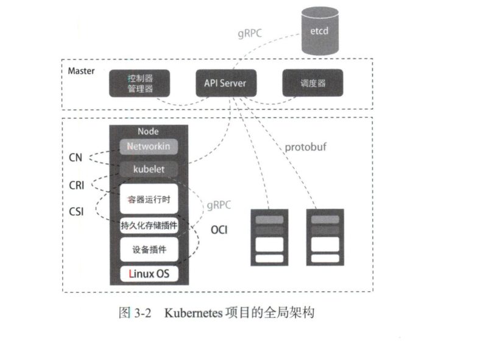

# 第3章 Kubernetes 设计与架构

### 目标

- 了解k8s的核心设计与架构
- 了解声明式API来描述容器化业务和荣期间关系的设计思想
- 了解K8S的核心功能

### 容器

容器：linux Namespaces、linux Cgroups 和 rootfs 这3种技术构建出来的进程的隔离环境。

一个正在运行的linux容器，可以“一分为二”地看待：

1、 容器镜像：一组联合挂载在`/var/lib/docker/aufs/mnt`上的rootfs，容器的静态视图；

2、容器运行时：一个由Namespace+Cgroups构成的隔离环境，容器的动态视图；


容器从开发者手里的一个小工具，一跃成为了云计算领域的绝对主角;而能够定义容器组织和管理规范的容器编排技术,则当仁不让地坐上了容器技术领域的“头把交椅”。

其中最具代表性的容器编排工具： 

- Docker：的Compose＋Swarm组合
- 谷歌：kubernetes项目。

### kubernetes 核心设计与架构

首先我们看一张谷歌的基础设施栈：


kubernetes项目从一开始就比较幸运地站在了他人难以企及的高度:在它的成长阶段，这个项目每—个核心特性的

提出，几乎都脱胎于Bo1g／Omega系统的设计与经验。

得益于Borg项目的理论优势，才在短短几个月内迅速站稳脚跟。，进而确定了一个如图3-2的全局架构：



1. Master和Node两种节点组成，两种角色分别对应控制节点和计算节点。
2. 控制节点即Master节点，由三个紧密协作的独立组件组合而成，分别是负责API服务的kube-apiserver, 负责调度的kube-scheduler,以及负责容器编排的kube-controller-manager。
3. 整个集群的持久化数据，则由kube-apiserver处理后保存在etcd中。
4. [kubelet](./名词解释：kubelet.md)，作为计算节点最核心部分，它负责容器运行时（比如docker项目）交互，而这种交互所依赖的一个称作CRI(container runtime interface)的远程调用接口，该接口定义了容器运行时的各种核心操作，比如启动一个容器需要的所有参数。

> 只要你的容器运行时能够运行标准的容器镜像，它就可以通过实现CRI接入Kubernetes项目。而具体的容器运行时，比如Docker项目，则一般通过OCI这个容器运行时规范同底层的Linux操作系统进行交互，即把CRI请求翻译成对Linux操作系统的调用（操作linux Namespace和Cgroups) 

5. Kubelet 通过gRPC协议与Device Plugin的插件进行交互。这个插件,是kubernetes项目用来管理GPU等宿主机物理设备的主要组件,也是基于kubernetes项目进行机器学习训练、高性能作业支持等工作必须关注的功能。

6. kubelet的另—个重要功能,则是调用网络插件和存储插件为容器配置网络和持久化存储。这两个插件与kubelet进行交互的接口，分别是CNI（contalnernetworkinginterface）和CSI（contajnerstorageinterlace）

   

#### **Borg对kubernetes项目的指导作用又体现在哪里呢?**

答案是，Master节点。虽然在Master节点的实现细节上，Borg项目与kubernetes项目不尽相同，但它们的出发点高度一致,即如何编排、管理调度用户提交的作业。所以，Borg项目完全可以把Docker镜像看作—种新的应用打包方式.这样，Borg团队过去在大规模作业管理与编排上的经验就可以直接“套用”在kubernetes项目上了。

这些经验最主要的表现就是,从一开始，kubernetes项目就没有像同时期的各种容器云项目那样，直接把Docker作为整个架构的核心来实现—个PaaS,而是仅仅把Docker作为最底层的一种容器运行时实现。kubernetes项目要着重解决的问题，则来自Borg的研究人员在论文中提到的—个非常重要的观点:

> 在大规模集群中的各种任务之间运行，实际上存在各种各样的关系。这些关系的处理才是作业编排和管理系统最困难的地方。

这个观点，正是kubernetes的核心能力和项目定位的关键所在。


### kubernetes核心能力与项目定位 

> 给Pod绑定一个Service服务，而Service服务声明的IP地址等信息是固定不变的。这个Service服务的主要作用就是作为Pod的代理入口(Portal)，从而代替Pod对外暴露一个固定的网络地址。


kubernetes项目最主要的设计思想就是,以统—的方式抽象底层基础设施能力（比如计算、存储、网络）,定义任务编排的各种关系（比如亲密关系、访问关系、代理关系）’将这些抽象以声明式API的方式对外暴露,从而允许平台构建者基于这些抽象进—步构建自己的PaaS乃至任何上层平台。

所以,kubernetes言tes的本质是“平台的平台”，即一个用来帮助用户构建上层平台的基础平台。

kubernetes中的所有抽象和设计,都是为了更好地实现这个‘‘使能平台构建者”的目标°对于底

层基础设施能力的抽象’想必已经不用多解释了。

这里单独解释kubernetes是如何定义任务编排的各种关系的。

首先，kubernetes项目对容器间的访问进行了抽象和分类,它总结出了一类常见的紧密交互的关系，即这些任务之间需要非常频繁地交互和访问,或者它们会直接通过本地文件交换信息。

在常规环境中’这些应用往往会被直接部署在同一台机器上,通过localhost进行通信，通过本地磁盘目录交换文件°而在kubernetes项目中,这些容器会被划分为—个Pod’Pod里的容器共享同—个Network Namespace、同一组VOlume，从而实现高效交换信息。Pod是kubernetes项目中最基础的—个对象，源自于谷歌Borg论文中一个名叫Alloc的设计。后文会进一步阐述Pod。


Kubemetes项目并没有像其他项目那样’为每—个管理功能创建—条指令,然后在项目中实现其中的逻辑.这种做法的确可以解决当前的问题,但是在更多的问题出现之后，往往会力不从心。

相比之下,在Kubemetes项目中’我们推崇的使用方法是:

□首先，通过一个任务编排对象’比如Pod、Job、CronJob等’描述你试图管理的应用;

□然后，为它定义—些运维能力对象’比如Service、Ingress、HorizomalPodAutoscaler（自

动水平扩展器）等’这些对象会负责具体的运维能力侧功能。

这种使用方法就是所谓的‘‘声明式API”。这种API对应的编排对象和服务对象，都是Kubemetes项目中的API对象。

> 这种使用方法就是所谓的“声明式API”. 这种API对应的编排对象和服务对象，都是Kubernetes项目中的API对象。

声明式API是Kubernetes最核心的设计理念，正因为有了它，我们基于Kubernetes构建上层平台才有了一致的编程范式和交互编程界面，才使得今天整个云原生生态中诞生了如此多的Kubernetes插件能力和扩展。

### Kubemetes项目如何启动—个容器化任务?

我现在已经制作好了—个Nginx容器镜像，希望平台帮我启动该镜像。并且，我要平台帮我运行两个完全相同的Ngjnx副本,以负载均衡的方式共同对外提供服务。

**虚拟机实现：**

启动两台虚拟机，分别安装两个Nginx，然后使用keepalived为两台虚拟机做一个虚拟IP。

**Kubernetes实现：**

编写一个YAML文件：（比如nginx-deployment.yaml）

```yaml
[root@k8s-master ~]# cat nginx-deployment.yaml
apiVersion: v1
kind: Service
metadata:
  name: ngx-service
  labels:
    app: nginx
spec:
 replicas:2
  type: NodePort
  selector:
  	matchLabels:
    	app: nginx
  template:
  	metadata:
  		labels:
  		  app:nginx 
    spec:
    	containers:
    	- name nginx
    	  image: nginx:1.7.9
    ports:
      containerPort: 80
```

上面这个YAML文件中，我们定义了一个Deployment对象，它的主体部分（spec.template部分）是一个使用Nginx镜像的Pod, 而这个pod的副本数是2(replicas=2)。

然后执行：

```
$ kubectl create -f nginx-deployment.yaml
```

这样两个完全相同的Nginx容器副本就启动了。


