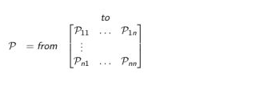
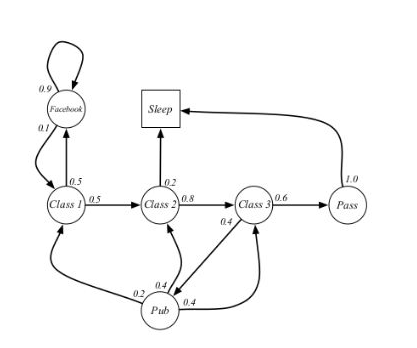

# 绪论、马尔可夫过程、动态规划

> 本学习笔记来源于DataWhale-第52期组队学习：[深度强化学习](https://linklearner.com/learn/detail/91)） ,[B站讲解](https://www.bilibili.com/video/BV1HZ4y1v7eX) 观看地址

推荐导读：[贝尔曼方程](./bellman.md)

在强化学习中，马尔可夫决策过程（Markov decision process, MDP）是对完全可观测的环境进行描述的，也就是说观测到的状态内容完整地决定了决策的需要的特征。几乎所有的强化学习问题都可以转化为**MDP**

## 马尔可夫过程 Markov Process

### **马尔可夫性 Markov Property**

某一状态信息包含了所有相关的历史，只要当前状态可知，所有的历史信息都不再需要，当前状态就可以决定未来，则认为该状态具有马尔可夫性。

可以用下面的状态转移概率公式来描述马尔可夫性：

$$
P_{ss'} = P[S_{i+1} = S' | S_t = S ]
$$

下面状态转移矩阵定义了所有状态的转移概率：

式中n为状态数量，矩阵中每一行元素之和为1.

### **马尔可夫性 Markov Property**

马尔可夫过程 又叫马尔可夫链(Markov Chain)，它是一个无记忆的随机过程，可以用一个元组<S,P>表示，其中S是有限数量的状态集，P是状态转移概率矩阵。

### 示例 - 学生马尔可夫链

使用学生马尔可夫链这个例子来讲解相关概念和计算。



图中，圆圈表示学生所处的状态，方格Sleep是一个终止状态，或者可以描述成自循环的状态，也就是Sleep状态的下一个状态100%的几率还是自己。

箭头表示状态之间的转移，箭头上的数字表示当前转移的概率。

举例说明：当学生处在第一节课（Class1）时，他/她有50%的几率会参加第2节课（Class2）；同时在也有50%的几率不在认真听课，进入到浏览facebook这个状态中。在浏览facebook这个状态时，他/她有90%的几率在下一时刻继续浏览，也有10%的几率返回到课堂内容上来。当学生进入到第二节课（Class2）时，会有80%的几率继续参加第三节课（Class3），也有20%的几率觉得课程较难而退出（Sleep）。当学生处于第三节课这个状态时，他有60%的几率通过考试，继而100%的退出该课程，也有40%的可能性需要到去图书馆之类寻找参考文献，此后根据其对课堂内容的理解程度，又分别有20%、40%、40%的几率返回值第一、二、三节课重新继续学习。一个可能的学生马尔可夫链从状态Class1开始，最终结束于Sleep，其间的过程根据状态转化图可以有很多种可能性，这些都称为 **Sample Episodes** 。以下四个Episodes都是可能的：


## 马尔可夫奖励过程 Markov Reward Process

马尔可夫奖励过程在马尔可夫过程的基础上增加了奖励$R$和衰减系数$γ：<S,P,R,γ>$。

R是一个奖励函数。S状态下的奖励是某一时刻(t)处在状态s下在下一个时刻(t+1)能获得的奖励期望，如下：

$$
R_s = E[R_{t+1} | S_t = s ]
$$

这里大家可能有疑问的是为什么$R_{t+1}$ 而不是R_{t}，我们更倾向于理解起来这相当于离开这个状态才能获得奖励而不是进入这个状态即获得奖励。

**衰减系数 Discount Factor:** γ∈ [0, 1]，它的引入有很多理由，其中优达学城的“机器学习-强化学习”课程对其进行了非常有趣的数学解释。其中有数学表达的方便，避免陷入无限循环，远期利益具有一定的不确定性，符合人类对于眼前利益的追求，符合金融学上获得的利益能够产生新的利益因而更有价值等等。

"马尔可夫奖励过程”图示的例子


## 收获 Return

定义：收获 $G_{t}$ 为在一个马尔可夫奖励链上从t时刻开始往后所有的奖励的有衰减的总和。也有翻译成“收益”或"回报"。


其中的 ![[公式]](https://www.zhihu.com/equation?tex=%5Cgamma) 指的是衰减因子，体现了**未来的奖励在当前时刻的价值比例，这样要注意的就是Gt并不只是一条路径，从t时刻到终止状态，可能会有多条路径，后面的例子会体现到。**

![[公式]](https://www.zhihu.com/equation?tex=%5Cgamma) 接近0，则表明趋向于“ **近视** ”性评估； ![[公式]](https://www.zhihu.com/equation?tex=%5Cgamma) 接近1则表明**偏重考虑远期**的利益，完整slides如下：


## 价值函数 Value Function

价值函数给出了某一状态或某一行为的长期价值。

定义：一个马尔可夫奖励过程中某一状态的价值函数为从该状态开始的马尔可夫链收获的期望：

v(s) = E [ G_{t} | S_{t} = s ]

注：价值可以仅描述状态，也可以描述某一状态下的某个行为，在一些特殊情况下还可以仅描述某个行为。在整个视频公开课中，除了特别指出，约定用状态价值函数或价值函数来描述针对状态的价值；用行为价值函数来描述某一状态下执行某一行为的价值，严格意义上说行为价值函数是“状态行为对”价值函数的简写。

## 基于表格的RL方法

### Sarsa和Qlearning

Sarsa,展开为(state,action,reward,next_state,next_action)这么一个五元组，Q-learning为（state,action,reward,next_state）的四元组。

一个回合中包含状态，动作，奖励的序列


image.png

Sarsa的Q函数更新公式:


image.png

其中α为学习率，γ为奖励折现因子，∈[0,1]，γ越大表示关注长期受益，越小表示关注短期受益。

TD-error，时序差分，下一个状态和当前状态收益的差值，我们希望|Q（st,at）-Q(st+1,at+1)|越小越好


image.png

Qlearning的Sarsa异同，主要是以下三处，初始化状态，Q函数的更新和状态-动作的更新:


saVsq.png

解释：

Sarsa是一种on-policy的算法（边学习边预测）从它的五元组中也可以看出多了一个next_aciton,这个action是通过查表得到的；Q-learning是一种off-policy的算法（先学习后预测）。

Sarsa的代码部分：

玩的是Frozen-lake游戏，希望从左上到右下的黄色（goal）,状态是格子位置，动作是上下左右，奖励，白色1，黑色-100,黄色100。


image.png

```python
import gym
import numpy as np
import time
#Agent
class SarsaAgent(object):
    def __init__(self, obs_n, act_n, learning_rate=0.01, gamma=0.9, e_greed=0.1):
        self.act_n = act_n      # 动作维度，有几个动作可选
        self.lr = learning_rate # 学习率
        self.gamma = gamma      # reward的衰减率
        self.epsilon = e_greed  # 按一定概率随机选动作
        self.Q = np.zeros((obs_n, act_n))

    # 根据输入观察值，采样输出的动作值，带探索
    def sample(self, obs):
        #e-gredy贪婪策略，<表示利用，否则为探索
        if(np.random.uniform(0,1)<1-self.epsilon):
            action = self.predict(obs)
        else:
            action = np.random.choice(self.act_n)
        return action

    # 根据输入观察值，预测输出的动作值
    def predict(self, obs):
        q_list = self.Q[obs,:]
        max_a = np.max(q_list)
        action_list = np.where(max_a==q_list)[0]  ## maxQ可能对应多个action
        action = np.random.choice(action_list)  
        return action

    # 学习方法，也就是更新Q-table的方法
    def learn(self, obs, action, reward, next_obs, next_action, done):
        """ on-policy
            obs: 交互前的obs, s_t
            action: 本次交互选择的action, a_t
            reward: 本次动作获得的奖励r
            next_obs: 本次交互后的obs, s_t+1
            next_action: 根据当前Q表格, 针对next_obs会选择的动作, a_t+1
            done: episode是否结束
        """
        if(done):
            target_q = reward
        else:
            target_q = reward + self.gamma*self.Q[next_obs,next_action]
        self.Q[obs,action] += self.lr*(target_q-self.Q[obs,action])
  
    # 保存Q表格数据到文件
    def save(self):
        npy_file = './q_table.npy'
        np.save(npy_file, self.Q)
        print(npy_file + ' saved.')
  
    # 从文件中读取数据到Q表格中
    def restore(self, npy_file='./q_table.npy'):
        self.Q = np.load(npy_file)
        print(npy_file + ' loaded.')

#训练&&测试
def run_episode(env, agent, render=False):
        total_steps = 0 # 记录每个episode走了多少step
        total_reward = 0

        obs = env.reset() # 重置环境, 重新开一局（即开始新的一个episode）
        action = agent.sample(obs) # 根据算法选择一个动作

    while True:
        next_obs, reward, done, _ = env.step(action) # 与环境进行一个交互
        next_action = agent.sample(next_obs) # 根据算法选择一个动作
        # 训练 Sarsa 算法
        agent.learn(obs, action, reward, next_obs, next_action, done)

        action = next_action
        obs = next_obs  # 存储上一个观察值
        total_reward += reward
        total_steps += 1 # 计算step数
        if render:
            env.render() #渲染新的一帧图形
        if done:
            break
    agent.save()
    return total_reward, total_steps

def run_episode1(env,agent,render=False):
    ##获取s,a
    total_reward = 0
    steps = 0
    obs = env.reset()
    action = agent.sample(obs)
    #开启循环
    while(True):
        #评估a获得s_,r,done
        next_obs,reward,done,_ = env.step(action)
        #获取a'
        next_action = agent.sample(next_obs)
        #训练sarsa算法
        agent.learn(obs,action,reward,next_obs,next_action,done)
        #更新s,a
        obs = next_obs
        total_reward += reward
        action = next_action
        steps += 1
        if(render):
            env.render()
        if(done):
            break
    agent.save()
    return total_reward,steps

def test_episode(env, agent):
    total_reward = 0
    obs = env.reset()
    while True:
        action = agent.predict(obs) # greedy
        next_obs, reward, done, _ = env.step(action)
        total_reward += reward
        obs = next_obs
        # time.sleep(0.5)
        # env.render()
        if done:
            break
    return total_reward

#创建环境和Agent，启动训练
# 使用gym创建迷宫环境，设置is_slippery为False降低环境难度
env = gym.make("FrozenLake-v0", is_slippery=False)  # 0 left, 1 down, 2 right, 3 up

# 创建一个agent实例，输入超参数
agent = SarsaAgent(
        obs_n=env.observation_space.n,
        act_n=env.action_space.n,
        learning_rate=0.1,
        gamma=0.9,
        e_greed=0.1)


# 训练500个episode，打印每个episode的分数
for episode in range(500):
    ep_reward, ep_steps = run_episode1(env, agent, False)
    print('Episode %s: steps = %s , reward = %.1f' % (episode, ep_steps, ep_reward))

# 全部训练结束，查看算法效果
test_reward = test_episode(env, agent)
print('test reward = %.1f' % (test_reward))
```

Q-learning算法的sample和predict方法与Sarsa完全一致，不同的地方在于learn方法：

```
 #学习方法，也就是更新Q-table的方法
def learn(self, obs, action, reward, next_obs, done):
      """ off-policy
          obs: 交互前的obs, s_t
          action: 本次交互选择的action, a_t
          reward: 本次动作获得的奖励r
          next_obs: 本次交互后的obs, s_t+1
          done: episode是否结束
      """
      if(done):
          target_q = reward
      else:
          target_q = reward + self.gamma*np.max(self.Q[next_obs,:])
      self.Q[obs,action] += self.lr*(target_q - self.Q[obs,action])
```

Q-learning与环境的交互

Sarsa与环境的交互


## 关键词

- 马尔可夫性质(Markov Property) 如果某一个过程未来的转移跟过去是无关，只由现在的状态决定，那么其满足马尔可夫性质。
- 马尔可夫链（Markov Chain） 概率论和数理统计中具有马尔可夫性质（markov property）且存在于离散的指数集（index set）和状态空间（state space）内的随机过程（stochastic process）.

* 状态转移矩阵(State Transition Matrix): 状态转移矩阵类似于一个 conditional probability，当我们知道当前我们在$s_t$这个状态过后，到达下面所有状态的一个概念，它每一行其实描述了是从一个节点到达所有其它节点的概率。
* 马尔可夫奖励过程(Markov Reward Process, MRP)： 即马尔可夫链再加上了一个奖励函数。在 MRP之中，转移矩阵跟它的这个状态都是跟马尔可夫链一样的，多了一个奖励函数(reward function)。奖励函数是一个期望，它说当你到达某一个状态的时候，可以获得多大的奖励。
* horizon: 定义了同一个 episode 或者是整个一个轨迹的长度，它是由有限个步数决定的。
* return: 把奖励进行折扣(discounted)，然后获得的对应的收益。
* Bellman Equation（贝尔曼等式）: 定义了当前状态与未来状态的迭代关系，表示当前状态的值函数可以通过下个状态的值函数来计算。Bellman Equation 因其提出者、动态规划创始人 Richard Bellman 而得名 ，同时也被叫作"`动态规划方程`"。**V**(**s**)**=**R**(**S**)**+**γ**∑**s**′**∈**S**P**(**s**′**∣**s**)**V**(**s**′**)，特别地，矩阵形式：**V**=**R**+**γ**P**V**。
* Monte Carlo Algorithm（蒙特卡罗方法）： 可用来计算价值函数的值。通俗的讲，我们当得到一个MRP过后，我们可以从某一个状态开始，然后让它让把这个小船放进去，让它随波逐流，这样就会产生一个轨迹。产生了一个轨迹过后，就会得到一个奖励，那么就直接把它的 Discounted 的奖励 **g**g**g** 直接算出来。算出来过后就可以把它积累起来，当积累到一定的轨迹数量过后，然后直接除以这个轨迹，然后就会得到它的这个价值。
* Iterative Algorithm（动态规划方法）： 可用来计算价值函数的值。通过一直迭代对应的Bellman Equation，最后使其收敛。当这个最后更新的状态跟你上一个状态变化并不大的时候，这个更新就可以停止。
* Q函数 (action-value function)： 其定义的是某一个状态某一个行为，对应的它有可能得到的 return 的一个期望（over policy function）。
* MDP中的prediction（即policy evaluation问题）： 给定一个 MDP 以及一个 policy **π**\pi**π** ，去计算它的 value function，即每个状态它的价值函数是多少。其可以通过动态规划方法（Iterative Algorithm）解决。
* MDP中的control问题： 寻找一个最佳的一个策略，它的 input 就是MDP，输出是通过去寻找它的最佳策略，然后同时输出它的最佳价值函数(optimal value function)以及它的这个最佳策略(optimal policy)。其可以通过动态规划方法（Iterative Algorithm）解决。
* 最佳价值函数(Optimal Value Function)： 我们去搜索一种 policy **π**\pi**π** ，然后我们会得到每个状态它的状态值最大的一个情况，$v^∗$ 就是到达每一个状态，它的值的极大化情况。在这种极大化情况上面，我们得到的策略就可以说它是最佳策略(optimal policy)。optimal policy 使得每个状态，它的状态函数都取得最大值。所以当我们说某一个 MDP 的环境被解了过后，就是说我们可以得到一个 optimal value function，然后我们就说它被解了。

## 2 Questions

- 为什么在马尔可夫奖励过程（MRP）中需要有**discount factor**?

  答：

  1. 首先，是有些马尔可夫过程是**带环**的，它并没有终结，然后我们想**避免这个无穷的奖励**；
  2. 另外，我们是想把这个**不确定性**也表示出来，希望**尽可能快**地得到奖励，而不是在未来某一个点得到奖励；
  3. 接上面一点，如果这个奖励是它是有实际价值的了，我们可能是更希望立刻就得到奖励，而不是我们后面再得到奖励。
  4. 还有在有些时候，这个系数也可以把它设为 0。比如说，当我们设为 0 过后，然后我们就只关注了它当前的奖励。我们也可以把它设为 1，设为 1 的话就是对未来并没有折扣，未来获得的奖励跟我们当前获得的奖励是一样的。

  所以，这个系数其实是应该可以作为强化学习 agent 的一个 hyperparameter 来进行调整，然后就会得到不同行为的 agent。
- 为什么矩阵形式的Bellman Equation的解析解比较难解？

  答：通过矩阵求逆的过程，就可以把这个 V 的这个价值的解析解直接求出来。但是一个问题是这个矩阵求逆的过程的复杂度是 $O(N^3)$。所以就当我们状态非常多的时候，比如说从我们现在十个状态到一千个状态，到一百万个状态。那么当我们有一百万个状态的时候，这个转移矩阵就会是个一百万乘以一百万的一个矩阵。这样一个大矩阵的话求逆是非常困难的，所以这种通过解析解去解，只能对于很小量的MRP。
- 计算贝尔曼等式（Bellman Equation）的常见方法以及区别？

  答：

  1. **Monte Carlo Algorithm（蒙特卡罗方法）：** 可用来计算价值函数的值。通俗的讲，我们当得到一个MRP过后，我们可以从某一个状态开始，然后让它让把这个小船放进去，让它随波逐流，这样就会产生一个轨迹。产生了一个轨迹过后，就会得到一个奖励，那么就直接把它的 Discounted 的奖励 $g$ 直接算出来。算出来过后就可以把它积累起来，当积累到一定的轨迹数量过后，然后直接除以这个轨迹，然后就会得到它的这个价值。
  2. **Iterative Algorithm（动态规划方法）：** 可用来计算价值函数的值。通过一直迭代对应的Bellman Equation，最后使其收敛。当这个最后更新的状态跟你上一个状态变化并不大的时候，通常是小于一个阈值 $\gamma$ ，这个更新就可以停止。
  3. **以上两者的结合方法：** 另外我们也可以通过 Temporal-Difference Learning 的那个办法。这个 `Temporal-Difference Learning` 叫 `TD Leanring`，就是动态规划和蒙特卡罗的一个结合。
- 马尔可夫奖励过程（MRP）与马尔可夫决策过程 （MDP）的区别？

  答：相对于 MRP，马尔可夫决策过程(Markov Decision Process)多了一个 decision，其它的定义跟 MRP 都是类似的。这里我们多了一个决策，多了一个 action ，那么这个状态转移也多了一个 condition，就是采取某一种行为，然后你未来的状态会不同。它不仅是依赖于你当前的状态，也依赖于在当前状态你这个 agent 它采取的这个行为会决定它未来的这个状态走向。对于这个价值函数，它也是多了一个条件，多了一个你当前的这个行为，就是说你当前的状态以及你采取的行为会决定你在当前可能得到的奖励多少。

  另外，两者之间是有转换关系的。具体来说，已知一个 MDP 以及一个 policy $\pi$ 的时候，我们可以把 MDP 转换成MRP。在 MDP 里面，转移函数 $P(s'|s,a)$  是基于它当前状态以及它当前的 action，因为我们现在已知它 policy function，就是说在每一个状态，我们知道它可能采取的行为的概率，那么就可以直接把这个 action 进行加和，那我们就可以得到对于 MRP 的一个转移，这里就没有 action。同样地，对于奖励，我们也可以把 action 拿掉，这样就会得到一个类似于 MRP 的奖励。
- MDP 里面的状态转移跟 MRP 以及 MP 的结构或者计算方面的差异？

  答：

  - 对于之前的马尔可夫链的过程，它的转移是直接就决定，就从你当前是 s，那么就直接通过这个转移概率就直接决定了你下一个状态会是什么。
  - 但是对于 MDP，它的中间多了一层这个行为 a ，就是说在你当前这个状态的时候，你首先要决定的是采取某一种行为。然后因为你有一定的不确定性，当你当前状态决定你当前采取的行为过后，你到未来的状态其实也是一个概率分布。所以你采取行为以及你决定，然后你可能有有多大的概率到达某一个未来状态，以及另外有多大概率到达另外一个状态。所以在这个当前状态跟未来状态转移过程中这里多了一层决策性，这是MDP跟之前的马尔可夫过程很不同的一个地方。在马尔可夫决策过程中，行为是由 agent 决定，所以多了一个 component，agent 会采取行为来决定未来的状态转移。
- 我们如何寻找最佳的policy，方法有哪些？

  答：本质来说，当我们取得最佳的价值函数过后，我们可以通过对这个 Q 函数进行极大化，然后得到最佳的价值。然后，我们直接在这个Q函数上面取一个让这个action最大化的值，然后我们就可以直接提取出它的最佳的policy。

  具体方法：

  1. **穷举法（一般不使用）：**假设我们有有限多个状态、有限多个行为可能性，那么每个状态我们可以采取这个 A 种行为的策略，那么总共就是 $|A|^{|S|}$ 个可能的 policy。我们可以把这个穷举一遍，然后算出每种策略的 value function，然后对比一下可以得到最佳策略。但是效率极低。
  2. **Policy iteration：** 一种迭代方法，有两部分组成，下面两个步骤一直在迭代进行，最终收敛：(有些类似于ML中EM算法（期望-最大化算法）)
     - 第一个步骤是 **policy evaluation** ，即当前我们在优化这个 policy $\pi$ ，所以在优化过程中得到一个最新的这个 policy 。
     - 第二个步骤是 **policy improvement** ，即取得价值函数后，进一步推算出它的 Q 函数。得到 Q 函数过后，那我们就直接去取它的极大化。
  3. **Value iteration:** 我们一直去迭代 Bellman Optimality Equation，到了最后，它能逐渐趋向于最佳的策略，这是 value iteration 算法的精髓，就是我们去为了得到最佳的 $v^*$ ，对于每个状态它的 $v^*$ 这个值，我们直接把这个 Bellman Optimality Equation 进行迭代，迭代了很多次之后它就会收敛到最佳的policy以及其对应的状态，这里面是没有policy function的。

## 3 Something About Interview

- 高冷的面试官: 请问马尔可夫过程是什么?马尔可夫决策过程又是什么?其中马尔可夫最重要的性质是什么呢?

  答: 马尔可夫过程是是一个二元组 $ <S,P> $ ,S为状态的集合,P为状态转移概率矩阵;
  而马尔可夫决策过程是一个五元组 $ <S,P,A,R,\gamma> $,其中 $R$ 表示为从 $S$ 到 $S'$ 能够获得的奖励期望, $\gamma$为折扣因子, $A$ 为动作集合.
  马尔可夫最重要的性质是下一个状态只与当前状态有关,与之前的状态无关,也就是 $P[S_{t+1} | S_t] = P[S_{t+1}|S_1,S_2,...,S_t]$
- 高冷的面试官: 请问我们一般怎么求解马尔可夫决策过程?

  答: 我们直接求解马尔可夫决策过程可以直接求解贝尔曼等式(动态规划方程),即$V(s)=R(S)+ \gamma \sum_{s' \in S}P(s'|s)V(s')$ ，特别地，矩阵形式：$V=R+\gamma PV$.但是贝尔曼等式很难求解且计算复杂度较高,所以可以使用动态规划,蒙特卡洛,时间差分等方法求解.
- 高冷的面试官: 请问如果数据流不满足马尔可夫性怎么办？应该如何处理?

  答: 如果不满足马尔可夫性,即下一个状态与之前的状态也有关，若还仅仅用当前的状态来进行求解决策过程，势必导致决策的泛化能力变差。 为了解决这个问题，可以利用RNN对历史信息建模，获得包含历史信息的状态表征。表征过程可以 使用注意力机制等手段。最后在表征状态空间求解马尔可夫决策过程问题。
- 高冷的面试官: 请分别写出基于状态值函数的贝尔曼方程以及基于动作值的贝尔曼方程.

  答:

  - 基于状态值函数的贝尔曼方程: $v_{\pi}(s) = \sum_{a}{\pi(a|s)}\sum_{s',r}{p(s',r|s,a)[r(s,a)+\gamma v_{\pi}(s')]}$
  - 基于动作值的贝尔曼方程: $q_{\pi}(s,a)=\sum_{s',r}p(s',r|s,a)[r(s',a)+\gamma v_{\pi}(s')]$
- 高冷的面试官: 请问最佳价值函数(optimal value function) $v^*$ 和最佳策略(optimal policy) $\pi^*$ 为什么等价呢？

  答: 最佳价值函数的定义为： $v^* (s)=\max_{\pi} v^{\pi}(s)$ 即我们去搜索一种 policy $\pi$ 来让每个状态的价值最大。$v^*$ 就是到达每一个状态，它的值的极大化情况。在这种极大化情况上面，我们得到的策略就可以说它是最佳策略(optimal policy)，即 $ \pi^{*}(s)=\underset{\pi}{\arg \max }~ v^{\pi}(s) $. Optimal policy 使得每个状态的价值函数都取得最大值。所以如果我们可以得到一个 optimal value function，就可以说某一个 MDP 的环境被解。在这种情况下，它的最佳的价值函数是一致的，就它达到的这个上限的值是一致的，但这里可能有多个最佳的 policy，就是说多个 policy 可以取得相同的最佳价值。
- 高冷的面试官：能不能手写一下第n步的值函数更新公式呀？另外，当n越来越大时，值函数的期望和方差分别变大还是变小呢？

  答：$n$越大，方差越大，期望偏差越小。值函数的更新公式? 话不多说，公式如下：

  $$
  Q\left(S, A\right) \leftarrow Q\left(S, A\right)+\alpha\left[\sum_{i=1}^{n} \gamma^{i-1} R_{t+i}+\gamma^{n} \max _{a}   Q\left(S',a\right)-Q\left(S, A\right)\right]
$$

## 策略梯度相关概念

策略梯度（Policy gradient）是所有基于策略搜索的强化学习算法的基础，就像MDP是所有强化学习问题的基础一样，后续提出的算法（如Actor-Critic、TRPO、PPO、DPG）都是针对策略梯度算法的缺陷提出改进，所以理解策略梯度的各种细节十分必要。

- 什么是策略梯度方法？

策略梯度方法是相对于动作价值函数的另一类强化学习思路。
在基于动作价值函数的方法中，我们需要先学习价值函数Q(s,a)，再根据估计的价值函数选择动作，价值函数相当于在不同状态下对不同动作的评分，是不可缺少的。
而在策略梯度方法中，我们会直接学习动作策略，也就是说输出应当是当前状态下应该执行的动作，即π(a|s)=P(a|s)，实际上这里的动作是一个概率分布，更有利的动作会分配到更大的选择概率。
因此策略梯度方法可以用包括神经网络在内的任意模型进行参数化，代表策略的参数向量我们用θ∈Rd′来表示，则t时刻下当状态为s、策略参数为θ时选择执行动作a的概率可写作：

$$
π(a|s,θ)=Pr{At=a|St=s,θt=θ}
$$

在所有的策略梯度类方法中，我们都会预先确定一个用于评价策略的某种性能指标，这里用J(θ)来表示。我们的目的是最大化这个性能指标，因此利用梯度上升对策略参数θ进行更新：

$$
θt+1=θt+α∇J(θt)ˆ
$$

这里的∇J(θt)ˆ∈Rd′实际上是一个随机估计，它的期望是选定的性能指标J对策略的参数θt的梯度∇J(θt)的近似。对参数更新也就是策略更新的方法，更新后的策略则直接指导动作的执行。
在有些算法中，我们会同时学习策略和近似的价值函数，这类方法被称为actor-critic。

- 策略梯度方法与价值函数方法的比较

基于价值函数的方法很多，以经典的DQN为例，它以神经网络代替Q表来逼近最优Q函数，更新后的网络同时作为价值函数引导动作的选择，一定程度上解决了高维离散输入的问题，使得图像等信息的处理在强化学习中变得可能。但其仍存在一些问题，如：

- 无法表示随机策略，对于某些特殊环境而言，最优的动作策略可能是一个带有随机性的策略，因此需要按特定概率输出动作。
- 无法输出连续的动作值，比如连续范围内的温度数值。
- 价值函数在更新过程中的微小变动可能使得被选中的最优动作完全改变，在收敛过程中缺少鲁棒性。

相对而言，策略梯度算法可以较好地解决上述问题，而且策略的参数化允许我们通过参数模型的引入来添加先验知识。
当然在有些情况下动作价值函数方法会更简单，更容易近似，有些情况下则相反，还是要根据实际情况选择采用的方法。

## 近端策略优化（PPO）算法


## 关键字

- **policy（策略）：** 每一个actor中会有对应的策略，这个策略决定了actor的行为。具体来说，Policy 就是给一个外界的输入，然后它会输出 actor 现在应该要执行的行为。**一般地，我们将policy写成 $\pi$ 。**
- **Return（回报）：** 一个回合（Episode）或者试验（Trial）所得到的所有的reward的总和，也被人们称为Total reward。**一般地，我们用 $R$ 来表示它。**
- **Trajectory：** 一个试验中我们将environment 输出的 $s$ 跟 actor 输出的行为 $a$，把这个 $s$ 跟 $a$ 全部串起来形成的集合，我们称为Trajectory，即 $\text { Trajectory } \tau=\left\{s_{1}, a_{1}, s_{2}, a_{2}, \cdots, s_{t}, a_{t}\right\}$。
- **Reward function：** 根据在某一个 state 采取的某一个 action 决定说现在这个行为可以得到多少的分数，它是一个 function。也就是给一个 $s_1$，$a_1$，它告诉你得到 $r_1$。给它 $s_2$ ，$a_2$，它告诉你得到 $r_2$。 把所有的 $r$ 都加起来，我们就得到了 $R(\tau)$ ，代表某一个 trajectory $\tau$ 的 reward。
- **Expected reward：** $\bar{R}_{\theta}=\sum_{\tau} R(\tau) p_{\theta}(\tau)=E_{\tau \sim p_{\theta}(\tau)}[R(\tau)]$。
- **REINFORCE：** 基于策略梯度的强化学习的经典算法，其采用回合更新的模式。
- **on-policy(同策略)：** 要learn的agent和环境互动的agent是同一个时，对应的policy。
- **off-policy(异策略)：** 要learn的agent和环境互动的agent不是同一个时，对应的policy。
- **important sampling（重要性采样）：** 使用另外一种数据分布，来逼近所求分布的一种方法，在强化学习中通常和蒙特卡罗方法结合使用，公式如下：$\int f(x) p(x) d x=\int f(x) \frac{p(x)}{q(x)} q(x) d x=E_{x \sim q}[f(x){\frac{p(x)}{q(x)}}]=E_{x \sim p}[f(x)]$  我们在已知 $q$ 的分布后，可以使用上述公式计算出从 $p$ 这个distribution sample x 代入 $f$ 以后所算出来的期望值。
- **Proximal Policy Optimization (PPO)：** 避免在使用important sampling时由于在 $\theta$ 下的 $p_{\theta}\left(a_{t} | s_{t}\right)$ 跟 在  $\theta '$  下的 $p_{\theta'}\left(a_{t} | s_{t}\right)$ 差太多，导致important sampling结果偏差较大而采取的算法。具体来说就是在training的过程中增加一个constrain，这个constrain对应着 $\theta$  跟 $\theta'$  output 的 action 的 KL divergence，来衡量 $\theta$  与 $\theta'$ 的相似程度。

## 问题集

- 如果我们想让机器人自己玩video game, 那么强化学习中三个组成（actor、environment、reward function）部分具体分别是什么？

  答：actor 做的事情就是去操控游戏的摇杆， 比如说向左、向右、开火等操作；environment 就是游戏的主机， 负责控制游戏的画面负责控制说，怪物要怎么移动， 你现在要看到什么画面等等；reward function 就是当你做什么事情，发生什么状况的时候，你可以得到多少分数， 比如说杀一只怪兽得到 20 分等等。

- 在一个process中，一个具体的trajectory $s_1$,$a_1$, $s_2$ , $a_2$ 出现的概率取决于什么？

  答：

  1. 一部分是 **environment 的行为**， environment 的 function 它内部的参数或内部的规则长什么样子。 $p(s_{t+1}|s_t,a_t)$这一项代表的是 environment， environment 这一项通常你是无法控制它的，因为那个是人家写好的，或者已经客观存在的。
  2. 另一部分是 **agent 的行为**，你能控制的是 $p_\theta(a_t|s_t)$。给定一个 $s_t$， actor 要采取什么样的 $a_t$ 会取决于你 actor 的参数 $\theta$， 所以这部分是 actor 可以自己控制的。随着 actor 的行为不同，每个同样的 trajectory， 它就会有不同的出现的概率。

- 当我们在计算 maximize expected reward时，应该使用什么方法？

  答： **gradient ascent（梯度上升）**，因为要让它越大越好，所以是 gradient ascent。Gradient ascent 在 update 参数的时候要加。要进行 gradient ascent，我们先要计算 expected reward $\bar{R}$ 的 gradient 。我们对 $\bar{R}$ 取一个 gradient，这里面只有 $p_{\theta}(\tau)$ 是跟 $\theta$ 有关，所以 gradient 就放在 $p_{\theta}(\tau)$ 这个地方。

- 我们应该如何理解梯度策略的公式呢？

  答：
  $$
  \begin{aligned}
  E_{\tau \sim p_{\theta}(\tau)}\left[R(\tau) \nabla \log p_{\theta}(\tau)\right] &\approx \frac{1}{N} \sum_{n=1}^{N} R\left(\tau^{n}\right) \nabla \log p_{\theta}\left(\tau^{n}\right) \\
  &=\frac{1}{N} \sum_{n=1}^{N} \sum_{t=1}^{T_{n}} R\left(\tau^{n}\right) \nabla \log p_{\theta}\left(a_{t}^{n} \mid s_{t}^{n}\right)
  \end{aligned}

$$
  
$p_{\theta}(\tau)$ 里面有两项，$p(s_{t+1}|s_t,a_t)$ 来自于 environment，$p_\theta(a_t|s_t)$ 是来自于 agent。 $p(s_{t+1}|s_t,a_t)$ 由环境决定从而与 $\theta$ 无关，因此 $\nabla \log p(s_{t+1}|s_t,a_t) =0 $。因此 $\nabla p_{\theta}(\tau)=
  \nabla \log p_{\theta}\left(a_{t}^{n} | s_{t}^{n}\right)$。 公式的具体推导可见我们的教程。
  
具体来说：
  
* 假设你在 $s_t$ 执行 $a_t$，最后发现 $\tau$ 的 reward 是正的， 那你就要增加这一项的概率，即增加在 $s_t$ 执行 $a_t$ 的概率。
  * 反之，在 $s_t$ 执行 $a_t$ 会导致$\tau$  的 reward 变成负的， 你就要减少这一项的概率。
- 我们可以使用哪些方法来进行gradient ascent的计算？

  答：用 gradient ascent 来 update 参数，对于原来的参数 $\theta$ ，可以将原始的 $\theta$  加上更新的 gradient 这一项，再乘以一个 learning rate，learning rate 其实也是要调的，和神经网络一样，我们可以使用 Adam、RMSProp 等优化器对其进行调整。
- 我们进行基于梯度策略的优化时的小技巧有哪些？

  答：

  1. **Add a baseline：**为了防止所有的reward都大于0，从而导致每一个stage和action的变换，会使得每一项的概率都会上升。所以通常为了解决这个问题，我们把reward 减掉一项叫做 b，这项 b 叫做 baseline。你减掉这项 b 以后，就可以让 $R(\tau^n)-b$ 这一项， 有正有负。 所以如果得到的 total reward $R(\tau^n)$ 大于 b 的话，就让它的概率上升。如果这个 total reward 小于 b，就算它是正的，正的很小也是不好的，你就要让这一项的概率下降。 如果$R(\tau^n)<b$  ， 你就要让这个 state 采取这个 action 的分数下降 。这样也符合常理。但是使用baseline会让本来reward很大的“行为”的reward变小，降低更新速率。
  2. **Assign suitable credit：** 首先第一层，本来的 weight 是整场游戏的 reward 的总和。那现在改成从某个时间 $t$ 开始，假设这个 action 是在 t 这个时间点所执行的，从 $t$ 这个时间点，一直到游戏结束所有 reward 的总和，才真的代表这个 action 是好的还是不好的；接下来我们再进一步，我们把未来的reward做一个discount，这里我们称由此得到的reward的和为**Discounted Return(折扣回报)** 。
  3. 综合以上两种tip，我们将其统称为**Advantage function**， 用 `A` 来代表 advantage function。Advantage function 是 dependent on s and a，我们就是要计算的是在某一个 state s 采取某一个 action a 的时候，advantage function 有多大。
  4. Advantage function 的意义就是，假设我们在某一个 state $s_t$ 执行某一个 action $a_t$，相较于其他可能的 action，它有多好。它在意的不是一个绝对的好，而是相对的好，即相对优势(relative advantage)。因为会减掉一个 b，减掉一个 baseline， 所以这个东西是相对的好，不是绝对的好。 $A^{\theta}\left(s_{t}, a_{t}\right)$ 通常可以是由一个 network estimate 出来的，这个 network 叫做 critic。
- 对于梯度策略的两种方法，蒙特卡洛（MC）强化学习和时序差分（TD）强化学习两个方法有什么联系和区别？

  答：

  1. **两者的更新频率不同**，蒙特卡洛强化学习方法是**每一个episode更新一次**，即需要经历完整的状态序列后再更新（比如我们的贪吃蛇游戏，贪吃蛇“死了”游戏结束后再更新），而对于时序差分强化学习方法是**每一个step就更新一次** ，（比如我们的贪吃蛇游戏，贪吃蛇每移动一次（或几次）就进行更新）。相对来说，时序差分强化学习方法比蒙特卡洛强化学习方法更新的频率更快。
  2. 时序差分强化学习能够在知道一个小step后就进行学习，相比于蒙特卡洛强化学习，其更加**快速、灵活**。
  3. 具体举例来说：假如我们要优化开车去公司的通勤时间。对于此问题，每一次通勤，我们将会到达不同的路口。对于时序差分（TD）强化学习，其会对于每一个经过的路口都会计算时间，例如在路口 A 就开始更新预计到达路口 B、路口 C $\cdots \cdots$, 以及到达公司的时间；而对于蒙特卡洛（MC）强化学习，其不会每经过一个路口就更新时间，而是到达最终的目的地后，再修改每一个路口和公司对应的时间。
- 请详细描述REINFORCE的计算过程。

  答：首先我们需要根据一个确定好的policy model来输出每一个可能的action的概率，对于所有的action的概率，我们使用sample方法（或者是随机的方法）去选择一个action与环境进行交互，同时环境就会给我们反馈一整个episode数据。对于此episode数据输入到learn函数中，并根据episode数据进行loss function的构造，通过adam等优化器的优化，再来更新我们的policy model。
- 给我手工推导一下策略梯度公式的计算过程。

  答：首先我们目的是最大化reward函数，即调整 $\theta$ ，使得期望回报最大，可以用公式表示如下
$$

  J(\theta)=E_{\tau \sim p_{\theta(\mathcal{T})}}[\sum_tr(s_t,a_t)]
$$
  
对于上面的式子， $\tau$ 表示从从开始到结束的一条完整路径。通常，对于最大化问题，我们可以使用梯度上升算法来找到最大值，即
  
$$
  \theta^* = \theta + \alpha\nabla J({\theta})
$$
  所以我们仅仅需要计算（更新）$\nabla J({\theta})$  ，也就是计算回报函数 $J({\theta})$ 关于 $\theta$ 的梯度，也就是策略梯度，计算方法如下：
$$
\begin{aligned}
  \nabla_{\theta}J(\theta) &= \int {\nabla}_{\theta}p_{\theta}(\tau)r(\tau)d_{\tau} \\
  &= \int p_{\theta}{\nabla}_{\theta}logp_{\theta}(\tau)r(\tau)d_{\tau} \\
  &= E_{\tau \sim p_{\theta}(\tau)}[{\nabla}_{\theta}logp_{\theta}(\tau)r(\tau)]
  \end{aligned}
$$
  
接着我们继续讲上式展开，对于 $p_{\theta}(\tau)$ ，即 $p_{\theta}(\tau|{\theta})$ :
  
$$
  p_{\theta}(\tau|{\theta}) = p(s_1)\prod_{t=1}^T \pi_{\theta}(a_t|s_t)p(s_{t+1}|s_t,a_t)
$$
  
  取对数后为：
$$
logp_{\theta}(\tau|{\theta}) = logp(s_1)+\sum_{t=1}^T log\pi_{\theta}(a_t|s_t)p(s_{t+1}|s_t,a_t)
$$
  继续求导：
  
$$
  \nabla logp_{\theta}(\tau|{\theta}) = \sum_{t=1}^T \nabla_{\theta}log \pi_{\theta}(a_t|s_t)
$$
  
带入第三个式子，可以将其化简为：
  
$$
\begin{aligned}
  \nabla_{\theta}J(\theta) &= E_{\tau \sim p_{\theta}(\tau)}[{\nabla}_{\theta}logp_{\theta}(\tau)r(\tau)] \\
&= E_{\tau \sim p_{\theta}}[(\nabla_{\theta}log\pi_{\theta}(a_t|s_t))(\sum_{t=1}^Tr(s_t,a_t))] \\
  &= \frac{1}{N}\sum_{i=1}^N[(\sum_{t=1}^T\nabla_{\theta}log \pi_{\theta}(a_{i,t}|s_{i,t}))(\sum_{t=1}^Nr(s_{i,t},a_{i,t}))]
\end{aligned}
$$
- 可以说一下你了解到的基于梯度策略的优化时的小技巧吗？

  答：

  1. **Add a baseline：**为了防止所有的reward都大于0，从而导致每一个stage和action的变换，会使得每一项的概率都会上升。所以通常为了解决这个问题，我们把reward 减掉一项叫做 b，这项 b 叫做 baseline。你减掉这项 b 以后，就可以让 $R(\tau^n)-b$ 这一项， 有正有负。 所以如果得到的 total reward $R(\tau^n)$ 大于 b 的话，就让它的概率上升。如果这个 total reward 小于 b，就算它是正的，正的很小也是不好的，你就要让这一项的概率下降。 如果$R(\tau^n)<b$  ， 你就要让这个 state 采取这个 action 的分数下降 。这样也符合常理。但是使用baseline会让本来reward很大的“行为”的reward变小，降低更新速率。
  2. **Assign suitable credit：** 首先第一层，本来的 weight 是整场游戏的 reward 的总和。那现在改成从某个时间 $t$ 开始，假设这个 action 是在 t 这个时间点所执行的，从 $t$ 这个时间点，一直到游戏结束所有 reward 的总和，才真的代表这个 action 是好的还是不好的；接下来我们再进一步，我们把未来的reward做一个discount，这里我们称由此得到的reward的和为**Discounted Return(折扣回报)** 。
  3. 综合以上两种tip，我们将其统称为**Advantage function**， 用 `A` 来代表 advantage function。Advantage function 是 dependent on s and a，我们就是要计算的是在某一个 state s 采取某一个 action a 的时候，advantage function 有多大。
- 基于on-policy的policy gradient有什么可改进之处？或者说其效率较低的原因在于？

  答：

  - 经典policy gradient的大部分时间花在sample data处，即当我们的agent与环境做了交互后，我们就要进行policy model的更新。但是对于一个回合我们仅能更新policy model一次，更新完后我们就要花时间去重新collect data，然后才能再次进行如上的更新。
  - 所以我们的可以自然而然地想到，使用off-policy方法使用另一个不同的policy和actor，与环境进行互动并用collect data进行原先的policy的更新。这样等价于使用同一组data，在同一个回合，我们对于整个的policy model更新了多次，这样会更加有效率。
- 使用important sampling时需要注意的问题有哪些。

  答：我们可以在important sampling中将 $p$ 替换为任意的 $q$，但是本质上需要要求两者的分布不能差的太多，即使我们补偿了不同数据分布的权重 $\frac{p(x)}{q(x)}$ 。 $E_{x \sim p}[f(x)]=E_{x \sim q}\left[f(x) \frac{p(x)}{q(x)}\right]$ 当我们对于两者的采样次数都比较多时，最终的结果时一样的，没有影响的。但是通常我们不会取理想的数量的sample data，所以如果两者的分布相差较大，最后结果的variance差距（平方级）将会很大。
- 基于off-policy的importance sampling中的 data 是从 $\theta'$ sample 出来的，从 $\theta$ 换成 $\theta'$ 有什么优势？

  答：使用off-policy的importance sampling后，我们不用 $\theta$ 去跟环境做互动，假设有另外一个 policy  $\theta'$，它就是另外一个actor。它的工作是他要去做demonstration，$\theta'$ 的工作是要去示范给 $\theta$ 看。它去跟环境做互动，告诉 $\theta$ 说，它跟环境做互动会发生什么事。然后，借此来训练$\theta$。我们要训练的是 $\theta$ ，$\theta'$  只是负责做 demo，负责跟环境做互动，所以 sample 出来的东西跟 $\theta$ 本身是没有关系的。所以你就可以让 $\theta'$ 做互动 sample 一大堆的data，$\theta$ 可以update 参数很多次。然后一直到 $\theta$  train 到一定的程度，update 很多次以后，$\theta'$ 再重新去做 sample，这就是 on-policy 换成 off-policy 的妙用。
- 在本节中PPO中的KL divergence指的是什么？

  答：本质来说，KL divergence是一个function，其度量的是两个action （对应的参数分别为$\theta$ 和 $\theta'$ ）间的行为上的差距，而不是参数上的差距。这里行为上的差距（behavior distance）可以理解为在相同的state的情况下，输出的action的差距（他们的概率分布上的差距），这里的概率分布即为KL divergence。
- 请问什么是重要性采样呀？

  答：使用另外一种数据分布，来逼近所求分布的一种方法，算是一种期望修正的方法，公式是：
$$
  \begin{aligned}
  \int f(x) p(x) d x &= \int f(x) \frac{p(x)}{q(x)} q(x) d x \\
  &= E_{x \sim q}[f(x){\frac{p(x)}{q(x)}}] \\
  &= E_{x \sim p}[f(x)]
  \end{aligned}
$$

我们在已知 $q$ 的分布后，可以使用上述公式计算出从 $p$ 分布的期望值。也就可以使用 $q$ 来对于 $p$ 进行采样了，即为重要性采样。

- 高冷的面试官：请问on-policy跟off-policy的区别是什么？

  答：用一句话概括两者的区别，生成样本的policy（value-funciton）和网络参数更新时的policy（value-funciton）是否相同。具体来说，on-policy：生成样本的policy（value function）跟网络更新参数时使用的policy（value function）相同。SARAS算法就是on-policy的，基于当前的policy直接执行一次action，然后用这个样本更新当前的policy，因此生成样本的policy和学习时的policy相同，算法为on-policy算法。该方法会遭遇探索-利用的矛盾，仅利用目前已知的最优选择，可能学不到最优解，收敛到局部最优，而加入探索又降低了学习效率。epsilon-greedy 算法是这种矛盾下的折衷。优点是直接了当，速度快，劣势是不一定找到最优策略。off-policy：生成样本的policy（value function）跟网络更新参数时使用的policy（value function）不同。例如，Q-learning在计算下一状态的预期收益时使用了max操作，直接选择最优动作，而当前policy并不一定能选择到最优动作，因此这里生成样本的policy和学习时的policy不同，即为off-policy算法。

- 高冷的面试官：请简述下PPO算法。其与TRPO算法有何关系呢?

  答：PPO算法的提出：旨在借鉴TRPO算法，使用一阶优化，在采样效率、算法表现，以及实现和调试的复杂度之间取得了新的平衡。这是因为PPO会在每一次迭代中尝试计算新的策略，让损失函数最小化，并且保证每一次新计算出的策略能够和原策略相差不大。具体来说，在避免使用important sampling时由于在 $\theta$ 下的 $p_{\theta}\left(a_{t} | s_{t}\right)$ 跟 在 $\theta'$ 下的 $ p_{\theta'}\left(a_{t} | s_{t}\right) $ 差太多，导致important sampling结果偏差较大而采取的算法。

## 参考资料：

- [理解策略梯度算法](https://zhuanlan.zhihu.com/p/93629846)
- [强化学习进阶 第六讲 策略梯度方法](https://zhuanlan.zhihu.com/p/26174099)
- [Proximal Policy Optimization(PPO)算法原理及实现！](https://www.jianshu.com/p/9f113adc0c50)
- [强化学习之PPO算法](https://zhuanlan.zhihu.com/p/468828804)
- https://cloud.tencent.com/developer/article/1167673
- [强化学习笔记(一）基于表格型方法求解RL，Sarsa和Q-learning](https://www.jianshu.com/p/3f0d1f453533)
- [马尔可夫决策过程之Markov Reward Process（马尔可夫奖励过程）](https://zhuanlan.zhihu.com/p/35231424)