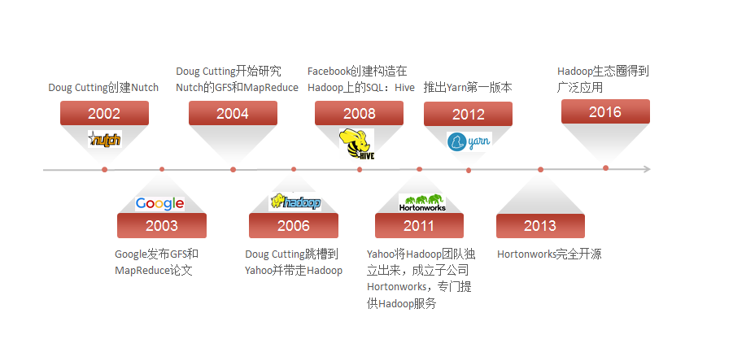
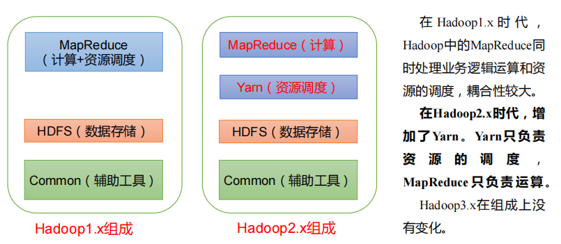
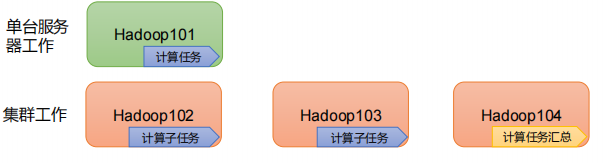
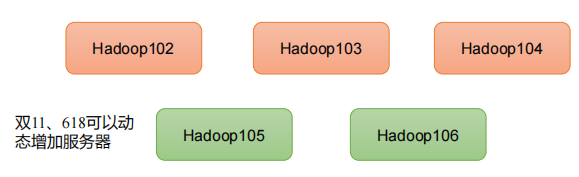
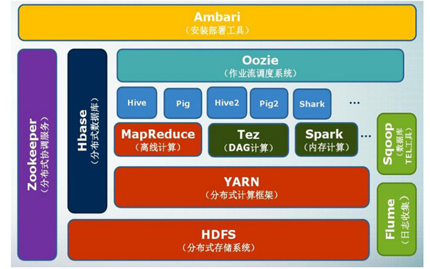
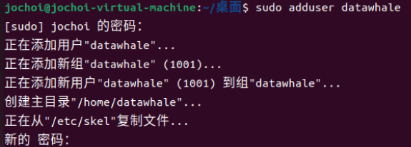
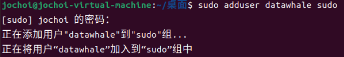
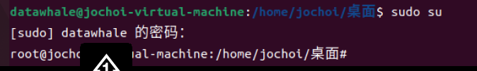

# 第二章 大数据处理架构Hadoop

---

（本学习笔记整理自[datawhale-大数据处理技术导论](https://github.com/datawhalechina/juicy-bigdata)，部分内容来自其他相关参考教程）

```md
Life is what you make it.
生活需要自己塑造。

```

---

> 1） Hadoop是一个由Apache基金会所开发的"分布式系统基础框架"。
> 2） 主要解决，海量数据的**存储**和海量书的**分析计算**问题。
> 3） 广义上来说，Hadoop通常是指一个更广泛的概念 --- **Hadoop生态圈**。

## 2.0 Hadoop的发展阶段



**Hadoop 三大发行版本 :**  Apache、Cloudera、Hortonworks

- Apache 版本最原始（最基础）的版本，对于入门学习最适合。 - 始于2006年
- Cloudera版本内部集成了很多大数据框架，对应产品**CDH** - 始于2008
- Hortonworks版本文档较好，对应产品**HDP** - 始于2011年
- Hortonworks现在已经被Cloudera公司收购，推出新的品牌**CDP** 。

1） **Apache Hadoop**

官网地址：http://hadoop.apache.org

下载地址：https://hadoop.apache.org/releases.html

**2**）**Cloudera Hadoop**

官网地址：https://www.cloudera.com/downloads/cdh

下载地址：https://docs.cloudera.com/documentation/enterprise/6/release-notes/topics/rg_cdh_6_download.html

（1）2008 年成立的 Cloudera 是最早将 Hadoop 商用的公司，为合作伙伴提供 Hadoop 的

商用解决方案，主要是包括支持、咨询服务、培训。

**（2）2009**年 **Hadoop** **的创始人** **Doug Cutting** **也加盟** **Cloudera** **公司**。Cloudera 产品主

要为 CDH，Cloudera Manager，Cloudera Support

（3）CDH 是 Cloudera 的 Hadoop 发行版，完全开源，比 Apache Hadoop 在兼容性，安

全性，稳定性上有所增强。Cloudera 的标价为每年每个节点 **10000** **美元**。

（4）Cloudera Manager 是集群的软件分发及管理监控平台，可以在几个小时内部署好一

个 Hadoop 集群，并对集群的节点及服务进行实时监控。

**3）Hortonworks Hadoop**

官网地址：https://hortonworks.com/products/data-center/hdp/

下载地址：https://hortonworks.com/downloads/#data-platform

（1）2011 年成立的 Hortonworks 是雅虎与硅谷风投公司 Benchmark Capital 合资组建。

**（**2）公司成立之初就吸纳了大约**25** **名至** **30** **名专门研究** **Hadoop** **的雅虎工程师，上述工程师均在 2005 年开始协助雅虎开发Hadoop，贡献了 **Hadoop80%的代码。

（3）Hortonworks 的主打产品是 Hortonworks Data Platform（HDP），也同样是 100%开源的产品，HDP 除常见的项目外还包括了 **Ambari**，一款开源的安装和管理系统。

（4）2018 年 Hortonworks 目前**已经被** **Cloudera** **公司收购**

## 2.1 概述

### 2.1.1 Hadoop简介

Hadoop是Apache软件基金会旗下的一个开源分布式计算平台，为用户提供了系统底层细节透明的分布式基础架构。Hadoop是基于Java语言开发的，具有很好的跨平台特性，并且可以部署在廉价的计算机集群中。

Hadoop的核心是分布式文件系统HDFS（Hadoop Distributed File System）和MapReduce。

- HDFS是对谷歌文件系统(Google File System，GFS）的开源实现，是面向普通硬件环境的分布式文件系统，具有较高的读写速度、很好的容错性和可伸缩性，支持大规模数据的分布式存储，其冗余数据存储的方式，很好地保证了数据的安全性。
- MapReduce是针对谷歌MapReduce的开源实现，允许用户在不了解分布式系统底层细节的情况下开发并行应用程序，采用MapReduce来整合分布式文件系统上的数据，可保证分析和处理数据的高效性。借助于Hadoop，程序员可以轻松地编写分布式并行程序，可将其运行于廉价计算机集群上，完成海量数据的存储与计算。

Hadoop 几个基础模块：

- **Common:** 支持其他模块的公用工具包,它主要包括**FileSystem、RPC和串行化库**。
- **HDFS:**  一个可高吞吐访问应用数据的分布式分拣系统,HDFS具有处理超大数据、流式处理、可以运行在廉价商用服务器上等优点。。
- **YARN:** 一个管理集群服务器资源和任务调度的框架。
- **MapReduce:** 基于Yarn对大数据集进行并行计算的系统。

其它的，像HBase、Hive等等不过在这几个基础模块上的高级抽象。Common模块是Hadoop最为基础的模块，他为其他模块提供了像操作文件系统、I/O、序列化和远程方法调用等最为基础的实现。如果想深入的了解Hadoop的具体实现，可以阅读一下Common的源码。

Hadoop1.x、2.x、3.x的区别



### 2.1.2 Hadoop的特性

Hadoop是一个能够对大量数据进行分布式处理的软件框架，并且是以一种可靠、高效、可伸缩的方式进行数据处理，它具有以下几个方面的特性：

- **高可靠性：** 采用冗余数据存储方式，即使一个副本发生故障，其他副本也可以保证正常对外提供服务。Hadoop按位存储和处理数据的能力，值得人们信赖。

  
- **高效性：** 在MapReduce的思想下，Hadoop作为**并行分布式计算平台**采用分布式存储和分布式处理两大核心技术，能够高效地处理PB级数据。Hadoop能够在节点之间动态地移动数据，并保证各个节点的动态平衡，因此处理速度非常快。
- **高可扩展性：** Hadoop的设计目标是可以高效稳定地运行在廉价的计算机集群上，可以扩展到数以千计的计算机节点。
  
- **高容错性：** 采用冗余数据存储方式，自动保存数据的多个副本，并且**能够自动将失败的任务进行重新分配**。

  
- **成本低：** Hadoop采用廉价的计算机集群，成本较低，普通用户也很容易用自己的PC上搭建Hadoop运行环境，与一体机、商用数据仓库以及QlinkView、Yonghong Z-Suit等数据集相比，Hadoop是开源的，项目的软件成本因此会大大降低。
- **运行在Linux平台上：** Hadoop是基于Java语言开发的，可以较好地运行在Linux平台上。
- **支持多种编程语言：** Hadoop上的应用程序也可以使用其他语言编写，如C++.

### 2.1.3 Hadoop的应用现状

- **国外应用：** Yahoo、Facebook等大厂
- **国内应用：** 百度、阿里巴巴、腾讯、华为等大厂

## 2.2 Hadoop的项目架构

经过多年发展，Hadoop项目不断完善和成熟，目前已经包含多个子项目，逐渐形成一个丰富的Hadoop生态系统。



- **HBase:** 一个提供高可靠性、高性能、可伸缩、实时读写和分布式的列式数据库.HBase是一个适合于非结构化数据存储的数据库,HBase是基于列而不是基于行的存储模式，HBase主要用于需要随机访问、实时读写的大数据（Big Data）。
- **pig:** Pig是一种数据流语言和运行环境，适合于使用Hadoop和MapReduce的平台来查询大型半结构化数据集，
- **Sqoop:** 主要用来在Hadoop和关系数据库之间交换数据,Sqoop可以改进数据的互操作性。通过JDBC（Java DataBase Connectivity）与关系数据库进行交互理论上，支持JDBC的关系数据库都可以用Sqoop与Hadoop进行数据交互。
- **Chukwa：** Chukwa是开源的数据收集系统，用于监控和分析大型分布式系统的数据。
- **Zookeeper：** Zookeeper是一个为分布式应用所涉及的开源协调服务，主要为用户提供同步、配置管理、分组和命名等服务，减轻分布式应用程序所承担的协调任务，Zookeeper的文件系统使用了我们所熟悉的目录树结构，Zookeeper是主要使用Java语言编写，同时支持C语言。

## 2.3 Hadoop运行环境搭建 :id=1-4

版本选择 ，现在 Hadoop 经历四个大版本：

```
Hadoop-0.x # 古老的Hadoop，连YARN都没有，现在应该没有任何企业还在使用这么古老的Hadoop了
hadoop-1.x # 基本淘汰的Hadoop版本。不用考虑
hadoop-2.x # 现阶段主流的使用版本。比如Hadoop-2.6.5， hadoop-2.7.7， hadoop-2.8.5
hadoop-3.x # 目前较新的Hadoop版本，提供了很多新特性，但是升级的企业还是比较少。
```

根据以上的说明和比较，根据我的了解，我这里选择使用 Hadoop-2.7.7 ，`出处选用hadoop3.3版本，这里有区别`

### 2.3.1 集群规划

说到集群规划，那么我们需要了解一下关于Hadoop集群的几种模式。

```md
伪分布式
分布式
高可用
联邦集群
```

主要有这么四种。当然企业中搭建的 Hadoop 集群都是高可用的分布式集群！

所以这里讲的Hadoop集群的规划主要针对Hadoop分布式集群来进行说明。

一台服务器：伪分布式


| 节点名称 | Hadoop                                  | YARN                             |
| ---------- | ----------------------------------------- | ---------------------------------- |
| bigdate2 | NameNode + DataNode + SecondaryNamenode | ResouceManager+<br />NodeManager |

三台服务器：


| 节点名称 | Hadoop                       | YARN                                   |
| ---------- | ------------------------------ | ---------------------------------------- |
| bigdate2 | NameNode + DataNode 主节点   | NodeManager                            |
| bigdate3 | DataNode + SecondaryNamenode | NodeManager                            |
| bigdate4 | DataNode                     | ResouceManager主节点+<br />NodeManager |

四台服务器：


| 节点名称 | Hadoop                       | YARN           |
| ---------- | ------------------------------ | ---------------- |
| bigdate2 | NameNode                     | NodeManager    |
| bigdate3 | DataNode + SecondaryNamenode | NodeManager    |
| bigdate4 | DataNode                     | NodeManager    |
| bigdate4 | DataNode                     | ResouceManager |

如果有更多的服务器，那么可以按需分配集群角色。实际企业中，一般会将单独性能较好的机器作为集群的主节点。我们在这儿把HDFS和YARN集群的主节点分开安装的不同的节点，主要是为了降低个节点的压力。毕竟我们使用的是虚拟机呀。当然，也可以调整把他们安装在同一个节点。

### 2.3.2 集群安装

刚才讲集群规划的时候，提到了四种安装模式。

```md
伪分布式 # 主要用来测试学习，搭建快速 
分布式 # 正儿八经的分布式集群。用来了解集群的工作机制，用于正儿八经的企业生产 
高可用 # 现阶段流行的主要集群模式。因为避免Hadoop的SPOF问题。提高集群的可用性。 
联邦集群 # 一些超大型企业可以使用的模式。主要为了应对超大规模的数据量对集群的主节点造 成的压力。
```

### 2.3.3 单机版环境搭建(伪分布)

<nav>
<a href="#一前置条件">一、前置条件</a><br/>
<a href="#二配置-SSH-免密登录">二、配置 SSH 免密登录</a><br/>
<a href="#三HadoopHDFS环境搭建">三、Hadoop(HDFS)环境搭建</a><br/>
<a href="#四HadoopYARN环境搭建">四、Hadoop(YARN)环境搭建</a><br/>
</nav>

首先我们搭建window10+wmware15+ubuntu20.04环境

**Windows：**

**系统镜像下载链接：**[https://mirror.bjtu.edu.cn/ubuntu-releases/22.04.1/ubuntu-22.04.1-desktop-amd64.iso](https://mirror.bjtu.edu.cn/ubuntu-releases/22.04.1/ubuntu-22.04.1-desktop-amd64.iso)

**✅参考教程：**[2020最新版VMware安装Ubuntu20.04教程(巨细)！](https://zhuanlan.zhihu.com/p/141033713)

**Mac：**

**下载VMware：**[https://customerconnect.vmware.com/cn/downloads/get-download?downloadGroup=FUS-PUBTP-2021H1](https://customerconnect.vmware.com/cn/downloads/get-download?downloadGroup=FUS-PUBTP-2021H1)

**系统镜像下载链接：**[http://old-releases.ubuntu.com/releases/22.04/ubuntu-22.04-live-server-arm64.iso](http://old-releases.ubuntu.com/releases/22.04/ubuntu-22.04-live-server-arm64.iso)

**✅参考教程：**[Mac M1芯片 安装vmware 和ubuntu 以及换源全过程](https://blog.csdn.net/nuomituansama/article/details/125909957)

**🔑**：教程以Windows版为主，Mac版后续操作可能略有不同，自行百度,具体搭建见参考教程。

接下来我们正式进入hadoop的搭建工作：

**环境：**Linux Ubuntu 22.04   
**要求：**在Linux系统的虚拟机上安装Hadoop软件，基本安装配置主要包括以下几个步骤：  

1. 创建Hadoop用户  
2. 安装Java  
3. 设置SSH登录权限。  
4. 单机安装配置。  
5. 伪分布式安装配置。  

- **创建Hadoop用户**

** ** **创建用户的命令是**`adduser`：会自动为创建的用户指定主目录、系统shell版本，会在创建时输入用户密码。

```shell
sudo adduser datawhale # 创建datawhale用户  我设置的密码为：12345678
```



输入`sudo adduser datawhale sudo`,给用户'datawhale'赋予管理员'sudo'权限

```shell
sudo adduser datawhale sudo
```



&emsp;&emsp;切换用户为`datawhale`用户，在该用户环境下进行操作。

```shell
su datawhale # 切换到datawhale用户
```


输入sudo su查看添加管理员权限是否成功，成功下如图所示



- **安装 Hadoop 的运行依赖 JDK**

> **JDK 版本**：jdk 1.8.0_20

**注意：课程里默认是把安装包下载到`/data/hadoop`文件夹下，并解压到`/opt`下**

1. 下载并解压

在[官网](https://www.oracle.com/technetwork/java/javase/downloads/index.html) 下载所需版本的 JDK，这里我下载的版本为[JDK 1.8](https://www.oracle.com/technetwork/java/javase/downloads/jdk8-downloads-2133151.html) ,下载后进行解压：

华为镜像： https://repo.huaweicloud.com/java/jdk/8u201-b09/jdk-8u201-linux-x64.tar.gz
```shell
[root@ java]# tar -zxvf jdk-8u201-linux-x64.tar.gz
```

2. 设置环境变量

```shell
[root@ java]# vi /etc/profile
```

添加如下配置：

```shell
export JAVA_HOME=/usr/java/jdk1.8.0_201  
export JRE_HOME=${JAVA_HOME}/jre  
export CLASSPATH=.:${JAVA_HOME}/lib:${JRE_HOME}/lib  
export PATH=${JAVA_HOME}/bin:$PATH
```

执行 `source` 命令，使得配置立即生效：

```shell
[root@ java]# source /etc/profile
```

3. 检查是否安装成功

```shell
[root@ java]# java -version
```

显示出对应的版本信息则代表安装成功。

```shell
java version "1.8.0_201"
Java(TM) SE Runtime Environment (build 1.8.0_201-b09)
Java HotSpot(TM) 64-Bit Server VM (build 25.201-b09, mixed mode)
```

- **配置免密登录**

Hadoop 组件之间需要基于 SSH 进行通讯。

1. 配置映射

配置 ip 地址和主机名映射：

```shell
vim /etc/hosts
# 文件末尾增加
192.168.72.131  hadoop001
```

2. 生成公私钥

执行下面命令行生成公匙和私匙：

```
ssh-keygen -t rsa
```

3. 授权

进入 `~/.ssh` 目录下，查看生成的公匙和私匙，并将公匙写入到授权文件：

```shell
[root@@hadoop001 sbin]#  cd ~/.ssh
[root@@hadoop001 .ssh]# ll
-rw-------. 1 root root 1675 3 月  15 09:48 id_rsa
-rw-r--r--. 1 root root  388 3 月  15 09:48 id_rsa.pub
# 写入公匙到授权文件
[root@hadoop001 .ssh]# cat id_rsa.pub >> authorized_keys
[root@hadoop001 .ssh]# chmod 600 authorized_keys
```

二、Hadoop 环境搭建

**注意：课程里默认是把安装包下载到`/data/hadoop`文件夹下，并解压到`/opt`下**

这里使用的Hadoop版本为2.7.7。

将该文件夹解压后，可以放置到自己喜欢的位置，如`/root/install`文件夹下。

```shell
tar -zxvf hadoop-2.7.2.tar.gz -C /root/install/

```

打开`/etc/profile`文件，命令如下：

```shell
sudo vi /etc/profile
在文件末尾，添加如下内容：
#hadoop
HADOOP_HOME=/root/install/hadoop-2.7.7
export HADOOP_HOME
export HADOOP_CLASSPATH=`hadoop classpath`
export HADOOP_CLASSPATH=$CLASSPATH:$HIVE_HOME/lib/*


```

对于单机安装，首先需要更改`hadoop-env.sh`文件，用于配置Hadoop运行的环境变量，命令如下：

修改hadoop-env.sh文件配置

```shell
cd /root/install/hadoop-2.7.7
vi etc/hadoop/hadoop-env.sh

```

在文件末尾，添加如下内容：

```shell
export JAVA_HOME=/root/install/jdk1.8.0_65


```

通过查看版本号命令验证是否安装成功，命令如下：

```shell
[root@hadoop5 hadoop-2.7.7]# hadoop version
Hadoop 2.7.7
Subversion Unknown -r c1aad84bd27cd79c3d1a7dd58202a8c3ee1ed3ac
Compiled by stevel on 2018-07-18T22:47Z
Compiled with protoc 2.5.0
From source with checksum 792e15d20b12c74bd6f19a1fb886490
This command was run using /root/install/hadoop-2.7.7/share/hadoop/common/hadoop-common-2.7.7.jar

```

## 2.4  Hadoop 测试案例 :id=1-5

### 2.4.1 官方案例

利用Hadoop自带的`WordCount`示例程序进行检查集群，并在主节点上进行如下操作，创建执行MapReduce任务所需的HDFS目录：

```shell

hadoop fs -mkdir /input

```

创建测试文件，命令如下：

```shell
vim test

```

在`test`文件中，添加以下内容：

```shell
Hello world!

```

使用`Shift+:`，输入`wq`后回车，保存并关闭编辑器。

将测试文件上传到Hadoop HDFS集群目录，命令如下：

```shell
hadoop fs -put test /input

```

执行wordcount程序，命令如下：

```shell
hadoop jar /root/install/hadoop-2.7.7/share/hadoop/mapreduce/hadoop-mapreduce-examples-2.7.7.jar wordcount /input /out

```

通过以下命令，查看执行结果：

```shell
hadoop fs -ls /out
```

执行结果如下：

```
Found 2 items
-rw-r--r--    1 root supergroup       0 time /out/_SUCCESS
-rw-r--r--    1 root supergroup      17 time /out/part-r-00000 

```

可以看到，结果中包含`_SUCCESS`文件，表示Hadoop集群运行成功。

查看具体的输出结果，命令如下：

```
hadoop fs -text /out/part-r-00000

```

输出结果如下：

```shell
Hello   1
world!  1

```
