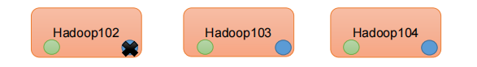

# 第二章 大数据处理架构Hadoop

---

（本学习笔记整理自[大数据技术导论](https://github.com/datawhalechina/juicy-bigdata)，部分内容来自其他相关参考教程）

```md
Life is what you make it.
生活需要自己塑造。

```

---

> 1） Hadoop是一个由Apache基金会所开发的"分布式系统基础框架"。
> 2） 主要解决，海量数据的**存储**和海量书的**分析计算**问题。
> 3） 广义上来说，Hadoop通常是指一个更广泛的概念 --- **Hadoop生态圈**。

## 2.0 Hadoop的发展阶段


**Hadoop 三大发行版本 :**  Apache、Cloudera、Hortonworks

- Apache 版本最原始（最基础）的版本，对于入门学习最适合。 - 始于2006年
- Cloudera版本内部集成了很多大数据框架，对应产品**CDH** - 始于2008
- Hortonworks版本文档较好，对应产品**HDP** - 始于2011年
- Hortonworks现在已经被Cloudera公司收购，推出新的品牌**CDP** 。

1） **Apache Hadoop**

官网地址：http://hadoop.apache.org

下载地址：https://hadoop.apache.org/releases.html

**2**）**Cloudera Hadoop**

官网地址：https://www.cloudera.com/downloads/cdh

下载地址：https://docs.cloudera.com/documentation/enterprise/6/release-notes/topics/rg_cdh_6_download.html

（1）2008 年成立的 Cloudera 是最早将 Hadoop 商用的公司，为合作伙伴提供 Hadoop 的

商用解决方案，主要是包括支持、咨询服务、培训。

**（2）2009**年 **Hadoop** **的创始人** **Doug Cutting** **也加盟** **Cloudera** **公司**。Cloudera 产品主

要为 CDH，Cloudera Manager，Cloudera Support

（3）CDH 是 Cloudera 的 Hadoop 发行版，完全开源，比 Apache Hadoop 在兼容性，安

全性，稳定性上有所增强。Cloudera 的标价为每年每个节点 **10000** **美元**。

（4）Cloudera Manager 是集群的软件分发及管理监控平台，可以在几个小时内部署好一

个 Hadoop 集群，并对集群的节点及服务进行实时监控。

**3）Hortonworks Hadoop**

官网地址：https://hortonworks.com/products/data-center/hdp/

下载地址：https://hortonworks.com/downloads/#data-platform

（1）2011 年成立的 Hortonworks 是雅虎与硅谷风投公司 Benchmark Capital 合资组建。

**（**2）公司成立之初就吸纳了大约**25** **名至** **30** **名专门研究** **Hadoop** **的雅虎工程师，上述工程师均在 2005 年开始协助雅虎开发Hadoop，贡献了 **Hadoop80%的代码。

（3）Hortonworks 的主打产品是 Hortonworks Data Platform（HDP），也同样是 100%开源的产品，HDP 除常见的项目外还包括了 **Ambari**，一款开源的安装和管理系统。

（4）2018 年 Hortonworks 目前**已经被** **Cloudera** **公司收购**

## 2.1 概述

### 2.1.1 Hadoop简介

Hadoop是Apache软件基金会旗下的一个开源分布式计算平台，为用户提供了系统底层细节透明的分布式基础架构。Hadoop是基于Java语言开发的，具有很好的跨平台特性，并且可以部署在廉价的计算机集群中。

Hadoop的核心是分布式文件系统HDFS（Hadoop Distributed File System）和MapReduce。

- HDFS是对谷歌文件系统(Google File System，GFS）的开源实现，是面向普通硬件环境的分布式文件系统，具有较高的读写速度、很好的容错性和可伸缩性，支持大规模数据的分布式存储，其冗余数据存储的方式，很好地保证了数据的安全性。
- MapReduce是针对谷歌MapReduce的开源实现，允许用户在不了解分布式系统底层细节的情况下开发并行应用程序，采用MapReduce来整合分布式文件系统上的数据，可保证分析和处理数据的高效性。借助于Hadoop，程序员可以轻松地编写分布式并行程序，可将其运行于廉价计算机集群上，完成海量数据的存储与计算。

Hadoop 几个基础模块：

- **Common:** 支持其他模块的公用工具包,它主要包括**FileSystem、RPC和串行化库**。
- **HDFS:**  一个可高吞吐访问应用数据的分布式分拣系统,HDFS具有处理超大数据、流式处理、可以运行在廉价商用服务器上等优点。。
- **YARN:** 一个管理集群服务器资源和任务调度的框架。
- **MapReduce:** 基于Yarn对大数据集进行并行计算的系统。

其它的，像HBase、Hive等等不过在这几个基础模块上的高级抽象。Common模块是Hadoop最为基础的模块，他为其他模块提供了像操作文件系统、I/O、序列化和远程方法调用等最为基础的实现。如果想深入的了解Hadoop的具体实现，可以阅读一下Common的源码。

Hadoop1.x、2.x、3.x的区别


### 2.1.2 Hadoop的特性

Hadoop是一个能够对大量数据进行分布式处理的软件框架，并且是以一种可靠、高效、可伸缩的方式进行数据处理，它具有以下几个方面的特性：

- **高可靠性：** 采用冗余数据存储方式，即使一个副本发生故障，其他副本也可以保证正常对外提供服务。Hadoop按位存储和处理数据的能力，值得人们信赖。

  
- **高效性：** 在MapReduce的思想下，Hadoop作为**并行分布式计算平台**采用分布式存储和分布式处理两大核心技术，能够高效地处理PB级数据。Hadoop能够在节点之间动态地移动数据，并保证各个节点的动态平衡，因此处理速度非常快。
- **高可扩展性：** Hadoop的设计目标是可以高效稳定地运行在廉价的计算机集群上，可以扩展到数以千计的计算机节点。
  
- **高容错性：** 采用冗余数据存储方式，自动保存数据的多个副本，并且**能够自动将失败的任务进行重新分配**。

  
- **成本低：** Hadoop采用廉价的计算机集群，成本较低，普通用户也很容易用自己的PC上搭建Hadoop运行环境，与一体机、商用数据仓库以及QlinkView、Yonghong Z-Suit等数据集相比，Hadoop是开源的，项目的软件成本因此会大大降低。
- **运行在Linux平台上：** Hadoop是基于Java语言开发的，可以较好地运行在Linux平台上。
- **支持多种编程语言：** Hadoop上的应用程序也可以使用其他语言编写，如C++.

### 2.1.3 Hadoop的应用现状

- **国外应用：** Yahoo、Facebook等大厂
- **国内应用：** 百度、阿里巴巴、腾讯、华为等大厂

## 2.2 Hadoop的项目架构

经过多年发展，Hadoop项目不断完善和成熟，目前已经包含多个子项目，逐渐形成一个丰富的Hadoop生态系统。


- **HBase:** 一个提供高可靠性、高性能、可伸缩、实时读写和分布式的列式数据库.HBase是一个适合于非结构化数据存储的数据库,HBase是基于列而不是基于行的存储模式，HBase主要用于需要随机访问、实时读写的大数据（Big Data）。
- **pig:** Pig是一种数据流语言和运行环境，适合于使用Hadoop和MapReduce的平台来查询大型半结构化数据集，
- **Sqoop:** 主要用来在Hadoop和关系数据库之间交换数据,Sqoop可以改进数据的互操作性。通过JDBC（Java DataBase Connectivity）与关系数据库进行交互理论上，支持JDBC的关系数据库都可以用Sqoop与Hadoop进行数据交互。
- **Chukwa：** Chukwa是开源的数据收集系统，用于监控和分析大型分布式系统的数据。
- **Zookeeper：** Zookeeper是一个为分布式应用所涉及的开源协调服务，主要为用户提供同步、配置管理、分组和命名等服务，减轻分布式应用程序所承担的协调任务，Zookeeper的文件系统使用了我们所熟悉的目录树结构，Zookeeper是主要使用Java语言编写，同时支持C语言。

```
wget -D --accept-regex=REGEX -P data -r -c ftp://ftp.ncdc.noaa.gov/pub/data/noaa/isd-lite/2019/5*

```
