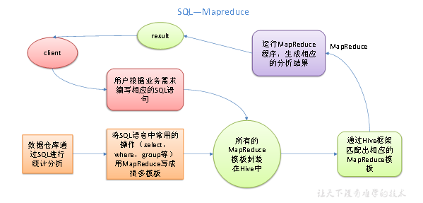
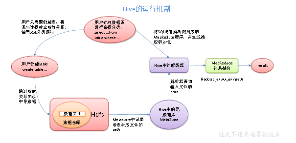

# task06之一：数据仓库Hive基础


---

（本学习笔记整理自[datawhale-大数据处理技术导论](https://github.com/datawhalechina/juicy-bigdata)，部分内容来自其他相关参考教程）


由于hive涉及内容有点多，所以我用了3个篇幅来说明：

1. [task06之一：数据仓库Hive基础](hive.md)
2. [task06之二:Hive-数据仓库进阶](hive2.md)
3. [task06之三：Apache Hive高级实战](hive3.md)


## 6.0 数据仓库

### 6.0.1 为什么要有数据仓库

在引入数据仓库之前，我们先来聊聊为什么回产生数据仓库？


数据的作用有两个：**操作型记录的保存**和**分析型决策的制定**

- 操作型记录的保存意味着企业通常不必维护历史数据，只需要修改数据以反映最新的状态；
- 分析型决策意味着企业需要保存历史的数据，从而可以更精准的来评估现有状况进行决策；

基于后者分析型决策的优化，需要高性能地完成用户的查询，因此引出了数据仓库的概念。

### 6.0.2 数据仓库概念

数据仓库是一个**面向主题、集成的、非易失的、随时间变化的、用来支持管理人员决策**的数据集合，数据仓库中包含了粒度化的企业数据。

数据仓库的主要特征是： **主题性** 、 **集成性** 、 **非易失性** 、 **时变性** 。


### 6.0.3 数据仓库的体系结构

数据仓库的体系结构通常包含4个层次：**数据源、数据存储和管理、数据服务以及数据应用**。


* **数据源：** 数据仓库的数据来源，包括外部数据、现有业务系统和文档资料等。
* **数据存储和管理：** 为数据提供的存储和管理，包括数据仓库、数据集市、数据仓库监视、运行与维护工具和元数据管理等。
* **数据服务：** 为前端工具和应用提供数据服务，包括直接从数据仓库中获取数据提供给前端使用，或者通过`OLAP`服务器为前端应用提供更为复杂的数据服务。
* **数据应用：** 直接面向最终用户，包括数据工具、自由报表工具、数据分析工具、数据挖掘工具和各类应用系统。

### 6.0.4 面临的挑战

随着大数据时代的全面到来，传统数据仓库也面临了如下挑战：

- 无法满足快速增长的海量数据存储需求
- 无法有效处理不同类型的数据
- 计算和处理能力不足

## 6.1 Hive基本概念

Hive 是基于Hadoop的一个数据仓库工具。**它可以将结构化的数据文件映射为一个数据库表**，并提供完整的SQL查询功能，可以将SQL语句转换为MapReduce任务进行运行。

特点：学习成本低，可以通过类SQL语句快速实现简单的MapReduce统计。

Hive定义了简单的类SQL查询语言，称为HiveQL,Hive 的命令行接口关系数据库的命令行接 但是 Hive 关系数据库还是有很大
的不同，主要体现在以下几点：

- Hive 和关系数据库存储文件的系统不同。Hive使用的是Hadoop的HDFS,关系数据库使用的则是服务器本地的文件系统。
- Hive 使用的计算模型是MapReduce,而关系数据库使用的则是自己设计的计算模型。
- 关系数据库都是实时查询的业务进行设计的，而Hive则是为海量数据做数据挖掘设计的。Hive的实时性很差，实时性的差别导致Hive的应用场景和关系数据库有很大的不同。
- Hive 很容易扩展自己的存储能力和计算能力，这是继承了Hadoop的特性，而关系数据库在这方面要与Hive 逊色很多。


### 6.2.1 概述

Hive:  由Facebook开源用于解决海量结构化日志的数据统计。

**Hive是建立在Hadoop之上的一种数仓工具。**该工具的功能是将**结构化、半结构化**的数据文件映射为一张**数据库表**，并提供了一种类似`SQL` 的查询功能（`HQL`）。

`Hive`本身并不具备存储功能，其核心是将`HQL`转换为`MapReduce`程序，然后将程序提交到`Hadoop`集群中执行。

本质是：将HQL转化成MapReduce程序。



1）Hive 处理的数据存储在HDFS

2）Hive 分析数据底层**默认实现**是MapReduce

3）执行程序运行在Yarn上

### 6.2.2 Hive 的优缺点

#### 6.2.2.1 优点

1）操作接口采用类SQL语法，提供快速开发的能力（简单、容易上手）。

2）避免了去写MapReduce，减少开发人员的学习成本。

3）Hive的执行延迟比较高，因此Hive常用于数据分析，对实时性要求不高的场合。

4）Hive优势在于处理大数据，对于处理小数据没有优势，因为Hive的执行延迟比较高。

5）Hive支持用户自定义函数，用户可以根据自己的需求来实现自己的函数。

#### 6.2.2.2 缺点

1．Hive的HQL表达能力有限

（1）迭代式算法无法表达

（2）数据挖掘方面不擅长

2．Hive的效率比较低

（1）Hive自动生成的MapReduce作业，通常情况下不够智能化

（2）Hive调优比较困难，粒度较粗

### 6.2.3 当前Hive的主流版本

选择任何技术的版本要考虑哪些方面：功能，稳定性，可维护性，兼容性

- 策略：靠考虑不新不九的稳定版本
- 当前Hive的主流版本有两个
    - hive-1.x 其中使用比较多的是hive-1.2.x的版本，最后一个稳定版本是hive-1.2.2,如果使用这个版本，你的hive将来没法集成spark.
    - hive-2.x 现行主流的hive使用版本，现行稳定的hive-2.x版本中，我们选择使用hive-2.3.6
    - HDP（商业版大数据环境）2.6.3内置的hive为1.2.1

### 6.2.3 Hive架构原理


1．用户接口：Client

CLI（hive shell）、JDBC/ODBC(java访问hive)、WEBUI（浏览器访问hive）

2．元数据：Metastore

元数据包括：表名、表所属的数据库（默认是default）、表的拥有者、列/分区字段、表的类型（是否是外部表）、表的数据所在目录等；

默认存储在自带的derby数据库中，推荐使用MySQL存储Metastore

3．Hadoop

使用HDFS进行存储，使用MapReduce进行计算。

4．驱动器：Driver

（1）解析器（SQL Parser）：将SQL字符串转换成抽象语法树AST，这一步一般都用第三方工具库完成，比如antlr；对AST进行语法分析，比如表是否存在、字段是否存在、SQL语义是否有误。

（2）编译器（Physical Plan）：将AST编译生成逻辑执行计划。

（3）优化器（Query Optimizer）：对逻辑执行计划进行优化。

（4）执行器（Execution）：把逻辑执行计划转换成可以运行的物理计划。对于Hive来说，就是MR/Spark。



Hive通过给用户提供的一系列交互接口，接收到用户的指令(SQL)，使用自己的Driver，结合元数据(MetaStore)，将这些指令翻译成MapReduce，提交到Hadoop中执行，最后，将执行返回的结果输出到用户交互接口。

### 6.2.4 Hive和数据库比较

由于 Hive 采用了类似SQL 的查询语言 HQL(Hive Query Language)，因此很容易将 Hive 理解为数据库。其实从结构上来看，Hive 和数据库除了拥有类似的查询语言，再无类似之处。本节将从多个方面来阐述 Hive 和数据库的差异。数据库可以用在 Online 的应用中，但是Hive 是为数据仓库而设计的，清楚这一点，有助于从应用角度理解 Hive 的特性。

#### **4.2.4.1 查询语言**

由于SQL被广泛的应用在数据仓库中，因此，专门针对Hive的特性设计了类SQL的查询语言HQL。熟悉SQL开发的开发者可以很方便的使用Hive进行开发。

#### **4.2.4.2 数据存储位置**

Hive 是建立在 Hadoop 之上的，所有 Hive 的数据都是存储在 HDFS 中的。而数据库则可以将数据保存在块设备或者本地文件系统中。

#### **4.2.4.3 数据更新**

由于Hive是针对数据仓库应用设计的，而数据仓库的内容是读多写少的。因此，Hive中不建议对数据的改写，所有的数据都是在加载的时候确定好的。而数据库中的数据通常是需要经常进行修改的，因此可以使用 INSERT INTO …  VALUES 添加数据，使用 UPDATE … SET修改数据。

#### **4.2.4.4 索引**

Hive在加载数据的过程中不会对数据进行任何处理，甚至不会对数据进行扫描，因此也没有对数据中的某些Key建立索引。Hive要访问数据中满足条件的特定值时，需要暴力扫描整个数据，因此访问延迟较高。由于 MapReduce 的引入， Hive 可以并行访问数据，因此即使没有索引，对于[大数据](http://lib.csdn.net/base/hadoop "Hadoop知识库")量的访问，Hive 仍然可以体现出优势。数据库中，通常会针对一个或者几个列建立索引，因此对于少量的特定条件的数据的访问，数据库可以有很高的效率，较低的延迟。由于数据的访问延迟较高，决定了 Hive 不适合在线数据查询。

### **4.2.4.5 执行**

Hive中大多数查询的执行是通过 Hadoop 提供的 MapReduce 来实现的。而数据库通常有自己的执行引擎。

#### **4.2.4.6 执行延迟**

Hive 在查询数据的时候，由于没有索引，需要扫描整个表，因此延迟较高。另外一个导致 Hive 执行延迟高的因素是 MapReduce框架。由于MapReduce 本身具有较高的延迟，因此在利用MapReduce 执行Hive查询时，也会有较高的延迟。相对的，数据库的执行延迟较低。当然，这个低是有条件的，即数据规模较小，当数据规模大到超过数据库的处理能力的时候，Hive的并行计算显然能体现出优势。

#### **4.2.4.7 可扩展性**

由于Hive是建立在Hadoop之上的，因此Hive的可扩展性是和Hadoop的可扩展性是一致的（世界上最大的Hadoop 集群在 Yahoo!，2009年的规模在4000 台节点左右）。而数据库由于 ACID 语义的严格限制，扩展行非常有限。目前最先进的并行数据库 [Oracle](http://lib.csdn.net/base/oracle "Oracle知识库") 在理论上的扩展能力也只有100台左右。

#### **4.2.4.8 数据规模**

由于Hive建立在集群上并可以利用MapReduce进行并行计算，因此可以支持很大规模的数据；对应的，数据库可以支持的数据规模较小。

## 6.3 Hive安装和shell操作

### 6.3.1 **Hive安装地址**

1．Hive官网地址

http://hive.apache.org/

2．文档查看地址

https://cwiki.apache.org/confluence/display/Hive/GettingStarted

3．下载地址

http://archive.apache.org/dist/hive/

### 6.3.2 **单机环境部署**

- 用途：测试，学习，快速使用

```md
# 基本要求：启动hadoop,mysql已安装

1. 上传安装包
apache-hive-2.3.6-bin.tar.gz

2. 解压安装包
tar -zxvf apache-hive-2.3.6-bin.tar.gz -C ../install/

3. 修改配置 hive-site.xml
<configuration>
<property>
    <name>javax.jdo.option.ConnectionURL</name>
    <value>jdbc:mysql://hadoop5:3306/hive?createDatabaseIfNotExist=true&verifyServerCertificate=false&useSSL=false</value>
</property>

<property>
    <name>javax.jdo.option.ConnectionDriverName</name>
    <value>com.mysql.jdbc.Driver</value>
</property>

<property>
    <name>javax.jdo.option.ConnectionUserName</name>
    <value>root</value>
</property>

<property>
    <name>javax.jdo.option.ConnectionPassword</name>
    <value>hadoop</value>
</property>


<property>
    <name>hive.metastore.warehouse.dir</name>
    <value>/user/hive/warehouse</value>
</property>

<property>
    <name>dfs.webhdfs.enabled</name>
    <value>true</value>
</property>
<property>
    <name>hive.server2.webui.host</name>
    <value>hadoop5</value>
</property>

<property>
    <name>hive.server2.webui.port</name>
    <value>15010</value>
</property>
<property>  
  <name>hive.metastore.local</name>
  <value>false</value>  
</property>
<property>  
  <name>hive.metastore.uris</name>
  <value>thrift://hadoop5:9083</value>  
</property>
<property>
    <name>hive.metastore.schema.verification</name>
    <value>false</value>
</property>

4. 一定要记得把Hadoop集群中的 core-site.xml 和 hdfs-site.xml 两个配置文件都放置在Hive安装目 录下conf目录中。
 cp core-site.xml hdfs-site.xml ~/install/apache-hive-2.3.6-bin/conf/

5、进入到bin目录，运行hive脚本 
cd apache-hive-2.3.6-bin/bin 
./hive 

6. 如果报错打开hadoop-2.7.7/etc/hadoop/文件加执行命令：

cp core-site.xml hdfs-site.xml ~/install/apache-hive-2.3.6-bin/conf/

4、测试使用 
show databases;
```

报错问题修复：

hive> show databases; FAILED: SemanticException org.apache.hadoop.hive.ql.metadata.HiveException: java.lang.RuntimeException: Unable to instantiate org.apache.hadoop.hive.ql.metadata.SessionHiveMetaStoreClient

> 可能是hive的服务端没有打开
> 1）hive --service metastore &
> 2）然后Ctrl+C
> 3）再hive,进去 show databases;
>
> 解答地址：https://blog.csdn.net/qq_35078688/article/details/86137440

### 6.3.3 **集群版环境构建**

```md
基本要求：
    安装好hadoop和mysql(mysql配置远程连接权限)

第1步：上传安装包
上传apache-hive-2.3.6-bin.tar.gz到服务器节点中。

第2步：解压安装包到对应的Hive安装目录中
tar -zxvf apache-hive-2.3.6-bin.tar.gz -C ../install/

第3步：创建配置文件 hive-site.xml
touch hive-site.xml
vi hive-site.xml

在这个新创建的配置文件中加入如下内容即可： 

<?xml version="1.0" encoding="UTF-8" standalone="no"?> 

<?xml-stylesheet type="text/xsl" href="configuration.xsl"?> 

<configuration> 

<property> 

<name>javax.jdo.option.ConnectionURL</name> 

<value>jdbc:mysql://hadoop1:3306/hive? 

createDatabaseIfNotExist=true&verifyServerCertificate=false&useSSL=false< 

/value> 

</property> 

<property> 

<name>javax.jdo.option.ConnectionDriverName</name> 

<value>com.mysql.jdbc.Driver</value> 

</property> 

<property> 

<name>javax.jdo.option.ConnectionUserName</name> 

<value>root</value> 

</property> 

<property> 

<name>javax.jdo.option.ConnectionPassword</name> 

<value>hadoop</value> 

</property> 

<property> 

<name>hive.metastore.warehouse.dir</name> 

<value>/user/hive/warehouse</value> 

</property> 

<property> 

<name>dfs.webhdfs.enabled</name> 

<value>true</value> 

</property> 

</configuration> 

第4步：加入MySQL驱动 

加入MySQL驱动包 mysql-connector-java-5.1.40-bin.jar 该jar包放置在hive的安装根路径下的 

lib目录中，hive要读写MySQL 

第5步：复制Hadoop集群的配置文件

**深度之眼 大数据开发实战**一定要记得把Hadoop集群中的 core-site.xml 和 hdfs-site.xml 两个配置文件都放置在Hive安装目 

录下conf目录中。 

cp core-site.xml hdfs-site.xml ~/install/apache-hive-2.3.6-bin/conf/

第6步：复制hive到其他节点 

scp -r apache-hive-2.3.6-bin root@hadoop2:/root/install 

scp -r apache-hive-2.3.6-bin root@hadoop3:/root/install 

第7步： 安装完成，配置环境变量 

export HIVE_HOME=/home/bigdata/apps/apache-hive-2.3.6-bin 

export PATH=$PATH:$HIVE_HOME/bin 

第8步：验证Hive安装 

hive --service version 

第9步：初始化元数据库 

注意：当使用的hive是1.x之前的版本，不做初始化也是OK的，当Hive第一次启动的时候会自动进行初始化， 

只不过会不会生成足够多的元数据库中的表。在使用过程中会慢慢生成。但最后进行初始化。如果使用的2.x版 

本的Hive，那么就必须手动初始化元数据库。使用命令： 

schematool -dbType mysql -initSchema 

第10步：启动Hive 客户端 

hive 

hive --service cli 

HiveServer2服务部署方法如下： 

修改的Hadoop集群中的 core-site.xml 和 hdfs-site.xml，并且一定要记得，所有节点都的修改。重 

启Hadoop集群 

第一步：修改hadoop集群的hdfs-site.xml配置文件：加入一条配置信息，表示启用webhdfs

<property> 

<name>dfs.webhdfs.enabled</name> 

<value>true</value> 

</property> 

第二步：修改hadoop集群的core-site.xml配置文件：加入两条配置信息：表示设置hadoop集群的代理用 

户

<property> 

<name>hadoop.proxyuser.root.hosts</name> 

<value>*</value> 

</property> 

<property> 

<name>hadoop.proxyuser.root.groups</name> 

<value>*</value> 

</property> 

启动Hiveserver2服务 

nohup hiveserver2 1>/root/install/apache-hive-2.3.6-bin/log/hiveserver.log 

2>/root/install/apache-hive-2.3.6-bin/log/hiveserver.err & 

启动beeline客户端，HUE,HDP的hive界面 

beeline -u jdbc:hive2://hadoop1:10000 -n root


扩展：Hiveserver2 Web UI 

Hive从2.0 版本开始，为 HiveServer2 提供了一个简单的 WEB UI 界面，界面中可以直观的看到当前链 

接的会话、历史日志、配置参数以及度量信息。 

hive-site.xml 配置文件： 

<property> 

<name>hive.server2.webui.host</name> 

<value>hadoop1</value> 

</property> 

<property> 

<name>hive.server2.webui.port</name> 

<value>15010</value> 

</property> 

重启 Hiveserver2，访问 Web UI：http://hadoop5:15010
```

### 6.3.4 Hive基本操作

（1）启动hive

```
[root@hadoop5 apache-hive-2.3.6-bin]$ bin/hive
```

（2）查看数据库

```
hive> show databases;
```

（3）打开默认数据库

```
hive> use default;
```

（4）显示default数据库中的表

```
hive> show tables;
```

（5）创建一张表

```
hive> create table student(id int, name string);
```

（6）显示数据库中有几张表

```
hive> show tables;
```

（7）查看表的结构

```
hive> desc student;
```

（8）向表中插入数据

```
hive> insert into student values(1000,"ss");
```

（9）查询表中数据

```
hive> select * from student;
```

（10）退出hive

```
hive> quit;
```

### 6.3.4 将本地文件导入Hive案例

将本地`/root/hdp/hive_stage/student.txt`这个目录下的数据导入到hive的student(id int, name string)表中。

```text
1001	zhangshan
1002	lishi
1003	zhaoliu
```

```sql
[root@hadoop5 apache-hive-2.3.6-bin]# bin/hive
hive> show databases;
hive> use default;
OK
Time taken: 0.039 seconds
hive> show tables;
OK
access_log
access_log_first
access_log_url_top
info_ip
ip_content
log_content
log_tmp1
log_tmp2
log_tmp3
log_tmp4
student
Time taken: 0.058 seconds, Fetched: 11 row(s)
hive> drop table student;
OK
Time taken: 0.6 seconds
hive> show tables;
OK
access_log
access_log_first
access_log_url_top
info_ip
ip_content
log_content
log_tmp1
log_tmp2
log_tmp3
log_tmp4
Time taken: 0.042 seconds, Fetched: 10 row(s)
hive> create table student(id int ,name string) ROW FORMAT DELIMITED FIELDS TERMINATED BY '\t';
OK
Time taken: 0.571 seconds
hive> load data local inpath '/root/hdp/hive_stage/student.txt' into table student;
Loading data to table default.student
OK
Time taken: 1.563 seconds
hive> select * from student;
OK
1001    zhangshan
1002    lishi
1003    zhaoliu
Time taken: 3.097 seconds, Fetched: 3 row(s)
hive> 

```

### 6.3.5 HiveJDBC访问

#### 6.3.5.1 ****启动hiveserver****2****服务**

```sql
[root@hadoop5 hive]$ bin/hiveserver2
```

4.3.5.2 ****启动beeline**

```
[root@hadoop5 hive]$ bin/beeline

Beeline version 1.2.1 by Apache Hive

beeline>
```

4.3.5.3 ****连接hiveserver****2

```
beeline> !connect jdbc:hive2://hadoop5:10000（回车）

Connecting to jdbc:hive2://hadoop5:10000

Enter username for jdbc:hive2://hadoop5:10000: atguigu（回车）

Enter password for jdbc:hive2://hadoop5:10000: （直接回车）

Connected to: Apache Hive (version 1.2.1)

Driver: Hive JDBC (version 1.2.1)

Transaction isolation: TRANSACTION_REPEATABLE_READ

0: jdbc:hive2://hadoop5:10000> show databases;

+----------------+--+

| database_name  |

+----------------+--+

| default        |

| hive_db2       |

+----------------+--+

```

### 6.3.6 Hive常用交互命令

```sql
[root@hadoop5 apache-hive-2.3.6-bin]# bin/hive -help
usage: hive
 -d,--define <key=value>          Variable substitution to apply to Hive
                                  commands. e.g. -d A=B or --define A=B
    --database <databasename>     Specify the database to use
 -e <quoted-query-string>         SQL from command line
 -f <filename>                    SQL from files
 -H,--help                        Print help information
    --hiveconf <property=value>   Use value for given property
    --hivevar <key=value>         Variable substitution to apply to Hive
                                  commands. e.g. --hivevar A=B
 -i <filename>                    Initialization SQL file
 -S,--silent                      Silent mode in interactive shell
 -v,--verbose                     Verbose mode (echo executed SQL to the
                                  console)

```

1．“-e” 不进入hive的交互窗口执行sql语句

```sql
[root@hadoop5 apache-hive-2.3.6-bin]# bin/hive -e "select id from student;"
OK
1001
1002
1003
Time taken: 7.306 seconds, Fetched: 3 row(s)

```

2．“-f”执行脚本中sql语句

（1）在/root/hdp/hive_stage目录下创建hivef.sql文件

```
$ touch hivef.sql
```

文件中写入正确的sql语句

```
select * from student;
```

（2）执行文件中的sql语句

```
$ bin/hive -f /root/hdp/hive_stage/hivef.sql
```

（3）执行文件中的sql语句并将结果写入文件中

```
$ bin/hive -f /root/hdp/hive_stage/hivef.sql  > /root/hdp/hive_stage/hive_result.txt
OK
Time taken: 6.712 seconds, Fetched: 3 row(s)

[root@hadoop5 apache-hive-2.3.6-bin]# cat  /root/hdp/hive_stage/hive_result.txt
1001    zhangshan
1002    lishi
1003    zhaoliu
```

### 6.3.7 Hive其他命令操作

1．在hive cli命令窗口中如何查看hdfs文件系统

```
hive> dfs -ls /;
drwxr-xr-x   - root supergroup          0 2021-10-21 23:41 /hema
drwxr-xr-x   - root supergroup          0 2021-08-01 20:48 /hive_stage
```

2．在hive cli命令窗口中如何查看本地文件系统

```sql
hive> ! ls /root/hdp/hive_stage;
hivef.sql
hive_result.txt
student.txt
```

3. 查看在hive中输入的所有历史命令
   （1）进入到当前用户的根目录/root或/home/<user>
   （2）查看. hivehistory文件

```
[root@hadoop5 ~]$ cat .hivehistory
```

### 6.3.8 Hive常见属性配置

#### 6.3.8.1 Hive数据仓库位置配置

1）Default数据仓库的最原始位置是在hdfs上的：/user/hive/warehouse路径下。

```shell
[root@hadoop5 ~]# cd ..
[root@hadoop5 /]# cd user/hive
[root@hadoop5 hive]# ls
warehouse

```

2）在仓库目录下，没有对默认的数据库default创建文件夹。如果某张表属于default数据库，直接在数据仓库目录下创建一个文件夹。

3）修改default数据仓库原始位置（将hive-default.xml.template如下配置信息拷贝到hive-site.xml文件中）。

```xml
<property>
<name>hive.metastore.warehouse.dir</name>
<value>/user/hive/warehouse</value>
<description>location of default database for the warehouse</description>
</property>
```

配置同组用户有执行权限`bin/hdfs dfs -chmod g+w /user/hive/warehouse`

#### 6.3.8.2 查询后信息显示配置

1）在hive-site.xml文件中添加如下配置信息，就可以实现显示当前数据库，以及查询表的头信息配置。

```xml
<property>
	<name>hive.cli.print.header</name>
	<value>true</value>
</property>

<property>
	<name>hive.cli.print.current.db</name>
	<value>true</value>
</property>
```

2）重启hive，对比差异`hive --service metastore &`

```sql
# 配置前
hive> select * from student;
OK
1001    zhangshan
1002    lishi
1003    zhaoliu
# 配置后
hive (default)> select * from student;
OK
student.id      student.name
1001    zhangshan
1002    lishi
1003    zhaoliu
Time taken: 3.49 seconds, Fetched: 3 row(s)


```

#### 6.3.8.3 Hive 运行日志信息配置

1. Hive的log默认存放在/tmp/root/hive.log目录下（当前用户名下）
2. 将Hive的log存放在logs文件夹

```xml

   [root@hadoop5 conf]# pwd
   /root/install/apache-hive-2.3.6-bin/conf

   [root@hadoop5 conf]# ls 
   beeline-log4j2.properties.template    hive-log4j2.properties.template

   [root@hadoop5 conf]# mv hive-log4j2.properties.template hive-log4j.properties

   [root@hadoop5 conf]# ls
   beeline-log4j2.properties.template    hive-log4j.properties

   [root@hadoop5 conf]# vi hive-log4j.properties
   #property.hive.log.dir = ${sys:java.io.tmpdir}/${sys:user.name}
   property.hive.log.dir = /root/install/apache-hive-2.3.6-bin/logs

```

#### 6.3.8.4 参数配置方式

1．查看当前所有的配置信息

```
hive>set;
```

2．参数的配置三种方式

（1）配置文件方式
默认配置文件：`hive-default.xml`

用户自定义配置文件：`hive-site.xml`

注意：用户自定义配置会覆盖默认配置。另外，Hive也会读入Hadoop的配置，因为Hive是作为Hadoop的客户端启动的，Hive的配置会覆盖Hadoop的配置。配置文件的设定对本机启动的所有Hive进程都有效。
（2）命令行参数方式

启动Hive时，可以在命令行添加-hiveconf param=value来设定参数。

例如：

```
[root@hadoop5 apache-hive-2.3.6-bin]# bin/hive -hiveconf mapred.reduce.tasks=10;
```

注意：仅对本次hive启动有效

查看参数设置：

```
hive (default)> set mapred.reduce.tasks;
```

（3）参数声明方式

可以在HQL中使用SET关键字设定参数

例如：

```
hive (default)> set mapred.reduce.tasks=100;
```

注意：仅对本次hive启动有效。

查看参数设置

```
hive (default)> set mapred.reduce.tasks;
```

上述三种设定方式的优先级依次递增。即配置文件<命令行参数<参数声明。注意某些系统级的参数，例如log4j相关的设定，必须用前两种方式设定，因为那些参数的读取在会话建立以前已经完成了。

## 6.4 Hive数据类型

### 6.4.1 基本数据类型

`Hive`表中的列支持以下基本数据类型：


| Hive数据类型 | Java数据类型 | 长度                                                 | 例子                                     |
| -------------- | -------------- | ------------------------------------------------------ | ------------------------------------------ |
| TINYINT      | byte         | 1byte有符号整数                                      | 20                                       |
| SMALINT      | short        | 2byte有符号整数                                      | 20                                       |
| *INT         | int          | 4byte有符号整数                                      | 20                                       |
| *BIGINT      | long         | 8byte有符号整数                                      | 20                                       |
| BOOLEAN      | boolean      | 布尔类型，true或者false                              | TRUE  FALSE                             |
| FLOAT        | float        | 单精度浮点数                                         | 3.14159                                  |
| *DOUBLE      | double       | 双精度浮点数                                         | 3.14159                                  |
| *STRING      | string       | 字符系列。可以指定字符集。可以使用单引号或者双引号。 | ‘now is the time’ “for all good men” |
| TIMESTAMP    |              | 时间类型                                             |                                          |
| BINARY       |              | 字节数组                                             |                                          |

对于Hive的String类型相当于数据库的varchar类型，该类型是一个可变的字符串，不过它不能声明其中最多能存储多少个字符，理论上它可以存储2GB的字符数。

> 注：TIMESTAMP和TIMESTAMP WITH LOCAL TIME ZONE的区别如下：
> TIMESTAMP WITH LOCAL TIME ZONE：用户提交TIMESTAMP给数据库时，会被转换成数据库所在的时区来保存。查询时，则按照查询客户端的不同，转换为查询客户端所在时区的时间。
> TIMESTAMP ：提交的时间按照原始时间保存，查询时，也不做任何转换。

- **隐式转换**

`Hive`中基本数据类型遵循以下的层次结构，按照这个层次结构，子类型到父类型允许隐式转换。 例如`INT`类型的数据允许隐式转换为`BIGINT`类型。额外注意的是：按照类型层次结构，允许将STRING类型隐式转换为DOUBLE类型。

- **复杂类型**


| STRUCT | 类似于对象，是字段的集合，字段的类型可以不同，可以使用`名称.字段名`方式进行访问 | STRUCT('xiaoming', 12 , '2018-12-12') |
| -------- | --------------------------------------------------------------------------------- | --------------------------------------- |
| MAP    | 键值对的集合，可以使用`名称[key]`的方式访问对应的值                             | map('a', 1, 'b', 2)                   |
| ARRAY  | 数组是一组具有相同类型和名称的变量的集合，可以使用`名称[index]`访问对应的值     | ARRAY('a', 'b', 'c', 'd')             |

- **Hive Meta Data Structure (元数据总览)**


| data structure | Logical                      | Physical (HDFS)   |
| ---------------- | ------------------------------ | ------------------- |
| Database       | A collection of tables       | Folder with files |
| table          | A collection of rows of data | Folder with files |
| partition      | Columns to split data        | folder            |
| Buckets        | Columns to distribute data   | Files             |
| Row            | Line of records              | Line in a file    |
| Columns        | slice of records             | Folder with files |
| Views          | shortcut of rows of data     | n/a               |
| index          | statistics of data           | folder with files |

### 6.4.2 Hive数据模型

`Hive`的数据都是存储在`HDFS`上的，默认有一个根目录，在`Hive-site.xml`中可以进行配置数据的存储路径。`Hive`数据模型的含义是，描述`Hive`组织、管理和操作数据的方式。`Hive`包含如下4种数据模型：

1. **库**

`Mysql`中默认数据库是`default`，用户可以创建不同的`database`,在`database`下也可以创建不同的表。`Hive`也可以分为不同的数据(仓)库，和传统数据库保持一致。在传统数仓中创建`database`。默认的数据库也是`default`。`Hive`中的库相当于关系数据库中的命名空间，它的作用是将用户和数据库的表进行隔离。

2. **表**

`Hive`中的表所对应的数据是存储在`HDFS`中，而表相关的元数据是存储在关系数据库中。Hive中的表分为内部表和外部表两种类型，两者的区别在于数据的访问和删除：

- 内部表的加载数据和创建表的过程是分开的，在加载数据时，实际数据会被移动到数仓目录中，之后对数据的访问是在数仓目录实现。而外部表加载数据和创建表是同一个过程，对数据的访问是读取`HDFS`中的数据；
- 内部表删除时，因为数据移动到了数仓目录中，因此删除表时，表中数据和元数据会被同时删除。外部表因为数据还在`HDFS`中，删除表时并不影响数据。
- 创建表时不做任何指定，默认创建的就是内部表。想要创建外部表，则需要使用`External`进行修饰


| 对比内容     | 内部表                                                                                                                                              | 外部表                                                                          |
| :------------- | :---------------------------------------------------------------------------------------------------------------------------------------------------- | :-------------------------------------------------------------------------------- |
| 数据存储位置 | 内部表数据存储的位置由`hive.Metastore.warehouse.dir`参数指定，<br/>默认情况下，表的数据存储在`HDFS`的`/user/hive/warehouse/数据库名.db/表名/`目录下 | 外部表数据的存储位置创建表时由`Location`参数指定                                |
| 导入数据     | 在导入数据到内部表，内部表将数据移动到自己的数据仓库目录下，<br/>数据的生命周期由`Hive`来进行管理                                                   | 外部表不会将数据移动到自己的数据仓库目录下，<br/>只是在元数据中存储了数据的位置 |
| 删除表       | 删除元数据（metadata）和文件                                                                                                                        | 只删除元数据（metadata）                                                        |

3. **分区**
   分区是一个优化的手段，目的是 **减少全表扫描** ，提高查询效率。在`Hive`中存储的方式就是表的主目录文件夹下的子文件夹，子文件夹的名字表示所定义的分区列名字。
4. **分桶**
   分桶和分区的区别在于：分桶是针对数据文件本身进行拆分，根据表中字段（例如，编号ID）的值，经过`hash`计算规则，将数据文件划分成指定的若干个小文件。分桶后，`HDFS`中的数据文件会变为多个小文件。分桶的优点是**优化join查询**和 **方便抽样查询** 。

## 6.5 Hive系统结构

`Hive`主要由用户接口模块、驱动模型以及元数据存储模块3个模块组成，其系统架构如下图所示：


### 6.5.1 用户接口模块

用户接口模块包括`CLI`、`Hive`网页接口（Hive Web Interface，HWI）、`JDBC`、`ODBC`、`Thrift Server`等，主要实现外部应用对`Hive`的访问。用户可以使用以下两种方式来操作数据：

* **CLI** （command-line shell）：`Hive`自带的一个命令行客户端工具，用户可以通过`Hive`命令行的方式来操作数据；
* **HWI** （Thrift/JDBC）：`HWI`是`Hive`的一个简单网页，`JDBC`、`ODBS`和`Thrift Server`可以向用户提供编程访问的接口。用户可以按照标准的`JDBC`的方式，通过`Thrift`协议操作数据。

### 6.5.2 驱动模块

驱动模块（Driver）包括编译器、优化器、执行器等，所采用的执行引擎可以是 `MapReduce`、`Tez`或`Spark`等。当采用`MapReduce`作为执行引擎时，驱动模块负责把 `HiveQL`语句转换成一系列`MapReduce`作业，所有命令和查询都会进入驱动模块，通过该模块对输入进行解析编译，对计算过程进行优化，然后按照指定的步骤执行。

### 6.5.3 元数据存储模块

* **元数据：**
  元数据（metadata）是 **描述数据的数据** ，对于`Hive`来说，元数据就是用来描述`HDFS`文件和表的各种对应关系（位置关系、顺序关系、分隔符）。`Hive`的元数据存储在**关系数据库**中（`Hive`内置的是`Derby`、第三方的是`MySQL`），`HDFS`中存储的是数据。在`Hive`中，所有的元数据默认存储在`Hive`内置的`Derby`数据库中，但由于`Derby`只能有一个实例，也就是说不能有多个命令行客户端同时访问，所以在实际生产环境中，通常使用` MySQL`代替`Derby`。
  元数据存储模块（Metastore）是一个独立的关系数据库，通常是与`MySQL`数据库连接后创建的一个`MySQL`实例，也可以是`Hive`自带的`Derby`数据库实例，提供 **元数据服务** 。元数据存储模块中主要保存表模式和其他系统元数据，如表的名称、表的列及其属性、表的分区及其属性、表的属性、表中数据所在位置信息等。它提供给`Hive`操作管理访问元数据的一个服务，具体操作为`Metastore`对外提供一个服务地址，使客户端能够连接`Hive`，以此来对元数据进行访问。使用`Metastore`的好处如下：
    * 元数据把数据保存在关系数据库中，`Hive`提供元数据服务，通过对外的服务地址，用户能够使用客户端连接`Hive`，访问并操作元数据；
    * 支持多个客户端的连接，而客户端无需关心数据的存储地址，实现了数据访问层面的解耦操作。
    * 因此如果你在`Hive`上创建了一张表，然后在`presto`/`impala`/`sparksql`中都是可以直接使用的，它们会从`Metastore`中获取统一的元数据信息，同样的你在`presto`/`impala`/`sparksql`中创建一张表，在`Hive`中也可以直接使用。


* **`Metastore`管理元数据的方式：**

1. **内嵌模式**
   `Metastore`**默认的**部署模式是`Metastore`元数据服务和`Hive`服务融合在一起。


在这种模式下，`Hive`服务（即`Hive`驱动本身）、元数据服务`Metastore`，元数据`metadata`（用于存储映射信息）都在同一个`JVM`进程中，元数据存储在内置的 **Derby数据库** 。当启动`HiveServer`进程时，`Derby`和`Metastore`都会启动，不需要额外启动`Metastore`服务。但是，一次只能支持一个用户访问，适用于测试场景。

2. **本地模式**
   本地模式与内嵌模式的区别在于：把元数据提取出来，让`Metastore`服务与`HiveServer`主进程在同一个`JVM`进程中运行，存储元数据的数据库在单独的进程中运行。元数据一般存储在`MySQL`关系型数据库中。


但是，每启动一个`Hive`服务，都会启动一个`Metastore`服务。多个人使用时，会启用多个`Metastore`服务。

3. **远程模式**
   既然可以把元数据存储给提取出来，也可以考虑把`Metastore`给提取出来变为单独一个进程。把`Metastore`单独进行配置，并在单独的进程中运行，可以保证全局唯一，从而保证数据访问的安全性。（即不随`Hive`的启动而启动）


其优点是把`Metastore`服务独立出来，可以安装到远程的服务器集群里，从而解耦`Hive`服务和`Metastore`服务，保证`Hive`的稳定运行。

### 6.5.4 HQL的执行流程

`Hive`在执行一条`HQL`语句时，会经过以下步骤：

1. 语法解析：`Antlr`定义`SQL`的语法规则，完成`SQL`词法，语法解析，将`SQL`转化为抽象语法树`AST Tree`；
2. 语义解析：遍历`AST Tree`，抽象出查询的基本组成单元`QueryBlock`；
3. 生成逻辑执行计划：遍历`QueryBlock`，翻译为执行操作树`OperatorTree`；
4. 优化逻辑执行计划：逻辑层优化器进行`OperatorTree`变换，合并不必要的`ReduceSinkOperator`，减少`shuffle`数据量；
5. 生成物理执行计划：遍历`OperatorTree`，翻译为`MapReduce`任务；
6. 优化物理执行计划：物理层优化器进行`MapReduce`任务的变换，生成最终的执行计划。

> 关于 Hive SQL 的详细工作原理可以参考美团技术团队的文章：[HiveQL编译过程](https://tech.meituan.com/2014/02/12/hive-sql-to-mapreduce.html)

## 6.6 分区表

### 6.6.1 概念

Hive 中的表对应为`HDFS`上的指定目录，在查询数据时候，默认会对全表进行扫描，这样时间和性能的消耗都非常大。

**分区为HDFS上表目录的子目录**，数据按照分区存储在子目录。如果查询的`where`字句的中包含分区条件，则直接从该分区去查找，而不是扫描整个表目录，合理的分区设计可以极大提高查询速度和性能。

> 这里说明以下分区表并hive独有的概念，实际上这个概念非常常见。比如在我们常用的Oracle数据库中，当表中的数据量不断增大，查询数据的速度就会下降，这时也可以对表进行分区。表进行分区后，逻辑上表仍然是一张完整的表，只是将表中的数据存放到多个表空间（物理文件上），这样查询数据时，就不必要每次都扫描整张表，从而提升查询性能。

### 6.6.2 使用场景

通常，在管理大规模数据集的时候都需要进行分区，比如将日志文件按天进行分区，从而保证数据细粒度的划分，使得查询性能得到提升。

> 分区HDFS上表目录的子目录，数据按照分区存储在子目录中。

### 6.6.3 创建分区表

**在Hive中可以使用`PARTITIONED BY`子句创建分区表。**表可以包含一个或多个分区列，程序会为分区列中的每个不同值组合创建单独的数据目录。下面的我们创建一张雇员表作为测试：

```sql
CREATE EXTERNAL TABLE emp_partition(
empno Int,
ename STRING,
job STRING,
mgr INT,
hiredate TIMESTAMP,
sal DECIMAL(7,2),
comm DECIMAL(7,2)
)
PARTITIONED BY (deptno INT)  -- 按照部门编号进行分区
ROW FORMAT DELIMITED FIELDS TERMINATED BY "\t"
LOCATION '/hive/emp_partition';
```

### 6.6.4 加载数据到分区表

加载数据到分区表时候必须要指定数据所处的分区：

```sql
# 加载部门编号为20的数据到表中
LOAD DATA LOCAL INPATH "/usr/file/emp20.txt" OVERWRITE INTO TABLE emp_partition PARTITION (deptno=20)
# 加载部门编号为30的数据到表中
LOAD DATA LOCAL INPATH "/usr/file/emp30.txt" OVERWRITE INTO TABLE emp_partition PARTITION (deptno=30)
```

### 6.6.5 查看分区目录

这时候我们直接查看表目录，可以看到表目录下存在两个子目录，分别是`deptno=20`和`deptno=30`,这就是分区目录，分区目录下才是我们加载的数据文件。

```sql
# hadoop fs -ls hdfs://hadoop001:8020/hive/emp_partition/
```

这时候当你的查询语句的`where`包含`deptno=20`,则就去对应的分区目录下进行查找，而不用扫描全表。

## 6.7 分桶表

### 6.7.1

分区提供了一个隔离数据和优化查询的可行方案，但是**并非所有的数据集都可以形成合力的分区**，分区的数量也不是越多越好，过多的分区条件可能会导致很多分区上没有数据。同时`Hive`会限制动态分区可以创建的最大分区数，用来避免过多分区文件对文件系统产生负担。鉴于以上原因，**Hive还提供了一种更加细粒度的数据拆分方案：分桶表（buket table）**。

**分桶表会将指定列的值进行哈希散列，并对bucket(桶数量)取余，然后存储到对应的bucket(桶)中。**

### 6.7.2 理解分桶表

单从概念上理解分桶表可能会比较晦涩，其实和分区一样，分桶这个概念同样不是Hive独有的，对于Java开发人员而言，这可能是一个每天都会用到的概念，因为Hive中的分桶概念和Java数据结构中的HashMap的分桶概念是一致的。

单从概念上理解分桶表可能会比较晦涩，其实和分区一样，分桶这个概念同样不是 Hive 独有的，对于 Java 开发人员而言，这可能是一个每天都会用到的概念，因为 Hive 中的分桶概念和 Java 数据结构中的 HashMap 的分桶概念是一致的。

当调用 HashMap 的 put() 方法存储数据时，程序会先对 key 值调用 hashCode() 方法计算出 hashcode，然后对数组长度取模计算出 index，最后将数据存储在数组 index 位置的链表上，链表达到一定阈值后会转换为红黑树 (JDK1.8+)。下图为 HashMap 的数据结构图：

### 6.7.3 创建分桶表

**在 Hive 中，我们可以通过 ****`CLUSTERED BY`**** 指定分桶列，并通过 ****`SORTED BY`** ** 指定桶中数据的排序参考列** 。下面为分桶表建表语句示例：

```sql
  CREATE EXTERNAL TABLE emp_bucket(
    empno INT,
    ename STRING,
    job STRING,
    mgr INT,
    hiredate TIMESTAMP,
    sal DECIMAL(7,2),
    comm DECIMAL(7,2),
    deptno INT)
    CLUSTERED BY(empno) SORTED BY(empno ASC) INTO 4 BUCKETS  --按照员工编号散列到四个 bucket 中
    ROW FORMAT DELIMITED FIELDS TERMINATED BY "\t"
    LOCATION '/hive/emp_bucket';
```

### 6.7.4 加载数据到分桶表

这里直接使用 `Load` 语句向分桶表加载数据，数据时可以加载成功的，但是数据并不会分桶。

这是由于分桶的实质是对指定字段做了 hash 散列然后存放到对应文件中，这意味着向分桶表中插入数据是必然要通过 MapReduce，且 Reducer 的数量必须等于分桶的数量。由于以上原因，分桶表的数据通常只能使用 CTAS(CREATE TABLE AS SELECT) 方式插入，因为 CTAS 操作会触发 MapReduce。加载数据步骤如下：

**设置强制分桶**

```sql
set hive.enforce.bucketing = true; --Hive 2.x 不需要这一步
```

在 Hive 0.x and 1.x 版本，必须使用设置 `hive.enforce.bucketing = true`，表示强制分桶，允许程序根据表结构自动选择正确数量的 Reducer 和 cluster by column 来进行分桶。

**CTAS导入数据**

```sql
INSERT INTO TABLE emp_bucket SELECT *  FROM emp;  --这里的 emp 表就是一张普通的雇员表
```

可以从执行日志看到 CTAS 触发 MapReduce 操作，且 Reducer 数量和建表时候指定 bucket 数量一致：


### 6.7.5 查看分桶文件

bucket(桶) 本质上就是表目录下的具体文件：


## 6.8 分区表和分桶表结合使用

分区表和分桶表的本质都是将数据按照不同粒度进行拆分，从而使得在查询时候不必扫描全表，只需要扫描对应的分区或分桶，从而提升查询效率。两者可以结合起来使用，从而保证表数据在不同粒度上都能得到合理的拆分。下面是 Hive 官方给出的示例：

```sql
CREATE TABLE page_view_bucketed(
    viewTime INT, 
    userid BIGINT,
    page_url STRING, 
    referrer_url STRING,
    ip STRING )
 PARTITIONED BY(dt STRING)
 CLUSTERED BY(userid) SORTED BY(viewTime) INTO 32 BUCKETS
 ROW FORMAT DELIMITED
   FIELDS TERMINATED BY '\001'
   COLLECTION ITEMS TERMINATED BY '\002'
   MAP KEYS TERMINATED BY '\003'
 STORED AS SEQUENCEFILE;
```

此时导入数据时需要指定分区：

```sql
INSERT OVERWRITE page_view_bucketed
PARTITION (dt='2009-02-25')
SELECT * FROM page_view WHERE dt='2009-02-25';
```
