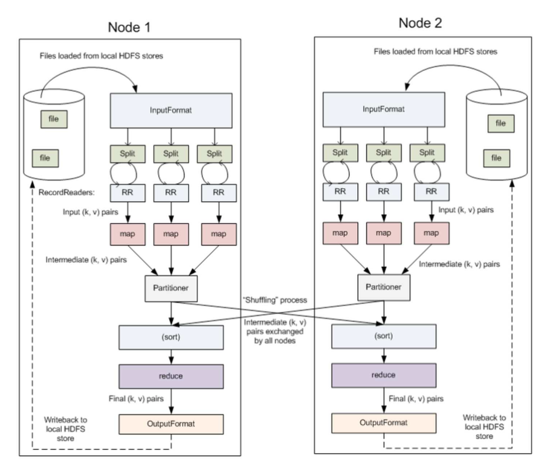
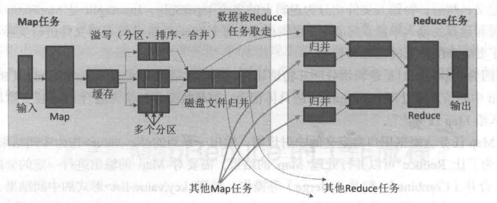

# Chapter5 分布式并行编程模型MapReduce

---

（本学习笔记整理自[大数据技术导论](https://github.com/datawhalechina/juicy-bigdata)，部分内容来自其他相关参考教程）

## 5.1 MapReduce概述

### 5.1.1 MapReduce 优缺点

Hadoop MapReduce 是一个分布式计算框架，用于编写批处理应用程序。编写好的程序可以提交到Hadoop集群上用于并行处理大规模的数据集。

MapReduce 作业通过将输入的数据集拆分为独立的块，这些块由`Map`以并行的方式处理，框架对`Map`

MapReduce处理过程分为两个阶段：

1. Map负责把一个任务分解成多个任务
2. Reduce负责把分解后多任务处理的结果汇总

适用场景

- **搜索：** 网页爬取、倒排索引、PageRank.
- **Web访问日志分析：** 分析和挖掘用户在web上的访问、购物行为特征、实现个性化推荐；分析用户访问行为。
- **文本统计分析：** 比如莫言小说的 wordcount、词频TFIDF分析；学术论文、专利文献的引用分析和统计；维基百科数据分析等；
- **海量数据挖掘：** 非结构化数据、时空数据、图像数据的挖掘。
- **机器学习：** 监督学习、非监督学习、分类算法如决策树、SVM等。
- **自然语言处理：** 基于大数据的训练和预测；基于语料库构建单词同现矩阵，频繁项集数据挖掘、重复文档检测等；
- **广告推荐：** 用户点击(CTR)和购买行为(CVR)预测。

### 5.1.2 MapReduce 优缺点

#### 优点

1. MapReduce 易于编程

**它简单的实现一些接口，就可以完成一个分布式程序**，这个分布式程序可以分布到大量廉价的PC机器上运行。也就是说你写一个分布式程序，跟写一个简单的串行程序是一模一样的。就是因为这个特点使得MapReduce编程变得非常流行。

2. 良好的扩展性
   当你的计算资源不能得到满足的时候，你可以通过简单的增加机器来扩展它的计算能力。
3. 高容错性

MapReduce设计的初衷就是使程序能够部署在廉价的PC机器上，这就要求它具有很高的容错性。比如其中一个机器挂了，它可以把上面的计算任务转移到另外一个节点上运行，不至于这个任务运行失败，而且这个过程不需要人工参与，而完全是由Hadoop内部完成的。

4. 适合PB级以上海量数据的离线处理

可以实现上千台服务器集群并发工作，提供数据处理能力。

#### 缺点

1. 不擅长实时计算

MapReduce无法像Mysql一样，在毫秒或者秒级内返回结果。

2. 不擅长流式计算

流式计算的输入数据是动态的，而MapReduce的输入数据集是静态的，不能动态变化。这是因为MapReduce自身的设计特点决定了数据源必须是静态的。

3. 不擅长DAG(有向图)计算

多个应用程序存依赖关系，后一个应用程序的输入为前一个的输出。在这种情况下，MapReduce并不是不能做，而是使用后，每个MapReduce作业的输出结果都会写入到磁盘中，会造成大量的磁盘IO,导致性能非常的低下。

### 5.1.3 MapReduce 核心编程思想


1） 分布式的运算程序往往需要分成至少2个阶段。

2）第一个阶段的MapTask并发实例，完全并行运行，互不相干。

3）第二个阶段的ReduceTask并发实例互不相干，但是他们的数据依赖于上一个阶段的所有MapTask并发实例的输出。

4）MapReduce编程模型只能包含一个Map阶段和一个Reduce阶段，，如果用户的业务逻辑非常复杂，那就只能多个MapReduce程序，串行运行。

总结：分析WordCout数据流走向深入理解mapReduce核心思想。

### 5.1.4 MapReduce 进程

一个完整的MapReduce程序在分布式运行时有三类实例进程：

1. **MrAppMaster:** 负责整个程序的过程调度及状态协调。
2. **MapTask:** 负责Map阶段的整个数据处理流程。
3. **ReduceTask:** 负责Reduce阶段的整个数据处理流程。

### 常用数据序列化类型


| Java类型 | Hadoop Writable类型 |
| ---------- | --------------------- |
| boolean  | BooleanWritable     |
| byte     | ByteWritable        |
| int      | IntWritable         |
| float    | FloatWritable       |
| long     | LongWritable        |
| double   | DoubleWritable      |
| String   | Text                |
| map      | MapWritable         |
| array    | ArrayWritable       |

### 5.1.5 MapReduce 编程规范

用户编写的程序分为三个部分：Mapper、Reducer和Driver。

- Mapper阶段
  - 用户自定义的Mapper要继承自己的父类
  - Mapper的输入数据是KV对的形式（kv的类型可自定义）
  - Mapper中的业务逻辑写在map()方法中
  - Mapper的输出数据是kv对的形式（kv的类型可自定义）
  - map()方法（Maptask进程）对每一个<K,V>调用一次🎉️
- Reduce阶段
  - 用户自定义的Reducer要继承自己的父类
  - Reducer的输入数据类型对应Mapper的输出数据类型，也是kv
  - Reducer的业务逻辑写在reduce()方法中。
  - ReduceTask进程对每一组相同k的<k,v>组调用一次reduce()方法
- Driver阶段
  - 相当于YARN集群的客户端，用于提交我们整个程序到YARN集群，提交的是封装了MapReduce程序相关运行参数的job对象。

## 5.2 MapReduce的工作流程

### 5.2.1 工作流程概述

大规模数据集的处理包括:`分布式存储`和`分布式计算`


| 对比   | 分布式存储         | 分布式计算       |
| -------- | -------------------- | ------------------ |
| google | 布式文件系统GFS    | MapReduce        |
| Hadoop | 分布式文件系统HDFS | Hadoop MapReduce |

MapReduce的核心思想可以用**"分而治之"**来描述，即把一个大的数据集拆分成多个小数据块在多台机器上并行处理，也就是说，一个大的MapReduce作业的处理流程如下：

- 首先，会被分成许多个Map任务在多台机器上并行执行。每个`Map`任务通常运行在数据存储的节点上，这样，计算和数据就可以放在一起运行，不需要额外的数据传输开销。当`Map`任务结束后，会生成以`<key,value>`形式表示的许多中间的结果。
- 然后，这些中间结果会被分发到多个`Reduce`任务在多台机器上**并行执行**，**具有相同key**的`<key,value>`会被发送到同一个`reduce`任务那里，`reduce`任务会对中间结果进行汇总计算得到最后结果，并输出到分布式文件系统中。


> 不同的Map任务之间不会进行通信，不同的reduce任务之间也不会发生任何信息交换；用户不能显示地从一台机器向另一台机器发送消息，所有的数据交换都是通过mapreduce框架自身去实现的。
> 在MapReduce的整个执行过程中，Map任务的输入文件，reduce任务的处理结果都是保存在分布式文件系统中的，而Map任务处理得到的中间结果则保存在本地存储（如磁盘）中。

### 5.2.2 MapReduce的各个执行阶段

MapReduce算法的执行过程：

1. MapReduce框架使用`InputFormat`模块做`Map`前的预处理。作用：验证输入的格式是否符合输入定义，如果符合，将输入文件切分为逻辑上的多个`InputSplit`,`InputSplit`是MapReduce对文件进行处理和运算的输入单位，只是一个逻辑概念，每个`InputSplit`并没有对文件进行实际切割，知识记录了要处理的数据的位置和长度。
2. 因为`InputSplit`是逻辑切分，所以，还需要通过`RecordReader`(RR)并根据`InputSplit`中的信息来处理`InputSplit`中的具体记录，加载数据并转换为适合`Map`任务读取的键值对，输入给`Map`任务。
3. `Map`任务会根据用户自定义的映射规则，输出一系列的`<key,value>`作为中间结果。
4. 为了让`Reduce`可以并行处理`Map`的结果，需要对`Map`的输出进行一定的分区，排序(Sort)、合并(Combine)和归并等操作，得到`<key,value-list>`形式的中间结果，再交给对应的`Reduce`程序进行处理，这个过程称为`shuffle`。
5. `Reduce`以一系列`<key,value-list>`中间结果作为输入，执行用户定义的逻辑，输出结果给`OutputFormat`模块。
6. `OutputFormat`模块会验证输出目录是否已经存在，以及输出结果类型是否符合配置文件中的配置类型，如果都满足，就输出`Reduce`的结果到分布式文件系统。
   

### 5.2.3 shuffle过程详解

#### 5.2.3.1 shuffle过程简介

> list(k2,v2) -> <k2,v2-list>的过程

`shuffle`过程是MapReduce整个工作流程的核心环节，理解`shuffle`过程的基本原理，对于理解MapReduce流程至关重要。

所谓`shuffle`，是针对`Map`输出结果进行**分区、排序和合并**等处理,并交给`reduce`的过程。因此，**shuffle过程**分为**Map端的操作和Reduce端的操作**。



1. 在`Map`端的shuffle过程。`Map`的输出结果首先被写入缓存，当缓存满时，就启动溢写操作（分区、排序、合并），把缓存中的数据写入磁盘文件，并清空缓存，当启动溢写操作时，首先需要把缓存中的数据进行分区，然后对每个分区的数据进行排序(sort)和合并（Combine）,之后写入磁盘文件。 每次溢写操作会生成要给新的磁盘文件，随着`Map`任务的执行，磁盘中就会生成多个溢写文件。在`Map`任务全部结束之<前[todo]，这些溢写文件会被归并(merge)成一个大的磁盘文件，然后，通知相应的`reduce`任务来领取属于自己需要处理的数据。


2. 在`reduce`端的shuffle过程。`Reduce`任务从`Map`端的不同`Map`机器领回属于自己需要处理的那部分数据，然后，对数据进行归并(Merge)后交给`Reduce`处理。

#### 5.2.3.2 Map端的shuffle过程

`Map`端的`shuffle`过程包括4个步骤：

1. 输入数据和执行`Map`任务 `k1,v1 -> list(k2,v2)`

`Map`任务的输入数据一般保存在分布式文件系统(如GFS或HDFS)的文件块中，这些文件块的格式时任意的，可以是文档，也可以是二进制格式的。`Map`任务接受`<key,value>`作为输入后，按一定的映射规则转换成一批`<key,value>`进行输出。

2. 写入缓存

每个`Map`任务都会被分配一个缓存，`Map`的输出结果不是立即写入磁盘，而是首先写入缓存。在缓存中积累一定数量的`map`输出结果以后，在一次性批量写入磁盘，这样可以大大减少对磁盘`I/O`的影响。

因为，磁盘包含机械部件，它事实通过磁头移动和盘片的转动来寻址定位数据的，每次寻址的开销很大，如果每个`Map`输出结果都直接写入磁盘，回引入很多寻址开销，而**一次性批量写入**,就只需要一次寻址，连续写入，大大降低了开销。需要注意的是，在写入缓存之前，`key`于`value`值都会被序列化成字节数组。

3. 溢写（分区、排序和合并）

提供给MapReduce的缓存的容量是有限的，默认大小是100MB. 随着`Map`任务的执行，缓存中`Map`结果的数量不断增加，很快就会占满整个缓存，这时，就必须启动溢写（spill）操作，把缓存中的内容一次性写入磁盘，并清空缓存。

## 5.3  Wordcount 案例实操

官方wordcount源码采用反编译工具反编译源码，发现WordCount案例有Map类、Reduce类和驱动类。且数据的类型是Hadoop自身封装的序列化类型。

1. 需求
   在给定的文本文件中统计输出每一个单词出现的总次数
   1）输入数据:
   hello.txt

```
atguigu atguigu
ss ss
cls cls
jiao
banzhang
xue
hadoop
```

2) 期望输出数据

```
atguigu	2
banzhang	1
cls	2
hadoop	1
jiao	1
ss	2
xue	1
```

2. 需求分析

按照MapReduce编程规范，分别编写Mapper，Reducer，Driver，如图所示。


3. IDE代码

完整代码：`code\chapter03\mapreduce`

这里只列出相关文件代码：`pom.xml`,`WordcountMapper.java`,`WordcountReducer.java`,`WordcountDriver.java`


pom.xml 文件代码：

```java
<dependencies>
    <dependency>
        <groupId>org.apache.hadoop</groupId>
        <artifactId>hadoop-common</artifactId>
        <version>2.7.2</version>
    </dependency>
    <dependency>
        <groupId>org.apache.hadoop</groupId>
        <artifactId>hadoop-hdfs</artifactId>
        <version>2.7.2</version>
    </dependency>
    <dependency>
        <groupId>org.apache.hadoop</groupId>
        <artifactId>hadoop-auth</artifactId>
        <version>2.7.2</version>
    </dependency>
    <dependency>
        <groupId>org.apache.hadoop</groupId>
        <artifactId>hadoop-client</artifactId>
        <version>2.7.2</version>
    </dependency>
    <dependency>
        <groupId>org.apache.hadoop</groupId>
        <artifactId>hadoop-mapreduce-client-core</artifactId>
        <version>2.7.2</version>
    </dependency>
    <dependency>
        <groupId>org.apache.hadoop</groupId>
        <artifactId>hadoop-mapreduce-client-jobclient</artifactId>
        <version>2.7.2</version>
    </dependency>
    <dependency>
        <groupId>junit</groupId>
        <artifactId>junit</artifactId>
        <version>3.8.1</version>
        <scope>test</scope>
    </dependency>
</dependencies>

<build>
    <!--<sourceDirectory>src</sourceDirectory>-->
    <plugins>
        <plugin>
            <groupId>org.apache.maven.plugins</groupId>
            <artifactId>maven-jar-plugin</artifactId>
        </plugin>
    </plugins>
</build>
```

WordcountMapper.java 文件代码：

```java
package com.mapreduce;

import java.io.IOException;
import org.apache.hadoop.io.IntWritable;
import org.apache.hadoop.io.LongWritable;
import org.apache.hadoop.io.Text;
import org.apache.hadoop.mapreduce.Mapper;

public class WordcountMapper extends Mapper<LongWritable, Text, Text, IntWritable>{

    Text k = new Text();
    IntWritable v = new IntWritable(1);

    @Override
    protected void map(LongWritable key, Text value, Context context)	throws IOException, InterruptedException {

        // 1 获取一行
        String line = value.toString();

        // 2 切割
        String[] words = line.split(" ");

        // 3 输出
        for (String word : words) {

            k.set(word);
            context.write(k, v);
        }
    }
}
```

WordcountReducer.java 文件代码：

```
 package com.mapreduce;
 
 import java.io.IOException;
 import org.apache.hadoop.io.IntWritable;
 import org.apache.hadoop.io.Text;
 import org.apache.hadoop.mapreduce.Reducer;
 
 public class WordcountReducer extends Reducer<Text, IntWritable, Text, IntWritable>{
 int sum;
 IntWritable v = new IntWritable();
 
     @Override
     protected void reduce(Text key, Iterable<IntWritable> values,Context context) throws IOException, InterruptedException {
 
         // 1 累加求和
         sum = 0;
         for (IntWritable count : values) {
             sum += count.get();
         }
 
         // 2 输出
         v.set(sum);
         context.write(key,v);
     }
 }

```

WordcountDriver.java 文件代码：

```
package com.mapreduce;

import java.io.IOException;
import org.apache.hadoop.conf.Configuration;
import org.apache.hadoop.fs.Path;
import org.apache.hadoop.io.IntWritable;
import org.apache.hadoop.io.Text;
import org.apache.hadoop.mapreduce.Job;
import org.apache.hadoop.mapreduce.lib.input.FileInputFormat;
import org.apache.hadoop.mapreduce.lib.output.FileOutputFormat;

public class WordcountDriver {

 public static void main(String[] args) throws IOException, ClassNotFoundException, InterruptedException {

     // 1 获取配置信息以及封装任务
     Configuration configuration = new Configuration();
     Job job = Job.getInstance(configuration);

     // 2 设置jar加载路径
     job.setJarByClass(WordcountDriver.class);

     // 3 设置map和reduce类
     job.setMapperClass(WordcountMapper.class);
     job.setReducerClass(WordcountReducer.class);

     // 4 设置map输出
     job.setMapOutputKeyClass(Text.class);
     job.setMapOutputValueClass(IntWritable.class);

     // 5 设置最终输出kv类型
     job.setOutputKeyClass(Text.class);
     job.setOutputValueClass(IntWritable.class);
     // 6 设置输入和输出路径
     FileInputFormat.setInputPaths(job, new Path(args[0]));
     FileOutputFormat.setOutputPath(job, new Path(args[1]));

     // 7 提交
     boolean result = job.waitForCompletion(true);

     System.exit(result ? 0 : 1);
 }
}
```

打包运行：

1. 打包jar复制到文件夹：`share/hadoop/mapreduce/mapreduce0-wordcount.jar`
2. 复制hello.txt到dfs文件夹：`hadoop fs -put hello.txt input`

hello.txt

```text
atguigu atguigu
ss ss
cls cls
jiao
banzhang
xue
hadoop
```

3. 执行代码：`hadoop jar share/hadoop/mapreduce/mapreduce-wordcount.jar com.mapreduce.WordcountDriver input/hello.txt output3`
4. `hadoop fs -cat output3/*`

最后显示结果：

```
[root@hadoop5 hadoop-2.7.7]# hadoop fs -cat output3/*
atguigu 2
banzhang        1
cls     2
hadoop  1
jiao    1
ss      2
xue     1
```

## 参考资料

1. [大数据学习指南](https://ldbmcs.gitbook.io/bigdata/hadoop/fen-bu-shi-ji-suan-kuang-jia-mapreduce)
2. [MapReduce 计算框架入门](https://www.cnblogs.com/shoufeng/p/15377088.html)
